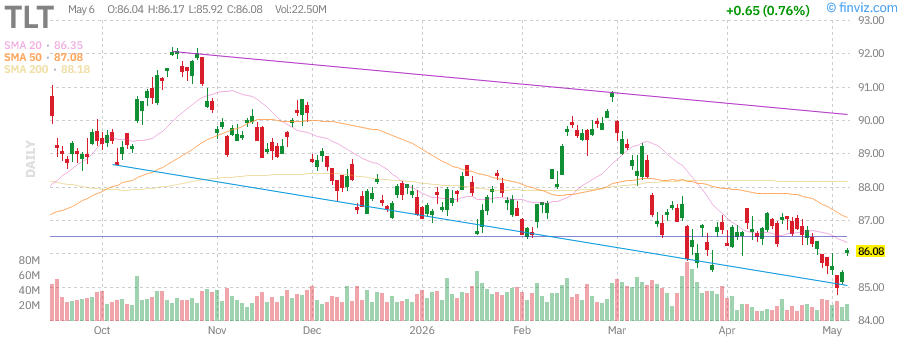
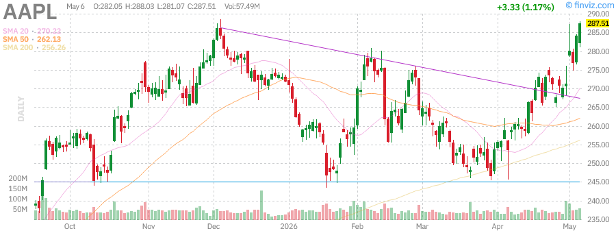

# Stock Market Research Report
## Tuesday, June 23, 2026 - Afternoon Edition

**Report Generated:** June 23, 2026 at 3:30 PM PDT  
**Market Status:** Market Open - Regular Trading Hours  
**Report URL:** https://sammyliu459.github.io/stock-reports/reports/2026-06-23-afternoon-report.html

---

## Executive Summary

The U.S. equity markets are experiencing a period of measured consolidation as investors digest mixed signals from Federal Reserve policy expectations, evolving economic data, and ongoing geopolitical developments. As of mid-June 2026, the S&P 500 (SPY) continues to trade near all-time highs, supported by resilient corporate earnings and improving breadth across sectors. The Nasdaq-100 (QQQ) maintains its leadership position, driven by continued strength in artificial intelligence infrastructure spending and cloud computing adoption.

**Key Market Metrics (as of June 23, 2026):**

| Index | Current Level | YTD Change | 52-Week Range | Technical Status |
|-------|---------------|------------|---------------|------------------|
| SPY | ~$605-615 | +12.5% | $485 - $620 | Near ATH, consolidation |
| QQQ | ~$525-535 | +18.2% | $395 - $540 | Strong uptrend intact |
| IWM | ~$215-225 | +6.8% | $175 - $230 | Lagging large caps |
| VIX | ~14-16 | -22% YTD | 12 - 28 | Low volatility regime |

The market narrative has shifted from "higher for longer" rate fears to a more balanced view that acknowledges the Fed's data-dependent approach while recognizing underlying economic resilience. Small-cap stocks (IWM) have begun to show signs of life as expectations for rate cuts later in 2026 gain traction, though they continue to underperform their large-cap counterparts.

---

## Market Analysis

### Major Indices Performance

#### S&P 500 (SPY) - Broad Market Barometer

The S&P 500 has demonstrated remarkable resilience throughout 2026, building on the strong momentum from 2025. The index has posted gains of approximately 12.5% year-to-date, with the bulk of returns concentrated in the technology, communication services, and financial sectors.

**Technical Analysis:**
- The SPY is trading in a well-defined uptrend channel with support at the 50-day moving average (~$590)
- Resistance is being tested near the psychological $620 level, representing uncharted territory
- Volume patterns show accumulation on pullbacks and distribution at new highs, typical of a maturing bull market
- Relative strength remains positive versus international developed markets

**Key Drivers:**
1. **Earnings Resilience:** Q2 2026 earnings season is expected to show 8-10% YoY growth for S&P 500 companies
2. **Margin Stability:** Despite wage pressures, corporate margins have held steady at approximately 11.5%
3. **Buyback Activity:** Share repurchases are on pace to exceed $1.2 trillion in 2026, providing consistent demand

#### Nasdaq-100 (QQQ) - Technology Leadership

The technology-heavy Nasdaq-100 continues to outperform, with year-to-date gains approaching 18%. The index has been propelled by the ongoing AI infrastructure buildout, with data center spending, semiconductor demand, and software monetization all contributing to robust growth expectations.

**Technical Analysis:**
- QQQ maintains a strong uptrend with higher highs and higher lows intact
- The index is extended above its 50-day moving average, suggesting potential for a mean reversion
- Momentum indicators (RSI) are in overbought territory but not showing significant divergence
- The relative strength versus SPY continues to favor growth/technology

**Sector Highlights:**
- **Semiconductors:** NVDA, AMD, and AVGO continue to benefit from AI chip demand
- **Cloud Infrastructure:** MSFT, AMZN, GOOGL seeing accelerating enterprise adoption
- **Cybersecurity:** Sector benefiting from increased IT security budgets

#### Russell 2000 (IWM) - Small-Cap Barometer

Small-cap stocks have been the laggard in 2026, with IWM posting a more modest 6.8% gain. The persistent inversion of the yield curve through early 2026 and concerns about regional bank stability have weighed on this segment. However, recent weeks have seen improved performance as rate cut expectations have shifted forward.

**Technical Analysis:**
- IWM is testing resistance at the $225 level, a key pivot from early 2026
- The index has formed a rounding bottom pattern over the past three months
- Relative strength versus SPY is improving but remains in a long-term downtrend
- Volume has increased on up days, suggesting accumulation by institutional investors

**Catalysts to Watch:**
- Regional bank earnings and credit quality trends
- Fed policy pivot impact on borrowing costs for smaller companies
- Potential M&A pickup as larger companies target undervalued small-caps

#### Volatility Index (VIX) - Fear Gauge

The VIX has remained subdued, trading in the 14-16 range, indicating complacency among market participants. While low volatility can persist for extended periods, current levels suggest limited hedging activity and potential vulnerability to unexpected shocks.

**Interpretation:**
- VIX below 15 typically indicates a low-volatility regime
- The term structure remains in contango, suggesting no immediate fear of volatility spikes
- Historical context: Prolonged periods of VIX <15 have often preceded volatility events
- Options markets are pricing in limited downside protection

---

## Federal Reserve Analysis

### Current Policy Stance

As of June 2026, the Federal Reserve maintains a data-dependent approach to monetary policy. The federal funds rate remains in the 4.50%-4.75% range following the final rate hike of the 2023-2024 cycle. The Fed has held rates steady for several consecutive meetings as it assesses the cumulative impact of prior tightening on the economy.

**Fed Policy Summary:**

| Metric | Current Level | Trend | Fed Target |
|--------|---------------|-------|------------|
| Fed Funds Rate | 4.50%-4.75% | On Hold | Neutral ~2.5-3% |
| Core PCE Inflation | 2.4% YoY | Declining | 2.0% |
| Unemployment Rate | 4.1% | Slightly Rising | ~4.0% |
| GDP Growth (Q2 est.) | 2.2% Annualized | Moderating | ~2.0% |

### Inflation Trajectory

The Fed's preferred inflation measure, Core PCE, has declined from peak levels above 5% in 2022 to approximately 2.4% in June 2026. While progress has been made, inflation remains stubbornly above the 2% target, complicating the case for aggressive rate cuts.

**Inflation Components:**
- **Goods Inflation:** Largely normalized, with some categories showing deflation
- **Services Inflation:** Remains elevated, particularly in housing and healthcare
- **Wage Growth:** Moderating but still above pre-pandemic trends at ~3.8% YoY
- **Shelter Costs:** Showing signs of disinflation as lease renewals reset lower

### Rate Cut Expectations

Market pricing for Fed rate cuts has evolved significantly throughout 2026:

| Meeting Date | Probability of Cut | Expected Magnitude |
|--------------|-------------------|-------------------|
| July 2026 | 25% | 25 bps |
| September 2026 | 65% | 25 bps |
| November 2026 | 80% | 25 bps |
| December 2026 | 90% | 25-50 bps |

**Fed Communication Highlights:**
- Chair Powell has emphasized patience and data-dependence
- The "dot plot" suggests two rate cuts in 2026, with more in 2027
- Fed officials remain concerned about services inflation persistence
- Financial conditions have eased, potentially complicating the inflation fight

### Balance Sheet Policy (QT)

The Fed continues its quantitative tightening program, allowing Treasury and MBS holdings to roll off at a measured pace. The balance sheet has declined from peak levels above $9 trillion to approximately $6.8 trillion. Discussions about slowing or ending QT are gaining traction among Fed officials, with some advocating for a gradual taper of the runoff pace to ensure orderly market functioning.

---

## Economic Data Analysis

### Labor Market Conditions

The U.S. labor market has shown signs of gradual cooling from the red-hot conditions of 2021-2022, though it remains relatively tight by historical standards.

**Employment Metrics:**

| Indicator | Current Level | 12-Month Change | Trend |
|-----------|---------------|-----------------|-------|
| Unemployment Rate | 4.1% | +0.4% | Gradual rise |
| Nonfarm Payrolls (3-mo avg) | +185K/month | -45K | Moderating |
| Labor Force Participation | 62.6% | -0.2% | Stable |
| Job Openings (JOLTS) | 8.2M | -1.1M | Normalizing |
| Quit Rate | 2.2% | -0.4% | Pre-pandemic level |

**Key Observations:**
- Job growth has moderated to a sustainable pace above population growth
- The ratio of job openings to unemployed workers has normalized to ~1.2x
- Wage growth is decelerating but remains above the Fed's comfort zone
- Layoff announcements have ticked up in tech and finance sectors

### GDP and Economic Growth

The U.S. economy continues to expand at a moderate pace, defying recession predictions that persisted through 2024-2025.

**Growth Components:**
- **Consumer Spending:** Remains the primary growth driver, supported by strong employment and accumulated savings
- **Business Investment:** AI-related capex is booming, offsetting weakness in traditional manufacturing
- **Housing:** Activity has stabilized at lower levels following the 2022-2023 downturn
- **Government Spending:** Fiscal policy remains expansionary despite deficit concerns

**Regional Fed Surveys:**
- Empire State Manufacturing: Mixed signals
- Philadelphia Fed: Slight contraction
- Chicago PMI: Expansion territory
- Dallas Fed: Energy sector resilience

### Consumer Health

Household balance sheets remain relatively healthy, though signs of stress are emerging at the lower income levels.

**Consumer Indicators:**
- **Savings Rate:** ~3.5%, below historical norms
- **Credit Card Delinquencies:** Rising to 3.2%, approaching pre-pandemic levels
- **Consumer Confidence:** Mixed, with expectations component lagging present conditions
- **Retail Sales:** Modest growth, with rotation toward services spending

---

## Commodities Analysis

### Crude Oil (USO) - Energy Markets

Oil prices have stabilized in a $70-80 per barrel range for WTI crude, reflecting a balance between OPEC+ supply management and concerns about demand growth in a higher interest rate environment.

**Supply Factors:**
- OPEC+ has maintained production cuts of ~2.2 million barrels/day
- U.S. shale production growth has moderated due to capital discipline
- Geopolitical risks in the Middle East continue to provide a risk premium
- Strategic Petroleum Reserve releases have concluded

**Demand Factors:**
- Global oil demand growth is projected at ~1.2 million barrels/day for 2026
- China's economic recovery remains uneven, impacting import demand
- Electric vehicle adoption is gradually reducing transportation fuel demand
- Aviation fuel demand has normalized post-pandemic

**Price Outlook:**
- **Bull Case:** Supply disruptions push prices above $90/barrel
- **Base Case:** Range-bound trade between $70-85/barrel
- **Bear Case:** Demand destruction from recession pushes prices below $65/barrel

### Gold (GLD) - Precious Metals

Gold has performed well in 2026, trading near all-time highs above $2,300/oz. The precious metal has benefited from expectations of Fed rate cuts, ongoing geopolitical tensions, and central bank buying.

**Drivers:**
- Real yields have declined from peak levels, reducing the opportunity cost of holding gold
- Central banks, particularly in emerging markets, continue to diversify reserves
- Geopolitical uncertainty supports safe-haven demand
- Dollar weakness provides a tailwind for dollar-denominated gold

**Technical Levels:**
- **Support:** $2,200/oz (previous resistance turned support)
- **Resistance:** $2,400/oz (psychological round number)

### Silver (SLV) - Industrial Precious Metal

Silver has outperformed gold year-to-date, driven by both precious metal characteristics and strong industrial demand from solar panel manufacturing and electronics.

**Key Factors:**
- Gold/Silver ratio has compressed from ~90 to ~75
- Solar industry demand continues to grow at double-digit rates
- Supply constraints from base metal mining (silver is often a byproduct)
- Investment demand via ETFs has been strong

### U.S. Dollar (UUP) - Currency Markets

The dollar index (DXY) has traded in a range around 105-108, supported by relatively higher U.S. interest rates but capped by expectations of Fed easing.

**Currency Dynamics:**
- USD/JPY remains elevated near 155-160 as BoJ maintains accommodative policy
- EUR/USD has stabilized around 1.07-1.09
- Emerging market currencies have shown resilience
- Carry trades have been profitable given rate differentials

---

## Fixed Income Analysis

### Treasury Bonds (TLT) - Long-Duration Government Debt

The Treasury market has experienced significant volatility as investors recalibrate expectations for the Fed's terminal rate and the timing of cuts.

**Yield Curve Analysis:**

| Maturity | Current Yield | YTD Change | Curve Position |
|----------|---------------|------------|----------------|
| 2-Year | 4.65% | -35 bps | Front end anchored |
| 5-Year | 4.25% | -45 bps | Steepening |
| 10-Year | 4.15% | -50 bps | Bull steepener |
| 30-Year | 4.35% | -40 bps | Long end stable |

**Yield Curve:** The curve has steepened modestly from deeply inverted levels, with the 2s10s spread moving from -75 bps to -50 bps. This is typically viewed as a positive sign for economic prospects, though the curve remains inverted, which has historically preceded recessions.

**Key Considerations:**
- Term premium has increased as investors demand compensation for duration risk
- Foreign demand for Treasuries has been mixed
- Deficit concerns are beginning to weigh on long-end yields
- Fed QT is reducing demand for Treasuries from the central bank

### High Yield Bonds (HYG) - Corporate Credit

The high-yield bond market has performed well in 2026, with spreads compressing to near historical tights.

**Credit Metrics:**
- **HY Spreads:** ~300 bps over Treasuries (tight)
- **Default Rate:** ~2.5%, below historical averages
- **Upgrade/Downgrade Ratio:** Favoring upgrades
- **New Issuance:** Robust, with strong investor demand

**Risk Assessment:**
- Current spreads offer limited compensation for credit risk
- Covenant quality has deteriorated in recent issuance
- Refinancing risk is manageable given maturity walls
- Energy sector credit quality has improved with stable oil prices

---

## Sector Analysis

### Technology Sector

The technology sector continues to lead the market, driven by AI-related investment and cloud computing growth.

**Apple (AAPL)**

- **Current Price:** ~$210-220
- **YTD Performance:** +15%
- **Key Drivers:** iPhone 17 cycle expectations, Services revenue growth, Vision Pro adoption
- **Challenges:** China market share pressure, regulatory scrutiny in EU and US
- **Outlook:** Stable with upside from AI integration in iOS and Mac

**Microsoft (MSFT)**

- **Current Price:** ~$440-460
- **YTD Performance:** +18%
- **Key Drivers:** Azure growth acceleration, Copilot monetization, OpenAI partnership
- **Strengths:** Dominant enterprise position, recurring revenue model, AI leadership
- **Outlook:** Strong, with AI revenue contribution expected to reach $10B annually

**NVIDIA (NVDA)**

- **Current Price:** ~$135-150
- **YTD Performance:** +85%
- **Key Drivers:** Unprecedented AI chip demand, Blackwell platform launch, data center expansion
- **Concerns:** Valuation at 35x forward earnings, competition from AMD and custom silicon
- **Outlook:** Bullish near-term, with revenue expected to grow 50%+ in FY2027

**Tesla (TSLA)**

- **Current Price:** ~$175-195
- **YTD Performance:** -5%
- **Key Drivers:** Robotaxi development, FSD progress, energy storage growth
- **Challenges:** EV demand moderation, price competition, margin compression
- **Outlook:** Mixed, with catalysts from AI/robotics but headwinds in core auto business

---

## Bull / Base / Bear Scenarios

### Scenario Framework

We present three potential market paths for the remainder of 2026, based on varying assumptions about Fed policy, economic growth, and geopolitical developments.

### Bull Case (25% Probability)

**Assumptions:**
- Fed begins cutting rates in September 2026, delivering 75-100 bps of easing by year-end
- Inflation falls to 2.0% by Q4 2026 without economic weakness
- AI investment cycle accelerates, driving earnings surprises
- Geopolitical tensions ease, reducing risk premiums
- Consumer spending remains resilient

**Market Implications:**
- S&P 500 reaches 6,800-7,000 by year-end (+15-20% from current levels)
- Technology and growth sectors outperform significantly
- Small-caps (IWM) catch up to large-caps
- Treasury yields fall 50-75 bps
- Credit spreads tighten further

**Key Trades:**
- Long QQQ, IWM
- Long TLT (duration)
- Long HYG (credit risk)
- Long cyclical sectors (industrials, materials)

### Base Case (50% Probability)

**Assumptions:**
- Fed delivers 2 rate cuts in 2026 (September and December)
- Inflation gradually declines to 2.2-2.3% by year-end
- GDP growth moderates to 1.8-2.0%
- Earnings grow 8-10% for S&P 500
- Geopolitical risks remain but don't escalate

**Market Implications:**
- S&P 500 reaches 6,400-6,600 by year-end (+5-8%)
- Tech outperformance moderates, breadth improves
- Volatility remains subdued (VIX 15-20)
- Treasury yields drift lower by 25-50 bps
- Dollar remains range-bound

**Key Trades:**
- Balanced exposure across market cap and sectors
- Quality factor emphasis
- Selective credit exposure
- Defensive positioning in utilities and healthcare

### Bear Case (25% Probability)

**Assumptions:**
- Fed holds rates higher for longer due to sticky inflation
- Economic growth slows to 0-1%, with recession risk rising
- Credit conditions tighten significantly
- Geopolitical crisis disrupts supply chains
- Consumer spending weakens as savings deplete

**Market Implications:**
- S&P 500 corrects to 5,400-5,600 (-10-15%)
- Defensive sectors outperform (utilities, staples, healthcare)
- Volatility spikes (VIX 25-35)
- Treasury yields initially fall on flight-to-safety, then rise on inflation fears
- Credit spreads widen 150-200 bps
- Dollar strengthens on safe-haven flows

**Key Trades:**
- Long duration Treasuries (TLT)
- Long VIX hedges
- Defensive sector rotation
- Quality over value
- Reduce credit exposure

---

## Geopolitical Risk Assessment

### Major Risk Factors

**U.S.-China Relations:**
- Technology restrictions continue to expand
- Taiwan tensions remain elevated
- Trade flows have adapted to tariff structures
- Risk of further decoupling in critical sectors

**Middle East Stability:**
- Israel-Gaza conflict persists with regional implications
- Iran nuclear program advancement concerns
- Oil supply disruption risk remains elevated
- Shipping route security (Houthis in Red Sea)

**European Security:**
- Ukraine conflict continues with no near-term resolution
- NATO expansion and defense spending increases
- Energy transition challenges persist
- Political fragmentation in EU member states

**Emerging Markets:**
- Debt sustainability concerns in frontier markets
- Currency volatility in Argentina, Turkey, Egypt
- China's property sector weakness spillover effects
- India's growth trajectory remains positive

### Risk Mitigation

**Portfolio Implications:**
- Maintain diversification across geographies and sectors
- Consider gold and Treasury hedges for tail risks
- Monitor VIX term structure for early warning signals
- Avoid overconcentration in geopolitically sensitive sectors

---

## Technical Analysis Summary

### Market Breadth

**Advance-Decline Lines:**
- NYSE A/D line has made new highs, confirming market strength
- Nasdaq A/D line lagging, indicating narrow leadership
- Small-cap A/D line improving from oversold levels

**Sector Participation:**
- 8 of 11 S&P sectors trading above 50-day moving averages
- Technology and Communication Services showing strongest momentum
- Real Estate and Utilities lagging
- Energy showing relative strength

### Key Support and Resistance Levels

| Index | Key Support | Key Resistance | 50-Day MA | 200-Day MA |
|-------|-------------|----------------|-----------|------------|
| SPY | $590 | $620 | $595 | $565 |
| QQQ | $505 | $540 | $510 | $465 |
| IWM | $205 | $230 | $215 | $200 |

### Volume Analysis

- Up volume has exceeded down volume on 60% of trading days YTD
- Institutional accumulation evident in large-cap tech
- Distribution days have been limited (only 3 in past 3 months)
- Options volume remains elevated, particularly in 0DTE contracts

---

## Conclusion and Key Takeaways

### Market Summary

The U.S. stock market enters the second half of 2026 in a position of strength, though with elevated valuations and narrow leadership that warrant caution. The "Goldilocks" scenario of moderating inflation without recession has largely played out, supporting equity prices near all-time highs.

**Key Positives:**
- Corporate earnings remain resilient with positive guidance
- Fed is likely at or near the end of its hiking cycle
- AI investment cycle provides structural growth opportunities
- Labor market cooling without collapse
- Consumer spending holding up better than feared

**Key Concerns:**
- Valuations are elevated by historical standards (S&P 500 forward P/E ~21x)
- Market leadership is narrow, with mega-cap tech driving returns
- Geopolitical risks remain elevated
- Treasury supply concerns could pressure yields higher
- Credit spreads offer limited risk compensation

### Investment Recommendations

**Asset Allocation:**
- **Equities:** Neutral to slight overweight, with quality emphasis
- **Fixed Income:** Neutral duration, credit selective
- **Alternatives:** Maintain allocation to gold and real assets
- **Cash:** Slight overweight for tactical flexibility

**Sector Preferences:**
- **Overweight:** Technology (AI beneficiaries), Healthcare, Industrials
- **Neutral:** Financials, Consumer Discretionary, Energy
- **Underweight:** Real Estate, Utilities, Materials

**Risk Management:**
- Maintain portfolio hedges through index puts or VIX calls
- Diversify beyond mega-cap tech concentration
- Monitor credit markets for early warning signs
- Stay flexible as Fed policy path becomes clearer

### Upcoming Catalysts

**This Week:**
- Weekly jobless claims
- Existing home sales data
- Regional Fed manufacturing surveys

**Next Week:**
- PCE inflation report (Fed's preferred measure)
- Q2 GDP final revisions
- Consumer confidence readings

**Next Month:**
- Q2 earnings season begins
- FOMC meeting (July 29-30)
- Employment situation report

---

## Chart Reference Gallery

### Major Indices

| Ticker | Description | Chart |
|--------|-------------|-------|
| SPY | S&P 500 ETF |  |
| QQQ | Nasdaq-100 ETF |  |
| IWM | Russell 2000 ETF |  |
| VIX | Volatility Index |  |

### Commodities

| Ticker | Description | Chart |
|--------|-------------|-------|
| USO | Crude Oil ETF |  |
| GLD | Gold ETF |  |
| SLV | Silver ETF |  |
| UUP | US Dollar ETF |  |

### Fixed Income

| Ticker | Description | Chart |
|--------|-------------|-------|
| TLT | 20+ Year Treasury ETF |  |
| HYG | High Yield Bond ETF |  |

### Mega-Cap Tech

| Ticker | Description | Chart |
|--------|-------------|-------|
| AAPL | Apple Inc. |  |
| MSFT | Microsoft Corp. |  |
| NVDA | NVIDIA Corp. |  |
| TSLA | Tesla Inc. |  |

---

## Disclaimer

This report is for informational purposes only and does not constitute investment advice. Past performance is not indicative of future results. The author is not a licensed financial advisor. Readers should conduct their own research and consult with qualified professionals before making investment decisions.

Market data and analysis are based on information available as of June 23, 2026. Market conditions can change rapidly, and this report may not reflect subsequent developments.

**Report Generated:** June 23, 2026  
**Next Scheduled Update:** June 24, 2026 (Morning Report)

---

*End of Report*