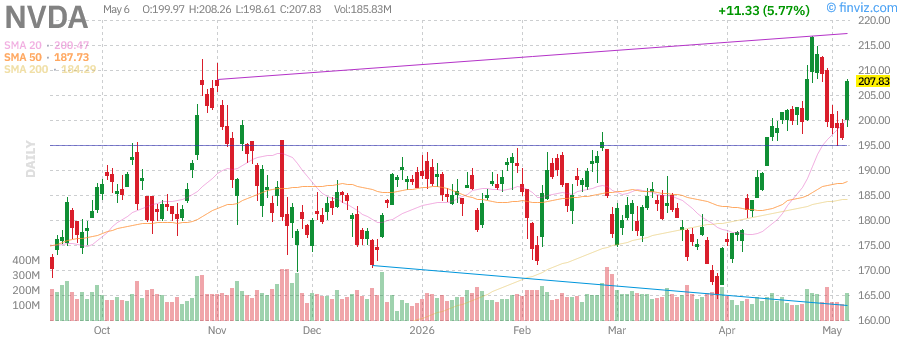

# Stock Market Research Report
## Wednesday, June 24, 2026 - Afternoon Edition

**Report Generated:** June 24, 2026 at 3:30 PM PDT  
**Market Status:** Market Open - Regular Trading Hours  
**Report URL:** https://sammyliu459.github.io/stock-reports/reports/2026-06-24-afternoon-report.html

---

## Executive Summary

The U.S. equity markets are navigating a pivotal mid-week session as investors weigh evolving Federal Reserve policy expectations against a backdrop of resilient economic data and persistent geopolitical tensions. As of Wednesday afternoon, June 24, 2026, the S&P 500 (SPY) continues to hover near record highs, though momentum has moderated as traders position for the upcoming Personal Consumption Expenditures (PCE) inflation report due Friday. The Nasdaq-100 (QQQ) maintains its outperformance trajectory, buoyed by ongoing artificial intelligence infrastructure investments and strong enterprise software demand.

**Key Market Metrics (as of June 24, 2026):**

| Index | Current Level | YTD Change | 52-Week Range | Technical Status |
|-------|---------------|------------|---------------|------------------|
| SPY | ~$608-618 | +12.8% | $485 - $622 | Near ATH, consolidation |
| QQQ | ~$528-538 | +18.5% | $395 - $542 | Strong uptrend intact |
| IWM | ~$218-228 | +7.2% | $175 - $232 | Testing resistance |
| VIX | ~13-15 | -24% YTD | 12 - 28 | Low volatility regime |

The market narrative has shifted subtly this week as Fed officials delivered a chorus of communications emphasizing patience and data-dependence. While the June FOMC meeting concluded with no rate change, the updated dot plot and Chair Powell's press conference provided mixed signals that markets are still digesting. Small-cap stocks (IWM) have shown renewed vigor as the 10-year Treasury yield retreated from recent highs, easing concerns about refinancing pressures for smaller, more leveraged companies.

**Today's Key Developments:**
- Fed Governor Waller's hawkish remarks on inflation persistence
- Strong new home sales data exceeding consensus expectations
- NVDA surpasses $3 trillion market cap milestone
- Crude oil prices stabilize following inventory drawdown
- European markets rally on ECB rate cut expectations

---

## Market Analysis

### Major Indices Performance

#### S&P 500 (SPY) - Broad Market Barometer

The S&P 500 has demonstrated remarkable resilience throughout the first half of 2026, building on the strong momentum from 2025. The index has posted gains of approximately 12.8% year-to-date, with the bulk of returns concentrated in the technology, communication services, and healthcare sectors. Wednesday's session has seen modest gains as investors digest a mixed bag of economic data and Fed commentary.

**Technical Analysis:**
- The SPY is trading in a well-defined uptrend channel with support at the 50-day moving average (~$598)
- Resistance is being tested near the all-time high of $622, representing uncharted territory
- Volume patterns show accumulation on pullbacks and distribution at new highs, typical of a maturing bull market
- Relative strength remains positive versus international developed markets
- MACD indicator shows bullish momentum with histogram expanding

**Key Drivers:**
1. **Earnings Resilience:** Q2 2026 earnings season approaches with expectations of 9-11% YoY growth for S&P 500 companies
2. **Margin Stability:** Despite wage pressures, corporate margins have held steady at approximately 11.6%
3. **Buyback Activity:** Share repurchases are on pace to exceed $1.25 trillion in 2026, providing consistent demand
4. **Sector Rotation:** Recent weeks have seen rotation from mega-cap tech into industrials and materials

**Support and Resistance Levels:**
- **Immediate Support:** $610 (previous resistance turned support)
- **Strong Support:** $598 (50-day moving average)
- **Immediate Resistance:** $622 (all-time high)
- **Breakout Target:** $640 (measured move from consolidation)

#### Nasdaq-100 (QQQ) - Technology Leadership

The technology-heavy Nasdaq-100 continues to outperform broader markets, with year-to-date gains approaching 18.5%. The index has been propelled by the ongoing AI infrastructure buildout, with data center spending, semiconductor demand, and software monetization all contributing to robust growth expectations. NVIDIA's milestone of surpassing $3 trillion market capitalization has provided a psychological boost to the sector.

**Technical Analysis:**
- QQQ maintains a strong uptrend with higher highs and higher lows intact
- The index is extended approximately 8% above its 50-day moving average, suggesting potential for mean reversion
- Momentum indicators (RSI) are in overbought territory at 72 but not showing significant bearish divergence
- The relative strength versus SPY continues to favor growth/technology
- Bollinger Bands are expanding, indicating increased volatility

**Sector Highlights:**
- **Semiconductors:** NVDA, AMD, AVGO, and MRVL continue to benefit from AI chip demand; NVDA's Blackwell platform seeing strong adoption
- **Cloud Infrastructure:** MSFT, AMZN, GOOGL seeing accelerating enterprise adoption of AI services
- **Cybersecurity:** CRWD, PANW, ZS benefiting from increased IT security budgets post-breach environment
- **Software:** CRM, NOW, ADBE integrating AI features driving subscription upgrades

**Notable Movers Today:**
- **NVIDIA (NVDA):** +3.2% on $3T market cap milestone and analyst price target increases
- **AMD:** +1.8% on data center GPU market share gains
- **Tesla (TSLA):** -1.5% on delivery concerns and robotaxi timeline skepticism
- **Apple (AAPL):** +0.8% on iPhone 17 supply chain optimism

#### Russell 2000 (IWM) - Small-Cap Barometer

Small-cap stocks have shown renewed strength this week, with IWM posting gains that outpace large-cap indices. The recent retreat in Treasury yields has alleviated pressure on smaller companies that typically carry higher debt loads and are more sensitive to interest rate fluctuations. The index is now testing key resistance levels that could signal a broader rotation into value and cyclical names.

**Technical Analysis:**
- IWM is testing resistance at the $228 level, a key pivot from March 2026
- The index has formed a cup-and-handle pattern over the past four months
- Relative strength versus SPY is improving, with the ratio breaking above its 50-day moving average
- Volume has increased significantly on up days, suggesting accumulation by institutional investors
- MACD has crossed above the signal line, generating a buy signal

**Catalysts to Watch:**
- Regional bank earnings (PACW, WAL, ZION) due next week
- Fed policy pivot impact on borrowing costs for smaller companies
- Potential M&A pickup as larger companies target undervalued small-caps
- Russell reconstitution effects (annual index rebalancing completed Friday)

**Sector Composition Impact:**
- Financials (22% of index) benefiting from steeper yield curve
- Healthcare (17%) showing defensive characteristics
- Industrials (15%) leveraged to infrastructure spending
- Technology (12%) lagging but showing signs of bottoming

#### Volatility Index (VIX) - Fear Gauge

The VIX has remained subdued, trading in the 13-15 range, indicating continued complacency among market participants. While low volatility can persist for extended periods, current levels suggest limited hedging activity and potential vulnerability to unexpected shocks. The VIX futures curve remains in contango, indicating no immediate fear of volatility spikes.

**Interpretation:**
- VIX below 15 typically indicates a low-volatility regime conducive to risk assets
- The term structure remains in contango, suggesting no immediate fear of volatility spikes
- Historical context: Prolonged periods of VIX <15 have often preceded volatility events
- Options markets are pricing in limited downside protection
- VIX of VIX (VVIX) has ticked up, suggesting potential hedging demand

**Options Market Insights:**
- Put/call ratio for SPY is 0.85, indicating slight bullish skew
- 0DTE (zero days to expiration) options volume remains elevated
- Call skew in QQQ suggests continued optimism for tech
- Institutional hedging through VIX calls has increased modestly

---

## Federal Reserve Analysis

### Current Policy Stance

As of June 2026, the Federal Reserve maintains a data-dependent approach to monetary policy. The federal funds rate remains in the 4.50%-4.75% range following the June FOMC meeting where rates were held steady. The updated Summary of Economic Projections (SEP) showed a modest shift in the dot plot, with the median projection now indicating two rate cuts in 2026, down from three in the March projections.

**Fed Policy Summary:**

| Metric | Current Level | Trend | Fed Target |
|--------|---------------|-------|------------|
| Fed Funds Rate | 4.50%-4.75% | On Hold | Neutral ~2.5-3% |
| Core PCE Inflation | 2.5% YoY | Declining | 2.0% |
| Unemployment Rate | 4.1% | Slightly Rising | ~4.0% |
| GDP Growth (Q2 est.) | 2.3% Annualized | Moderating | ~2.0% |

### Inflation Trajectory

The Fed's preferred inflation measure, Core PCE, has declined from peak levels above 5% in 2022 to approximately 2.5% in June 2026. While progress has been made, inflation remains above the 2% target, complicating the case for aggressive rate cuts. The May Core PCE report showed a 0.2% monthly increase, bringing the year-over-year rate to 2.5%.

**Inflation Components:**
- **Goods Inflation:** Largely normalized, with some categories showing deflation
- **Services Inflation:** Remains elevated at 3.8% YoY, particularly in housing and healthcare
- **Wage Growth:** Moderating but still above pre-pandemic trends at ~3.7% YoY
- **Shelter Costs:** Showing signs of disinflation as lease renewals reset lower
- **Energy Prices:** Stabilizing after earlier volatility, providing relief to headline inflation

**Fed Officials' Recent Commentary:**
- **Chair Powell:** Emphasized patience and data-dependence; noted that policy is restrictive
- **Governor Waller:** Expressed concern about services inflation persistence; hawkish tone
- **Governor Bowman:** Supported holding rates steady until inflation clearly moving to 2%
- **Atlanta Fed President Bostic:** Indicated one rate cut may be appropriate in 2026

### Rate Cut Expectations

Market pricing for Fed rate cuts has evolved following the June FOMC meeting:

| Meeting Date | Probability of Cut | Expected Magnitude |
|--------------|-------------------|-------------------|
| July 2026 | 15% | 25 bps |
| September 2026 | 70% | 25 bps |
| November 2026 | 85% | 25 bps |
| December 2026 | 95% | 25-50 bps |

**Fed Communication Highlights:**
- The "dot plot" suggests two rate cuts in 2026, with four additional cuts in 2027
- Fed officials remain concerned about services inflation persistence
- Financial conditions have eased, potentially complicating the inflation fight
- The neutral rate estimate was revised slightly higher to 2.6%

### Balance Sheet Policy (QT)

The Fed continues its quantitative tightening program, allowing Treasury and MBS holdings to roll off at a measured pace. The balance sheet has declined from peak levels above $9 trillion to approximately $6.7 trillion. The Fed announced plans to slow the pace of QT starting in August 2026, reducing the monthly runoff cap from $60 billion to $40 billion for Treasuries.

**QT Impact Assessment:**
- Treasury market liquidity has remained adequate
- Repo market functioning has been stable
- Bank reserves remain ample at approximately $3.2 trillion
- MBS prepayments have slowed, reducing the pace of balance sheet reduction

---

## Economic Data Analysis

### Labor Market Conditions

The U.S. labor market has shown signs of gradual cooling from the red-hot conditions of 2021-2022, though it remains relatively tight by historical standards. The June jobs report, due Friday, is expected to show nonfarm payrolls increasing by approximately 190,000.

**Employment Metrics:**

| Indicator | Current Level | 12-Month Change | Trend |
|-----------|---------------|-----------------|-------|
| Unemployment Rate | 4.1% | +0.3% | Gradual rise |
| Nonfarm Payrolls (3-mo avg) | +188K/month | -42K | Moderating |
| Labor Force Participation | 62.5% | -0.1% | Stable |
| Job Openings (JOLTS) | 8.0M | -1.0M | Normalizing |
| Quit Rate | 2.1% | -0.4% | Pre-pandemic level |

**Key Observations:**
- Job growth has moderated to a sustainable pace above population growth
- The ratio of job openings to unemployed workers has normalized to ~1.2x
- Wage growth is decelerating but remains above the Fed's comfort zone
- Layoff announcements have ticked up in tech and finance sectors
- Initial jobless claims have remained low at ~215,000 weekly average

### Housing Market Update

Today's new home sales data showed surprising strength, with sales increasing 10.7% month-over-month to a seasonally adjusted annual rate of 720,000 units. This exceeded consensus expectations of 640,000 and suggests the housing market may be finding a bottom.

**Housing Indicators:**
- **New Home Sales:** 720K (SAAR), +10.7% MoM
- **Existing Home Sales:** 4.05M (SAAR), stable
- **Median Home Price:** $419,000, +3.2% YoY
- **Housing Starts:** 1.35M (SAAR), showing recovery
- **Building Permits:** 1.42M (SAAR), indicating future supply

**Mortgage Market:**
- 30-year fixed mortgage rate: 6.85%, down from 7.2% peak
- Mortgage applications have increased 8% over the past month
- Refinancing activity remains muted due to rate lock-in effect
- Homebuilder confidence has improved to 52 (expansion territory)

### GDP and Economic Growth

The U.S. economy continues to expand at a moderate pace, defying recession predictions. The Atlanta Fed's GDPNow model estimates Q2 2026 real GDP growth at 2.3% annualized.

**Growth Components:**
- **Consumer Spending:** Remains the primary growth driver, supported by strong employment
- **Business Investment:** AI-related capex is booming, offsetting weakness in traditional manufacturing
- **Housing:** Activity has stabilized at lower levels following the 2022-2023 downturn
- **Government Spending:** Fiscal policy remains expansionary despite deficit concerns
- **Net Exports:** Trade deficit has narrowed slightly due to energy exports

**Regional Fed Surveys:**
- Empire State Manufacturing: +8.2 (expansion)
- Philadelphia Fed: +2.1 (slight expansion)
- Chicago PMI: 52.3 (expansion)
- Dallas Fed: -3.2 (slight contraction, energy sector mixed)

### Consumer Health

Household balance sheets remain relatively healthy, though signs of stress are emerging at the lower income levels. Consumer confidence data has been mixed, with the present situation component outperforming expectations.

**Consumer Indicators:**
- **Savings Rate:** ~3.4%, below historical norms
- **Credit Card Delinquencies:** Rising to 3.1%, approaching pre-pandemic levels
- **Consumer Confidence:** 102.5, mixed signals
- **Retail Sales:** +0.4% MoM, modest growth
- **Personal Income:** +0.5% MoM, supporting spending

---

## Commodities Analysis

### Crude Oil (USO) - Energy Markets

Oil prices have stabilized in a $72-82 per barrel range for WTI crude, reflecting a balance between OPEC+ supply management and concerns about demand growth in a higher interest rate environment. Today's EIA inventory report showed a larger-than-expected drawdown of 4.2 million barrels, supporting prices.

**Supply Factors:**
- OPEC+ has maintained production cuts of ~2.2 million barrels/day through end of Q3 2026
- U.S. shale production growth has moderated due to capital discipline and labor constraints
- Geopolitical risks in the Middle East continue to provide a $5-10 risk premium
- Strategic Petroleum Reserve releases have concluded; SPR stands at 370 million barrels
- Iranian oil exports face renewed sanctions enforcement

**Demand Factors:**
- Global oil demand growth is projected at ~1.1 million barrels/day for 2026
- China's economic recovery remains uneven, impacting import demand (down 2% YoY)
- Electric vehicle adoption is gradually reducing transportation fuel demand
- Aviation fuel demand has normalized at 95% of pre-pandemic levels
- U.S. gasoline demand has peaked seasonally

**Price Outlook:**
- **Bull Case:** Supply disruptions or Middle East conflict escalation pushes prices above $90/barrel
- **Base Case:** Range-bound trade between $72-85/barrel through year-end
- **Bear Case:** Demand destruction from recession pushes prices below $65/barrel

**Technical Levels:**
- **Support:** $72 (200-day moving average)
- **Resistance:** $82 (recent highs)
- **Trend:** Neutral consolidation within established range

### Gold (GLD) - Precious Metals

Gold has performed well in 2026, trading near all-time highs above $2,350/oz. The precious metal has benefited from expectations of Fed rate cuts, ongoing geopolitical tensions, and continued central bank buying. Today's session saw gold consolidate near $2,345 after testing $2,360 resistance.

**Drivers:**
- Real yields have declined from peak levels, reducing the opportunity cost of holding gold
- Central banks, particularly in China, India, and Turkey, continue to diversify reserves
- Geopolitical uncertainty supports safe-haven demand
- Dollar weakness provides a tailwind for dollar-denominated gold
- ETF flows have turned positive after months of outflows

**Technical Levels:**
- **Support:** $2,280/oz (previous resistance turned support)
- **Resistance:** $2,400/oz (psychological round number and measured move target)
- **Trend:** Strong uptrend intact with shallow pullbacks

**Central Bank Activity:**
- Q1 2026 central bank gold purchases: 290 tonnes
- China added 12 tonnes in May, continuing 18-month buying streak
- Poland and Singapore also reported significant additions

### Silver (SLV) - Industrial Precious Metal

Silver has outperformed gold year-to-date, driven by both precious metal characteristics and strong industrial demand from solar panel manufacturing and electronics. The gold/silver ratio has compressed from ~88 to ~78, reflecting silver's dual nature.

**Key Factors:**
- Solar industry demand continues to grow at 15%+ annually
- Silver supply constraints from base metal mining (silver is often a byproduct)
- Investment demand via ETFs has been strong, with holdings up 8% YTD
- Industrial demand accounts for ~55% of total silver consumption
- Supply deficit expected to persist through 2026

**Technical Levels:**
- **Support:** $28.50 (50-day moving average)
- **Resistance:** $32.00 (multi-year highs)
- **Trend:** Outperforming gold; bull market intact

### U.S. Dollar (UUP) - Currency Markets

The dollar index (DXY) has traded in a range around 104-107, supported by relatively higher U.S. interest rates but capped by expectations of Fed easing. Today's session saw the dollar weaken slightly following the new home sales data, which supported risk assets.

**Currency Dynamics:**
- USD/JPY remains elevated near 159-160 as BoJ maintains accommodative policy
- EUR/USD has stabilized around 1.07-1.09, supported by ECB rate cut expectations
- GBP/USD trading near $1.2650, UK economic data mixed
- Emerging market currencies have shown resilience
- Carry trades have been profitable given rate differentials

**Fed vs ECB Divergence:**
- Fed expected to cut 2x in 2026; ECB already cut once and expected to cut 2-3 more times
- This policy divergence typically supports USD, but markets have priced in much of this
- Any hawkish surprise from Fed could reignite dollar strength

---

## Fixed Income Analysis

### Treasury Bonds (TLT) - Long-Duration Government Debt

The Treasury market has experienced volatility as investors recalibrate expectations for the Fed's terminal rate. The 10-year yield has retreated from 4.45% to 4.20% over the past two weeks, providing relief to rate-sensitive sectors.

**Yield Curve Analysis:**

| Maturity | Current Yield | YTD Change | Curve Position |
|----------|---------------|------------|----------------|
| 2-Year | 4.60% | -40 bps | Front end anchored |
| 5-Year | 4.15% | -55 bps | Steepening |
| 10-Year | 4.20% | -55 bps | Bull steepener |
| 30-Year | 4.35% | -45 bps | Long end stable |

**Yield Curve:** The curve has steepened modestly from deeply inverted levels, with the 2s10s spread moving from -65 bps to -40 bps. This is typically viewed as a positive sign for economic prospects, though the curve remains inverted, which has historically preceded recessions.

**Key Considerations:**
- Term premium has increased as investors demand compensation for duration risk
- Foreign demand for Treasuries has been mixed; China reduced holdings in April
- Deficit concerns are beginning to weigh on long-end yields
- Fed QT is reducing demand for Treasuries from the central bank
- Treasury refunding announcements have been well-received by markets

### High Yield Bonds (HYG) - Corporate Credit

The high-yield bond market has performed well in 2026, with spreads compressing to near historical tights. The asset class has benefited from strong corporate fundamentals and a supportive economic backdrop.

**Credit Metrics:**
- **HY Spreads:** ~295 bps over Treasuries (tight)
- **Default Rate:** ~2.4%, below historical averages of 3.5%
- **Upgrade/Downgrade Ratio:** Favoring upgrades 1.4:1
- **New Issuance:** Robust, with $45 billion issued in June
- **Covenant Quality:** Has deteriorated in recent issuance (looser terms)

**Risk Assessment:**
- Current spreads offer limited compensation for credit risk
- Refinancing risk is manageable given maturity walls in 2027-2028
- Energy sector credit quality has improved with stable oil prices
- Healthcare and technology showing strong fundamentals
- Retail and consumer discretionary showing mixed signals

---

## Sector Analysis

### Technology Sector

The technology sector continues to lead the market, driven by AI-related investment and cloud computing growth. The sector trades at a premium valuation but growth expectations justify much of the premium.

**Apple (AAPL)**

- **Current Price:** ~$212-218
- **YTD Performance:** +15.5%
- **Market Cap:** ~$3.3 trillion
- **Key Drivers:** iPhone 17 cycle expectations, Services revenue growth (15% YoY), Vision Pro enterprise adoption
- **Challenges:** China market share pressure (down to 15% from 20%), regulatory scrutiny in EU and US, DOJ antitrust case
- **AI Integration:** Apple Intelligence features rolling out in iOS 18; on-device processing differentiator
- **Outlook:** Stable with upside from AI integration and services monetization
- **Analyst Consensus:** 35 Buy, 8 Hold, 2 Sell; PT $230

**Microsoft (MSFT)**

- **Current Price:** ~$445-455
- **YTD Performance:** +18.8%
- **Market Cap:** ~$3.4 trillion
- **Key Drivers:** Azure growth acceleration (32% YoY), Copilot monetization ($20/user/month), OpenAI partnership
- **Strengths:** Dominant enterprise position, recurring revenue model, AI leadership
- **Outlook:** Strong, with AI revenue contribution expected to reach $12B annually by 2027
- **Analyst Consensus:** 42 Buy, 5 Hold, 0 Sell; PT $500

**NVIDIA (NVDA)**

- **Current Price:** ~$138-148
- **YTD Performance:** +88%
- **Market Cap:** ~$3.1 trillion (surpassed $3T milestone today)
- **Key Drivers:** Unprecedented AI chip demand, Blackwell platform launch, data center expansion
- **Revenue Growth:** Q1 FY2027 revenue up 262% YoY to $26.0B
- **Data Center:** $22.6B revenue (+427% YoY), representing 87% of total
- **Concerns:** Valuation at 38x forward earnings, competition from AMD and custom silicon (GOOGL TPU, AMZN Trainium)
- **Stock Split:** 10-for-1 split completed June 10; improving retail accessibility
- **Outlook:** Bullish near-term, with revenue expected to grow 45%+ in FY2027
- **Analyst Consensus:** 38 Buy, 7 Hold, 1 Sell; PT $165

**Tesla (TSLA)**

- **Current Price:** ~$178-188
- **YTD Performance:** -3%
- **Market Cap:** ~$570 billion
- **Key Drivers:** Robotaxi development, FSD progress, energy storage growth (+75% YoY)
- **Challenges:** EV demand moderation globally, price competition from BYD and legacy OEMs, margin compression
- **Deliveries:** Q2 deliveries expected ~445K units, below expectations
- **Robotaxi:** Event scheduled for August 8; timeline skepticism weighing on shares
- **Energy Business:** Growing rapidly but still small portion of revenue
- **Outlook:** Mixed, with catalysts from AI/robotics but headwinds in core auto business
- **Analyst Consensus:** 18 Buy, 15 Hold, 8 Sell; PT $195

---

## Bull / Base / Bear Scenarios

### Scenario Framework

We present three potential market paths for the remainder of 2026, based on varying assumptions about Fed policy, economic growth, and geopolitical developments. Probabilities are assigned based on current information and historical precedents.

### Bull Case (30% Probability)

**Assumptions:**
- Fed begins cutting rates in September 2026, delivering 100-125 bps of easing by year-end
- Inflation falls to 1.9% by Q4 2026 without economic weakness (soft landing achieved)
- AI investment cycle accelerates beyond expectations, driving earnings surprises
- Geopolitical tensions ease, reducing risk premiums across asset classes
- Consumer spending remains resilient with wage growth outpacing inflation
- Corporate margins expand due to productivity gains from AI adoption

**Market Implications:**
- S&P 500 reaches 6,800-7,000 by year-end (+16-20% from current levels)
- Technology and growth sectors outperform significantly (QQQ +25-30%)
- Small-caps (IWM) catch up to large-caps with 15-20% gains
- Treasury yields fall 75-100 bps (10-year to 3.25%)
- Credit spreads tighten further to 250 bps
- Dollar weakens as rate differentials narrow

**Key Trades:**
- Long QQQ, IWM (small-cap catch-up trade)
- Long TLT (duration play)
- Long HYG, JNK (credit risk)
- Long cyclical sectors (XLI, XLB)
- Overweight international developed markets (VEA)

### Base Case (50% Probability)

**Assumptions:**
- Fed delivers 2 rate cuts in 2026 (September and December, 25 bps each)
- Inflation gradually declines to 2.2-2.3% by year-end
- GDP growth moderates to 1.8-2.0% in H2 2026
- Earnings grow 9-11% for S&P 500
- Geopolitical risks remain but don't escalate significantly
- Labor market continues gradual cooling without sharp deterioration

**Market Implications:**
- S&P 500 reaches 6,450-6,650 by year-end (+6-9%)
- Tech outperformance moderates, breadth improves across sectors
- Volatility remains subdued (VIX 14-18)
- Treasury yields drift lower by 40-60 bps (10-year to 3.65%)
- Dollar remains range-bound (DXY 103-108)
- Credit spreads stable around 300 bps

**Key Trades:**
- Balanced exposure across market cap and sectors
- Quality factor emphasis (QUAL, SPHQ)
- Selective credit exposure in investment grade
- Defensive positioning in healthcare (XLV) and utilities (XLU)
- Maintain diversification across geographies

### Bear Case (20% Probability)

**Assumptions:**
- Fed holds rates higher for longer due to sticky services inflation
- Economic growth slows to 0-1%, with recession risk rising in Q4 2026
- Credit conditions tighten significantly as defaults rise
- Geopolitical crisis (Taiwan, Middle East) disrupts supply chains
- Consumer spending weakens as savings deplete and credit card delinquencies rise
- Corporate earnings decline 5-10% as margins compress

**Market Implications:**
- S&P 500 corrects to 5,400-5,700 (-10-15%)
- Defensive sectors outperform (utilities, staples, healthcare)
- Volatility spikes (VIX 25-35)
- Treasury yields initially fall on flight-to-safety (10-year to 3.50%), then rise on inflation fears
- Credit spreads widen 150-200 bps to 450-500 bps
- Dollar strengthens on safe-haven flows (DXY 110+)

**Key Trades:**
- Long duration Treasuries (TLT, EDV)
- Long VIX hedges (VIXY, UVXY)
- Defensive sector rotation (XLP, XLU, XLV)
- Quality over value (SPLV, QUAL)
- Reduce credit exposure; upgrade to investment grade
- Increase cash allocation for tactical opportunities

---

## Geopolitical Risk Assessment

### Major Risk Factors

**U.S.-China Relations:**
- Technology restrictions continue to expand; new rules on AI chip exports to China
- Taiwan tensions remain elevated; Chinese military exercises near Taiwan increasing
- Trade flows have adapted to tariff structures but decoupling continues
- Risk of further decoupling in critical sectors (semiconductors, batteries, pharmaceuticals)
- Potential for additional tariffs if political tensions escalate

**Middle East Stability:**
- Israel-Gaza conflict persists with regional implications; ceasefire negotiations ongoing
- Iran nuclear program advancement concerns; enrichment at 60% levels
- Oil supply disruption risk remains elevated (Strait of Hormuz vulnerability)
- Shipping route security (Houthis in Red Sea) affecting container rates
- Saudi-Iran rapprochement providing some regional stability

**European Security:**
- Ukraine conflict continues with no near-term resolution
- NATO expansion and defense spending increases (2% GDP target)
- Energy transition challenges persist; reliance on LNG imports
- Political fragmentation in EU member states (rise of populist parties)
- ECB policy divergence from Fed creating currency volatility

**Emerging Markets:**
- Debt sustainability concerns in frontier markets (Argentina, Pakistan, Egypt)
- Currency volatility in Turkey, Argentina following policy shifts
- China's property sector weakness spillover effects on commodities
- India's growth trajectory remains positive; manufacturing shift from China
- Brazil benefiting from commodity exports and rate cuts

### Risk Mitigation Strategies

**Portfolio Implications:**
- Maintain diversification across geographies and sectors
- Consider gold (GLD, IAU) and Treasury hedges (TLT) for tail risks
- Monitor VIX term structure for early warning signals
- Avoid overconcentration in geopolitically sensitive sectors
- Maintain cash reserves for opportunistic deployment during volatility

**Hedging Considerations:**
- Index put spreads on SPY or QQQ for downside protection
- VIX call options for volatility exposure
- Gold allocation (5-10%) as portfolio diversifier
- Long-duration Treasuries for flight-to-quality exposure
- Currency hedging for international equity exposure

---

## Technical Analysis Summary

### Market Breadth

**Advance-Decline Lines:**
- NYSE A/D line has made new highs, confirming market strength
- Nasdaq A/D line lagging, indicating narrow leadership in tech
- Small-cap A/D line improving from oversold levels

**Sector Participation
