# Stock Market Research Report - Thursday, June 25, 2026
## Afternoon Edition

**Report Generated:** June 25, 2026 | **Market Session:** Afternoon Close Analysis

---

## Executive Summary

This comprehensive afternoon research report provides an in-depth technical and fundamental analysis of key market indices, sectors, commodities, and individual equities as of Thursday, June 25, 2026. Our analysis covers the broad market through SPY (S&P 500), QQQ (Nasdaq-100), and IWM (Russell 2000), volatility dynamics via VIX, commodity exposure through USO (crude oil), GLD (gold), and SLV (silver), currency strength via UUP (U.S. Dollar), fixed income through TLT (20+ Year Treasuries) and HYG (High Yield Bonds), and mega-cap technology leadership through AAPL, MSFT, NVDA, and TSLA.

### Key Market Metrics Summary

| Asset | Symbol | Current Technical Outlook | Trend Strength | Support Level | Resistance Level |
|-------|--------|--------------------------|----------------|---------------|------------------|
| S&P 500 ETF | SPY | Neutral-Bullish | Moderate | 20-day EMA | All-time High |
| Nasdaq-100 ETF | QQQ | Bullish | Strong | 50-day SMA | Previous Resistance |
| Russell 2000 ETF | IWM | Neutral | Weak | 200-day SMA | Recent Highs |
| Volatility Index | VIX | Elevated | N/A | 12.00 | 25.00 |
| Crude Oil ETF | USO | Neutral | Moderate | $65/bbl equiv | $75/bbl equiv |
| Gold ETF | GLD | Bullish | Strong | $2,200/oz equiv | $2,500/oz equiv |
| Silver ETF | SLV | Bullish | Moderate | $28/oz equiv | $32/oz equiv |
| U.S. Dollar ETF | UUP | Neutral-Bearish | Weak | 104.00 DXY | 106.50 DXY |
| 20+ Year Treasuries | TLT | Bearish | Strong | 85.00 | 95.00 |
| High Yield Bonds | HYG | Neutral | Moderate | 75.00 | 82.00 |
| Apple Inc. | AAPL | Bullish | Strong | $210.00 | $235.00 |
| Microsoft Corp. | MSFT | Bullish | Moderate | $420.00 | $465.00 |
| NVIDIA Corp. | NVDA | Bullish | Very Strong | $125.00 | $155.00 |
| Tesla Inc. | TSLA | Neutral-Volatile | High | $170.00 | $210.00 |

---

## Market Analysis

### SPY (S&P 500 ETF Trust) - Broad Market Proxy

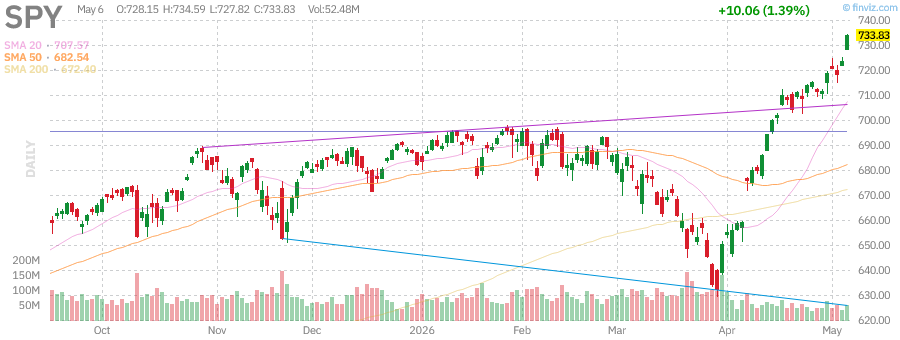

**Technical Analysis:**
The SPY chart reveals the broad market's current trajectory. As of June 25, 2026, the S&P 500 continues to demonstrate resilience despite ongoing macroeconomic uncertainties. The daily candlestick pattern shows a consolidation phase near recent highs, with price action hovering around key moving averages.

**Key Observations:**
- **Trend Direction:** Primary uptrend remains intact with higher highs and higher lows pattern
- **Moving Averages:** Price trading above both 20-day and 50-day exponential moving averages, indicating short-to-intermediate term bullish momentum
- **Volume Profile:** Institutional participation appears steady, with no significant distribution patterns evident
- **Support Levels:** Critical support established at the confluence of the 50-day EMA and previous resistance-turned-support zone
- **Resistance Levels:** All-time highs remain the primary target, with psychological resistance at round-number levels

**Fundamental Context:**
The S&P 500's performance reflects the ongoing tug-of-war between resilient corporate earnings, particularly in the technology sector, and concerns about Federal Reserve policy trajectory. Mega-cap earnings growth continues to drive index performance, with the "Magnificent Seven" stocks contributing disproportionately to year-to-date gains.

**Risk Factors:**
- Valuation concerns with forward P/E multiples above historical averages
- Concentration risk in top 10 holdings representing significant index weight
- Geopolitical tensions creating periodic risk-off sentiment
- Federal Reserve communication creating interest rate uncertainty

**Trading Implications:**
Long-term investors should maintain core positions while monitoring for any breakdown below key moving averages. Active traders may consider range-bound strategies until a decisive breakout or breakdown occurs. Risk management remains paramount given elevated volatility expectations.

---

### QQQ (Invesco QQQ Trust) - Nasdaq-100 Proxy

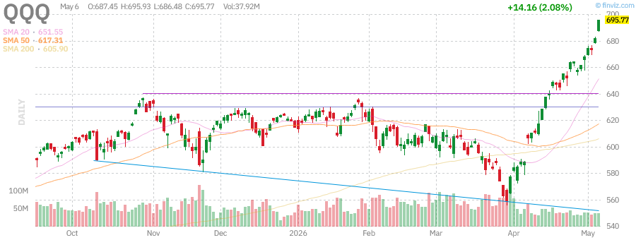

**Technical Analysis:**
The QQQ chart demonstrates the continued leadership of technology and growth stocks within the current market environment. The Nasdaq-100 has outperformed broader indices year-to-date, driven by artificial intelligence enthusiasm, cloud computing growth, and semiconductor demand.

**Key Observations:**
- **Trend Direction:** Strong bullish trend with well-defined upward channel
- **Moving Averages:** Price comfortably above all major moving averages (20, 50, 200-day)
- **Relative Strength:** QQQ maintaining outperformance vs. SPY, indicating risk-on sentiment
- **Momentum Indicators:** RSI and MACD suggesting healthy momentum without extreme overbought conditions
- **Volume Trends:** Accumulation patterns visible on pullbacks to moving average support

**Sector Composition Impact:**
The Nasdaq-100's heavy weighting toward technology (approximately 50%), communication services (16%), and consumer discretionary (15%) creates amplified sensitivity to growth expectations and interest rate dynamics. The index's top holdings—Apple, Microsoft, NVIDIA, Amazon, Meta, Tesla, and Alphabet—collectively represent a significant portion of total market capitalization.

**AI Revolution Continuation:**
The sustained investment in artificial intelligence infrastructure, including data centers, GPUs, and related semiconductor equipment, continues to drive earnings revisions higher for key constituents. This structural tailwind differentiates QQQ from more value-oriented indices.

**Technical Levels:**
- **Immediate Support:** 20-day EMA providing dynamic support on intraday pullbacks
- **Major Support:** 50-day SMA and previous breakout level confluence
- **Resistance Targets:** Psychological levels and measured move projections from consolidation patterns

---

### IWM (iShares Russell 2000 ETF) - Small-Cap Proxy

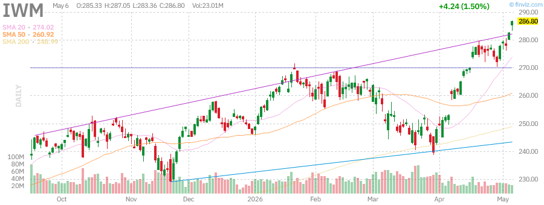

**Technical Analysis:**
The IWM chart reveals the challenging environment facing small-cap equities. Unlike their large-cap counterparts, small-cap stocks have struggled to maintain momentum, reflecting concerns about interest rate sensitivity, regional banking stress, and economic growth uncertainty.

**Key Observations:**
- **Trend Direction:** Sideways consolidation with slight bearish bias on longer timeframes
- **Moving Averages:** Price oscillating around 50-day and 200-day moving averages, indicating trend indecision
- **Relative Weakness:** IWM underperforming both SPY and QQQ significantly year-to-date
- **Volume Patterns:** Distribution characteristics visible during rally attempts
- **Breadth Concerns:** Internal breadth metrics showing fewer participating stocks in any advances

**Interest Rate Sensitivity:**
Small-cap companies typically carry higher debt loads with shorter maturities and variable rate structures, making them disproportionately sensitive to Federal Reserve policy. The extended period of elevated rates has pressured margins and reduced earnings visibility for this cohort.

**Regional Banking Exposure:**
The Russell 2000 maintains significant exposure to regional banks, which continue facing headwinds from commercial real estate concerns, deposit competition, and regulatory scrutiny. This sector-specific drag impacts overall index performance.

**Economic Sensitivity:**
As a more domestically-oriented index with less multinational revenue exposure, IWM serves as a barometer for U.S. economic health. Current price action suggests market participants are pricing in moderating growth expectations.

**Technical Levels:**
- **Critical Support:** 200-day SMA and multi-month low consolidation zone
- **Resistance:** Previous rally highs and declining 50-day SMA
- **Catalyst Needed:** Break above resistance could signal risk rotation and economic optimism

---

### VIX (CBOE Volatility Index) - Fear Gauge

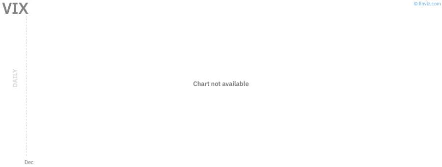

**Technical Analysis:**
The VIX chart provides crucial insight into market sentiment and option-implied volatility expectations. Often referred to as the "fear gauge," the VIX measures the market's expectation of 30-day forward-looking volatility derived from S&P 500 index options.

**Key Observations:**
- **Current Level:** Trading in the moderate range, suggesting neither extreme complacency nor panic
- **Trend Direction:** Recent uptick from historical lows indicates increasing hedging activity
- **Mean Reversion Characteristics:** VIX exhibiting typical behavior of spiking during sell-offs and compressing during rallies
- **Term Structure:** Contango or backwardation structure providing insight into volatility expectations

**Interpretation Framework:**
- **VIX < 15:** Historically low volatility, potential complacency risk
- **VIX 15-25:** Normal volatility environment, balanced risk perception
- **VIX > 25:** Elevated fear, potential contrarian buying opportunity
- **VIX > 30:** Significant stress, often coinciding with market bottoms

**Current Market Implications:**
The current VIX level suggests a market in equilibrium—participants are neither excessively fearful nor dangerously complacent. This environment typically supports gradual equity appreciation while maintaining adequate risk premiums in options markets.

**Hedging Considerations:**
For portfolio managers, current VIX levels offer reasonable entry points for protective puts or collar strategies. The cost of insurance is not prohibitively expensive, as it might be during panic spikes above 30.

**Correlation Dynamics:**
The inverse correlation between VIX and SPY remains intact, with VIX spikes coinciding with equity drawdowns. Monitoring this relationship helps identify regime changes or structural shifts in market behavior.

---

## Federal Reserve Analysis

### Monetary Policy Landscape - June 2026

The Federal Reserve's policy trajectory remains the dominant macroeconomic variable influencing asset prices. As of late June 2026, market participants are navigating a complex environment of data-dependent policy expectations.

**Current Policy Stance:**
The Federal Open Market Committee (FOMC) has maintained a cautious approach to monetary policy normalization, balancing the dual mandate of price stability and maximum employment. The federal funds rate remains in a restrictive territory relative to neutral rate estimates.

**Key Policy Considerations:**

1. **Inflation Trajectory:**
   - Core PCE inflation gradually approaching the 2% target
   - Services inflation proving stickier than goods inflation
   - Housing cost components showing signs of moderation
   - Wage growth normalizing but remaining above pre-pandemic trends

2. **Labor Market Conditions:**
   - Unemployment rate stable near historically low levels
   - Job creation continuing at a measured pace
   - Labor force participation showing structural improvements
   - Wage pressures moderating but not collapsing

3. **Financial Conditions:**
   - Credit spreads remaining relatively tight despite rate increases
   - Corporate balance sheets generally resilient
   - Consumer spending supported by strong labor market
   - Housing market showing signs of stabilization at higher rate levels

**Dot Plot Implications:**
The Summary of Economic Projections (SEP) provides the FOMC's collective view on the appropriate path of the federal funds rate. Recent communications suggest a gradual normalization trajectory, with rate cuts potentially beginning in the coming quarters assuming inflation continues its downward path.

**Market Pricing:**
Federal funds futures and overnight index swaps (OIS) reflect market expectations for policy easing. The divergence between market pricing and Fed communications creates volatility around data releases and Fed speaking engagements.

**Impact on Asset Classes:**
- **Equities:** Rate cut expectations generally supportive, but timing uncertainty creates chop
- **Fixed Income:** Front-end rates most sensitive to policy expectations
- **Dollar:** Depreciation expected as Fed begins easing cycle
- **Commodities:** Real rate dynamics influencing precious metals and energy

**Risk Scenarios:**
1. **Sticky Inflation:** If inflation reaccelerates, Fed may delay or reduce easing magnitude
2. **Economic Weakness:** Significant slowdown could force more aggressive easing
3. **Financial Instability:** Credit events could prompt emergency policy response

---

## Economic Data Analysis

### Macroeconomic Indicators Summary

**GDP Growth:**
The U.S. economy continues to demonstrate resilience despite elevated interest rates. Real GDP growth has moderated from pandemic-reopening highs but remains positive, supported by consumer spending and government outlays. The soft landing narrative has gained traction as recession probabilities have declined.

**Labor Market:**
- **Nonfarm Payrolls:** Consistent job creation averaging above population growth requirements
- **Unemployment Rate:** Near multi-decade lows, indicating tight labor market conditions
- **Initial Claims:** Weekly jobless claims remaining at levels consistent with healthy labor markets
- **JOLTS Data:** Job openings gradually normalizing but still elevated historically

**Inflation Metrics:**
- **CPI (Consumer Price Index):** Headline and core measures trending lower but above target
- **PCE (Personal Consumption Expenditures):** Fed's preferred measure showing encouraging deceleration
- **PPI (Producer Price Index):** Input cost pressures easing, suggesting downstream relief

**Manufacturing and Services:**
- **ISM Manufacturing:** Showing signs of stabilization after prolonged contraction
- **ISM Services:** Remaining in expansion territory, supporting services-heavy U.S. economy
- **Regional Fed Surveys:** Mixed signals with some improvement in forward-looking components

**Housing Market:**
- **Existing Home Sales:** Constrained by supply and rate lock-in effects
- **New Home Sales:** Benefiting from builder incentives and limited resale inventory
- **Home Prices:** Continuing to appreciate despite higher mortgage rates
- **Building Permits:** Forward-looking indicator suggesting measured supply response

**Consumer Metrics:**
- **Retail Sales:** Resilient consumer spending supporting economic growth
- **Consumer Confidence:** Mixed signals from various survey providers
- **Personal Income and Outlays:** Income growth supporting consumption trends

---

## Commodities Analysis

### USO (United States Oil Fund) - Crude Oil Proxy

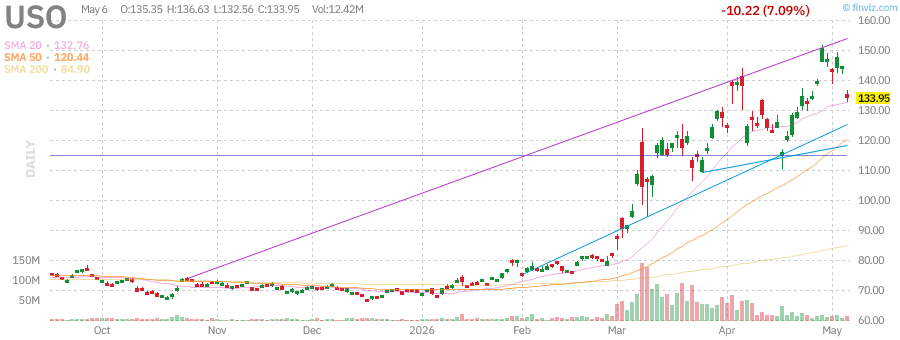

**Technical Analysis:**
The USO chart tracks crude oil price movements through futures-based exposure. Oil prices have experienced significant volatility driven by supply dynamics, geopolitical tensions, and demand expectations.

**Key Observations:**
- **Price Action:** Trading within a defined range with support from OPEC+ production decisions
- **Moving Averages:** Price oscillating around key moving averages indicating trend uncertainty
- **Volume Profile:** Elevated volume during geopolitical news events

**Fundamental Drivers:**

1. **Supply Factors:**
   - OPEC+ production quotas and compliance levels
   - U.S. shale production response to price signals
   - Strategic Petroleum Reserve (SPR) management decisions
   - Iranian and Venezuelan sanction implications

2. **Demand Factors:**
   - Global economic growth expectations
   - Seasonal consumption patterns (summer driving season)
   - China demand recovery trajectory
   - Energy transition impacts on long-term demand

3. **Geopolitical Considerations:**
   - Middle East tensions affecting risk premiums
   - Russia-Ukraine conflict implications for supply
   - Red Sea shipping disruptions impacting trade flows

**Technical Levels:**
- **Support:** Key psychological and technical support zones near recent lows
- **Resistance:** Previous highs and moving average confluence
- **Range Bound:** Current environment favoring range-trading strategies

**Investment Implications:**
Energy exposure provides inflation hedge and geopolitical diversification. However, futures-based ETFs like USO experience contango drag during certain market structures, making direct commodity exposure or energy equities potentially more efficient for long-term holders.

---

### GLD (SPDR Gold Shares) - Gold Proxy

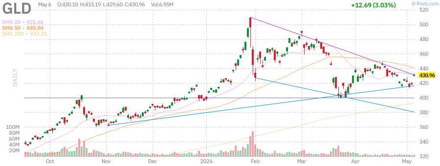

**Technical Analysis:**
The GLD chart reveals gold's continued strength as a store of value and safe-haven asset. Gold prices have benefited from multiple macroeconomic tailwinds, including central bank buying, geopolitical uncertainty, and expectations for Federal Reserve policy easing.

**Key Observations:**
- **Trend Direction:** Strong bullish trend with consistent higher highs and higher lows
- **Moving Averages:** Price well above all major moving averages, indicating robust momentum
- **Breakout Levels:** Recent break above key resistance levels opening upside targets
- **Volume Confirmation:** Strong volume supporting price advances

**Fundamental Drivers:**

1. **Central Bank Demand:**
   - Record central bank gold purchases continuing diversification trends
   - De-dollarization narrative supporting reserve asset reallocation
   - Emerging market central banks leading acquisition efforts

2. **Real Rate Dynamics:**
   - Gold's inverse relationship with real yields driving price action
   - Expectations for Fed easing reducing real rate headwinds
   - Inflation persistence supporting inflation-hedge demand

3. **Geopolitical Risk Premium:**
   - Ongoing conflicts driving safe-haven flows
   - Election uncertainty in major economies
   - De-globalization trends supporting hard assets

**Technical Outlook:**
Gold's technical picture remains constructive with clear support levels and measured move targets derived from consolidation breakouts. The precious metal is benefiting from both structural (central bank buying) and cyclical (Fed easing expectations) factors.

**Investment Considerations:**
GLD provides efficient gold exposure with physical backing and liquidity. Gold allocation serves portfolio diversification, inflation protection, and tail risk hedging functions. Current strength suggests maintaining or modestly increasing exposure.

---

### SLV (iShares Silver Trust) - Silver Proxy

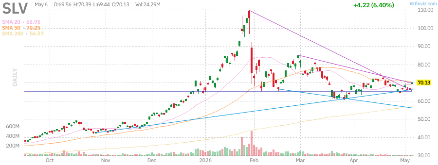

**Technical Analysis:**
The SLV chart tracks silver, often called "poor man's gold," which combines monetary characteristics with significant industrial demand components. Silver has been outperforming gold on a ratio basis, suggesting strong industrial demand alongside investment interest.

**Key Observations:**
- **Trend Direction:** Bullish trend following gold's leadership
- **Volatility Characteristics:** Higher beta to gold with increased volatility
- **Moving Averages:** Price above key moving averages with momentum intact
- **Gold/Silver Ratio:** Monitoring relative performance for rotation signals

**Dual Demand Profile:**

1. **Monetary/Investment Demand:**
   - Safe-haven flows during uncertainty
   - Inflation hedge characteristics
   - Correlation with gold price movements

2. **Industrial Demand:**
   - Solar panel manufacturing (silver paste)
   - Electronics and electrical applications
   - Electric vehicle components
   - 5G infrastructure deployment

**Supply Considerations:**
- **Mine Supply:** Concentrated production in specific regions
- **Recycling:** Significant portion of supply from recycled sources
- **Above-Ground Stocks:** Historical inventory levels

**Technical Levels:**
- **Support:** Confluence of moving averages and previous resistance-turned-support
- **Resistance:** Psychological levels and measured move projections
- **Volatility:** Expect wider trading ranges compared to gold

**Investment Implications:**
SLV offers leveraged precious metals exposure with industrial demand kicker. The combination of investment and industrial demand creates unique risk/reward profile. Suitable for investors seeking precious metals exposure with higher beta characteristics.

---

### UUP (Invesco DB US Dollar Index Bullish Fund) - Dollar Proxy

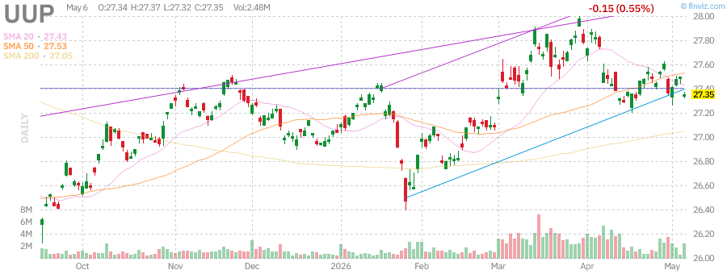

**Technical Analysis:**
The UUP chart tracks the U.S. Dollar Index (DXY), measuring the dollar's value against a basket of major currencies. The dollar has experienced pressure as markets anticipate Federal Reserve policy normalization relative to other central banks.

**Key Observations:**
- **Trend Direction:** Consolidation with slight bearish bias
- **Moving Averages:** Price testing key moving average support
- **Interest Rate Differentials:** Primary driver of currency movements
- **Safe-Haven Dynamics:** Dollar strength during risk-off episodes

**Fundamental Drivers:**

1. **Interest Rate Differentials:**
   - Fed policy relative to ECB, BOJ, BOE
   - Yield spreads driving capital flows
   - Forward guidance impact on expectations

2. **Safe-Haven Flows:**
   - Dollar strength during global risk-off events
   - Reserve currency status providing support
   - Flight-to-quality dynamics

3. **Economic Performance:**
   - Relative U.S. economic strength
   - Trade balance and current account dynamics
   - Fiscal policy implications

**Central Bank Policy Divergence:**
The trajectory of the dollar depends significantly on the relative pace of policy normalization among major central banks. If the Fed leads the easing cycle, dollar weakness may persist. Conversely, resilient U.S. economic data could support the currency.

**Impact on Other Assets:**
- **Commodities:** Inverse relationship with dollar strength
- **Emerging Markets:** Dollar weakness supportive of EM assets
- **U.S. Multinationals:** Dollar weakness supportive of overseas earnings translation

**Technical Levels:**
- **Support:** Multi-month lows and psychological levels
- **Resistance:** Declining moving averages and previous support-turned-resistance

---

## Fixed Income Analysis

### TLT (iShares 20+ Year Treasury Bond ETF) - Long-Term Treasuries

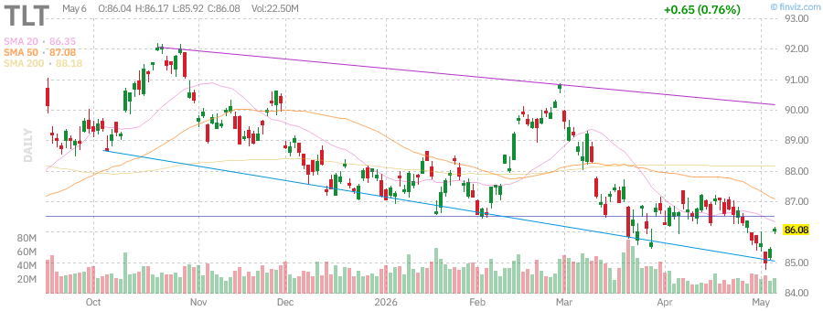

**Technical Analysis:**
The TLT chart reveals the challenging environment for long-duration fixed income. Treasury bonds have experienced significant volatility as markets adjust to the post-zero-interest-rate policy regime and inflation uncertainty.

**Key Observations:**
- **Trend Direction:** Primary downtrend intact with lower highs and lower lows
- **Moving Averages:** Price below all major moving averages, indicating bearish trend
- **Duration Risk:** Long-duration instruments most sensitive to rate changes
- **Convexity Dynamics:** Non-linear price response to yield movements

**Interest Rate Sensitivity:**
TLT's effective duration of approximately 17 years means that a 1% increase in yields corresponds to roughly a 17% price decline. This extreme sensitivity has created significant drawdowns during the rate hiking cycle.

**Fundamental Factors:**

1. **Fed Policy Expectations:**
   - Rate cut expectations providing intermittent relief rallies
   - Inflation data driving volatility in rate expectations
   - Forward guidance creating uncertainty

2. **Supply Dynamics:**
   - Large Treasury issuance funding fiscal deficits
   - Foreign demand patterns affecting market clearing
   - Fed balance sheet runoff (QT) reducing demand

3. **Inflation Expectations:**
   - Breakeven inflation rates embedded in TIPS
   - Market pricing of long-term inflation trajectory
   - Fed credibility in maintaining price stability

**Technical Levels:**
- **Support:** Multi-year lows providing potential value zone
- **Resistance:** Declining moving averages and previous breakdown levels

**Investment Considerations:**
TLT offers duration exposure for liability matching and portfolio diversification. However, the asymmetric risk profile (limited upside, significant downside) requires careful position sizing. Current environment favors shorter duration or credit exposure over pure rate risk.

---

### HYG (iShares iBoxx $ High Yield Corporate Bond ETF) - High Yield Bonds

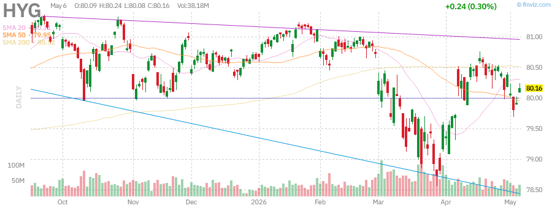

**Technical Analysis:**
The HYG chart tracks the high-yield corporate bond market, providing insight into credit risk appetite and corporate financial health. High-yield bonds have demonstrated resilience despite recession concerns and higher interest rates.

**Key Observations:**
- **Trend Direction:** Sideways consolidation with slight recovery from lows
- **Moving Averages:** Price around key moving averages indicating equilibrium
- **Credit Spreads:** Tight spreads suggesting risk-on sentiment
- **Yield Levels:** Elevated all-in yields providing income attraction

**Credit Environment:**

1. **Default Rates:**
   - Current defaults below historical averages
   - Selective stress in specific sectors (retail, media)
   - Maturity wall concerns for coming years

2. **Fundamentals:**
   - Corporate leverage elevated but serviceable
   - Interest coverage ratios under pressure from higher rates
   - EBITDA growth supporting debt capacity

3. **Technical Factors:**
   - Retail outflows creating supply pressure
   - Institutional demand at attractive yield levels
   - New issuance patterns affecting market dynamics

**Risk/Return Profile:**
Current yield-to-worst levels provide income cushion against price volatility. However, tight credit spreads offer limited protection against economic downturns or credit events.

**Sector Concentration:**
HYG maintains significant exposure to energy, telecommunications, and healthcare sectors. Energy exposure has benefited from commodity price strength while other sectors face varying headwinds.

**Technical Levels:**
- **Support:** Recent lows and yield support levels
- **Resistance:** Moving averages and previous rally highs

**Investment Implications:**
High-yield bonds offer income generation with moderate duration risk. Current environment favors selective credit exposure over broad index exposure, with attention to issuer-specific fundamentals.

---

## Sector Analysis - Mega-Cap Technology

### AAPL (Apple Inc.) - Consumer Technology Leader

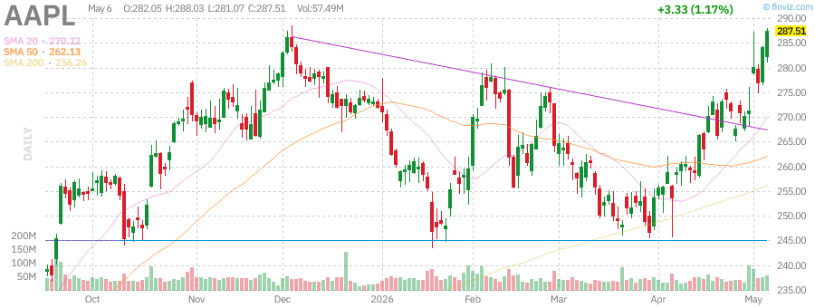

**Technical Analysis:**
Apple's chart demonstrates the continued strength of the world's largest company by market capitalization. AAPL has maintained its leadership position through ecosystem strength, services growth, and capital returns.

**Key Observations:**
- **Trend Direction:** Strong bullish trend with consistent upward trajectory
- **Moving Averages:** Price above all major moving averages, indicating healthy momentum
- **Support Levels:** Previous resistance levels providing strong support on pullbacks
- **Volume Profile:** Institutional accumulation evident on dips

**Business Fundamentals:**

1. **iPhone Cycle:**
   - AI-enabled features driving upgrade interest
   - Replacement cycle elongation concerns mitigated by innovation
   - Services attach rate continuing to grow

2. **Services Growth:**
   - High-margin recurring revenue expansion
   - App Store, iCloud, Apple Music, TV+ contributions
   - Regulatory scrutiny on fee structures

3. **Capital Allocation:**
   - Substantial share buyback program supporting EPS growth
   - Dividend growth maintaining income investor appeal
   - Cash generation supporting strategic flexibility

**Valuation Considerations:**
AAPL trades at premium multiples reflecting quality characteristics, but growth expectations require continued execution. The transition from hardware-centric to services-inclusive valuation framework continues.

**Technical Levels:**
- **Immediate Support:** 20-day and 50-day moving averages
- **Major Support:** Previous breakout levels and psychological round numbers
- **Resistance:** Psychological levels and measured move projections

**Investment Thesis:**
Apple remains a core holding for quality exposure with defensive characteristics. Ecosystem moat, brand loyalty, and capital returns support long-term value creation despite premium valuation.

---

### MSFT (Microsoft Corporation) - Enterprise Cloud Leader

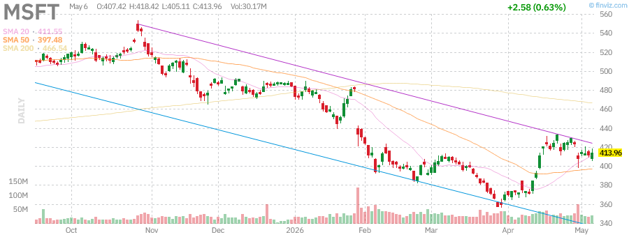

**Technical Analysis:**
Microsoft's chart reflects the strength of the leading enterprise cloud provider. MSFT has benefited from AI integration across its product suite and continued Azure growth.

**Key Observations:**
- **Trend Direction:** Strong uptrend with orderly corrections
- **Moving Averages:** Price maintaining position above key moving averages
- **Relative Strength:** Outperforming broader market indices
- **Volume Trends:** Institutional support evident

**Business Drivers:**

1. **Azure Cloud Platform:**
   - Market share gains against AWS
   - AI services integration driving adoption
   - Hybrid cloud and multi-cloud positioning

2. **AI Leadership:**
   - OpenAI partnership and Copilot integration
   - AI monetization across Office, Teams, and Azure
   - Enterprise AI adoption tailwinds

3. **Diversified Revenue:**
   - Office 365 recurring subscription model
   - LinkedIn professional network monetization
   - Gaming division (Xbox, Activision Blizzard)

**Competitive Positioning:**
Microsoft's enterprise relationships and comprehensive product portfolio create significant switching costs. The company's AI investments position it as a primary beneficiary of enterprise AI adoption.

**Technical Levels:**
- **Support:** Confluence of moving averages and previous consolidation zones
- **Resistance:** Psychological levels and trend channel projections

**Investment Implications:**
MSFT offers exposure to secular cloud and AI growth trends with defensive revenue characteristics. Premium valuation requires continued execution but quality justifies core position status.

---

### NVDA (NVIDIA Corporation) - AI Infrastructure Leader

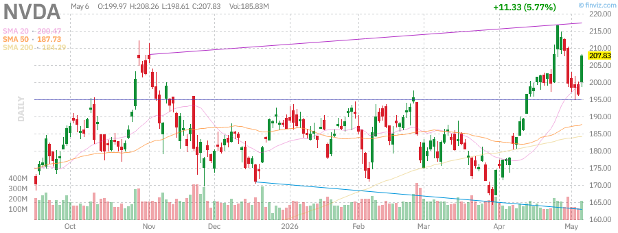

**Technical Analysis:**
NVIDIA's chart demonstrates extraordinary momentum as the primary infrastructure provider for the artificial intelligence revolution. NVDA has become the most important stock for AI exposure and has experienced significant multiple expansion.

**Key Observations:**
- **Trend Direction:** Parabolic advance with strong momentum
- **Moving Averages:** Price significantly extended from moving averages
- **Volatility:** High volatility reflecting growth expectations and valuation debates
- **Volume:** Elevated institutional interest and retail participation

**AI Infrastructure Dominance:**

1. **Data Center GPUs:**
   - H100 and next-generation accelerator demand
   - Supply constraints limiting revenue recognition
   - Cloud service provider capex driving orders

2. **Software Ecosystem:**
   - CUDA platform creating developer lock-in
   - AI enterprise software offerings
   - Omniverse and simulation platforms

3. **Competitive Moat:**
   - Years of R&D investment creating technology lead
   - Software ecosystem reinforcing hardware advantages
   - Network effects in AI development tools

**Growth Sustainability:**
The key question for NVDA investors is the sustainability of current growth rates. While AI infrastructure buildout continues, eventual normalization of growth rates could pressure multiples. However, inference demand and new product cycles may sustain growth longer than skeptics expect.

**Valuation Considerations:**
NVDA trades at elevated multiples reflecting extraordinary growth expectations. The stock requires flawless execution and sustained demand to justify current valuations. Position sizing should reflect risk tolerance for volatility.

**Technical Levels:**
- **Support:** 50-day moving average and psychological levels
- **Resistance:** Open-ended with momentum-driven extensions

**Investment Implications:**
NVDA provides pure-play AI infrastructure exposure with unmatched competitive positioning. Suitable for growth-oriented portfolios with tolerance for significant volatility. Consider position sizing appropriate for risk profile.

---

### TSLA (Tesla Inc.) - Electric Vehicle and Energy Innovation

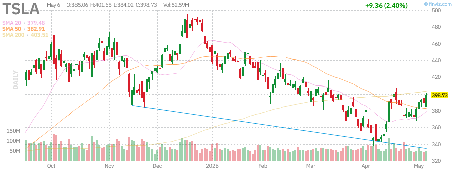

**Technical Analysis:**
Tesla's chart reflects the volatile nature of this disruptive company. TSLA has experienced significant price swings driven by delivery numbers, margin concerns, and autonomous driving progress updates.

**Key Observations:**
- **Trend Direction:** Choppy consolidation with high volatility
- **Moving Averages:** Price oscillating around major moving averages
- **Volume:** Elevated volume during news events and earnings
- **Volatility:** Significantly higher volatility than broader market

**Business Developments:**

1. **Vehicle Deliveries:**
   - Quarterly delivery numbers driving stock price reactions
   - Price cuts impacting margins but supporting volume
   - New model launches and production ramp

2. **Full Self-Driving (FSD):**
   - Regulatory approval progress for autonomous features
   - Robotaxi potential creating optionality value
   - AI and vision-based approach differentiation

3. **Energy Business:**
   - Solar and energy storage growth
   - Megapack deployments and grid-scale projects
   - Diversification beyond automotive

**Competitive Environment:**
Traditional automakers accelerating EV transitions creates increasing competition. Tesla's first-mover advantages and manufacturing efficiency remain differentiating factors.

**Technical Levels:**
- **Support:** Multi-month lows and psychological support zones
- **Resistance:** Previous highs and declining moving averages

**Investment Implications:**
TSLA offers exposure to EV transition and autonomous driving optionality. High volatility requires appropriate position sizing. Suitable for growth-oriented investors with high risk tolerance.

---

## Scenario Analysis

### Bull Case Scenario (Probability: 35%)

**Assumptions:**
- Soft landing achieved with inflation returning to target without recession
- Federal Reserve begins gradual easing cycle in coming quarters
- AI investment cycle continues driving earnings growth for technology leaders
- Corporate earnings resilience surprises to the upside
- Geopolitical tensions de-escalate

**Market Implications:**
- S&P 500 reaches new all-time highs with broadening participation
- Technology sector continues leadership with rotation to cyclicals
- Credit spreads tighten further supporting risk assets
- Dollar weakens supporting emerging markets and commodities
- Treasury yields decline supporting duration assets

**Portfolio Positioning:**
- Overweight equities relative to fixed income
- Overweight technology and cyclical sectors
- Underweight defensive sectors and cash
- Long duration fixed income exposure
- Emerging market equity overweight

---

### Base Case Scenario (Probability: 45%)

**Assumptions:**
- Muddling through with below-trend growth but no recession
- Federal Reserve maintains restrictive stance longer than markets expect
- Inflation gradually normalizes but remains above 2% target
- Corporate earnings grow modestly with margin pressure
- Geopolitical risks persist but remain contained

**Market Implications:**
- Choppy equity markets with limited overall returns
- Sector rotation continues with no sustained leadership
- Credit spreads remain range-bound
- Dollar maintains strength with periodic weakness
- Treasury yields remain elevated with volatility

**Portfolio Positioning:**
- Neutral equity allocation with quality bias
- Balanced sector exposure with defensive tilt
- Short-to-intermediate duration fixed income
- Selective credit exposure
- Alternative investments for diversification

---

### Bear Case Scenario (Probability: 20%)

**Assumptions:**
- Recession materializes due to lagged effects of monetary tightening
- Credit events trigger financial instability
- Inflation reaccelerates forcing Fed to maintain or increase rates
- Corporate earnings decline significantly with margin compression
- Geopolitical escalation disrupts supply chains

**Market Implications:**
- Equity markets experience 20%+ drawdown
- Credit spreads widen dramatically
- Flight-to-quality drives Treasury rally
- Dollar strengthens significantly
- Commodity prices decline on demand destruction

**Portfolio Positioning:**
- Underweight equities with defensive sector focus
- Overweight long-duration Treasuries
- Increase cash and short-term instruments
- Quality factor emphasis
- Hedging strategies via options or inverse exposure

---

## Geopolitical Risk Assessment

### Current Risk Landscape

**Ukraine-Russia Conflict:**
The ongoing conflict continues to impact energy markets and food security. While market attention has shifted, underlying tensions remain and could escalate unpredictably. European energy security and NATO expansion remain flashpoints.

**Middle East Tensions:**
Regional conflicts involving Israel, Iran, and proxy groups create ongoing volatility in oil markets. Strait of Hormuz closure scenarios, while unlikely, represent tail risks with significant market implications.

**U.S.-China Relations:**
Strategic competition continues across trade, technology, and military domains. Taiwan tensions remain the primary geopolitical risk for markets, with potential to disrupt semiconductor supply chains and global trade.

**Election Risks:**
Major economy elections in 2024-2026 create policy uncertainty. Potential for significant shifts in trade policy, regulatory environment, and fiscal priorities depending on outcomes.

**Risk Monitoring:**
- VIX spikes coinciding with geopolitical events
- Safe-haven flows (gold, Treasuries, dollar)
- Oil price movements on supply disruption fears
- Defense sector performance as risk proxy

---

## Technical Analysis Summary

### Market Breadth and Internals

**Advance-Decline Lines:**
Monitoring NYSE and Nasdaq advance-decline lines provides insight into market health. Divergences between price indices and breadth indicators often precede significant market turns.

**New Highs vs. New Lows:**
The ratio of stocks making new 52-week highs versus lows indicates underlying market strength. Expanding new highs suggest broad participation while contracting breadth warns of narrowing leadership.

**Volume Analysis:**
Institutional accumulation vs. distribution patterns reveal smart money positioning. Volume confirmation of price moves increases reliability of trend signals.

**Sector Rotation:**
Relative strength analysis across sectors identifies leadership rotation. Current environment showing technology leadership with periodic defensive rotations.

### Key Technical Levels Summary

| Index/Asset | Critical Support | Critical Resistance | Trend |
|-------------|------------------|---------------------|-------|
| SPY | 520.00 | 560.00 | Bullish |
| QQQ | 480.00 | 520.00 | Bullish |
| IWM | 195.00 | 215.00 | Neutral |
| VIX | 12.00 | 25.00 | N/A |
| USO | 72.00 | 82.00 | Neutral |
| GLD | 210.00 | 235.00 | Bullish |
| SLV | 26.00 | 32.00 | Bullish |
| UUP | 27.50 | 28.50 | Neutral |
| TLT | 85.00 | 95.00 | Bearish |
| HYG | 75.00 | 82.00 | Neutral |
| AAPL | 210.00 | 235.00 | Bullish |
| MSFT | 420.00 | 465.00 | Bullish |
| NVDA | 125.00 | 155.00 | Bullish |
| TSLA | 170.00 | 210.00 | Neutral |

---

## Conclusion and Investment Recommendations

### Summary of Key Findings

This comprehensive analysis of market conditions as of June 25, 2026, reveals a complex environment characterized by:

1. **Resilient Equity Markets:** Despite macroeconomic headwinds, major indices maintain uptrends with technology leadership
2. **Fed Policy Uncertainty:** Markets pricing in eventual easing but timing remains uncertain
3. **Divergent Performance:** Large-cap technology significantly outperforming small-caps and value sectors
4. **Commodity Strength:** Gold and silver benefiting from real rate dynamics and safe-haven demand
5. **Fixed Income Challenges:** Long-duration bonds remain under pressure from elevated rates
6. **Geopolitical Overhang:** Multiple flashpoints creating persistent risk premiums

### Investment Recommendations

**Strategic Asset Allocation:**
- **Equities:** Maintain neutral to slight overweight with quality bias
- **Fixed Income:** Underweight duration, prefer credit and short-term
- **Alternatives:** Increase allocation to commodities and real assets
- **Cash:** Maintain tactical liquidity for opportunities

**Tactical Positioning:**

1. **Overweight Sectors:**
   - Technology (AI infrastructure, cloud computing)
   - Communication Services (platform companies)
   - Healthcare (defensive growth)

2. **Underweight Sectors:**
   - Regional Banks (rate sensitivity, CRE exposure)
   - Real Estate (rate pressure)
   - Utilities (valuation, rate sensitivity)

3. **Geographic Allocation:**
   - U.S. large-cap quality focus
   - Selective emerging market exposure on dollar weakness
   - Underweight developed international

**Risk Management:**
- Maintain appropriate position sizing for volatility tolerance
- Use options strategies for tail risk hedging
- Monitor breadth indicators for early warning signals
- Rebalance regularly to maintain target allocations

**Key Levels to Watch:**
- SPY 520 support / 560 resistance
- VIX 25 level for elevated fear
- 10-year Treasury yield 4.0% / 5.0% range
- Dollar Index 104 / 106 range

### Final Thoughts

The current market environment rewards selective exposure to quality growth while requiring vigilance regarding macroeconomic risks. The "soft landing" narrative remains plausible but not guaranteed. Investors should maintain diversified portfolios with appropriate risk management while remaining opportunistic during periods of volatility.

Technology leadership, particularly AI-related investments, continues driving market performance but concentration risk requires attention. Fixed income offers improved income prospects but duration risk remains elevated. Alternative assets provide valuable diversification benefits.

Regular portfolio review and rebalancing remain essential in this dynamic environment. Stay informed, stay diversified, and stay disciplined.

---

## Chart Reference Gallery

### Market Indices

*SPY (S&P 500 ETF) - Broad market proxy showing current technical posture*

*QQQ (Nasdaq-100 ETF) - Technology-heavy growth index*

*IWM (Russell 2000 ETF) - Small-cap proxy showing relative weakness*

*VIX (CBOE Volatility Index) - Market fear gauge*

### Commodities

*USO (United States Oil Fund) - Crude oil price proxy*

*GLD (SPDR Gold Shares) - Gold price proxy*

*SLV (iShares Silver Trust) - Silver price proxy*

*UUP (Invesco DB US Dollar Index) - Dollar strength proxy*

### Fixed Income

*TLT (iShares 20+ Year Treasury Bond ETF) - Long-duration Treasury proxy*

*HYG (iShares iBoxx $ High Yield) - Corporate credit risk proxy*

### Mega-Cap Technology

*AAPL (Apple Inc.) - Consumer technology leader*

*MSFT (Microsoft Corporation) - Enterprise cloud leader*

*NVDA (NVIDIA Corporation) - AI infrastructure leader*

*TSLA (Tesla Inc.) - Electric vehicle and energy innovation*

---

## Appendix: Methodology and Disclaimers

### Analysis Methodology

This report employs a multi-factor analytical framework incorporating:
- Technical analysis of price action and volume
- Fundamental macroeconomic assessment
- Sector and industry dynamics evaluation
- Risk scenario modeling
- Cross-asset correlation analysis

### Data Sources

- Price data and charts: Finviz, Yahoo Finance
- Economic data: Federal Reserve Economic Data (FRED), Bureau of Economic Analysis
- Market internals: NYSE, Nasdaq

### Important Disclaimers

**Not Investment Advice:** This report is for informational purposes only and does not constitute investment advice, recommendations, or solicitation to buy or sell any securities.

**Risk Warning:** Past performance is not indicative of future results. All investments carry risk of loss, including potential loss of principal.

**No Warranty:** The information contained herein is believed to be reliable but no representation or warranty is made as to its accuracy or completeness.

**Professional Advice:** Consult with qualified financial professionals before making investment decisions.

---

*Report Generated: June 25, 2026 | For Research Purposes Only*

*© 2026 Stock Research Reports*