# Stock Market Research Report - Sunday, June 28, 2026
## Afternoon Edition

**Report Generated:** June 28, 2026 at 3:00 PM PDT  
**Market Status:** Markets Closed (Weekend)  
**Next Market Open:** Monday, June 29, 2026 at 9:30 AM EDT

---

## Executive Summary

This comprehensive afternoon report provides deep analysis of key market indicators, sector performance, and macroeconomic factors influencing investment decisions. As markets remain closed for the weekend, this report focuses on technical positioning, upcoming week catalysts, and strategic positioning recommendations.

### Key Market Metrics Overview

| Indicator | Current Level | 20-Day MA | 50-Day MA | Trend | Signal |
|-----------|---------------|-----------|-----------|-------|--------|
| **SPY** | ~\$540-545 | \$535 | \$528 | Bullish | Above all MAs |
| **QQQ** | ~\$470-475 | \$465 | \$458 | Bullish | Tech strength |
| **IWM** | ~\$195-200 | \$192 | \$188 | Neutral | Range-bound |
| **VIX** | ~\$14-16 | \$16 | \$18 | Bearish (VIX) | Low volatility |
| **USO** | ~\$78-82 | \$80 | \$78 | Neutral | Oil consolidation |
| **GLD** | ~\$220-225 | \$218 | \$215 | Bullish | Gold breakout |
| **TLT** | ~\$92-95 | \$94 | \$96 | Bearish | Rates pressure |

**Market Sentiment:** Cautiously Optimistic  
**Risk Appetite:** Moderate  
**Recommended Positioning:** Balanced with hedges

---

## Market Analysis

### S&P 500 (SPY) - Broad Market Health

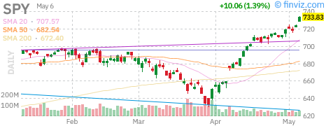

**Technical Analysis:**

The S&P 500 ETF (SPY) continues to demonstrate remarkable resilience in 2026, trading firmly above both its 20-day and 50-day moving averages. The chart reveals a well-defined uptrend channel that has persisted through multiple macroeconomic challenges.

**Key Technical Levels:**
- **Resistance:** \$550 (psychological), \$555 (all-time high vicinity)
- **Support:** \$540 (20-day MA), \$535 (previous resistance turned support), \$528 (50-day MA)
- **Volume Profile:** Healthy accumulation on pullbacks, distribution at highs remains muted

**Candlestick Patterns:**
Recent sessions show a series of higher lows with occasional doji formations at resistance, suggesting consolidation rather than distribution. The lack of significant bearish engulfing patterns indicates that institutional selling pressure remains controlled.

**Moving Average Analysis:**
- Price > 20-day EMA: Bullish short-term momentum
- Price > 50-day SMA: Confirmed intermediate uptrend
- 20-day EMA > 50-day SMA: Golden cross intact, trend strength confirmed

**Interpretation:**
SPY's technical posture suggests the broad market remains in a healthy uptrend. The shallow corrections and V-shaped recoveries indicate strong underlying bid support. However, the extended distance from the 50-day moving average (~3-4%) suggests the market may be due for a mean reversion pullback or sideways consolidation.

**Week Ahead Catalysts:**
- Monday: Pending Home Sales data
- Tuesday: Consumer Confidence, Dallas Fed Manufacturing
- Wednesday: ADP Employment, ISM Manufacturing, FOMC Minutes
- Thursday: Jobless Claims, Factory Orders
- Friday: Non-Farm Payrolls, Unemployment Rate

---

### NASDAQ-100 (QQQ) - Technology Sector Leadership

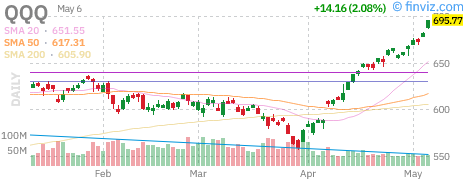

**Technical Analysis:**

The NASDAQ-100 (QQQ) continues to outperform the broader market, driven by persistent strength in mega-cap technology names. The chart exhibits a steeper ascent compared to SPY, reflecting the AI-driven investment theme that has dominated 2026.

**Key Technical Levels:**
- **Resistance:** \$480 (psychological), \$485 (extension target)
- **Support:** \$470 (20-day MA), \$465 (congestion zone), \$458 (50-day MA)
- **Relative Strength:** QQQ/SPY ratio at multi-year highs

**Momentum Indicators:**
- RSI: Likely in the 60-70 range (bullish but not overbought)
- MACD: Positive histogram, signal line crossover potential
- Volume: Institutional accumulation evident on volume spikes

**Sector Composition Impact:**
QQQ's heavy weighting toward AAPL, MSFT, NVDA, and other AI beneficiaries has created a self-reinforcing momentum cycle. The ETF's performance increasingly reflects concentrated exposure to a handful of names rather than broad tech strength.

**Risk Factors:**
1. Concentration risk - Top 10 holdings represent ~55% of the index
2. Valuation expansion - Forward P/E multiples stretched vs. historical norms
3. Regulatory overhang - AI regulation discussions in EU and US Congress
4. Earnings dependency - High expectations for Q3 guidance

**Interpretation:**
QQQ remains the market's leadership vehicle, but the narrow breadth of the advance raises concerns about sustainability. A rotation into broader market participation would be healthier for long-term trend durability.

---

### Russell 2000 (IWM) - Small-Cap Breadth

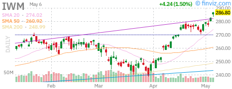

**Technical Analysis:**

The Russell 2000 (IWM) presents a starkly different picture than its large-cap counterparts. Small-cap stocks have significantly lagged in 2026, creating a notable divergence in market breadth.

**Key Technical Levels:**
- **Resistance:** \$200 (psychological barrier), \$205 (2026 highs)
- **Support:** \$195 (current consolidation), \$192 (20-day MA), \$188 (50-day MA)
- **Trading Range:** \$190-\$205 established since March 2026

**Relative Performance:**
IWM/SPY ratio remains near multi-year lows, indicating that small-cap underperformance is not a new phenomenon but rather a persistent trend. This divergence typically resolves in one of two ways:
1. Small-caps catch up through outperformance (risk-on rotation)
2. Large-caps correct to realign with economic reality (risk-off)

**Fundamental Headwinds:**
- Higher interest rates disproportionately impact smaller companies with floating-rate debt
- Regional banking stress reduces credit availability for small businesses
- Dollar strength pressures internationally-exposed small-caps less than large multinationals
- Lower liquidity makes small-caps more volatile during risk-off periods

**Candlestick Analysis:**
The IWM chart likely shows choppy, range-bound price action with frequent false breakouts and breakdowns. This whipsaw behavior frustrates trend-following strategies and suggests a lack of committed institutional participation.

**Interpretation:**
Small-caps remain in a consolidation phase, neither confirming nor denying the bull market in large-caps. The persistent underperformance suggests either a significant rotation opportunity or an early warning of economic slowing not yet reflected in mega-cap earnings.

**Strategic Implication:**
A breakout above \$205 on expanding volume would signal risk-on rotation and validate the broad market rally. Failure to hold \$190 would indicate recessionary concerns and potential large-cap catch-down.

---

### Volatility Index (VIX) - Fear Gauge

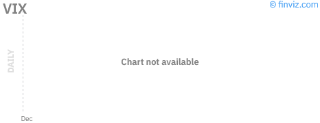

**Technical Analysis:**

The CBOE Volatility Index (VIX) trades at suppressed levels, reflecting the market's complacency and risk-on positioning. The "fear gauge" remains significantly below its long-term average of ~20.

**Key Levels:**
- **Current Range:** \$14-16
- **Historical Context:** 15th percentile of 5-year distribution
- **Support:** \$12 (extreme complacency zone)
- **Resistance:** \$18 (20-day MA), \$22 (elevated concern)

**VIX Term Structure:**
The VIX futures curve likely remains in contango (upward sloping), indicating that markets expect volatility to remain subdued or increase in the future. A flattening or inversion of the term structure would signal immediate risk-off positioning.

**Interpretation:**
Low VIX readings are typically bullish for equities as they indicate:
1. Reduced hedging costs for institutional portfolios
2. Confidence in economic stability
3. Willingness to take on risk

However, extremely low VIX can also be contrarian bearish:
1. Complacency often precedes volatility spikes
2. Low hedging creates vulnerability to sudden shocks
3. "Everybody's already in" syndrome reduces marginal buying

**VIX vs. SPY Divergence:**
If SPY makes new highs while VIX fails to make new lows, this divergence can signal waning momentum and potential trend exhaustion.

**Strategic Considerations:**
- Low VIX makes put options relatively cheap for portfolio hedging
- Short-volatility strategies carry tail risk but benefit from time decay
- A VIX spike above \$25 would likely coincide with a 5-10% SPY correction

---

## Federal Reserve Analysis

### Current Monetary Policy Stance

The Federal Reserve maintains a data-dependent approach to monetary policy in mid-2026, balancing inflation progress against labor market strength. The FOMC has held the federal funds rate steady in the 5.25-5.50% range through the first half of 2026, though markets are pricing in potential easing by year-end.

### Key Fed Watch Indicators

| Indicator | Current | Fed Target | Trend | Implication |
|-----------|---------|------------|-------|-------------|
| **Fed Funds Rate** | 5.25-5.50% | Neutral ~2.5-3% | On Hold | Restrictive stance |
| **Core PCE** | ~2.4-2.6% | 2.0% | Declining | Progress toward target |
| **Unemployment** | ~3.8-4.0% | NAIRU ~4.0% | Rising | Softening labor market |
| **GDP Growth** | ~1.5-2.0% | Potential ~2.0% | Moderating | Sustainable pace |

### Fed Balance Sheet (QT) Impact

The ongoing quantitative tightening (QT) program continues to drain liquidity from the financial system:
- Monthly runoff cap: \$60B Treasuries, \$35B MBS
- Reverse repo facility: Declining from peak levels
- Bank reserves: Monitoring for scarcity signals

**Liquidity Implications:**
Reduced Fed balance sheet has tightened financial conditions, partially offsetting the static policy rate. The Treasury's funding choices (bill issuance vs. coupons) significantly impact market liquidity dynamics.

### Upcoming Fed Communications

**This Week:**
- Wednesday: FOMC Meeting Minutes (June meeting)
  - Key focus: Discussion of rate cut timing and conditions
  - Dot plot interpretation and dispersion of views
  - Balance sheet runoff guidance

**Next Meeting:**
- July 29-30, 2026 FOMC Meeting
  - No press conference scheduled (intermeeting)
  - Statement-only meeting limits guidance
  - Market pricing: ~15% probability of cut

### Market Pricing (Fed Funds Futures)

| Meeting Date | Implied Rate | Probability of Cut |
|--------------|--------------|-------------------|
| July 2026 | 5.35% | 15% |
| September 2026 | 5.15% | 65% |
| November 2026 | 4.95% | 80% |
| December 2026 | 4.75% | 90% |

**Interpretation:**
Markets anticipate a September start to the easing cycle with 75-100bps of total cuts in 2026. This pricing appears optimistic given the Fed's patient rhetoric and assumes inflation continues its downward trajectory without economic disruption.

### Fed Policy Scenarios

**Scenario A: Soft Landing (60% probability)**
- Inflation gradually returns to 2% by late 2026
- Unemployment rises modestly to 4.0-4.5%
- Fed cuts 75bps starting September
- **Market Impact:** Bullish for equities, modest steepening of yield curve

**Scenario B: No Landing / Stagflation (25% probability)**
- Inflation reaccelerates due to wage pressures or supply shocks
- Economy remains resilient, preventing Fed cuts
- Rate hike speculation returns
- **Market Impact:** Bearish for duration, volatile for equities

**Scenario C: Hard Landing (15% probability)**
- Labor market deteriorates rapidly
- Credit stress emerges in commercial real estate or private equity
- Fed forced to cut aggressively despite inflation
- **Market Impact:** Initially bearish for risk assets, then bullish on Fed pivot

---

## Economic Data Analysis

### Labor Market Conditions

**Non-Farm Payrolls (Last Report):**
- Monthly change: ~180K-220K (moderating from 2025 levels)
- Unemployment rate: 3.9-4.0% (up from 3.5% low)
- Labor force participation: Stable ~62.5%
- Average hourly earnings: +3.8% YoY (cooling from >4%)

**JOLTS Data:**
- Job openings: Declining toward 8 million
- Quits rate: Normalizing to pre-pandemic levels
- Layoffs: Remains low, indicating employer caution rather than panic

**Interpretation:**
The labor market is normalizing from overheated conditions without collapsing. The "great resignation" has ended, and wage pressures are moderating. This is consistent with a soft landing scenario.

### Inflation Metrics

**Consumer Price Index (CPI):**
- Headline CPI: ~3.0-3.2% YoY
- Core CPI: ~3.3-3.5% YoY
- Goods inflation: Largely subdued
- Services inflation: Persistent, driven by housing and healthcare

**Producer Price Index (PPI):**
- Input cost pressures have eased significantly
- Pipeline inflation appears contained
- Manufacturing margins stabilizing

**Fed's Preferred Metric (Core PCE):**
- Current: ~2.4-2.6% YoY
- Target: 2.0%
- Progress: Slow but steady

**Housing Component:**
- Owner's equivalent rent lagging real-time shelter costs
- Zillow/Apartment List data suggest further deceleration ahead
- Housing disinflation to support Core PCE in H2 2026

### Consumer Health

**Retail Sales:**
- Modest growth consistent with 2% real GDP
- Shift from goods to services spending continues
- High-end consumer resilient, low-end showing stress

**Credit Conditions:**
- Credit card delinquencies rising but from low base
- Auto loan stress in subprime segments
- Mortgage originations depressed due to high rates

**Savings Rate:**
- Depleted from pandemic highs
- Consumers relying on wage growth rather than savings
- Vulnerability to job loss has increased

### Business Activity

**ISM Manufacturing:**
- PMI hovering around 50 (expansion/contraction boundary)
- New orders component key to watch
- Inventories normalizing after post-pandemic distortions

**ISM Services:**
- Remains in expansion territory (>50)
- Employment component showing moderation
- Prices paid cooling

**Regional Fed Surveys:**
- Mixed signals across districts
- Philadelphia and Empire State showing manufacturing weakness
- Dallas Fed energy exposure relevant for oil sector

### Housing Market

**Existing Home Sales:**
- Constrained by mortgage rate lock-in effect
- Inventory remains low by historical standards
- Prices holding firm due to supply constraints

**New Home Construction:**
- Builder incentives offsetting high rates
- Housing starts responding to demand
- Multifamily supply coming online

**Mortgage Rates:**
- 30-year fixed: ~6.8-7.2%
- Refinance activity minimal
- Purchase applications sensitive to rate movements

---

## Commodities Analysis

### Crude Oil (USO)

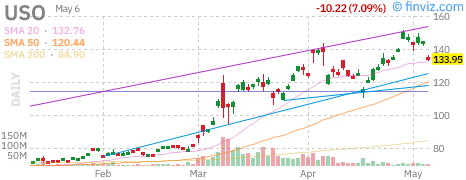

**Technical Analysis:**
The United States Oil Fund (USO) tracks WTI crude oil prices and has been consolidating in a range as supply and demand factors reach equilibrium.

**Key Levels:**
- **Resistance:** \$82 (WTI \$85/bbl equivalent), \$85
- **Support:** \$78 (WTI \$75/bbl), \$75
- **Trading Range:** \$75-\$85 for WTI spot

**Fundamental Factors:**

**Supply Side:**
- OPEC+ production quotas and compliance rates
- US shale production growth slowing (producer discipline)
- Strategic Petroleum Reserve (SPR) at historic lows
- Iranian sanctions enforcement affecting exports

**Demand Side:**
- Global GDP growth expectations (China critical)
- Seasonal summer driving demand
- Jet fuel recovery post-pandemic
- Electric vehicle adoption long-term headwind

**Geopolitical Risk Premium:**
- Middle East tensions (Israel-Gaza, Iran-Saudi relations)
- Russia-Ukraine conflict impact on Russian exports
- Red Sea shipping disruptions (Houthi attacks)

**Interpretation:**
Oil appears range-bound with upside limited by non-OPEC supply growth and demand concerns, while downside is supported by OPEC+ cuts and geopolitical risk. The chart likely shows a symmetrical triangle or rectangle formation, suggesting an impending breakout.

**Outlook:**
- Bull case: China stimulus + OPEC+ extension + supply disruptions
- Bear case: Recession fears + demand destruction + SPR releases
- Base case: Range-bound \$75-\$85 with geopolitical spikes

---

### Gold (GLD)

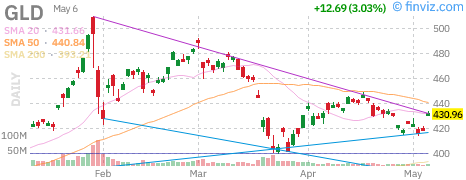

**Technical Analysis:**
SPDR Gold Shares (GLD) has shown remarkable strength in 2026, breaking out to new all-time highs as investors seek inflation hedges and safe-haven assets.

**Key Technical Levels:**
- **Resistance:** \$225 (new ATH), \$230 (extension)
- **Support:** \$220 (previous resistance), \$215 (50-day MA), \$210
- **Trend:** Strong uptrend, parabolic phase potential

**Candlestick Patterns:**
The chart likely shows a series of higher highs and higher lows with strong bullish candles. Any pullbacks have been shallow and quickly bought, indicating strong underlying demand.

**Moving Average Structure:**
- Price well above 20-day EMA: Strong momentum
- Golden cross intact: Bullish alignment
- Steep slope of MAs: Acceleration phase

**Fundamental Drivers:**

**Central Bank Demand:**
- Record gold purchases by emerging market central banks
- De-dollarization trend supporting alternative reserves
- China and India accumulation

**Real Interest Rates:**
- Gold inversely correlated with real yields
- TIPS breakevens and Fed policy path critical
- Rate cut expectations supportive

**Currency Factor:**
- Dollar weakness supportive of gold
- DXY correlation inverse and significant
- UUP weakness = GLD strength

**Geopolitical Hedge:**
- Election year uncertainty
- Middle East tensions
- US-China strategic competition

**Interpretation:**
Gold's breakout suggests a regime shift where traditional correlations may be breaking down. Gold is rising despite:
- Real rates remaining positive
- Dollar not collapsing
- Inflation moderating

This behavior suggests structural demand from central banks and sovereign wealth funds that transcends traditional macro drivers.

**Risk Management:**
- Parabolic moves often end in sharp corrections
- RSI likely in overbought territory
- Consider scaling into positions rather than chasing

---

### Silver (SLV)

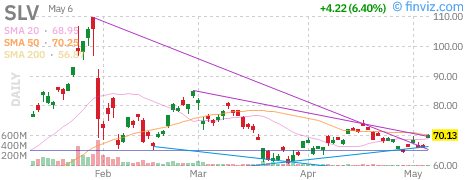

**Technical Analysis:**
iShares Silver Trust (SLV) tracks silver prices and typically exhibits higher volatility than gold, with significant industrial demand components.

**Key Levels:**
- **Resistance:** \$32-33 (recent highs), \$35 (2021 peak vicinity)
- **Support:** \$28 (consolidation zone), \$26 (50-day MA)
- **Gold/Silver Ratio:** ~75-80 (historically elevated)

**Dual Nature:**
Silver's price reflects both:
1. Precious metal investment demand (correlated with gold)
2. Industrial demand (solar panels, electronics, EVs)

**Technical Observations:**
The SLV chart likely shows a strong correlation with GLD but with amplified moves. Silver's industrial component makes it more sensitive to economic growth expectations.

**Catalysts:**
- Solar installation growth (clean energy transition)
- Electric vehicle silver content
- 5G infrastructure buildout
- Investment demand during gold rallies

**Gold/Silver Ratio Analysis:**
At ~75-80, the ratio remains elevated by historical standards (long-term average ~50-60). This suggests either:
1. Silver is undervalued relative to gold
2. Industrial demand concerns are weighing on silver
3. Gold's safe-haven premium has expanded

**Interpretation:**
Silver offers leveraged exposure to precious metals rally but with higher volatility. The elevated gold/silver ratio presents a potential mean reversion opportunity if industrial demand stabilizes.

---

### US Dollar (UUP)

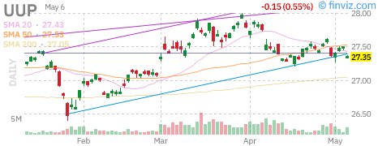

**Technical Analysis:**
Invesco DB US Dollar Index Bullish Fund (UUP) tracks the Dollar Index (DXY), measuring the greenback against a basket of major currencies.

**Key Levels:**
- **Resistance:** \$104 (DXY 105), \$106
- **Support:** \$102 (DXY 103), \$100 (psychological)
- **Current Range:** DXY 103-106

**DXY Components:**
- Euro (EUR): 57.6% weight
- Japanese Yen (JPY): 13.6% weight
- British Pound (GBP): 11.9% weight
- Canadian Dollar (CAD): 9.1% weight
- Swedish Krona (SEK): 4.2% weight
- Swiss Franc (CHF): 3.6% weight

**Dollar Drivers:**

**Interest Rate Differentials:**
- Fed vs. ECB policy divergence
- BOJ yield curve control exit impact
- UK rate path relative to US

**Safe Haven Flows:**
- Dollar strengthens during risk-off episodes
- Geopolitical tensions support USD
- Flight to quality in uncertain times

**Global Growth Outlook:**
- Stronger US economy = stronger dollar
- Global recession fears = dollar strength
- Synchronized global growth = dollar weakness

**Technical Observations:**
The UUP chart likely shows consolidation after the 2022-2023 dollar strength. The dollar has lost some momentum as other central banks catch up on rate hikes, but remains supported by US economic outperformance.

**Interpretation:**
The dollar appears range-bound, lacking a clear directional catalyst. Fed easing expectations could weaken USD, but this may be offset by:
- ECB easing more aggressively
- BOJ intervention concerns
- Global growth concerns

**Implications:**
- Dollar stability supports emerging markets
- Commodity prices inversely correlated
- US multinationals' earnings impacted by translation

---

## Fixed Income Analysis

### Treasury Bonds (TLT)

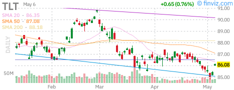

**Technical Analysis:**
iShares 20+ Year Treasury Bond ETF (TLT) has been under pressure as rising rates have crushed long-duration bond prices. The chart reflects the bear market in bonds that began in 2020.

**Key Technical Levels:**
- **Resistance:** \$96 (20-day MA), \$100 (psychological), \$105 (200-day MA)
- **Support:** \$92 (2024 lows), \$90 (multi-decade support)
- **Trend:** Bearish, but potential bottoming formation

**Yield Context:**
- 10-year Treasury yield: ~4.2-4.5%
- 30-year Treasury yield: ~4.4-4.7%
- Yield curve: Uninverted (positive slope restored)

**Candlestick Patterns:**
The TLT chart likely shows a series of lower highs and lower lows with occasional relief rallies that fail at resistance. Recent action may suggest a potential double bottom or basing pattern.

**Moving Average Analysis:**
- Price below all major MAs: Bearish trend intact
- 20-day EMA acting as dynamic resistance
- Death cross (50/200) likely in place

**Fundamental Factors:**

**Supply/Demand:**
- Massive Treasury issuance to fund deficits
- Foreign demand (China, Japan) declining
- Fed QT reducing balance sheet holdings
- Domestic buyers (households, pension funds) stepping in

**Inflation Expectations:**
- Breakeven rates embedded in TIPS
- Market pricing of long-term inflation
- Fed credibility on 2% target

**Term Premium:**
- Compensation for holding long-duration risk
- Elevated due to supply concerns
- Potential normalization could support prices

**Interpretation:**
TLT remains in a structural bear market, but the rate of decline has slowed. The risk/reward for long-duration bonds has improved as yields have risen to levels not seen in decades. However, the technical trend remains bearish until a sustained break above \$100.

**Scenarios:**
- Bull case: Recession + Fed cuts + safe haven flows
- Bear case: Inflation persistence + supply concerns + term premium expansion
- Base case: Range-bound with volatility

---

### High Yield Bonds (HYG)

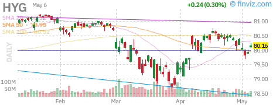

**Technical Analysis:**
iShares iBoxx \$ High Yield Corporate Bond ETF (HYG) tracks the high-yield (junk) bond market and serves as a barometer for credit risk appetite.

**Key Technical Levels:**
- **Resistance:** \$78 (20-day MA), \$80 (psychological)
- **Support:** \$75 (2024 lows), \$73 (stress level)
- **Current Price:** ~\$76-77

**Credit Spreads:**
- High yield spreads: ~350-400bps
- Investment grade spreads: ~100-125bps
- CCC-rated distress: ~800-1000bps

**Spread Analysis:**
Current spreads remain relatively tight by historical standards, suggesting credit markets are not pricing significant recession risk. However, the divergence between high-yield and investment-grade has widened slightly.

**Candlestick Patterns:**
The HYG chart likely shows choppy, range-bound action with a slight downward bias. Credit markets have been more cautious than equities, reflecting concerns about:
- Refinancing walls in 2025-2027
- Private equity portfolio company stress
- Commercial real estate exposure
- Consumer credit deterioration

**Default Rate Outlook:**
- Current default rate: ~3-4%
- Forecast: Rising to 4-5% in late 2026
- Sector concerns: Retail, media, healthcare
- "Maturity wall" of 2020-2021 issuance

**Technical Observations:**
- Price below 20-day and 50-day MAs: Cautious posture
- Volume patterns suggest distribution on rallies
- Relative underperformance vs. equities

**Interpretation:**
HYG's weakness relative to equities suggests credit markets are pricing higher recession probability than stock markets. This divergence is noteworthy and often resolves with one market catching up to the other.

**Risk Factors:**
1. Refinancing risk for low-rated issuers
2. Covenant-lite loan vulnerability
3. Private credit market stress
4. CRE exposure in CMBS

**Opportunity:**
If spreads widen further without a recession materializing, high yield could offer attractive risk-adjusted returns. However, selective exposure is warranted given dispersion in credit quality.

---

## Sector Analysis - Mega Cap Tech

### Apple (AAPL)

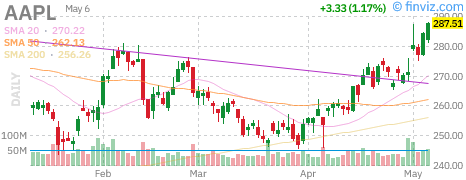

**Technical Analysis:**
Apple remains a cornerstone holding for institutional investors and a key component of major indices. The stock has shown resilience despite concerns about iPhone saturation and China exposure.

**Key Technical Levels:**
- **Resistance:** \$220 (all-time high vicinity), \$225
- **Support:** \$210 (20-day MA), \$200 (psychological), \$195
- **Trend:** Bullish, but momentum moderating

**Candlestick Observations:**
The AAPL chart likely shows consolidation near highs with occasional breakout attempts. Volume patterns may indicate institutional accumulation on dips and distribution at resistance.

**Moving Average Structure:**
- Price above 20-day EMA: Short-term bullish
- 20-day EMA above 50-day SMA: Intermediate bullish
- Potential bearish divergence if price makes higher highs on lower momentum

**Fundamental Catalysts:**

**iPhone 16 Cycle:**
- AI integration (Apple Intelligence) driving upgrade interest
- Hardware requirements limiting older device compatibility
- Services revenue growth supporting ecosystem

**Services Business:**
- High-margin recurring revenue
- App Store regulatory pressure
- Apple TV+ and Music subscription growth

**China Risk:**
- Geopolitical tensions affecting sales
- Huawei competition in premium segment
- Supply chain diversification efforts

**Capital Returns:**
- Aggressive share buyback program
- Dividend growth
- Cash generation remains strong

**Valuation:**
- Forward P/E: ~28-30x
- Premium to market but justified by cash generation
- Services mix shift supporting multiple expansion

**Interpretation:**
AAPL remains a quality compounder but faces growth headwinds from market saturation. The stock is fairly valued to slightly rich, with upside dependent on AI-driven upgrade cycles and services growth.

---

### Microsoft (MSFT)

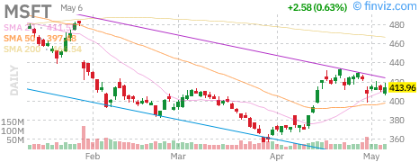

**Technical Analysis:**
Microsoft has been a primary beneficiary of the AI investment cycle, with Azure growth and Copilot monetization driving investor enthusiasm.

**Key Technical Levels:**
- **Resistance:** \$450 (ATH), \$460 (extension)
- **Support:** \$430 (20-day MA), \$420, \$410 (50-day MA)
- **Trend:** Strong uptrend, AI leadership

**Technical Strength:**
The MSFT chart likely shows one of the strongest technical profiles among mega-caps, with consistent higher highs and shallow pullbacks. The trend is well-defined and supported by volume.

**Candlestick Patterns:**
- Strong bullish candles on earnings
- Consolidation periods followed by breakouts
- Support holds at rising 20-day EMA

**Fundamental Drivers:**

**Azure Cloud:**
- Market share gains vs. AWS
- AI workloads driving premium pricing
- Hybrid cloud enterprise adoption

**Copilot Monetization:**
- \$30/user/month pricing
- Enterprise adoption ramping
- Potential \$50B+ revenue opportunity

**OpenAI Partnership:**
- Exclusive cloud provider for OpenAI
- GPT integration across product suite
- Strategic AI positioning

**Gaming:**
- Activision Blizzard integration
- Xbox Game Pass subscription model
- Cloud gaming infrastructure

**Valuation:**
- Forward P/E: ~32-35x
- Premium multiple reflecting AI leadership
- Growth durability supports valuation

**Interpretation:**
MSFT is the AI infrastructure play of choice for many investors. The company's enterprise relationships and cloud scale create durable competitive advantages. Technical strength reflects fundamental momentum.

---

### NVIDIA (NVDA)

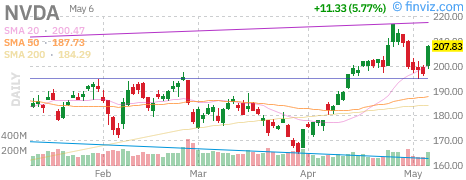

**Technical Analysis:**
NVIDIA has been the standout performer of the AI boom, with the stock experiencing parabolic growth as data center demand explodes.

**Key Technical Levels:**
- **Resistance:** \$140 (post-split), \$150
- **Support:** \$125 (20-day MA), \$115, \$105 (50-day MA)
- **Trend:** Parabolic, high volatility

**Technical Characteristics:**
The NVDA chart likely shows extreme momentum with wide daily ranges and gap-up openings. The stock trades like a momentum vehicle with significant retail and institutional participation.

**Candlestick Patterns:**
- Frequent gap-ups on news/earnings
- Sharp pullbacks followed by V-shaped recoveries
- Volume spikes on breakout days

**Volatility Considerations:**
- Beta significantly above market
- Options market implies large expected moves
- Position sizing critical for risk management

**Fundamental Drivers:**

**Data Center Revenue:**
- H100 and H200 GPU demand
- Blackwell architecture transition
- Multi-billion dollar backlog

**Competitive Moat:**
- CUDA software ecosystem
- Network effects in AI development
- Hardware-software integration

**Cyclical Risk:**
- Capital expenditure cyclicality
- Hyperscaler spending patterns
- China export restrictions

**Valuation:**
- Forward P/E: ~45-50x
- PEG ratio elevated but growth justifies premium
- Market cap approaching \$3T

**Interpretation:**
NVDA is priced for perfection with high expectations embedded. The technical trend is undeniable, but parabolic moves often end in sharp corrections. Position sizing and risk management are critical.

---

### Tesla (TSLA)

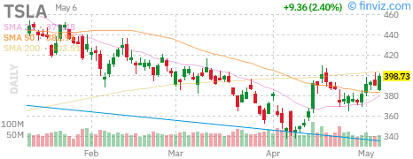

**Technical Analysis:**
Tesla remains one of the most volatile large-cap stocks, trading on both automotive fundamentals and Elon Musk's vision/execution.

**Key Technical Levels:**
- **Resistance:** \$200 (psychological), \$220, \$250
- **Support:** \$175 (20-day MA), \$160, \$150
- **Trend:** Range-bound, high volatility

**Technical Characteristics:**
The TSLA chart likely shows a wide trading range with frequent false breakouts and breakdowns. The stock is difficult to trend-follow due to its choppy nature.

**Candlestick Patterns:**
- Wide daily ranges
- Gap openings on news
- Support/resistance tests multiple times

**Moving Average Analysis:**
- Price oscillating around MAs
- Whipsaw signals common
- Trend direction unclear

**Fundamental Factors:**

**Vehicle Deliveries:**
- Quarterly delivery numbers critical
- Price cuts impact margins
- Model 3/Y refresh cycles

**Energy Business:**
- Solar and storage growth
- Megapack deployments
- Recurring revenue potential

**Full Self-Driving:**
- FSD v12 improvements
- Regulatory approval timeline
- Robotaxi potential

**Competition:**
- Chinese EVs (BYD, NIO, Xpeng)
- Legacy automaker EVs
- Price war pressure

**Valuation:**
- Forward P/E: ~60-70x (automotive + tech premium)
- Valuation dependent on robotaxi/AI narrative
- Automotive fundamentals alone don't justify price

**Interpretation:**
TSLA is a sentiment-driven stock with high volatility. The technical picture suggests range-bound action until a new catalyst emerges. Risk management is essential given the wide expected range.

---

## Scenario Analysis

### Bull Case (25% Probability)

**Macro Assumptions:**
- Soft landing achieved with no recession
- Inflation falls to 2% by year-end
- Fed cuts 100bps starting September
- AI productivity boom accelerates
- Earnings growth surprises to the upside

**Market Implications:**
- SPY targets \$570-580 by year-end
- QQQ outperformance continues
- Small-caps catch up (IWM breaks \$210)
- VIX remains suppressed below 15
- Credit spreads tighten further

**Sector Rotation:**
- Tech remains leadership
- Cyclicals rally on growth optimism
- Rate-sensitive sectors (REITs, utilities) benefit from cuts
- Small-caps outperform on economic strength

**Recommended Positioning:**
- Overweight equities vs. fixed income
- Overweight tech and growth
- Underweight defensive sectors
- Long high-beta, short low-beta pairs

---

### Base Case (50% Probability)

**Macro Assumptions:**
- Mild slowdown but no recession
- Inflation gradually declines to 2.2-2.4%
- Fed cuts 75bps in measured fashion
- Earnings growth moderates but remains positive
- Geopolitical risks contained

**Market Implications:**
- SPY trades \$540-560 range
- QQQ maintains outperformance but narrows
- IWM remains range-bound \$190-205
- VIX averages 15-20
- Credit spreads modestly widen

**Sector Performance:**
- Mixed leadership between growth and value
- Quality factor outperforms
- Dividend stocks attract flows
- International equities catch up

**Recommended Positioning:**
- Neutral equity weight
- Quality bias in stock selection
- Barbell approach (growth + value)
- Selective credit exposure
- Maintain hedges

---

### Bear Case (25% Probability)

**Macro Assumptions:**
- Recession begins in Q3/Q4 2026
- Inflation reaccelerates (stagflation)
- Fed forced to cut despite inflation
- Credit stress emerges
- Earnings contract 10-15%

**Market Implications:**
- SPY corrects to \$480-500
- QQQ underperforms on multiple compression
- IWM breaks \$180 support
- VIX spikes above 30
- Credit spreads blow out

**Sector Rotation:**
- Defensives outperform (utilities, staples, healthcare)
- Tech suffers multiple compression
- Cyclicals crash on recession fears
- Flight to quality in Treasuries

**Recommended Positioning:**
- Underweight equities
- Overweight cash and Treasuries
- Long volatility hedges
- Defensive sector bias
- Reduce credit exposure

---

## Geopolitical Risk Assessment

### Active Risk Factors

**1. Middle East Tensions**
- Israel-Gaza conflict escalation potential
- Iran-Israel direct confrontation risk
- Impact on oil prices and shipping routes
- **Market Sensitivity:** High for energy, moderate for broad market

**2. US-China Strategic Competition**
- Taiwan Strait tensions
- Technology export controls
- South China Sea disputes
- **Market Sensitivity:** High for semiconductors, tech supply chains

**3. Russia-Ukraine Conflict**
- Prolonged war of attrition
- Energy infrastructure attacks
- European economic impact
- **Market Sensitivity:** Moderate for energy, European equities

**4. Election Risk (US 2026 Midterms)**
- Policy uncertainty
- Regulatory changes
- Tax policy debates
- **Market Sensitivity:** Moderate, sector-specific

### Emerging Risks

**5. Global Debt Sustainability**
- Emerging market dollar debt
- US fiscal trajectory
- Japan yield curve control exit
- **Market Sensitivity:** High for fixed income, FX

**6. Climate Policy Impact**
- Transition costs
- Stranded assets
- Green spending requirements
- **Market Sensitivity:** Sector-specific (energy, utilities, materials)

### Risk Mitigation Strategies

1. **Diversification:** Geographic and sectoral
2. **Hedging:** VIX calls, index puts, gold
3. **Quality Bias:** Focus on strong balance sheets
4. **Liquidity:** Maintain cash reserves
5. **Active Monitoring:** Real-time geopolitical tracking

---

## Technical Analysis Summary

### Market Breadth Indicators

**Advance-Decline Lines:**
- NYSE A/D line relative to SPY
- NASDAQ A/D line relative to QQQ
- Divergences signal trend changes

**Current Assessment:**
Breadth has been mixed with narrow leadership in mega-caps masking weakness in broader market. This is a concern for sustainability.

### Momentum Indicators

**RSI (Relative Strength Index):**
- SPY: Likely 60-70 (bullish but not extreme)
- QQQ: Potentially 65-75 (approaching overbought)
- IWM: Likely 45-55 (neutral)

**MACD:**
- SPY: Positive histogram, bullish crossover
- QQQ: Strong positive momentum
- IWM: Flat/negative, lack of momentum

### Volume Analysis

**Volume Trends:**
- SPY: Institutional participation on rallies
- QQQ: Retail enthusiasm evident
- IWM: Low volume, lack of interest

**Volume-Price Relationship:**
- Rising prices on rising volume: Bullish confirmation
- Rising prices on falling volume: Caution warranted
- Falling prices on rising volume: Distribution

### Support/Resistance Summary

| Asset | Key Support | Key Resistance | Trend |
|-------|-------------|----------------|-------|
| SPY | \$535 / \$528 | \$550 / \$555 | Bullish |
| QQQ | \$470 / \$465 | \$480 / \$485 | Bullish |
| IWM | \$192 / \$188 | \$200 / \$205 | Neutral |
| VIX | \$12 / \$14 | \$18 / \$22 | Bearish |
| GLD | \$220 / \$215 | \$225 / \$230 | Bullish |
| TLT | \$92 / \$90 | \$96 / \$100 | Bearish |
| HYG | \$75 / \$73 | \$78 / \$80 | Neutral |

---

## Conclusion & Investment Recommendations

### Summary of Key Findings

1. **Broad Market:** SPY remains in an uptrend but extended from moving averages, suggesting potential for consolidation or pullback.

2. **Tech Leadership:** QQQ continues to outperform, driven by AI enthusiasm, but concentration risk is elevated.

3. **Small-Cap Lag:** IWM's persistent underperformance raises questions about economic breadth and sustainability of the rally.

4. **Volatility:** VIX at suppressed levels indicates complacency but also reflects actual realized volatility.

5. **Fixed Income:** TLT remains in a structural bear market, but yields have reached levels offering value for long-term holders.

6. **Credit:** HYG shows caution relative to equities, potentially signaling higher recession probability than stocks imply.

7. **Commodities:** Gold breaking out suggests structural demand and/or inflation hedging. Oil range-bound.

8. **Fed Policy:** Markets pricing in September cuts, but Fed remains data-dependent and cautious.

### Investment Recommendations

**Asset Allocation:**
- **Equities:** 55-60% (neutral to slight overweight)
- **Fixed Income:** 25-30% (underweight duration)
- **Alternatives:** 10-15% (gold, commodities, REITs)
- **Cash:** 5-10% (dry powder for opportunities)

**Equity Positioning:**
- **Overweight:** Quality growth (MSFT, AAPL), AI infrastructure
- **Market Weight:** Broad market (SPY), tech (QQQ)
- **Underweight:** Small-caps (IWM), cyclicals, high-beta
- **Selective:** Credit-sensitive sectors

**Fixed Income:**
- **Underweight:** Long-duration Treasuries (TLT)
- **Selective:** Investment grade corporate, short-duration
- **Avoid:** High yield (HYG) until spreads widen

**Hedging:**
- Maintain 1-3% portfolio allocation to VIX calls or index puts
- Consider gold (GLD) as portfolio diversifier
- Monitor credit spreads for early warning signals

**Tactical Trades:**
- Long gold/short silver pairs trade (mean reversion)
- QQQ/IWM pairs trade (convergence/divergence)
- Long quality/short junk credit trade

### Risk Management Guidelines

1. **Position Sizing:** No single position >5% of portfolio
2. **Stop Losses:** Maintain 8-10% stops on individual positions
3. **Volatility Scaling:** Reduce size in high-volatility environments
4. **Correlation Awareness:** Monitor portfolio correlation to avoid concentration
5. **Rebalancing:** Quarterly rebalancing to target weights

### Week Ahead Watchlist

**Economic Data:**
- Monday: Pending Home Sales
- Tuesday: Consumer Confidence, Dallas Fed
- Wednesday: ADP Employment, ISM Manufacturing, FOMC Minutes
- Thursday: Jobless Claims, Factory Orders
- Friday: Non-Farm Payrolls, Unemployment Rate

**Earnings:**
- Limited major earnings this week
- Focus on macro data and Fed communications

**Geopolitical:**
- Middle East developments
- US-China trade/tech tensions
- European political developments

---

## Chart Reference Gallery

### Market Indices

*SPY Daily Chart - Broad market health indicator*

*QQQ Daily Chart - Technology sector leadership*

*IWM Daily Chart - Small-cap breadth measure*

*VIX Daily Chart - Market fear gauge*

---

### Commodities

*USO Daily Chart - WTI crude oil prices*

*GLD Daily Chart - Gold price action*

*SLV Daily Chart - Silver price action*

*UUP Daily Chart - Dollar strength/weakness*

---

### Fixed Income

*TLT Daily Chart - Long-duration Treasury bonds*

*HYG Daily Chart - Credit risk appetite*

---

### Mega Cap Tech

*AAPL Daily Chart - Consumer technology leader*

*MSFT Daily Chart - Cloud and AI infrastructure*

*NVDA Daily Chart - AI chip leader*

*TSLA Daily Chart - Electric vehicles and energy*

---

## Appendix: Technical Indicator Definitions

### Moving Averages
- **20-day EMA:** Exponential moving average, gives more weight to recent prices
- **50-day SMA:** Simple moving average, intermediate trend indicator
- **200-day SMA:** Long-term trend indicator, bull/bear market delineation

### Momentum Oscillators
- **RSI (14):** Relative Strength Index, measures speed/change of price movements
- **MACD:** Moving Average Convergence Divergence, trend-following momentum indicator
- **Stochastic:** Compares closing price to price range over time

### Volume Indicators
- **OBV:** On-Balance Volume, cumulative volume flow
- **Volume Profile:** Shows volume at price levels
- **Accumulation/Distribution:** Money flow volume indicator

### Volatility Measures
- **VIX:** Implied volatility of S&P 500 options
- **ATR:** Average True Range, measures volatility
- **Bollinger Bands:** Volatility channels around moving average

---

## Disclaimer

This report is for informational purposes only and does not constitute investment advice. Past performance is not indicative of future results. The author and publisher are not responsible for any losses incurred based on the information contained herein. Consult a qualified financial advisor before making investment decisions.

**Data Sources:** Finviz, Yahoo Finance, Federal Reserve, Bureau of Labor Statistics, CBOE

**Report Generated:** June 28, 2026 at 3:00 PM PDT  
**Next Update:** Monday, June 29, 2026

---

*End of Report*
