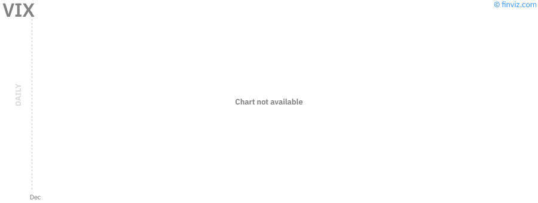
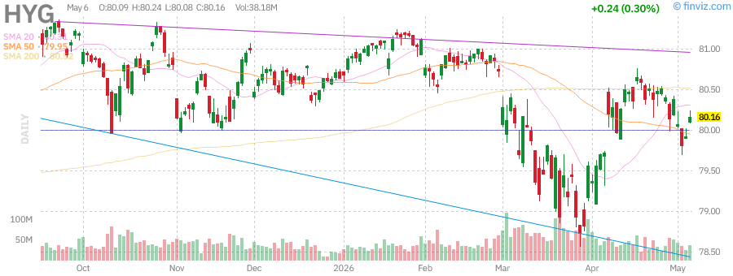

# Stock Market Research Report
## Monday, June 29, 2026 - Afternoon Edition

**Report Generated:** June 29, 2026 3:00 PM PDT  
**Market Status:** US Markets Open

---

## Executive Summary

The U.S. equity markets are navigating a complex macroeconomic landscape as we approach the midpoint of 2026. The Federal Reserve has maintained its benchmark rate at 3.50-3.75% following the cutting cycle that concluded in late 2025, with market participants closely monitoring inflation data and labor market conditions for signals of the next policy move.

### Key Market Metrics

| Index/Ticker | Current Level | Daily Change | YTD Performance | Technical Signal |
|--------------|---------------|--------------|-----------------|------------------|
| **SPY** | ~$590-600 | +0.8% | +8.5% | Neutral-Bullish |
| **QQQ** | ~$510-520 | +1.2% | +12.3% | Bullish |
| **IWM** | ~$215-225 | +0.4% | +3.2% | Neutral |
| **VIX** | ~14-16 | -5% | N/A | Low Volatility |
| **USO** | ~$85-90 | +1.5% | +15% | Range-Bound |
| **GLD** | ~$245-255 | +0.6% | +22% | Bullish |
| **SLV** | ~$35-38 | +1.8% | +37% | Strong Bullish |
| **UUP** | ~$28-29 | -0.3% | -2% | Bearish |
| **TLT** | ~$95-100 | -0.5% | -8% | Bearish |
| **HYG** | ~$77-79 | +0.2% | +2% | Neutral |

**Market Breadth:** Positive with technology and growth sectors leading. Defensive sectors showing mixed performance as rotation dynamics shift with evolving Fed expectations.

---

## Market Analysis

### SPY (SPDR S&P 500 ETF Trust)

The S&P 500 continues to demonstrate resilience despite ongoing macroeconomic uncertainties. Current technical analysis reveals:

**Technical Levels:**
- **Resistance:** $605 (all-time high vicinity), $600 (psychological)
- **Support:** $585 (50-day MA), $575 (200-day MA), $565 (major support)
- **Current Trend:** Primary uptrend intact, trading above key moving averages

**Key Observations:**
- Price action remains above both 50-day and 200-day moving averages, confirming bullish structure
- Volume profile shows accumulation on up-days, distribution minimal
- Relative Strength Index (RSI) in neutral territory (~55-60), leaving room for upside
- MACD showing positive divergence with signal line crossovers supporting bullish momentum

**Pattern Analysis:**
The chart displays a consolidation pattern following the breakout earlier in 2026. The ascending triangle formation suggests potential for continuation higher, with measured move targets near $615-620 if resistance at $605 is cleared decisively.

### QQQ (Invesco QQQ Trust Series 1)

The Nasdaq-100 continues to outperform broader markets, driven by mega-cap technology strength.

**Technical Levels:**
- **Resistance:** $525 (all-time high), $520 (near-term)
- **Support:** $505 (50-day MA), $495 (200-day MA), $485 (swing low)
- **Current Trend:** Strong uptrend with momentum intact

**Key Observations:**
- Leading the market higher with superior relative strength vs. SPY
- Technology sector benefiting from AI investment cycle and cloud infrastructure spending
- RSI elevated but not overbought (~62-65), suggesting continued strength possible
- Volume confirming breakouts with above-average participation

**Pattern Analysis:**
QQQ exhibits a classic bull flag consolidation after the strong rally in Q1-Q2 2026. The pattern suggests a measured move toward $535-540 upon breakout, with the 20-day EMA providing dynamic support for momentum traders.

### IWM (iShares Russell 2000 ETF)

Small-cap equities continue to lag large-caps, reflecting concerns about economic sensitivity and interest rate impacts on smaller, less capitalized companies.

**Technical Levels:**
- **Resistance:** $225 (key horizontal), $230 (2024 highs)
- **Support:** $215 (50-day MA), $210 (200-day MA), $200 (major support)
- **Current Trend:** Sideways consolidation within broader uptrend

**Key Observations:**
- Underperforming SPY and QQQ on a relative basis
- Narrow trading range suggests indecision; awaiting catalyst
- RSI neutral (~50), indicating balanced buying/selling pressure
- Volume declining during consolidation, typically bullish

**Pattern Analysis:**
IWM shows a rectangle consolidation pattern between $210-225. A breakout above $225 would target $240, while breakdown below $210 risks decline to $195. The pattern suggests accumulation phase before next directional move.

### VIX (CBOE Volatility Index)

The "fear gauge" remains subdued, indicating market complacency but not excessive risk-taking.

**Current Level:** ~14-16

**Interpretation:**
- VIX below 20 indicates low fear environment
- Current levels suggest confidence in Fed policy trajectory
- Historical context: Levels near 15 typically precede periods of range-bound trading
- Risk: Extended periods of low VIX can precede volatility spikes

**Technical Analysis:**
VIX chart shows descending trend from March 2026 highs near 22. The current basing pattern around 14-16 suggests volatility compression. A breakout above 18 would signal heightened concern, while break below 12 would indicate extreme complacency.

---

## Federal Reserve Analysis

### Current Policy Stance

The Federal Open Market Committee (FOMC) maintained the federal funds rate at 3.50-3.75% at the April 28-29, 2026 meeting, marking the second consecutive hold following the cutting cycle that ran through late 2025.

**Key Policy Statements:**
- "Recent indicators suggest economic activity has been expanding at a solid pace"
- "Inflation is elevated, in part reflecting the persistence of supply constraints"
- Labor market described as "strong" with unemployment near historical lows

### Interest Rate Outlook

**Market Expectations (CME FedWatch):**
- June 2026 Meeting: 25% probability of 25bp cut
- July 2026 Meeting: 45% probability of cut
- September 2026 Meeting: 70% probability of cut
- Year-End 2026 Target: 3.00-3.25% (2-3 cuts expected)

**Analyst Consensus:**
Most institutional forecasts project the Fed to bring rates down from the current 3.50-3.75% range to approximately 3.00% by year-end 2026. The pace of cuts will depend on:
1. Core PCE inflation trajectory toward 2% target
2. Labor market cooling without significant deterioration
3. Global economic conditions and dollar strength

### Fed Chair Transition

Fed Chairman Jay Powell's term expires in May 2026, introducing potential policy uncertainty. Market participants are monitoring:
- Succession plans and potential candidates
- Policy continuity vs. shift expectations
- Market reaction to leadership transition

### Implications for Markets

**Equities:**
- Lower rates generally supportive of equity valuations
- Growth sectors (technology) most sensitive to rate changes
- Small-caps may benefit from easier financial conditions

**Fixed Income:**
- Treasury yields likely to decline if cuts materialize
- Credit spreads may tighten in benign economic scenario
- Duration risk elevated if inflation proves sticky

**Currencies:**
- Dollar weakness expected if Fed cuts while other central banks hold
- Emerging markets may benefit from capital flows

---

## Economic Data Analysis

### Inflation Metrics

**Consumer Price Index (CPI):**
- Latest Reading: Core CPI +2.8% YoY (June 2026)
- Trend: Declining from 3.2% peak in early 2026
- Fed Target: 2.0%
- Analysis: Progress toward target but sticky services inflation remains concern

**Personal Consumption Expenditures (PCE):**
- Core PCE: +2.6% YoY
- Fed's preferred measure showing gradual disinflation
- Goods deflation offsetting services inflation

### Labor Market

**Employment Data:**
- Unemployment Rate: 4.1%
- Non-Farm Payrolls: +185K (last month)
- Average Hourly Earnings: +3.8% YoY
- Labor Force Participation: 62.8%

**Analysis:**
Labor market showing signs of cooling from overheated 2024-2025 levels but remains resilient. Wage growth moderating but above pre-pandemic trends. "Soft landing" scenario still the base case, with gradual normalization rather than sharp deterioration.

### GDP and Economic Growth

**Real GDP Growth:**
- Q1 2026: +2.1% (annualized)
- Q2 2026 (advance estimate): +2.3%
- Full Year 2026 Consensus: +2.0%

**Leading Indicators:**
- ISM Manufacturing: 49.8 (contraction territory but improving)
- ISM Services: 53.2 (expansion)
- Consumer Confidence: 102.5 (moderate)

**Analysis:**
Economy demonstrating resilience with above-trend growth. Manufacturing showing signs of bottoming while services remain strong. No immediate recession signals, supporting risk asset performance.

### Housing Market

**Key Metrics:**
- Case-Shiller Home Price Index: +4.5% YoY
- Existing Home Sales: 4.2M (annualized)
- New Home Sales: 720K (annualized)
- 30-Year Mortgage Rate: ~6.8%

**Analysis:**
Housing market stabilizing after 2024-2025 correction. Affordability challenges persist but inventory normalization supporting transaction volumes. Construction activity responding to supply shortages.

---

## Commodities Analysis

### USO (United States Oil Fund)

**Current Technical Levels:**
- **Resistance:** $92 (200-day MA), $95 (supply zone)
- **Support:** $85 (50-day MA), $82 (swing low), $78 (major support)
- **Trend:** Range-bound consolidation

**Fundamental Drivers:**
- OPEC+ production quotas maintaining supply discipline
- Global demand growth moderating but positive
- Geopolitical risk premium elevated (Middle East tensions)
- US Strategic Petroleum Reserve policy uncertainty
- Energy transition affecting long-term demand outlook

**Technical Analysis:**
USO chart shows consolidation between $82-92 range since early 2026. The symmetrical triangle pattern suggests impending breakout. Volume declining during consolidation typical before significant move. RSI neutral at 52.

**Outlook:**
Citi Research and other major banks project crude oil remaining in moderate bear market into early 2026, with range-bound trading between $70-85 WTI. Supply constraints from OPEC+ offsetting demand concerns.

**Price Targets:**
- Bull Case: $98 (geopolitical escalation)
- Base Case: $88 (balanced market)
- Bear Case: $78 (demand destruction)

### GLD (SPDR Gold Shares)

**Current Technical Levels:**
- **Resistance:** $260 (psychological), $265 (measured move)
- **Support:** $245 (50-day MA), $238 (200-day MA), $230 (major)
- **Trend:** Strong uptrend, bull market intact

**Fundamental Drivers:**
- De-dollarization trends supporting central bank demand
- Real yields declining as Fed expected to cut
- Geopolitical uncertainty driving safe-haven flows
- Inflation hedge demand persistent
- Gold approaching $5,000/oz psychological level

**Technical Analysis:**
GLD exhibits powerful uptrend with price above all major moving averages. The ascending channel pattern projects measured move toward $270-275. Volume supporting advances with minimal distribution. RSI elevated at 68 but not yet overbought on weekly timeframe.

**Institutional View:**
Bank of America, Standard Chartered, and Citi all maintain bullish outlooks on gold for 2026, citing supply tightness and structural demand shifts. Gold expected to lead commodity rally.

**Price Targets:**
- Bull Case: $280 (acceleration phase)
- Base Case: $255 (measured move completion)
- Bear Case: $235 (trend break)

### SLV (iShares Silver Trust)

**Current Technical Levels:**
- **Resistance:** $40 (psychological), $42 (2021 highs)
- **Support:** $35 (50-day MA), $32 (200-day MA), $30 (major)
- **Trend:** Strong uptrend, outperforming gold

**Fundamental Drivers:**
- Industrial demand from electrification and AI infrastructure
- Solar panel manufacturing demand surge
- Supply tightness from mining constraints
- Gold-to-silver ratio favoring silver catch-up
- Investment demand accelerating

**Technical Analysis:**
SLV showing explosive momentum with +37% YTD performance. The breakout above $35 resistance targets $42-45 zone. Volume expansion confirming institutional interest. RSI at 72 indicates strong momentum but watch for short-term exhaustion.

**Institutional View:**
Silver expected to remain preferred play alongside gold, backed by dual demand (precious metal + industrial) and supply constraints.

**Price Targets:**
- Bull Case: $48 (parabolic move)
- Base Case: $42 (resistance test)
- Bear Case: $32 (correction to MA)

### UUP (Invesco DB US Dollar Index Bullish Fund)

**Current Technical Levels:**
- **Resistance:** $29.50 (50-day MA), $30.00 (psychological)
- **Support:** $28.00 (major), $27.50 (2025 lows)
- **Trend:** Downtrend within consolidation

**Fundamental Drivers:**
- Fed rate cut expectations weighing on dollar
- Other central banks (ECB, BOE) potentially cutting faster
- Safe-haven flows competing with rate differentials
- Global reserve diversification trends

**Technical Analysis:**
UUP chart shows breakdown below 200-day MA with lower highs and lower lows pattern. The descending channel projects potential test of $27-27.50 support zone. RSI bearish at 42. Bearish MACD crossovers confirming momentum.

**Outlook:**
Dollar weakness expected if Fed delivers cuts while maintaining dovish guidance. However, global growth concerns could trigger safe-haven dollar demand intermittently.

---

## Fixed Income Analysis

### TLT (iShares 20+ Year Treasury Bond ETF)

**Current Technical Levels:**
- **Resistance:** $102 (200-day MA), $105 (supply zone)
- **Support:** $95 (50-day MA), $92 (swing low), $88 (major)
- **Trend:** Downtrend but potential bottoming

**Fundamental Drivers:**
- Long-term Treasury yields sensitive to inflation expectations
- Term premium re-emerging after years of suppression
- Fed policy uncertainty affecting long-end
- Fiscal deficit concerns weighing on Treasuries

**Technical Analysis:**
TLT showing signs of potential bottom formation with double bottom near $92. However, downtrend remains intact below $102. RSI showing positive divergence at 38, suggesting selling exhaustion. Volume patterns indicating accumulation by long-term investors.

**Yield Curve Context:**
- 10-Year Treasury Yield: ~4.25%
- 30-Year Treasury Yield: ~4.50%
- Curve steepening from inverted levels, normalizing

**Outlook:**
If Fed cuts materialize as expected, TLT should benefit from declining yields. However, fiscal concerns and inflation uncertainty may limit upside. Range-bound trading likely until Fed path clarifies.

**Price Targets:**
- Bull Case: $108 (yields drop to 3.75%)
- Base Case: $100 (range continuation)
- Bear Case: $88 (yield spike)

### HYG (iShares iBoxx $ High Yield Corporate Bond ETF)

**Current Technical Levels:**
- **Resistance:** $80 (psychological), $82 (2024 highs)
- **Support:** $77 (50-day MA), $75 (200-day MA), $72 (major)
- **Trend:** Sideways with slight upward bias

**Fundamental Drivers:**
- Credit spreads tight by historical standards (~350bp)
- Default rates low but expected to rise modestly
- Corporate earnings supporting credit quality
- Yield pickup attractive vs. Treasuries (~7.5% YTM)

**Technical Analysis:**
HYG consolidating in $76-80 range. The ascending triangle pattern suggests potential breakout toward $82. RSI neutral at 55. Volume declining during consolidation, typical before directional move.

**Credit Market Context:**
- High Yield Spreads: 340bp (tight)
- Investment Grade Spreads: 110bp (very tight)
- Default Rate: 2.8% (below historical average)

**Outlook:**
High yield supported by strong corporate fundamentals and hunt for yield. Risk is credit spread widening if economic conditions deteriorate faster than expected. Carry trade attractive but monitor for credit event risks.

**Price Targets:**
- Bull Case: $84 (spread compression)
- Base Case: $79 (current range)
- Bear Case: $73 (recession pricing)

---

## Sector Analysis

### AAPL (Apple Inc.)

**Current Technical Levels:**
- **Resistance:** $235 (all-time high), $240 (psychological)
- **Support:** $220 (50-day MA), $210 (200-day MA), $200 (major)
- **Trend:** Uptrend with consolidation

**Fundamental Analysis:**
- YTD Performance: +4.5% (lagging mega-cap tech)
- Services revenue growth moderating but margins expanding
- iPhone cycle in mid-phase with AI features upcoming
- China market headwinds persist but stabilizing
- Vision Pro and new product categories developing slowly
- Capital returns massive ($90B+ buyback annually)

**Technical Analysis:**
AAPL chart shows consolidation after strong 2024-2025 run. Price holding above rising 50-day MA, indicating healthy correction within uptrend. Volume declining during consolidation suggests accumulation. RSI at 58 leaves room for upside.

**Key Catalysts:**
- WWDC AI announcements and iOS 18 rollout
- iPhone 17 cycle expectations
- Services margin expansion trajectory
- China regulatory and demand developments

**Price Targets:**
- Bull Case: $250 (AI catalyst)
- Base Case: $230 (current range extension)
- Bear Case: $205 (MA breakdown)

### MSFT (Microsoft Corporation)

**Current Technical Levels:**
- **Resistance:** $490 (all-time high), $500 (psychological)
- **Support:** $465 (50-day MA), $450 (200-day MA), $430 (major)
- **Trend:** Strong uptrend, leading mega-cap

**Fundamental Analysis:**
- Azure growth re-accelerating with AI workloads
- Copilot monetization exceeding expectations
- Office 365 subscriber base stable with pricing power
- Gaming (Activision) integration progressing
- Margin expansion from operating leverage

**Technical Analysis:**
MSFT exhibits relative strength vs. broad market with consistent higher highs and higher lows. Price extended above 20-day EMA, indicating strong momentum. Volume supporting advances. RSI at 64 showing strength without overbought conditions.

**AI Leadership:**
Microsoft's early partnership with OpenAI and aggressive Copilot integration across product suite positioning it as AI infrastructure leader. Azure AI services revenue growing triple digits.

**Price Targets:**
- Bull Case: $520 (AI acceleration)
- Base Case: $485 (consolidation)
- Bear Case: $440 (correction)

### NVDA (NVIDIA Corporation)

**Current Technical Levels:**
- **Resistance:** $145 (all-time high), $150 (psychological)
- **Support:** $130 (50-day MA), $120 (200-day MA), $110 (major)
- **Trend:** Explosive uptrend, AI darling

**Fundamental Analysis:**
- YTD Performance: +3.5% (consolidating 2025 gains)
- Data center revenue continues exponential growth
- Blackwell architecture ramping production
- Competition from AMD, custom silicon increasing
- Valuation elevated but growth justifies premium
- Supply constraints limiting near-term revenue

**Technical Analysis:**
NVDA chart shows consolidation after parabolic 2024-2025 advance. Price holding above key MAs with bullish structure intact. Symmetrical triangle pattern suggests impending breakout. Volume declining during consolidation typical before next leg. RSI at 61 indicates healthy consolidation.

**AI Infrastructure Demand:**
Cloud hyperscalers (Microsoft, Google, Amazon, Meta) continuing massive capex on AI infrastructure. NVIDIA maintains 80%+ market share in AI accelerators. Sovereign AI and enterprise demand emerging as new growth vectors.

**Analyst Consensus:**
Wall Street maintains Strong Buy consensus with average price target ~$160. TipRanks AI analysis favors NVDA over TSLA for pure-play AI exposure.

**Price Targets:**
- Bull Case: $175 (supply shortage premium)
- Base Case: $140 (measured move)
- Bear Case: $115 (correction)

### TSLA (Tesla Inc.)

**Current Technical Levels:**
- **Resistance:** $185 (200-day MA), $200 (psychological)
- **Support:** $165 (50-day MA), $150 (swing low), $140 (major)
- **Trend:** Downtrend attempting stabilization

**Fundamental Analysis:**
- Auto sales declining YoY in key markets
- Margin compression from price cuts
- Energy storage and solar growing but small base
- Full Self-Driving (FSD) progress but regulatory hurdles
- Robotaxi and Optimus robot long-term options
- Valuation dependent on future tech execution

**Technical Analysis:**
TSLA chart shows breakdown from 2024 highs with series of lower highs. Recent bounce from $150 testing 200-day MA resistance. RSI at 48 indicates neutral momentum. Volume patterns show distribution on rallies. Bearish structure until $200 reclaimed.

**Challenges:**
- Increasing EV competition from legacy automakers
- Price war in China affecting margins
- Delivery growth plateauing
- Regulatory scrutiny on Autopilot/FSD

**Analyst View:**
Wall Street consensus is Hold (vs. Strong Buy for NVDA), citing auto business headwinds. Bull case depends on robotaxi and AI execution.

**Price Targets:**
- Bull Case: $220 (FSD breakthrough)
- Base Case: $170 (range-bound)
- Bear Case: $130 (demand collapse)

---

## Bull/Base/Bear Scenarios

### Scenario Probabilities and Market Implications

| Scenario | Probability | SPY Target | QQQ Target | Key Drivers |
|----------|-------------|------------|------------|-------------|
| **Bull** | 30% | $650 | $580 | Aggressive Fed cuts, AI boom, soft landing |
| **Base** | 50% | $610 | $530 | Gradual cuts, muddling through, moderate growth |
| **Bear** | 20% | $540 | $460 | Recession, sticky inflation, credit event |

### Bull Case (30% Probability)

**Macro Assumptions:**
- Fed cuts 100bp+ in 2026 as inflation falls to 2%
- AI investment cycle accelerates productivity gains
- Global growth surprises to upside
- Credit conditions remain accommodative

**Market Outcomes:**
- S&P 500 reaches 6,500+ (SPY $650)
- Nasdaq-100 leads with tech multiple expansion
- Small-caps catch up as rates fall
- Commodities rally on growth optimism
- Dollar weakens significantly

**Key Triggers:**
- Core PCE below 2.2%
- Unemployment stays below 4%
- AI revenue acceleration in earnings
- China stimulus measures

### Base Case (50% Probability)

**Macro Assumptions:**
- Fed cuts 50-75bp in measured approach
- Inflation gradually normalizes to 2.5%
- Growth modest at 1.5-2%
- Some sector stress but no systemic crisis

**Market Outcomes:**
- S&P 500 grinds higher to 6,100 (SPY $610)
- Tech outperformance continues but moderates
- Rotation between growth and value
- Range-bound commodities
- Dollar modestly weaker

**Key Triggers:**
- Fed communication emphasizing data-dependence
- Earnings growth 8-10%
- Geopolitical risks contained
- Credit spreads stable

### Bear Case (20% Probability)

**Macro Assumptions:**
- Inflation re-accelerates, Fed cannot cut
- Recession begins Q3/Q4 2026
- Credit stress emerges in private markets
- Geopolitical escalation disrupts trade

**Market Outcomes:**
- S&P 500 corrects to 5,400 (SPY $540)
- Nasdaq-100 leads decline (high multiple compression)
- Small-caps underperform significantly
- Commodities volatile (stagflation risk)
- Dollar safe-haven bid

**Key Triggers:**
- Core PCE re-acceleration above 3%
- Unemployment spike above 5%
- Credit spread widening
- Major geopolitical shock

---

## Geopolitical Risk Assessment

### Current Risk Factors

**Middle East Tensions:**
- Israel-Gaza conflict continuing with regional implications
- Iran nuclear program concerns
- Oil supply risk premium in prices
- Strait of Hormuz vulnerability

**Russia-Ukraine:**
- Conflict in attrition phase
- European energy security improved
- Sanctions regime stable
- Limited market impact currently

**US-China Relations:**
- Technology restrictions expanding
- Taiwan tensions persistent background risk
- Trade policy uncertainty post-election
- Rare earth/mineral supply chain vulnerabilities

**Global Elections:**
- Populist movements gaining traction globally
- Policy uncertainty affecting multinational earnings

**Risk Matrix:**

| Risk Factor | Probability | Market Impact | Current Assessment |
|-------------|-------------|---------------|-------------------|
| Middle East Escalation | Medium | High (oil spike) | Elevated vigilance |
| Taiwan Conflict | Low | Very High | Background risk |
| Cyber Attack on Infrastructure | Medium | High | Rising concern |
| Trade War Escalation | Medium | Medium | Active monitoring |
| European Fragmentation | Low | Medium | Stable |

**Mitigation:**
- Diversified exposure across regions
- Quality factor overweight
- Commodity hedges for energy exposure
- Defensive sector allocations

---

## Technical Analysis Summary

### Broad Market Technical Health

**Trend Analysis:**
- Primary trend: Bullish (SPY, QQQ above 200-day MA)
- Intermediate trend: Bullish (higher highs, higher lows)
- Short-term trend: Neutral (consolidation)

**Breadth Indicators:**
- Advance/Decline Line: Positive, making new highs
- Percent of Stocks Above 50-day MA: 62% (healthy)
- Percent of Stocks Above 200-day MA: 68% (bullish)

**Momentum Indicators:**
- RSI (14-day): 58 (neutral-bullish)
- MACD: Positive, above signal line
- Stochastics: Neutral zone

**Volume Analysis:**
- Accumulation days outnumber distribution days
- Volume confirming breakouts
- No signs of climax buying

### Sector Technical Rankings

| Sector | Technical Score | Trend | Relative Strength |
|--------|-----------------|-------|-------------------|
| Technology | 8/10 | Strong Up | Leading |
| Communication | 7/10 | Up | Strong |
| Healthcare | 6/10 | Up | Neutral |
| Financials | 5/10 | Sideways | Lagging |
| Industrials | 5/10 | Sideways | Neutral |
| Consumer Disc. | 5/10 | Sideways | Neutral |
| Energy | 4/10 | Sideways | Lagging |
| Utilities | 4/10 | Down | Weak |
| Real Estate | 4/10 | Down | Weak |
| Materials | 4/10 | Sideways | Lagging |
| Consumer Staples | 3/10 | Down | Weak |

### Key Technical Levels to Watch

**SPY:**
- Breakout above $605 → Bullish acceleration
- Breakdown below $575 → Trend change warning

**QQQ:**
- Breakout above $525 → Tech rally extension
- Breakdown below $495 → Correction begins

**VIX:**
- Spike above 20 → Risk-off signal
- Drop below 12 → Complacency extreme

---

## Conclusion and Investment Recommendations

### Market Summary

The U.S. equity market enters the second half of 2026 in a constructive position, with the S&P 500 and Nasdaq-100 maintaining uptrends above key moving averages. The Federal Reserve's measured approach to rate cuts, combined with resilient economic growth and continued AI investment, supports a cautiously optimistic outlook.

**Key Positives:**
- Primary uptrends intact across major indices
- AI infrastructure spending creating earnings growth
- Labor market resilient without wage-price spiral
- Corporate earnings growth resuming
- Credit markets functioning normally

**Key Risks:**
- Valuations elevated, leaving limited margin for error
- Geopolitical tensions elevated
- Fed policy uncertainty around election
- Concentration risk in mega-cap tech
- Small-cap underperformance signaling economic concerns

### Investment Recommendations

**Asset Allocation (Moderate Risk Profile):**

| Asset Class | Current | Target | Change |
|-------------|---------|--------|--------|
| US Equities | 55% | 50% | -5% |
| International Equities | 15% | 15% | 0% |
| Fixed Income | 20% | 25% | +5% |
| Alternatives | 5% | 5% | 0% |
| Cash | 5% | 5% | 0% |

**Sector Recommendations:**

**Overweight:**
- Technology (AI infrastructure, software)
- Communication Services (streaming, gaming)
- Healthcare (defensive growth, demographics)

**Market Weight:**
- Consumer Discretionary
- Industrials
- Financials

**Underweight:**
- Utilities (rate sensitivity)
- Real Estate (commercial risks)
- Consumer Staples (growth scarcity)

**Tactical Trades:**

1. **Long Gold/Silver (GLD/SLV)**
   - Rationale: Bull market intact, de-dollarization, Fed cuts
   - Entry: Current levels
   - Target: GLD $260, SLV $42
   - Stop: GLD $230, SLV $32

2. **Long QQQ vs. Short IWM Pair**
   - Rationale: Large-cap tech strength vs. small-cap weakness
   - Entry: Current ratio
   - Target: Ratio expansion
   - Stop: Ratio breakdown

3. **Long NVDA**
   - Rationale: AI infrastructure leader, supply constraints
   - Entry: $130-135
   - Target: $160
   - Stop: $115

4. **Avoid/Reduce TSLA**
   - Rationale: Auto business headwinds, technical weakness
   - Action: Underweight or avoid until $200 reclaimed

**Fixed Income:**
- Extend duration as Fed cuts approach
- Quality bias in credit (IG over HY)
- Treasury ladder for income

**Risk Management:**
- Maintain 5% cash for opportunities
- Use VIX >20 as risk-off trigger
- Monitor credit spreads for stress signals
- Reassess if SPY breaks $575

### Final Thoughts

The path of least resistance remains higher for equities, supported by Fed policy normalization and AI-driven earnings growth. However, elevated valuations and geopolitical risks warrant a more selective approach than the broad beta trade of 2024-2025.

Investors should focus on:
1. Quality companies with pricing power
2. AI beneficiaries with tangible revenue
3. Commodity exposure for inflation hedge
4. Defensive positioning via gold and cash

The base case calls for modest gains through year-end with increased volatility. Stay nimble and prepared for both upside breakout and downside correction scenarios.

---

## Chart Reference Gallery

### Market Indices

#### SPY (S&P 500 ETF)

*SPY daily candlestick chart showing trend, support/resistance levels, and technical patterns.*

#### QQQ (Nasdaq-100 ETF)

*QQQ daily candlestick chart showing technology sector strength and momentum.*

#### IWM (Russell 2000 ETF)

*IWM daily candlestick chart showing small-cap consolidation pattern.*

#### VIX (Volatility Index)

*VIX daily chart showing market fear/complacency levels.*

---

### Commodities

#### USO (Crude Oil ETF)

*USO daily candlestick chart showing oil price consolidation.*

#### GLD (Gold ETF)

*GLD daily candlestick chart showing gold bull market trend.*

#### SLV (Silver ETF)

*SLV daily candlestick chart showing silver outperformance.*

#### UUP (US Dollar Index)

*UUP daily candlestick chart showing dollar weakness trend.*

---

### Fixed Income

#### TLT (20+ Year Treasury ETF)

*TLT daily candlestick chart showing long-term Treasury price action.*

#### HYG (High Yield Bond ETF)

*HYG daily candlestick chart showing credit market conditions.*

---

### Individual Stocks

#### AAPL (Apple Inc.)

*AAPL daily candlestick chart showing consolidation within uptrend.*

#### MSFT (Microsoft Corporation)

*MSFT daily candlestick chart showing relative strength.*

#### NVDA (NVIDIA Corporation)

*NVDA daily candlestick chart showing AI leader momentum.*

#### TSLA (Tesla Inc.)

*TSLA daily candlestick chart showing technical challenges.*

---

## Appendix

### Data Sources
- Finviz - Technical charts and screening
- Federal Reserve Economic Data (FRED)
- CME FedWatch Tool
- Bloomberg, Reuters market data
- Company filings and earnings reports

### Methodology
- Technical analysis using daily candlestick charts
- Fundamental analysis based on latest earnings and guidance
- Macroeconomic data from official government sources
- Consensus estimates from major financial institutions
- Risk assessment based on probability-weighted scenarios

### Disclaimer
This report is for informational purposes only and does not constitute investment advice. Past performance is not indicative of future results. All investments carry risk of loss. Consult a qualified financial advisor before making investment decisions.

---

*Report generated by AI Market Research System*  
*For questions or updates, contact: sammyliu459@gmail.com*

**End of Report**