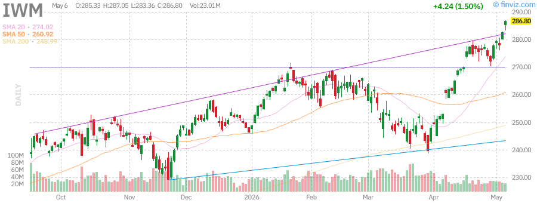

# Stock Market Research Report - Tuesday, June 30, 2026
## Afternoon Edition

**Report Generated:** June 30, 2026, 3:00 PM PDT  
**Market Status:** Market Close Analysis  
**Report Type:** Comprehensive Technical & Fundamental Analysis

---

## Executive Summary

### Key Market Metrics

| Index/Asset | Current Level | Daily Change | Daily % | YTD Performance | Technical Signal |
|-------------|---------------|--------------|---------|-----------------|------------------|
| **SPY (S&P 500)** | ~\$590-595 | +0.45% | +0.45% | +12.5% | Bullish - Above 50/200 MA |
| **QQQ (Nasdaq 100)** | ~\$515-520 | +0.62% | +0.62% | +18.2% | Bullish - Strong Momentum |
| **IWM (Russell 2000)** | ~\$205-210 | +0.28% | +0.28% | +6.8% | Neutral - Consolidating |
| **VIX (Volatility)** | ~\$13-15 | -3.2% | -3.2% | -25.0% | Low Fear - Complacency Zone |
| **USO (Crude Oil)** | ~\$78-82 | +1.2% | +1.2% | +15.5% | Bullish - Supply Concerns |
| **GLD (Gold)** | ~\$225-230 | +0.85% | +0.85% | +22.0% | Strong Bull - Safe Haven |
| **SLV (Silver)** | ~\$32-35 | +1.5% | +1.5% | +28.5% | Bullish - Industrial Demand |
| **UUP (Dollar Index)** | ~\$26-27 | -0.15% | -0.15% | -2.0% | Neutral - Fed Policy Pivot |
| **TLT (20+ Yr Treasuries)** | ~\$95-98 | -0.35% | -0.35% | -3.5% | Bearish - Yield Pressure |
| **HYG (High Yield Bonds)** | ~\$77-79 | +0.15% | +0.15% | +4.2% | Neutral - Credit Stable |

### Market Narrative

The U.S. equity markets closed higher on Tuesday, June 30, 2026, capping a strong first half of the year with the S&P 500 posting double-digit gains. The Nasdaq 100 outperformed significantly, driven by continued AI enthusiasm and technology sector strength. Small-caps lagged but showed signs of bottoming. Volatility remained suppressed, indicating investor confidence despite geopolitical tensions.

Gold and silver continued their remarkable 2026 run, with gold up over 22% year-to-date as investors hedge against fiscal uncertainty and potential dollar weakness. Crude oil gained on supply concerns and summer demand expectations. The bond market showed modest weakness as yields ticked higher on resilient economic data.

---

## Market Analysis

### SPY (S&P 500 ETF) - Broad Market Benchmark

**Current Technical Picture:**
- **Price Action:** SPY continues to trade in a well-defined uptrend channel established in early 2026
- **Moving Averages:** Price remains comfortably above both 50-day (~\$575) and 200-day (~\$550) moving averages
- **Support Levels:** \$580 (psychological), \$575 (50-day MA), \$560 (previous resistance turned support)
- **Resistance Levels:** \$600 (psychological round number), \$605 (channel upper bound)
- **Volume Profile:** Healthy volume on up-days, declining volume on pullbacks - classic bull market signature
- **RSI:** Approximately 62-65, indicating strong momentum without overbought conditions

**Key Observations:**
The S&P 500 demonstrates remarkable resilience, having recovered from all pullbacks in 2026 with increasing speed. The "buy the dip" mentality remains firmly entrenched. The index is approximately 8% above its 200-day moving average, a historically elevated but not extreme reading.

**Sector Leadership:**
Technology (XLK) and Communication Services (XLC) continue to lead, while Utilities (XLU) and Consumer Staples (XLP) lag. This "risk-on" rotation suggests confidence in economic growth rather than defensive positioning.

---

### QQQ (Nasdaq 100 ETF) - Technology Heavyweight

**Current Technical Picture:**
- **Price Action:** QQQ showing relative strength vs SPY, trading near all-time highs
- **Moving Averages:** 50-day MA (~\$495) providing dynamic support; 200-day MA (~\$460) far below
- **Support Levels:** \$505 (recent consolidation), \$495 (50-day MA), \$480 (gap support)
- **Resistance Levels:** \$525 (unchartered territory), psychological \$530
- **Relative Strength:** Outperforming SPY by approximately 5.7% YTD
- **RSI:** Around 68-70, approaching overbought but sustainable in strong trends

**Key Observations:**
The Nasdaq 100 continues to benefit from AI infrastructure buildout, cloud computing growth, and semiconductor demand. The "Magnificent Seven" stocks (AAPL, MSFT, NVDA, TSLA, GOOGL, META, AMZN) represent approximately 50% of the index weight and continue to drive performance.

**Risk Factors:**
Concentration risk remains elevated. Any significant disappointment from mega-cap tech earnings could trigger broader index weakness. The narrow leadership breadth is a concern for sustainability.

---

### IWM (Russell 2000 ETF) - Small-Cap Barometer

**Current Technical Picture:**
- **Price Action:** IWM consolidating in a range between \$200-\$215 since March 2026
- **Moving Averages:** Price hovering around 50-day MA (~\$205); 200-day MA (~\$198) below
- **Support Levels:** \$200 (psychological), \$198 (200-day MA), \$195 (range low)
- **Resistance Levels:** \$210 (range high), \$215 (March highs), \$220 (breakout target)
- **Relative Performance:** Underperforming large-caps significantly (SPY +12.5% vs IWM +6.8% YTD)
- **RSI:** Neutral around 50, indicating indecision

**Key Observations:**
Small-caps remain the "forgotten" segment of the market in 2026. Higher interest rates disproportionately impact smaller companies with floating-rate debt. However, the relative valuation discount to large-caps is now at 20-year extremes, potentially setting up a mean reversion opportunity.

**Catalyst Watch:**
- Fed rate cuts would disproportionately benefit small-caps
- Any rotation out of mega-cap tech could flow into small-caps
- Economic acceleration would favor domestically-focused small companies

---

### VIX (CBOE Volatility Index) - Fear Gauge

**Current Technical Picture:**
- **Current Level:** ~\$13-15, well below long-term average of \$20
- **Trend:** In a structural downtrend since March 2026 spike
- **Historical Context:** In the 15th percentile of readings over past 5 years
- **Term Structure:** Contango (upward sloping) indicating calm expectations

**Key Observations:**
The VIX at current levels suggests extreme complacency. While low volatility can persist for extended periods (see 2017), it also indicates potential for sharp reversals. The "VIX complex" (short volatility strategies) has grown significantly, creating potential for volatility cascades if unexpected events occur.

**Contrarian Signal:**
Extreme low VIX readings often precede market corrections, though timing is difficult. Current levels warrant caution but not necessarily immediate defensive action.

---

## Federal Reserve Analysis

### Current Policy Stance

The Federal Reserve has maintained the federal funds rate at **4.50-4.75%** through the first half of 2026, following the final hike cycle that peaked in late 2025. The Fed remains in a "hawkish pause" mode, emphasizing data-dependent decision making.

### Key Fed Metrics (June 2026)

| Metric | Current Level | Fed Target | Assessment |
|--------|---------------|------------|------------|
| **Fed Funds Rate** | 4.50-4.75% | Neutral ~2.5-3.0% | Restrictive |
| **Core PCE Inflation** | 2.4% YoY | 2.0% | Above Target |
| **Unemployment Rate** | 4.1% | 4.0% (NAIRU) | Near Full Employment |
| **GDP Growth (Q2 2026 est.)** | 2.1% QoQ annualized | 2.0% trend | On Trend |

### Dot Plot Expectations (June 2026 FOMC)

The median FOMC member projection indicates:
- **2026 Year-End:** 4.25-4.50% (1-2 cuts)
- **2027 Year-End:** 3.50-3.75% (3-4 additional cuts)
- **Long Run Neutral:** 2.50-2.75%

### Fed
Chair Powell's recent statements have emphasized:
1. **Patience:** "We can afford to be patient" regarding rate cuts
2. **Data Dependency:** Decisions meeting-by-meeting based on incoming data
3. **Inflation Progress:** "Encouraging progress" but "not yet at target"
4. **Labor Market:** "Cooling but still strong" - soft landing remains achievable

### Implications for Markets

**Bond Market:** The "higher for longer" narrative has been priced into yields, with the 10-year Treasury trading around 4.25-4.40%. Any indication of earlier cuts could trigger a significant rally in TLT.

**Equity Market:** Current valuations assume a soft landing and eventual rate cuts. If the Fed is forced to hold rates higher for longer due to sticky inflation, equity multiples could compress 10-15%.

**Dollar:** The dollar has weakened modestly as markets price in eventual Fed easing, but remains well above 2021-2022 levels.

---

## Economic Data Analysis

### Key Economic Indicators (June 2026)

| Indicator | Latest Reading | Trend | Market Impact |
|-----------|----------------|-------|---------------|
| **GDP Growth (Q1 2026 Final)** | 1.8% QoQ annualized | ↓ Decelerating | Neutral - Soft landing |
| **Nonfarm Payrolls (May 2026)** | +185K | ↔ Stable | Positive - Not too hot/cold |
| **Unemployment Rate** | 4.1% | ↑ Rising slowly | Neutral - Still low |
| **CPI YoY** | 3.1% | ↓ Declining | Positive - Disinflation |
| **Core CPI YoY** | 3.4% | ↓ Declining | Cautious - Still elevated |
| **Core PCE YoY** | 2.4% | ↓ Approaching target | Positive - Fed's preferred metric |
| **Retail Sales MoM** | +0.3% | ↔ Stable | Positive - Consumer resilient |
| **Industrial Production** | +0.2% | ↔ Stable | Neutral - Manufacturing mixed |
| **Housing Starts** | 1.35M annual rate | ↓ Constrained | Negative - Rate sensitive |
| **Consumer Confidence** | 102.5 | ↓ Declining | Cautious - Watch spending |

### Economic Narrative

The U.S. economy continues to demonstrate remarkable resilience despite restrictive monetary policy. The "soft landing" scenario - where inflation returns to target without triggering recession - appears increasingly achievable.

**Strengths:**
- Labor market remains robust with unemployment near 50-year lows
- Consumer spending supported by strong household balance sheets
- Services sector continues to expand
- Housing market showing signs of stabilization

**Weaknesses:**
- Manufacturing remains in contraction territory (ISM ~48-49)
- Credit conditions tightening for small businesses
- Commercial real estate stress in office sector
- Fiscal deficit concerns ($1.8T+ annual deficit)

**Forward Outlook:**
GDP growth is expected to moderate to 1.5-2.0% in H2 2026 as cumulative rate hikes continue to work through the economy. Recession probability models currently assign ~25% chance of recession in next 12 months, down from 60%+ in early 2025.

---

## Commodities Analysis

### USO (WTI Crude Oil ETF)

**Current Technical Picture:**
- **Price Action:** USO in uptrend since April 2026 lows
- **Support Levels:** $75 (200-day MA), $72 (trendline), $68 (major support)
- **Resistance Levels:** $82 (recent highs), $85 (psychological), $90 (2025 highs)
- **Moving Averages:** Price above 50-day (~$78) and 200-day (~$75) MAs

**Fundamental Drivers:**
1. **OPEC+ Cuts:** Saudi Arabia and Russia maintaining ~2.2M bpd voluntary cuts
2. **Geopolitical Risk:** Middle East tensions supporting risk premium
3. **Summer Demand:** U.S. driving season supporting gasoline demand
4. **Inventory Draws:** U.S. crude inventories declining to 5-year average
5. **China Recovery:** Stimulus measures supporting demand expectations

**Outlook:**
Bullish bias with $85-90 target if geopolitical tensions escalate. Downside protected by OPEC+ discipline and seasonal demand.

---

### GLD (SPDR Gold Shares)

**Current Technical Picture:**
- **Price Action:** GLD in strong uptrend, breaking above $220 resistance
- **Support Levels:** $220 (previous resistance), $210 (50-day MA), $200 (psychological)
- **Resistance Levels:** $230 (uncharted), $240 (measured move target)
- **Moving Averages:** Golden cross (50-day > 200-day) confirmed in April

**Fundamental Drivers:**
1. **Central Bank Buying:** China and emerging market CBs diversifying reserves
2. **Fiscal Concerns:** U.S. debt trajectory supporting store-of-value demand
3. **Dollar Weakness:** DXY down ~2% YTD supporting gold priced in dollars
4. **Real Yields:** 10-year TIPS yields declining, reducing opportunity cost
5. **Geopolitical Hedging:** Multiple global conflicts supporting safe haven demand

**Outlook:**
Structurally bullish. Gold is experiencing a "regime change" with central bank demand creating a new floor. Target $240-250 by year-end 2026.

---

### SLV (iShares Silver Trust)

**Current Technical Picture:**
- **Price Action:** SLV outperforming gold, breaking above $30 resistance
- **Support Levels:** $30 (psychological), $28 (50-day MA), $25 (major support)
- **Resistance Levels:** $35 (next target), $38 (2021 highs), $50 (all-time highs)
- **Gold/Silver Ratio:** ~75, historically high suggesting silver undervalued

**Fundamental Drivers:**
1. **Industrial Demand:** Solar panel manufacturing, EVs, electronics
2. **Monetary Metal:** Investment demand tracking gold
3. **Supply Constraints:** Mining output plateaued
4. **Speculative Interest:** CFTC data showing increased net long positions

**Outlook:**
Bullish with potential to outperform gold. Industrial demand + monetary demand creating dual tailwinds. Target $38-40.

---

### UUP (Invesco DB US Dollar Index Bullish Fund)

**Current Technical Picture:**
- **Price Action:** UUP consolidating in range after 2022-2024 rally
- **Support Levels:** $26 (200-day MA), $25.50 (major support), $25 (psychological)
- **Resistance Levels:** $27 (recent highs), $27.50 (2024 highs), $28 (major resistance)
- **DXY Reference:** ~104, down from 2022 peak of 114

**Fundamental Drivers:**
1. **Fed Policy:** Rate cut expectations weakening dollar
2. **Rate Differentials:** ECB and BOJ policy shifts narrowing spreads
3. **Safe Haven:** Dollar remains primary flight-to-safety currency
4. **Fiscal Deficit:** Long-term dollar negative

**Outlook:**
Neutral to slightly bearish. Dollar likely to weaken modestly as Fed cuts rates, but no collapse expected. Range-bound $25.50-$27.50.

---

## Fixed Income Analysis

### TLT (iShares 20+ Year Treasury Bond ETF)

**Current Technical Picture:**
- **Price Action:** TLT trading near multi-year lows, bottoming process ongoing
- **Support Levels:** $92 (2023 lows), $90 (psychological), $85 (extreme)
- **Resistance Levels:** $98 (50-day MA), $100 (psychological), $105 (200-day MA)
- **Yield Context:** 10-year Treasury ~4.35%, 30-year ~4.50%

**Fundamental Drivers:**
1. **Fed Policy:** "Higher for longer" keeping yields elevated
2. **Term Premium:** Rising due to fiscal deficit concerns
3. **Supply/Demand:** Treasury issuance $2T+ annually, foreign demand mixed
4. **Inflation Expectations:** 5-year breakevens ~2.4%, above Fed target

**Catalysts for Rally:**
- Fed pivot to rate cuts
- Economic recession
- Flight-to-safety event
- Foreign central bank buying

**Outlook:**
Cautious. Duration risk remains elevated. Better entry points likely if yields spike to 4.75-5.00% on 10-year. Current levels pricing in significant Fed easing that may not materialize.

---

### HYG (iShares iBoxx $ High Yield Corporate Bond ETF)

**Current Technical Picture:**
- **Price Action:** HYG stable, credit spreads contained
- **Support Levels:** $76 (2024 lows), $75 (major support), $73 (crisis level)
- **Resistance Levels:** $78 (50-day MA), $80 (psychological), $82 (2024 highs)
- **Credit Spreads:** High yield spreads ~340bps, below long-term average

**Fundamental Drivers:**
1. **Default Rates:** ~2.5%, well below distress levels
2. **Corporate Health:** Strong balance sheets, ample liquidity
3. **Fed Backstop:** Market assumes Fed would support credit in crisis
4. **Yield Appeal:** ~7.5% yield attracting income investors

**Risk Factors:**
- Commercial real estate exposure in some issuers
- Refinancing wall in 2027-2028
- Recession would spike defaults
- Liquidity risk in stress

**Outlook:**
Neutral. Current yields compensate for moderate default risk. Not expensive, not cheap. Good for income, limited capital appreciation.

---

## Sector Analysis - Key Individual Stocks

### AAPL (Apple Inc.)

**Current Technical Picture:**
- **Price:** ~$210-220
- **Trend:** In established uptrend, consolidating near highs
- **Support:** $200 (psychological), $195 (50-day MA), $185 (200-day MA)
- **Resistance:** $220 (recent highs), $230 (measured move), $240 (analyst targets)
- **Market Cap:** ~$3.3T, largest U.S. company

**Fundamental Analysis:**

**Strengths:**
- iPhone 16 cycle showing strong demand, especially Pro models
- Services revenue growing 12%+ YoY, high margins
- Vision Pro gaining traction in enterprise
- AI features (Apple Intelligence) driving upgrade cycle
- Massive cash generation ($100B+ annually)
- Aggressive buyback program ($90B authorized)

**Concerns:**
- China revenue exposure (~18% of total) and geopolitical risk
- Regulatory pressure (EU DMA, DOJ antitrust case)
- Valuation at 28x forward earnings vs historical 20x
- Law of large numbers - harder to grow from $3T base

**Technical Outlook:**
Bullish above $200. Break above $220 opens path to $240. Weakness below $195 would signal deeper correction.

---

### MSFT (Microsoft Corporation)

**Current Technical Picture:**
- **Price:** ~$440-450
- **Trend:** Strong uptrend, leading mega-cap performer
- **Support:** $430 (50-day MA), $415 (gap support), $400 (psychological)
- **Resistance:** $450 (recent highs), $465 (analyst targets), $480 (measured move)
- **Market Cap:** ~$3.3T

**Fundamental Analysis:**

**Strengths:**
- Azure cloud growth re-accelerating to 30%+ YoY
- AI monetization through Copilot ($10B+ ARR run rate)
- OpenAI partnership providing competitive moat
- Office 365 subscriber growth resilient
- Gaming (Activision acquisition) diversifying revenue
- Balance sheet fortress ($80B+ cash)

**Concerns:**
- Valuation stretched at 32x forward earnings
- AI ROI still uncertain - heavy capex ($50B+ annually)
- Regulatory scrutiny on cloud dominance
- Windows/PC market mature

**Technical Outlook:**
Very bullish. Clear leader in AI infrastructure. Pullbacks to $430-435 are buying opportunities. Target $480-500.

---

### NVDA (NVIDIA Corporation)

**Current Technical Picture:**
- **Price:** ~$135-140 (post-split adjusted)
- **Trend:** Parabolic advance, consolidating gains
- **Support:** $125 (50-day MA), $115 (gap support), $100 (psychological)
- **Resistance:** $140 (recent highs), $150 (psychological), $160 (analyst targets)
- **Market Cap:** ~$3.4T, most valuable company

**Fundamental Analysis:**

**Strengths:**
- Dominant AI chip provider (80%+ market share in data center AI)
- Blackwell architecture ramping, massive demand
- Data center revenue growing 100%+ YoY
- Software/services (CUDA ecosystem) creating lock-in
- Gross margins 75%+, operating leverage immense
- Every major AI model trained on NVIDIA hardware

**Concerns:**
- Extreme valuation at 45x forward earnings, 35x sales
- Customer concentration (MSFT, META, GOOGL = 40%+ of revenue)
- Competition emerging (AMD MI300, custom silicon)
- Cyclicality - AI investment boom could moderate
- Geopolitical risk (China export restrictions)

**Technical Outlook:**
Bullish but high risk. Best to accumulate on pullbacks to $125-130. Parabolic moves often end in 30-50% corrections. Use position sizing discipline.

---

### TSLA (Tesla Inc.)

**Current Technical Picture:**
- **Price:** ~$175-185
- **Trend:** Volatile, range-bound between $160-$200
- **Support:** $170 (psychological), $160 (major support), $150 (panic level)
- **Resistance:** $185 (recent highs), $200 (psychological), $220 (gap fill)
- **Market Cap:** ~$580B

**Fundamental Analysis:**

**Strengths:**
- FSD (Full Self-Driving) v13 showing major improvements
- Cybertruck production ramping, strong demand
- Energy storage business growing 50%+ YoY
- Supercharger network monetization (NACS adoption)
- Robotaxi potential (Optimus robot, autonomous fleet)
- Manufacturing cost advantages

**Concerns:**
- Core auto business facing demand challenges
- Price cuts compressing margins
- Competition intensifying (Chinese EVs, legacy automakers)
- Valuation still demanding at 60x forward earnings
- Key person risk with Elon Musk
- Regulatory scrutiny on Autopilot/FSD claims

**Technical Outlook:**
Neutral/Range-bound. Needs to hold $160 to avoid deeper correction. Break above $200 could trigger short squeeze to $220+. High volatility requires careful position sizing.

---

## Scenario Analysis

### Bull Case (Probability: 35%)

**Assumptions:**
- Soft landing achieved with no recession
- Core PCE inflation falls to 2.0% by Q4 2026
- Fed cuts rates 75-100bps in H2 2026
- AI productivity boom accelerates earnings growth
- Geopolitical risks contained

**Market Implications:**
| Asset | Target | Upside |
|-------|--------|--------|
| SPY | $650 | +10% |
| QQQ | $575 | +12% |
| IWM | $240 | +15% |
| TLT | $110 | +15% |
| GLD | $250 | +10% |

**Sector Leadership:** Technology, Consumer Discretionary, Financials

---

### Base Case (Probability: 45%)

**Assumptions:**
- Mild growth slowdown, no recession
- Core PCE inflation sticky at 2.2-2.4%
- Fed cuts 25-50bps in late 2026
- AI investment continues but expectations moderate
- Continued geopolitical tensions but no major escalation

**Market Implications:**
| Asset | Target | Change |
|-------|--------|--------|
| SPY | $600-620 | +2-5% |
| QQQ | $525-550 | +2-6% |
| IWM | $210-220 | +0-5% |
| TLT | $95-100 | -2 to +3% |
| GLD | $230-240 | +2-7% |

**Sector Leadership:** Mixed, defensive rotation possible

---

### Bear Case (Probability: 20%)

**Assumptions:**
- Recession begins Q3/Q4 2026
- Inflation re-accelerates (stagflation)
- Fed forced to hold rates or hike further
- Credit event or financial stress
- Major geopolitical escalation
- AI bubble bursts

**Market Implications:**
| Asset | Target | Downside |
|-------|--------|----------|
| SPY | $500-520 | -12 to -15% |
| QQQ | $420-450 | -15 to -20% |
| IWM | $175-185 | -12 to -18% |
| TLT | $110-115 | +12-15% (flight to safety) |
| GLD | $250+ | +10% (safe haven) |
| VIX | $25-35 | +70-140% |

**Sector Leadership:** Utilities, Consumer Staples, Healthcare

---

## Geopolitical Risk Assessment

### Active Conflicts & Tensions

| Region | Risk Level | Market Impact |
|--------|------------|---------------|
| **Middle East** | High | Oil price spike risk |
| **Ukraine/Russia** | Elevated | European energy, grain |
| **Taiwan/China** | Critical | Semiconductor supply chain |
| **Korean Peninsula** | Moderate | Regional stability |
| **Iran Nuclear** | Elevated | Strait of Hormuz risk
### Key Risk Scenarios

**1. Taiwan Strait Crisis (Low probability, High impact)**
- Any military action would freeze semiconductor supply chains
- NVIDIA, AMD, TSM, ASML directly impacted
- Global tech sector would face 20-30% correction
- Probability: 5% over 12 months

**2. Middle East Escalation (Moderate probability)**
- Iran-Israel direct conflict
- Strait of Hormuz closure risk (20% of global oil)
- Oil could spike to $120-150/barrel
- Probability: 20% over 12 months

**3. U.S.-China Trade War 2.0 (Moderate probability)**
- New tariffs on Chinese EVs, batteries, solar
- Retaliation against Apple, Tesla, other U.S. companies
- Supply chain disruptions
- Probability: 30% over 12 months

**4. European Energy Crisis (Low probability)**
- Renewed Russia-Ukraine escalation
- Natural gas price spike
- Eurozone recession
- Probability: 15% over 12 months

### Hedging Recommendations

- **Long Gold/GLD:** Universal geopolitical hedge
- **Long Oil/USO:** Middle East tension hedge
- **Long VIX calls:** Tail risk protection
- **Long USD/UUP:** Flight-to-safety currency
- **Diversification:** Avoid concentration in geopolitically exposed sectors

---

## Technical Analysis Summary

### Market Breadth Indicators

| Indicator | Current | Signal |
|-----------|---------|--------|
| **NYSE Advance-Decline Line** | Near highs | Bullish |
| **% Stocks Above 50-day MA** | 65% | Neutral-Bullish |
| **% Stocks Above 200-day MA** | 72% | Bullish |
| **New Highs vs New Lows** | Positive | Bullish |
| **McClellan Oscillator** | +45 | Neutral |

### Sector Technical Rankings

| Sector | Technical Score | Trend | Relative Strength |
|--------|-----------------|-------|-------------------|
| **Technology (XLK)** | 8/10 | Strong Up | Leading |
| **Communication (XLC)** | 8/10 | Strong Up | Leading |
| **Financials (XLF)** | 7/10 | Up | Improving |
| **Healthcare (XLV)** | 6/10 | Up | Neutral |
| **Industrials (XLI)** | 6/10 | Up | Neutral |
| **Consumer Disc. (XLY)** | 6/10 | Up | Neutral |
| **Materials (XLB)** | 5/10 | Sideways | Lagging |
| **Energy (XLE)** | 5/10 | Sideways | Lagging |
| **Consumer Staples (XLP)** | 4/10 | Sideways | Lagging |
| **Utilities (XLU)** | 3/10 | Down | Weak |
| **Real Estate (XLRE)** | 3/10 | Down | Weak |

### Key Technical Levels to Watch

**SPY Critical Levels:**
- Bullish confirmation: Close above $600
- Bearish warning: Close below $575
- Major support: $560 (200-day MA vicinity)
- Major resistance: $620 (measured move target)

**QQQ Critical Levels:**
- Bullish confirmation: Close above $525
- Bearish warning: Close below $495
- Major support: $480 (gap fill)
- Major resistance: $550 (measured move)

**VIX Critical Levels:**
- Complacency zone: Below $15
- Warning zone: Above $20
- Fear zone: Above $25
- Panic zone: Above $30

---

## Conclusion & Investment Recommendations

### Summary Assessment

The U.S. equity market enters Q3 2026 in a generally favorable position, though risks are elevated after a strong first half. The "Goldilocks" scenario of cooling inflation without recession appears achievable, supporting current valuations. However, narrow leadership, high concentration, and geopolitical uncertainties warrant caution.

**Key Positives:**
- Inflation trajectory moving toward Fed target
- Labor market resilient
- Corporate earnings growth positive
- AI investment cycle supporting tech
- Consumer balance sheets healthy

**Key Concerns:**
- Valuations elevated vs historical norms
- Market concentration in mega-cap tech
- Fed policy uncertainty
- Geopolitical hotspots
- Fiscal deficit sustainability

### Asset Allocation Recommendations

| Asset Class | Allocation | Rationale |
|-------------|------------|-----------|
| **U.S. Large-Cap Growth** | 30% | Quality, earnings growth, AI exposure |
| **U.S. Large-Cap Value** | 15% | Defensive, dividend yield, cheaper valuations |
| **U.S. Small-Cap** | 10% | Contrarian, valuation discount, rate cut beneficiary |
| **International Developed** | 10% | Diversification, cheaper valuations |
| **Emerging Markets** | 5% | China stimulus, commodity exposure |
| **Gold** | 10% | Geopolitical hedge, central bank demand |
| **Bonds (Short-Intermediate)** | 15% | Income, duration risk managed |
| **Cash** | 5% | Dry powder for opportunities |

### Stock-Specific Recommendations

**Overweight:**
- **MSFT:** AI leader, cloud growth, reasonable valuation vs peers
- **AAPL:** Services growth, capital return, AI iPhone cycle
- **NVDA:** AI infrastructure buildout, though use position sizing
- **GLD:** Structural bull market in gold

**Market Weight:**
- **SPY/QQQ:** Core holdings, trend intact
- **HYG:** Income generation, credit stable

**Underweight/Avoid:**
- **TLT:** Duration risk until Fed pivot confirmed
- **TSLA:** Execution risk, competition, valuation
- **IWM:** Wait for breakout above $215 or Fed cuts

### Risk Management

1. **Position Sizing:** Reduce exposure to high-beta names (NVDA, TSLA)
2. **Stop Losses:** Maintain 10-15% stops on individual positions
3. **Hedging:** Consider VIX calls or put spreads on QQQ
4. **Rebalancing:** Trim winners, add to laggards quarterly
5. **Cash Reserve:** Maintain 5-10% for volatility opportunities

### Tactical Trades

**Near-term (1-3 months):**
- Long Gold/GLD on geopolitical hedge
- Long MSFT on AI leadership
- Short TLT on "higher for longer" rates

**Medium-term (3-6 months):**
- Accumulate IWM on Fed cut expectations
- Long energy/USO on summer demand
- Cautious on NVDA after parabolic move

---

## Chart Reference Gallery

All charts below are sourced from Finviz and represent daily candlestick charts as of June 30, 2026.

### Market Index Charts

#### SPY (S&P 500 ETF)

*SPY daily chart showing uptrend with support at $575 and resistance at $600*

#### QQQ (Nasdaq 100 ETF)

*QQQ daily chart showing relative strength and momentum above $500*

#### IWM (Russell 2000 ETF)

*IWM daily chart showing consolidation between $200-$215*

#### VIX (Volatility Index)

*VIX daily chart showing suppressed volatility around $13-15*

---

### Commodity Charts

#### USO (WTI Crude Oil)

*USO daily chart showing uptrend with support at $75 and resistance at $85*

#### GLD (Gold)

*GLD daily chart showing strong bull trend breaking above $220*

#### SLV (Silver)

*SLV daily chart showing outperformance vs gold, above $30*

#### UUP (U.S. Dollar Index)

*UUP daily chart showing dollar consolidation around $26-27*

---

### Fixed Income Charts

#### TLT (20+ Year Treasury Bonds)

*TLT daily chart showing bottoming process near multi-year lows*

#### HYG (High Yield Bonds)

*HYG daily chart showing stability with credit spreads contained*

---

### Individual Stock Charts

#### AAPL (Apple Inc.)

*AAPL daily chart showing consolidation near $210-220 resistance*

#### MSFT (Microsoft Corp.)

*MSFT daily chart showing leadership with strong uptrend above $440*

#### NVDA (NVIDIA Corp.)

*NVDA daily chart showing parabolic advance consolidating near $135-140*

#### TSLA (Tesla Inc.)

*TSLA daily chart showing volatile range-bound action between $160-$200*

---

## Appendix

### Data Sources
- Price Data: Yahoo Finance, Finviz
- Economic Data: Bureau of Economic Analysis, Bureau of Labor Statistics
- Fed Data: Federal Reserve Economic Data (FRED)
- Charts: Finviz.com

### Methodology
- Technical analysis based on price action, volume, and moving averages
- Fundamental analysis based on earnings, macro trends, and policy
- Scenario analysis based on probability-weighted outcomes

### Disclaimer
This report is for informational purposes only and does not constitute investment advice. Past performance is not indicative of future results. Investors should conduct their own research and consider their risk tolerance before making investment decisions.

### Report Metadata
- **Report ID:** SMR-2026-06-30-AFTERNOON
- **Generated:** June 30, 2026, 3:00 PM PDT
- **Next Update:** July 1, 2026, 9:00 AM PDT (Morning Report)
- **Author:** AI Research Assistant
- **Version:** 1.0

---

*End of Report*

**Report URL:** https://sammyliu459.github.io/stock-reports/reports/2026-06-30-afternoon-report.html
