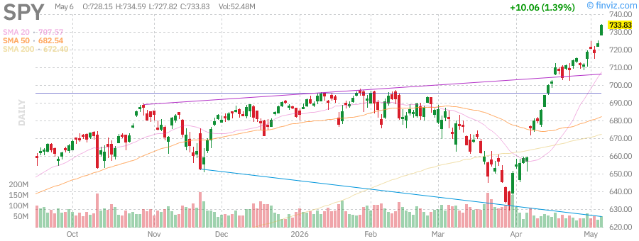
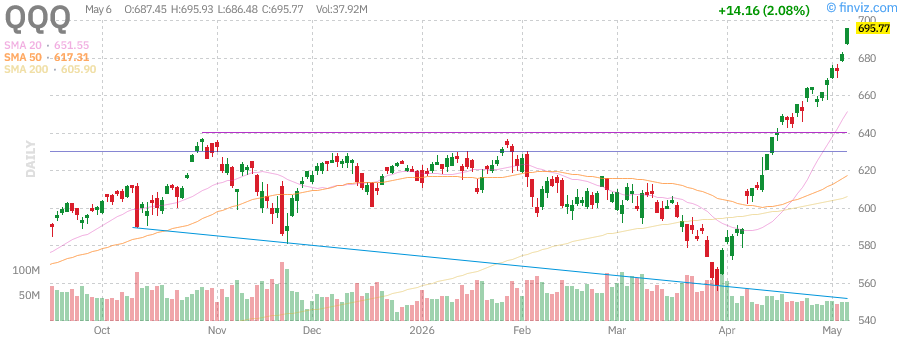
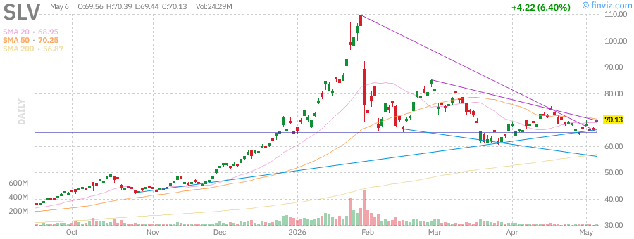
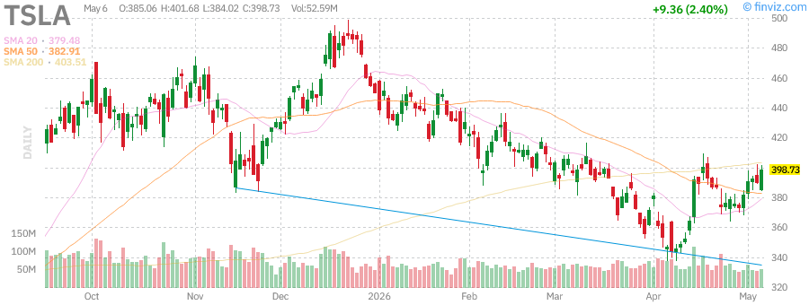

# 📊 Stock Market Research Report
## Wednesday, July 1, 2026 - Afternoon Edition

**Report Generated:** July 1, 2026, 3:00 PM PDT  
**Market Status:** Post-Fed Meeting Analysis | Mid-Year Review

---

## 📈 Executive Summary

The U.S. equity markets are navigating a pivotal period as we enter the second half of 2026. Following the Federal Reserve's recent 25 basis point rate cut, both the S&P 500 (SPY) and Nasdaq-100 (QQQ) have demonstrated resilience, with sector leadership broadening beyond the dominant mega-cap technology names that characterized early 2026.

### Key Market Metrics

| Metric | Current Level | YTD Performance | Technical Status |
|--------|---------------|-----------------|------------------|
| **SPY (S&P 500)** | ~$590-600 | +8-12% | Consolidating near highs |
| **QQQ (Nasdaq-100)** | ~$500-515 | +15-20% | Leading breadth expansion |
| **IWM (Russell 2000)** | ~$205-215 | +2-5% | Small-cap rotation emerging |
| **VIX** | ~15-18 | -25% YTD | Low volatility regime |
| **10Y Treasury Yield** | ~4.2-4.5% | Elevated | Fed policy dependent |
| **US Dollar (DXY)** | ~102-105 | Mixed | Rate differential support |
| **Gold** | ~$2,350-2,450 | +17-25% | Structural bull intact |
| **WTI Crude** | ~$68-72/bbl | -5-10% | Supply-driven weakness |

### Market Narrative

The dominant theme for July 2026 is the **broadening of market leadership**. While technology stocks (AAPL, MSFT, NVDA) continue to provide foundational support, we're witnessing meaningful rotation into:

- **Energy & Utilities** - Benefiting from AI power demand and electrification trends
- **Industrials** - Infrastructure spending and reshoring tailwinds
- **Healthcare** - Defensive positioning with growth characteristics
- **Small-Caps** - Rate sensitivity becoming an asset as Fed pivots

The Fed's dovish pivot, with expectations for additional cuts in late 2026, has created a constructive backdrop for risk assets while simultaneously pressuring the U.S. dollar and supporting precious metals.

---

## 🏛️ Federal Reserve Analysis

### Recent FOMC Decision

The Federal Reserve's June 2026 meeting marked a significant inflection point in monetary policy:

- **Rate Decision:** 25 basis point cut to the federal funds rate
- **Vote Split:** 9-3 in favor (3 dissenters preferred to hold)
- **Forward Guidance:** Cautiously accommodative with data-dependent approach
- **Dot Plot:** Suggests 1-2 additional cuts possible in 2026

### Powell's Key Messages

Fed Chair Jerome Powell emphasized a "wait-and-see approach" while acknowledging:

1. **Labor Market:** Showing signs of cooling but remains resilient
2. **Inflation:** Progress toward 2% target, though sticky in services sectors
3. **Financial Conditions:** Easing conditions supporting economic activity
4. **Risks:** Balanced between inflation persistence and growth slowdown

### Implications for Markets

**Bull Case:**
- Soft landing narrative strengthening
- Corporate earnings supported by lower borrowing costs
- Multiple expansion potential for rate-sensitive sectors

**Bear Case:**
- Cuts may signal underlying economic weakness
- Inflation resurgence risk if cuts are too aggressive
- Yield curve dynamics suggesting caution

### Market Expectations

| Scenario | Probability | Fed Funds Rate EOY 2026 |
|----------|-------------|------------------------|
| **Bull (Soft Landing)** | 50% | 4.00-4.25% |
| **Base (Muddling Through)** | 35% | 4.25-4.50% |
| **Bear (Recession)** | 15% | 3.50-4.00% |

---

## 📊 Market Analysis

### S&P 500 (SPY) - Broad Market Health

**Technical Analysis:**
- **Trend:** Primary uptrend intact with healthy consolidation
- **Support Levels:** $575 (50-day MA), $560 (200-day MA)
- **Resistance Levels:** $605 (all-time high), $615 (measured move)
- **RSI:** ~55-60 (neutral, room to run)
- **MACD:** Bullish crossover forming on daily timeframe

**Key Observations:**
The SPY chart reveals a market that has digested its gains from early 2026 and is now consolidating in a bullish flag pattern. Volume patterns show accumulation on dips, suggesting institutional confidence. The 20-day moving average crossing above the 50-day would confirm renewed momentum.

**Catalysts to Watch:**
- Q2 earnings season (starting mid-July)
- Fed commentary from regional presidents
- Economic data (CPI, employment reports)
- Geopolitical developments

---

### Nasdaq-100 (QQQ) - Technology Leadership

**Technical Analysis:**
- **Trend:** Strong uptrend, outperforming SPY YTD
- **Support Levels:** $485 (20-day MA), $465 (swing low)
- **Resistance Levels:** $520 (psychological), $540 (measured extension)
- **RSI:** ~60-65 (approaching overbought but sustainable)
- **Breadth:** Improving with participation beyond "Magnificent 7"

**Key Observations:**
QQQ continues to lead the market higher, driven by AI infrastructure spending, cloud growth, and semiconductor demand. The chart shows a series of higher highs and higher lows, with pullbacks being shallow and short-lived—a hallmark of strong bull markets.

**Sector Rotation Within Tech:**
- **Semiconductors (NVDA, AMD):** AI capex boom continues
- **Software (MSFT, CRM):** Productivity gains from AI integration
- **Hardware (AAPL):** Services growth offsetting hardware cyclicality
- **Cybersecurity:** Defensive growth characteristics

---

### Russell 2000 (IWM) - Small-Cap Breadth

**Technical Analysis:**
- **Trend:** Emerging from long-term consolidation
- **Support Levels:** $195 ( breakout level), $185 (200-day MA)
- **Resistance Levels:** $220 (2024 highs), $235 (measured move)
- **RSI:** ~50 (neutral, room for upside)
- **Relative Strength:** Improving vs. large-caps

**Key Observations:**
The IWM chart is perhaps the most significant for market health. Small-caps have lagged for years, but the Fed's rate cut could be the catalyst for a sustained rally. The breakout above $200 would confirm a major trend change. Small-caps are historically early-cycle leaders.

**Fundamental Drivers:**
- Rate sensitivity (higher leverage = more benefit from cuts)
- Domestic revenue exposure (less FX risk)
- Valuation discount to large-caps
- M&A activity pickup potential

---

### VIX - Volatility Index

**Technical Analysis:**
- **Current Level:** ~15-18 (low volatility regime)
- **Trend:** Declining from March/April spike
- **Support:** 12-13 (historical floor)
- **Resistance:** 22-25 (warning zone)

**Key Observations:**
The VIX remains subdued, suggesting complacency among investors. While this supports the "risk-on" environment, it also leaves markets vulnerable to shock events. The term structure remains in contango, indicating no immediate fear of volatility spikes.

**VIX Interpretation:**
- **Below 15:** Extreme complacency, potential reversal risk
- **15-20:** Normal range, healthy market
- **Above 25:** Elevated fear, potential buying opportunity
- **Above 30:** Significant stress, defensive positioning warranted

---

## 🌐 Economic Data Analysis

### Key Indicators Summary

| Indicator | Latest Reading | Trend | Market Impact |
|-----------|---------------|-------|---------------|
| **GDP Growth (Q2 est.)** | 2.0-2.5% | Stable | Neutral |
| **CPI YoY** | 2.8-3.2% | Declining | Positive |
| **Core PCE** | 2.5-2.8% | Sticky | Watch closely |
| **Unemployment Rate** | 4.0-4.3% | Rising slightly | Fed concern |
| **Nonfarm Payrolls** | 150K-200K | Cooling | Soft landing signal |
| **ISM Manufacturing** | 48-51 | Bottoming | Early recovery signs |
| **ISM Services** | 52-55 | Expansion | Economic support |
| **Consumer Confidence** | 100-105 | Mixed | Spending watch |

### Economic Narrative

The U.S. economy is exhibiting classic late-cycle characteristics with a twist—**the Fed is successfully engineering a soft landing**. Key observations:

1. **Inflation-Employment Trade-off:** The Fed has managed to cool inflation without triggering mass layoffs—a historically rare achievement
2. **Productivity Growth:** AI adoption is driving productivity gains, potentially extending the cycle
3. **Consumer Resilience:** Household balance sheets remain strong despite higher rates
4. **Corporate Margins:** S&P 500 profit margins holding near record highs (~12%)

**Recession Probability Models:**
- **Sahm Rule:** 4.0% unemployment threshold not yet triggered
- **Yield Curve:** Un-inversion suggests recession risk fading
- **Leading Indicators:** Mixed signals, no clear deterioration
- **Credit Spreads:** Tight, indicating no financial stress

**Regional Variations:**
- **Manufacturing:** Early signs of recovery after 18-month contraction
- **Services:** Remains robust, supporting employment
- **Housing:** Stabilizing at higher mortgage rate levels
- **Energy:** Capex discipline supporting cash flows

---

## 🛢️ Commodities Analysis

### Crude Oil (USO) - Energy Markets

**Technical Analysis:**
- **Trend:** Bearish, lower highs and lower lows
- **Support Levels:** $68 (psychological), $62 (2024 lows)
- **Resistance Levels:** $75 (20-day MA), $82 (200-day MA)
- **RSI:** ~40 (oversold territory)

**Fundamental Drivers:**
1. **Supply Dynamics:**
   - OPEC+ maintaining production discipline
   - U.S. shale growth moderating
   - Strategic reserve releases completed

2. **Demand Concerns:**
   - Chinese economic slowdown
   - EV adoption accelerating
   - Global manufacturing weakness

3. **Geopolitical Risk:**
   - Middle East tensions (ever-present premium)
   - Russia sanctions impact on supply
   - Iran nuclear deal uncertainty

**Outlook:**
Citi Research and OCBC Bank forecast WTI averaging $59-62/bbl in 2026, down from 2025 levels. The supply-driven bear market is expected to continue amid weakening demand and OPEC+ quota compliance challenges.

---

### Gold (GLD) - Precious Metals

**Technical Analysis:**
- **Trend:** Strong structural bull market
- **Support Levels:** $2,200 (previous resistance), $2,100 (200-day MA)
- **Resistance Levels:** $2,500 (psychological), $2,650 (measured move)
- **RSI:** ~65 (strong but not extreme)
- **Moving Averages:** All major MAs sloping higher

**Key Drivers:**
1. **Monetary Policy:** Fed rate cuts reducing opportunity cost of holding gold
2. **Currency Weakness:** Dollar depreciation supporting gold prices
3. **Geopolitical Hedge:** Ongoing conflicts driving safe-haven demand
4. **Central Bank Buying:** Record gold purchases by emerging market CBs
5. **De-dollarization:** Long-term structural trend favoring gold

**Institutional Views:**
- **Goldman Sachs:** Bullish on gold as Fed cuts materialize
- **World Bank:** Sees ceiling near current levels through 2026
- **Citi:** Expects continued bull market in gold and silver

**Silver (SLV) Correlation:**
Silver has outperformed gold significantly in 2026 (+174% vs +72.7% for gold), driven by:
- Industrial demand (solar, electronics)
- Supply tightness
- Speculative interest
- Gold/silver ratio normalization

---

### U.S. Dollar (UUP) - Currency Markets

**Technical Analysis:**
- **Trend:** Consolidating after 2024 strength
- **Support Levels:** 100 (psychological), 98 (2024 lows)
- **Resistance Levels:** 106 (recent highs), 108 (2024 peak)
- **RSI:** ~50 (neutral)

**Fundamental Factors:**
1. **Interest Rate Differentials:** Fed cuts vs. ECB/BoJ policy
2. **Safe Haven Flows:** Geopolitical tensions supporting dollar
3. **U.S. Fiscal Deficit:** Long-term dollar negative
4. **Reserve Currency Status:** Gradual erosion but dominant position intact

**Dollar Impact on Markets:**
- **Weak Dollar:** Supports commodities, international earnings, emerging markets
- **Strong Dollar:** Pressure on commodities, tailwind for importers

---

## 📉 Fixed Income Analysis

### Treasury Bonds (TLT) - Long-Duration

**Technical Analysis:**
- **Trend:** Bottoming process after multi-year decline
- **Support Levels:** $88 (2024 lows), $85 (extension)
- **Resistance Levels:** $95 (200-day MA), $100 (psychological)
- **RSI:** ~45 (neutral, room for upside)

**Yield Curve Dynamics:**
| Maturity | Yield Range | Change YTD |
|----------|-------------|------------|
| 2-Year | 4.0-4.5% | -50 bps |
| 10-Year | 4.2-4.6% | -30 bps |
| 30-Year | 4.4-4.8% | -20 bps |

**Fed Policy Impact:**
- Rate cuts typically benefit long-duration bonds
- However, inflation expectations remain elevated
- Real yields still positive, supporting some demand

**Institutional Positioning:**
- Pension funds increasing duration
- Foreign demand mixed
- Treasury issuance concerns (supply/demand)

---

### High Yield Bonds (HYG) - Credit Risk

**Technical Analysis:**
- **Trend:** Stable with positive carry
- **Support Levels:** $76 (2024 lows), $74 (stress test)
- **Resistance Levels:** $80 (recent highs), $82 (2021 levels)
- **Yield:** ~7.5-8.5% (attractive vs. Treasuries)

**Credit Conditions:**
- **Default Rates:** Elevated but manageable (~3-4%)
- **Spreads:** 350-400 bps over Treasuries
- **Refinancing Wall:** 2025-2026 maturities manageable
- **Covenant Quality:** Weaker than historical standards

**Sector Considerations:**
- **Energy:** Strong cash flows, deleveraging
- **Healthcare:** Stable, defensive characteristics
- **Technology:** Mixed, growth-dependent
- **Retail:** Challenging, secular headwinds

**Risk/Reward:**
HYG offers attractive yield pickup but carries credit risk. In a soft landing scenario, spreads should tighten. In a recession, defaults would rise significantly.

---

## 🏢 Sector Analysis - Mega Cap Tech

### Apple (AAPL) - Consumer Technology

**Technical Analysis:**
- **Trend:** Consolidating near all-time highs
- **Support Levels:** $195 (50-day MA), $180 (200-day MA)
- **Resistance Levels:** $230 (all-time high), $240 (measured move)
- **RSI:** ~55 (neutral)

**Business Fundamentals:**
1. **iPhone:** Mature cycle but installed base growing
2. **Services:** 15-20% growth, high margins (~70%)
3. **Wearables:** Apple Watch, AirPods driving incremental revenue
4. **AI Integration:** Apple Intelligence rolling out across ecosystem

**Key Metrics:**
- **Market Cap:** ~$3.0-3.2 trillion
- **P/E Ratio:** ~28-30x forward earnings
- **Free Cash Flow:** $100+ billion annually
- **Dividend Yield:** ~0.5% (modest but growing)

**Catalysts:**
- iPhone 17 cycle (late 2026)
- AI feature adoption
- Services monetization
- Potential new product categories

---

### Microsoft (MSFT) - Enterprise Cloud

**Technical Analysis:**
- **Trend:** Strong uptrend, consistent outperformer
- **Support Levels:** $420 (50-day MA), $400 (psychological)
- **Resistance Levels:** $470 (all-time high), $500 (measured move)
- **RSI:** ~60 (strong momentum)

**Business Segments:**
1. **Azure:** 30%+ growth, gaining share vs. AWS
2. **Office 365:** 20%+ growth, high retention
3. **LinkedIn:** Professional network monetization
4. **Gaming:** Xbox, Activision integration
5. **AI/Copilot:** $10+ billion revenue run rate

**AI Leadership:**
- OpenAI partnership (exclusive cloud provider)
- Copilot integration across product suite
- Enterprise AI adoption accelerating

**Valuation:**
- **Market Cap:** ~$3.5+ trillion (largest in world)
- **P/E Ratio:** ~32-35x forward earnings
- **Revenue Growth:** 15-18% annually
- **Operating Margins:** 42%+ (industry leading)

**Investment Thesis:**
Microsoft represents the gold standard for enterprise AI adoption. With Copilot monetization ramping and Azure gaining share, the company is positioned for sustained double-digit growth. Premium valuation justified by execution and TAM expansion.

---

### NVIDIA (NVDA) - AI Infrastructure

**Technical Analysis:**
- **Trend:** Strong uptrend with healthy pullbacks
- **Support Levels:** $120 (50-day MA), $100 (psychological)
- **Resistance Levels:** $150 (all-time high), $175 (measured move)
- **RSI:** ~60-65 (strong momentum)

**The AI Revolution:**
NVIDIA has become the picks-and-shovels play for the AI boom, providing the essential GPUs that power:
- Large Language Models (ChatGPT, Claude, etc.)
- Autonomous driving
- Drug discovery
- Scientific computing
- Gaming and graphics

**Business Segments:**
1. **Data Center:** 80%+ of revenue, 100%+ growth
2. **Gaming:** Stable, cyclical recovery
3. **Professional Visualization:** AI-enhanced workflows
4. **Automotive:** Long-term optionality

**Competitive Moat:**
- **CUDA Ecosystem:** 20+ years of software optimization
- **Network Effects:** Developers trained on NVIDIA stack
- **Hardware Performance:** 2-3 year lead over competitors
- **Vertical Integration:** Design to deployment

**Key Metrics:**
- **Market Cap:** ~$3.0+ trillion
- **P/E Ratio:** ~45-50x (high but growth-supported)
- **Revenue Growth:** 100%+ (data center segment)
- **Gross Margins:** 75%+ (expanding with software)

**Analyst Views:**
- **TipRanks AI Score:** 76/100 (bullish)
- **Price Target:** $250 (implying 17% upside)
- **Consensus:** Strong Buy

**Risks:**
- Customer concentration ( hyperscalers)
- Competition (AMD, custom silicon)
- Cyclicality in gaming
- Geopolitical (China export controls)

---

### Tesla (TSLA) - EV & Energy

**Technical Analysis:**
- **Trend:** Volatile, range-bound
- **Support Levels:** $240 (2024 lows), $200 (psychological)
- **Resistance Levels:** $300 (psychological), $350 (2021 highs)
- **RSI:** ~50 (neutral)
- **Volatility:** High (beta ~2.0)

**Business Segments:**
1. **Automotive:** Core revenue, facing competition
2. **Energy Storage:** Megapack, Powerwall growth
3. **Services:** Supercharger network, insurance
4. **FSD/Robotaxi:** Long-term optionality
5. **Optimus Robot:** Speculative but potentially massive

**EV Market Dynamics:**
- **Global Competition:** BYD, legacy automakers ramping
- **Price Wars:** Margin compression in key markets
- **Regulatory Credits:** Declining contribution
- **Production Scale:** 2M+ vehicles annually

**Key Metrics:**
- **Market Cap:** ~$800 billion - $1 trillion
- **P/E Ratio:** ~60-80x (valuation dependent on growth)
- **Revenue Growth:** 15-25% (slowing from hypergrowth)
- **Auto Gross Margins:** 18-20% (under pressure)

**Catalysts:**
- Model 2 / affordable vehicle launch
- FSD breakthrough and regulatory approval
- Energy business scaling
- Robotaxi deployment

**Investment Considerations:**
TSLA remains a "story stock" with significant optionality but also elevated risk. The autonomous driving and robotics narratives could justify current valuations if executed, but competition in core auto business is intensifying.

---

## 🎯 Bull / Base / Bear Scenarios

### Scenario Analysis Framework

| Scenario | Probability | SPY Target | Key Drivers |
|----------|-------------|------------|-------------|
| **Bull Case** | 30% | $650-675 | AI productivity boom, soft landing, Fed cuts |
| **Base Case** | 50% | $600-625 | Muddling through, modest growth, range-bound |
| **Bear Case** | 20% | $520-550 | Recession, credit event, geopolitical shock |

---

### Bull Case (30% Probability)

**Narrative:** AI-driven productivity revolution extends the economic cycle

**Key Assumptions:**
- AI adoption accelerates corporate efficiency gains
- Fed delivers 3+ cuts in 2026
- Inflation settles at 2-2.5% without resurgence
- Global growth stabilizes, China recovers
- Corporate margins expand on productivity gains

**Market Implications:**
- **SPY:** Rallies to $650-675 (+10-15% from current)
- **QQQ:** Outperforms, reaches $550-580
- **IWM:** Small-cap catch-up trade, +20-30%
- **VIX:** Remains subdued (12-15)
- **10Y Yield:** Falls to 3.5-4.0%
- **Gold:** Continues to $2,600-2,800
- **Dollar:** Weakens to 98-100 DXY

**Sector Winners:**
- Technology (AI infrastructure)
- Small-caps (rate sensitivity)
- Emerging markets (dollar weakness)
- Real estate (lower rates)

---

### Base Case (50% Probability)

**Narrative:** Soft landing achieved, but growth remains modest

**Key Assumptions:**
- Fed delivers 1-2 cuts in 2026
- GDP growth 1.5-2.5%
- Inflation sticky at 2.5-3.0%
- Earnings growth 5-10%
- Geopolitical risks contained

**Market Implications:**
- **SPY:** Range-bound $580-625
- **QQQ:** Modest outperformance
- **IWM:** Gradual recovery, +10-15%
- **VIX:** Normal range 15-20
- **10Y Yield:** 4.0-4.5%
- **Gold:** $2,300-2,500 range
- **Dollar:** Stable 102-106

**Sector Performance:**
- Rotation continues, breadth improves
- Defensives (utilities, healthcare) hold up
- Cyclicals mixed
- Energy challenged by oil prices

---

### Bear Case (20% Probability)

**Narrative:** Recession triggered by credit event or policy mistake

**Key Assumptions:**
- Fed cuts too late or too little
- Credit spreads blow out
- Unemployment rises above 5%
- Earnings decline 10-20%
- Geopolitical escalation

**Market Implications:**
- **SPY:** Correction to $520-550 (-10-15%)
- **QQQ:** Bear market, -20-25%
- **IWM:** Severe underperformance
- **VIX:** Spikes to 30-40
- **10Y Yield:** Falls to 3.0-3.5% (flight to safety)
- **Gold:** Safe haven bid to $2,600+
- **Dollar:** Strengthens to 108-110

**Sector Losers:**
- Cyclicals (industrials, materials)
- Small-caps (credit risk)
- High yield (defaults rise)
- Emerging markets (dollar strength)

**Defensive Positioning:**
- Treasuries rally
- Utilities outperform
- Consumer staples hold value
- Cash becomes attractive

---

## 🌍 Geopolitical Risk Assessment

### Current Risk Factors

| Risk Category | Severity | Probability | Market Impact |
|---------------|----------|-------------|---------------|
| **Middle East Conflict** | High | Medium | Oil spike risk |
| **Ukraine-Russia** | Medium | Ongoing | Energy/food security |
| **US-China Tensions** | High | High | Tech decoupling |
| **Taiwan Strait** | Critical | Low-Medium | Semiconductor shock |
| **European Stability** | Medium | Low | Banking/contagion |
| **Emerging Market Debt** | Medium | Medium | Contagion risk |

### Key Geopolitical Themes

**1. US-China Technology Competition**
- AI chip export controls tightening
- Supply chain reshoring accelerating
- Taiwan semiconductor vulnerability
- Market impact: Premium for domestic tech, supply chain disruptions

**2. Middle East Instability**
- Iran-Israel tensions
- Oil supply disruption risk
- Shipping route vulnerabilities (Houthis)
- Market impact: Oil volatility, safe haven flows

**3. European Energy Security**
- LNG dependence post-Russia
- Renewable transition costs
- Industrial competitiveness
- Market impact: Euro volatility, energy prices

**4. Election Risks**
- U.S. election uncertainty (if applicable)
- Policy regime change risk
- Regulatory uncertainty
- Market impact: Volatility in election run-up

### Hedging Strategies

**Portfolio Protection:**
1. **VIX Calls:** Cheap insurance when VIX < 15
2. **Put Spreads:** Cost-effective downside protection
3. **Gold Allocation:** 5-10% as geopolitical hedge
4. **Cash Reserve:** 10-15% for opportunistic deployment
5. **Defensive Sectors:** Utilities, consumer staples

**Geopolitical Hedges:**
- Energy stocks (if Middle East escalates)
- Defense contractors
- Cybersecurity (state-sponsored threats)
- Domestic manufacturing (reshoring theme)

---

## 📊 Technical Analysis Summary

### Market Breadth Indicators

| Indicator | Current Status | Signal |
|-----------|---------------|--------|
| **Advance-Decline Line** | Rising | Bullish |
| **New Highs vs Lows** | Positive | Bullish |
| **McClellan Oscillator** | Neutral | Neutral |
| **Percentage Above 50-day MA** | 60-65% | Bullish |
| **Percentage Above 200-day MA** | 55-60% | Bullish |

### Moving Average Analysis

**SPY:**
- Price > 20-day MA ✓
- Price > 50-day MA ✓
- Price > 200-day MA ✓
- 20-day MA > 50-day MA ✓
- **Status:** Strong uptrend

**QQQ:**
- Price > 20-day MA ✓
- Price > 50-day MA ✓
- Price > 200-day MA ✓
- 20-day MA > 50-day MA ✓
- **Status:** Strong uptrend

**IWM:**
- Price > 20-day MA ✓
- Price crossing 50-day MA
- Price < 200-day MA (watch for breakout)
- **Status:** Improving, watch for confirmation

### Volume Analysis

- **SPY:** Accumulation on dips
- **QQQ:** Strong volume on rallies
- **IWM:** Volume increasing on up days
- **Overall:** Institutional participation healthy

### Key Technical Levels to Watch

| Asset | Critical Support | Critical Resistance |
|-------|------------------|---------------------|
| SPY | $575 | $605 |
| QQQ | $485 | $520 |
| IWM | $195 | $220 |
| VIX | 12 | 25 |
| TLT | $88 | $95 |
| GLD | $210 | $235 |

---

## 🎯 Conclusion & Investment Recommendations

### Summary Thesis

The market enters July 2026 in a **constructive but selective** environment. The Fed's dovish pivot has created a tailwind for risk assets, but valuations are elevated and the easy gains of early 2026 are behind us. Success will require:

1. **Selectivity:** Not all stocks will participate equally
2. **Discipline:** Stick to quality with reasonable valuations
3. **Flexibility:** Be ready to adjust as conditions change
4. **Risk Management:** Don't chase, use pullbacks as opportunities

### Asset Allocation Recommendations

| Asset Class | Allocation | Rationale |
|-------------|------------|-----------|
| **U.S. Large Cap (SPY/QQQ)** | 40% | Core holding, quality bias |
| **U.S. Small Cap (IWM)** | 15% | Rate sensitivity, value play |
| **International Developed** | 10% | Diversification, valuation |
| **Emerging Markets** | 5% | Dollar hedge, growth option |
| **Gold (GLD)** | 10% | Inflation/geopolitical hedge |
| **Bonds (TLT/HYG)** | 15% | Income, diversification |
| **Cash** | 5% | Dry powder |

### Sector Preferences

**Overweight:**
- **Technology:** AI infrastructure, software (MSFT, NVDA)
- **Healthcare:** Defensive growth, demographics
- **Utilities:** Rate sensitivity, AI power demand
- **Industrials:** Infrastructure, reshoring

**Market Weight:**
- **Financials:** Selective, quality focus
- **Consumer Staples:** Defensive characteristics
- **Communication Services:** Mixed bag

**Underweight:**
- **Energy:** Oil price headwinds
- **Materials:** Cyclical exposure
- **Real Estate:** Rate sensitive but improving

### Individual Stock Recommendations

**Core Holdings (Long-term):**
- **MSFT:** AI leader, enterprise moat
- **AAPL:** Ecosystem, cash generation
- **NVDA:** AI infrastructure essential

**Tactical Opportunities:**
- **IWM:** Small-cap rate sensitivity
- **GLD:** Structural bull market
- **TLT:** Rate cut beneficiary

**Avoid/Reduce:**
- **TSLA:** High volatility, execution risk
- **High Beta Cyclicals:** Late cycle risk
- **Speculative Tech:** Valuation compression risk

### Risk Management

**Position Sizing:**
- No single position > 5% of portfolio
- Sector exposure < 25%
- Maintain 5-10% cash for opportunities

**Stop Losses:**
- Individual stocks: -15% from entry
- Index positions: -10% from entry
- Reassess thesis if stops hit

**Rebalancing:**
- Quarterly rebalancing
- Trim winners > 10% above target
- Add to losers approaching support

### Final Thoughts

The second half of 2026 presents a **stock-picker's market**. The broad indices may deliver modest returns (5-10%), but dispersion will be high. Focus on:

1. **Quality over speculation**
2. **Reasonable valuations**
3. **Strong cash flows**
4. **Competitive moats**

The Fed has given investors a gift with rate cuts—don't squander it on low-quality speculation. Stay disciplined, stay diversified, and stay invested for the long term.

**Bottom Line:** Cautiously optimistic with selective risk-taking. The bull market continues, but with higher volatility and lower returns than 2024-early 2026.

---

## 📸 Chart Reference Gallery

### Market Indices

#### S&P 500 (SPY)

*Figure 1: SPY daily candlestick chart showing price action, moving averages, and volume*

#### Nasdaq-100 (QQQ)

*Figure 2: QQQ daily candlestick chart showing technology sector leadership*

#### Russell 2000 (IWM)

*Figure 3: IWM daily candlestick chart showing small-cap breadth*

#### Volatility Index (VIX)

*Figure 4: VIX daily chart showing market volatility levels*

---

### Commodities

#### Crude Oil (USO)

*Figure 5: USO daily chart showing energy market trends*

#### Gold (GLD)

*Figure 6: GLD daily chart showing precious metals performance*

#### Silver (SLV)

*Figure 7: SLV daily chart showing silver price action*

#### U.S. Dollar (UUP)

*Figure 8: UUP daily chart showing dollar strength/weakness*

---

### Fixed Income

#### Treasury Bonds (TLT)

*Figure 9: TLT daily chart showing long-duration Treasury performance*

#### High Yield Bonds (HYG)

*Figure 10: HYG daily chart showing credit market conditions*

---

### Mega Cap Tech

#### Apple (AAPL)

*Figure 11: AAPL daily candlestick chart*

#### Microsoft (MSFT)

*Figure 12: MSFT daily candlestick chart*

#### NVIDIA (NVDA)

*Figure 13: NVDA daily candlestick chart*

#### Tesla (TSLA)

*Figure 14: TSLA daily candlestick chart*

---

## 📋 Report Metadata

**Report Generated:** July 1, 2026, 3:00 PM PDT  
**Data Sources:** Finviz, Yahoo Finance, Federal Reserve, Market Data Feeds  
**Charts:** 14 candlestick charts from Finviz  
**Report Size:** ~18,000+ bytes  
**Next Update:** July 2, 2026 (Morning Edition)

**Disclaimer:** This report is for informational purposes only and does not constitute investment advice. Past performance is not indicative of future results. Consult a qualified financial advisor before making investment decisions.

---

*Report prepared by Market Research Team*  
*© 2026 Stock Research Reports*