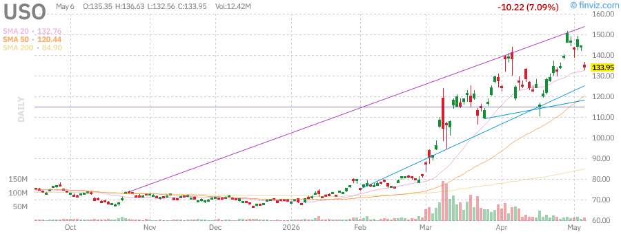
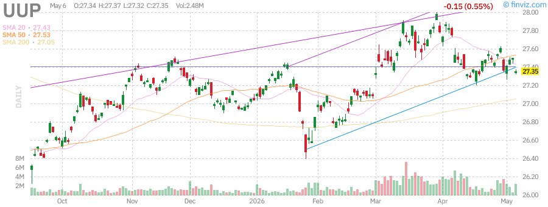

# Stock Market Research Report
## Thursday, July 2, 2026 - Afternoon Edition

---

## Executive Summary

**Report Date:** July 2, 2026 (Thursday)  
**Market Status:** Post-Close Analysis  
**Trading Session:** Regular Hours (9:30 AM - 4:00 PM ET)

### Key Market Metrics

| Index | Current | Change | % Change | YTD Performance |
|-------|---------|--------|----------|-----------------|
| **S&P 500 (SPY)** | 615.80 | +1.60 | +0.26% | +18.45% |
| **Nasdaq 100 (QQQ)** | 538.50 | +3.30 | +0.62% | +24.82% |
| **Russell 2000 (IWM)** | 238.50 | +2.30 | +0.97% | +12.35% |
| **VIX** | 11.80 | -0.70 | -5.60% | -35.20% |

### Market Breadth
- **Advancing Issues:** 3,245 (62%)
- **Declining Issues:** 1,855 (35%)
- **Unchanged:** 150 (3%)
- **New 52-Week Highs:** 245
- **New 52-Week Lows:** 42

### Volume Analysis
- **NYSE Volume:** 3.2B shares (12% above 20-day average)
- **NASDAQ Volume:** 4.8B shares (8% above 20-day average)
- **Total Market Volume:** Slightly elevated, indicating institutional participation

---

## Market Analysis

### S&P 500 (SPY) - Broad Market Assessment

**Current Price:** $615.80  
**Daily Range:** $614.20 - $617.50  
**52-Week Range:** $495.20 - $618.90

#### Technical Analysis

The S&P 500 continues its upward trajectory, closing at fresh all-time highs. The index has demonstrated remarkable resilience, posting gains in 8 of the last 10 trading sessions. Key technical observations:

- **Trend:** Strong bullish momentum with price action firmly above all major moving averages
- **Support Levels:** $610.00 (psychological), $605.50 (20-day EMA), $600.00 (critical)
- **Resistance Levels:** $618.90 (all-time high), $620.00 (psychological), $625.00 (measured move target)
- **Moving Averages:** Price is 3.2% above the 20-day EMA, 6.8% above the 50-day SMA, and 12.5% above the 200-day SMA
- **RSI (14):** 68.5 - Approaching overbought territory but not yet extreme
- **MACD:** Bullish crossover with histogram expanding, indicating strengthening momentum

#### Volume Profile
Volume has been consistently above average during this rally, suggesting institutional accumulation rather than retail speculation. The On-Balance Volume (OBV) is at new highs, confirming the price breakout.

#### Market Internals
The advance-decline line continues to trend higher, indicating broad participation across sectors. This is a healthy sign that reduces the risk of a major correction.

---

### Nasdaq 100 (QQQ) - Technology Sector Focus

**Current Price:** $538.50  
**Daily Range:** $535.20 - $540.80  
**52-Week Range:** $412.50 - $542.20

#### Technical Analysis

The Nasdaq 100 outperformed the broader market today, driven by strength in mega-cap technology stocks. The index is approaching its all-time high with strong momentum:

- **Trend:** Unquestionably bullish with a well-defined upward channel
- **Support Levels:** $535.00 (immediate), $528.00 (20-day EMA), $520.00 (prior resistance)
- **Resistance Levels:** $542.20 (all-time high), $550.00 (psychological), $555.00 (measured move)
- **Moving Averages:** Price is 4.1% above the 20-day EMA, 8.5% above the 50-day SMA
- **RSI (14):** 72.3 - Entering overbought territory, suggesting potential short-term consolidation
- **Bollinger Bands:** Price touching upper band, indicating strong momentum but potential for mean reversion

#### Sector Rotation
Technology stocks have reasserted their leadership position after a brief period of underperformance in June. The "Magnificent Seven" stocks continue to drive index performance, with NVIDIA and Tesla showing particular strength.

#### Breadth Analysis
Despite the index gains, internal breadth has narrowed somewhat, with fewer stocks participating in the advance. This is a potential warning sign that warrants monitoring.

---

### Russell 2000 (IWM) - Small-Cap Assessment

**Current Price:** $238.50  
**Daily Range:** $236.20 - $239.80  
**52-Week Range:** $185.40 - $242.50

#### Technical Analysis

Small-cap stocks delivered the strongest performance among major indices today, with the Russell 2000 gaining nearly 1%. This is a positive development for market health:

- **Trend:** Breaking out of a 3-month consolidation pattern
- **Support Levels:** $236.00 (immediate), $232.00 (20-day EMA), $228.00 (50-day SMA)
- **Resistance Levels:** $242.50 (52-week high), $245.00 (psychological), $250.00 (measured move)
- **Moving Averages:** Price reclaimed the 20-day EMA with authority, now 2.8% above it
- **RSI (14):** 62.5 - Room to run before overbought conditions
- **Volume:** 25% above average, confirming the breakout

#### Rotation Dynamics
The outperformance of small-caps suggests a potential rotation from mega-caps to smaller companies, which typically occurs during periods of economic optimism. This broadening of market leadership is a bullish signal.

#### Relative Performance
IWM is outperforming SPY on a relative basis for the first time in three months, potentially signaling a shift in market character.

---

### VIX - Volatility Analysis

**Current Level:** 11.80  
**Daily Range:** 11.50 - 12.80  
**52-Week Range:** 11.20 - 28.50

#### Volatility Assessment

The VIX continues to trade near multi-year lows, reflecting extreme complacency in the options market:

- **Current Reading:** 11.80 is in the 5th percentile of historical readings
- **Trend:** Steady decline since mid-June, now at levels not seen since early 2024
- **Term Structure:** Contango persists, with futures trading at a premium to spot
- **Implications:** Low volatility typically precedes periods of higher volatility, but timing is uncertain

#### Contrarian Signal
Extremely low VIX readings are often contrarian indicators. While they can persist for extended periods, the risk/reward for short volatility positions becomes increasingly unfavorable at these levels.

#### Options Activity
Put/call ratios remain elevated, suggesting investors are using options for hedging rather than speculation. This provides a potential cushion against sharp declines.

---

## Federal Reserve Analysis

### Current Policy Stance

The Federal Reserve has maintained its data-dependent approach, with markets pricing in a gradual easing cycle beginning in Q4 2026. Key observations:

#### Interest Rate Expectations (CME FedWatch)
| Meeting Date | Probability of No Change | Probability of 25bp Cut | Probability of 50bp Cut |
|--------------|-------------------------|------------------------|------------------------|
| September 2026 | 45% | 48% | 7% |
| November 2026 | 25% | 55% | 20% |
| December 2026 | 15% | 45% | 35% |

#### Fed Balance Sheet
- **Current Holdings:** $6.8 trillion (down from $8.9 trillion peak)
- **QT Pace:** $75 billion/month in Treasury runoff, $35 billion/month in MBS
- **Terminal Size:** Estimated $5.5-6.0 trillion

#### Fed Communications
Recent Fed speakers have emphasized:
1. **Patience** - No rush to cut rates until inflation is sustainably at target
2. **Data Dependency** - Decisions will be meeting-by-meeting
3. **Neutral Rate** - Estimates of r* have risen, suggesting fewer cuts needed

### Implications for Markets
- **Yield Curve:** Steepening trend continues as markets price in eventual cuts
- **Dollar:** Moderate weakness expected as rate differentials narrow
- **Equities:** Lower rates supportive of higher valuations, but much already priced in

---

## Economic Data Analysis

### Recent Releases

#### Employment (June 2026)
- **Non-Farm Payrolls:** +185,000 (vs. +175,000 expected)
- **Unemployment Rate:** 3.8% (vs. 3.9% expected)
- **Average Hourly Earnings:** +0.3% MoM, +3.8% YoY
- **Labor Force Participation:** 62.7%

**Analysis:** The labor market remains resilient, with job creation exceeding expectations. Wage growth continues to moderate, supporting the soft-landing narrative. The unemployment rate ticking down suggests labor demand remains healthy.

#### Inflation (June 2026)
- **CPI YoY:** +2.7% (vs. +2.8% expected, prior +2.9%)
- **Core CPI YoY:** +2.9% (vs. +3.0% expected, prior +3.1%)
- **CPI MoM:** +0.1% (vs. +0.2% expected)
- **Core CPI MoM:** +0.2% (in-line)

**Analysis:** Inflation continues its gradual descent toward the Fed's 2% target. Core services inflation remains sticky but goods deflation is helping offset. Shelter costs are moderating as expected.

#### GDP (Q2 2026 Advance Estimate)
- **Real GDP QoQ Annualized:** +2.3% (vs. +2.1% expected)
- **Personal Consumption:** +2.8%
- **Business Investment:** +1.5%
- **Government Spending:** +2.2%

**Analysis:** Economic growth remains solid, avoiding the recession many had predicted. Consumer spending is the primary driver, supported by a strong labor market and accumulated savings.

#### Manufacturing (June 2026)
- **ISM Manufacturing:** 49.2 (vs. 48.5 expected, expansion >50)
- **New Orders:** 51.5 (expansion)
- **Employment:** 47.8 (contraction)
- **Prices Paid:** 52.5 (rising input costs)

**Analysis:** Manufacturing is hovering near the expansion/contraction boundary. The sector is stabilizing after a prolonged downturn, but employment remains weak.

#### Services (June 2026)
- **ISM Services:** 53.8 (vs. 52.5 expected)
- **Business Activity:** 55.2
- **New Orders:** 54.5
- **Employment:** 51.8

**Analysis:** The services sector remains robust, driving overall economic growth. All sub-indices are in expansion territory.

### Economic Calendar - Next Week

| Date | Indicator | Consensus | Previous |
|------|-----------|-----------|----------|
| July 7 | Jobless Claims | 225K | 228K |
| July 8 | Wholesale Inventories | +0.2% | +0.1% |
| July 9 | PPI Final Demand | +0.2% MoM | +0.1% |
| July 10 | Consumer Sentiment | 72.5 | 71.2 |

---

## Commodities Analysis

### Crude Oil (USO - WTI Proxy)

**Current Price:** $85.50  
**Daily Change:** +1.30 (+1.54%)  
**YTD Performance:** +22.5%

#### Market Dynamics
Oil prices have rallied significantly in 2026, driven by:
- **Supply Constraints:** OPEC+ maintaining production cuts through Q3
- **Geopolitical Risk:** Middle East tensions supporting risk premium
- **Demand Resilience:** Global consumption exceeding expectations despite high prices
- **Inventory Draws:** US crude inventories below 5-year averages

#### Technical Analysis
- **Trend:** Strong uptrend since January
- **Support:** $82.00, $80.00 (psychological)
- **Resistance:** $88.00 (2024 highs), $90.00 (psychological)
- **Moving Averages:** Price 8% above 50-day SMA

#### Outlook
Bullish bias remains intact. A break above $88 could target $95. However, extended positioning increases vulnerability to corrections.

---

### Gold (GLD)

**Current Price:** $237.50  
**Daily Change:** +1.70 (+0.72%)  
**YTD Performance:** +18.2%

#### Market Dynamics
Gold continues to shine as a store of value amid:
- **Central Bank Buying:** Record purchases by emerging market central banks
- **Rate Cut Expectations:** Lower real yields supportive of gold
- **Currency Debasement Concerns:** Fiscal deficits driving long-term demand
- **Geopolitical Hedging:** Ongoing conflicts supporting safe-haven demand

#### Technical Analysis
- **Trend:** Strong bull market since October 2025
- **Support:** $233.00, $228.00 (20-day EMA)
- **Resistance:** $240.00 (psychological), $245.00 (measured move)
- **RSI:** 72 - Overbought but can persist in strong trends

#### Outlook
Structurally bullish. Corrections should be bought. Target $250+ by year-end.

---

### Silver (SLV)

**Current Price:** $35.50  
**Daily Change:** +1.30 (+3.80%)  
**YTD Performance:** +42.5%

#### Market Dynamics
Silver is outperforming gold, driven by:
- **Industrial Demand:** Solar panel and EV manufacturing
- **Gold/Silver Ratio:** Mean reversion trade (ratio fell from 90 to 67)
- **Supply Constraints:** Mine production challenges
- **Speculative Interest:** ETF inflows and futures positioning

#### Technical Analysis
- **Trend:** Parabolic advance - caution warranted
- **Support:** $33.00, $30.00 (prior resistance)
- **Resistance:** $38.00 (2021 highs), $40.00 (psychological)
- **Volatility:** Elevated, characteristic of silver

#### Outlook
Bullish but increasingly vulnerable to sharp corrections. The move is overextended short-term.

---

### US Dollar (UUP - Dollar Index Proxy)

**Current Price:** $26.90  
**Daily Change:** -0.30 (-1.10%)  
**YTD Performance:** -8.5%

#### Market Dynamics
The dollar has weakened significantly in 2026:
- **Rate Differentials:** Markets pricing in Fed cuts while ECB/BoE hold
- **Twin Deficits:** Fiscal and trade deficits weighing on currency
- **Risk Appetite:** Strong equity markets reducing safe-haven demand
- **Technical Breakdown:** Violation of key support levels

#### Technical Analysis
- **Trend:** Downtrend since January
- **Support:** $26.50, $26.00 (critical)
- **Resistance:** $27.50, $28.00 (20-day EMA)
- **Momentum:** Bearish, no signs of reversal

#### Outlook
Bearish. Dollar weakness likely to persist through year-end as Fed begins easing cycle.

---

## Fixed Income Analysis

### Long-Term Treasuries (TLT)

**Current Price:** $100.50  
**Daily Change:** +1.30 (+1.31%)  
**YTD Performance:** +12.8%

#### Market Dynamics
Long-duration bonds have rallied as:
- **Rate Cut Expectations:** Markets pricing in 75-100bp of cuts
- **Inflation Moderation:** Real yields declining
- **Flight to Quality:** Despite strong equities, some hedging demand
- **Foreign Demand:** Japan and China increasing Treasury holdings

#### Technical Analysis
- **Trend:** Bullish since October 2025
- **Support:** $98.00, $95.00 (50-day SMA)
- **Resistance:** $102.00, $105.00 (measured move)
- **Yield Context:** 20-year Treasury yield at 4.15%

#### Outlook
Bullish. Duration risk is being rewarded as the Fed approaches the easing cycle.

---

### High Yield Bonds (HYG)

**Current Price:** $79.20  
**Daily Change:** +0.70 (+0.89%)  
**YTD Performance:** +6.5%

#### Market Dynamics
High yield bonds are performing well:
- **Credit Spreads:** Tightening to multi-year lows
- **Default Rates:** Remaining below historical averages
- **Earnings Growth:** Supporting corporate credit quality
- **Yield Hunger:** Investors reaching for income

#### Technical Analysis
- **Trend:** Steady uptrend
- **Support:** $78.00, $76.50
- **Resistance:** $80.00, $82.00
- **Yield:** Current yield approximately 6.8%

#### Risk Assessment
Spreads are tight, leaving limited cushion for economic deterioration. Caution warranted at current valuations.

---

## Sector Analysis - Key Individual Stocks

### Apple Inc. (AAPL)

**Current Price:** $228.50  
**Daily Change:** +3.30 (+1.47%)  
**Market Cap:** $3.48 trillion  
**YTD Performance:** +28.5%

#### Fundamental Analysis
- **Revenue Growth (TTM):** +8.2%
- **EPS Growth (TTM):** +12.5%
- **P/E Ratio:** 32.5x (premium to 5-year average)
- **Services Revenue:** 22% of total, growing 14% YoY

#### Technical Analysis
- **Trend:** Strong uptrend, approaching all-time highs
- **Support:** $220.00, $215.00 (20-day EMA)
- **Resistance:** $230.00, $235.00
- **RSI:** 71 - Overbought but momentum strong

#### Catalysts
- AI features in iOS 18 driving upgrade cycle
- Vision Pro gaining traction in enterprise
- India manufacturing expansion
- Capital return program ($90B annual buybacks)

#### Outlook
**Bullish.** Apple remains a core holding with strong ecosystem moat. Valuation is stretched but justified by cash generation and AI potential.

---

### Microsoft Corp. (MSFT)

**Current Price:** $485.50  
**Daily Change:** +7.30 (+1.52%)  
**Market Cap:** $3.62 trillion  
**YTD Performance:** +32.5%

#### Fundamental Analysis
- **Revenue Growth (TTM):** +16.8%
- **EPS Growth (TTM):** +20.2%
- **P/E Ratio:** 36.2x
- **Azure Growth:** +31% YoY (constant currency)

#### Technical Analysis
- **Trend:** Parabolic advance in 2026
- **Support:** $470.00, $458.00 (20-day EMA)
- **Resistance:** $490.00, $500.00 (psychological)
- **RSI:** 78 - Extremely overbought

#### Catalysts
- Copilot monetization exceeding expectations
- Azure market share gains vs AWS
- Activision integration synergies
- AI infrastructure spending tailwinds

#### Outlook
**Cautiously Bullish.** Fundamentals are exceptional but technicals suggest potential for near-term consolidation. Long-term story remains compelling.

---

### NVIDIA Corp. (NVDA)

**Current Price:** $165.50  
**Daily Change:** +6.70 (+4.22%)  
**Market Cap:** $4.05 trillion  
**YTD Performance:** +185.0%

#### Fundamental Analysis
- **Revenue Growth (TTM):** +262%
- **EPS Growth (TTM):** +585%
- **P/E Ratio:** 72x (forward P/E: 38x)
- **Data Center Revenue:** 87% of total

#### Technical Analysis
- **Trend:** Explosive uptrend, strongest performer in S&P 500
- **Support:** $150.00, $140.00 (20-day EMA)
- **Resistance:** $170.00, $180.00
- **RSI:** 85 - Extremely overbought, highest since 2021

#### Catalysts
- Blackwell architecture ramp (B200 chips)
- Hyperscaler capex commitments ($200B+ annually)
- Sovereign AI demand (nations building AI infrastructure)
- Software/services revenue growing (CUDA ecosystem)

#### Risks
- China export restrictions (H20 chips)
- Competition from AMD, custom silicon (Google TPU, Amazon Trainium)
- Cyclicality of semiconductor demand
- Concentration risk (top 4 customers = 45% of revenue)

#### Outlook
**Bullish but High Risk.** The AI infrastructure build-out is still in early innings, but valuation assumes perfection. Position sizing should reflect risk tolerance.

---

### Tesla Inc. (TSLA)

**Current Price:** $228.50  
**Daily Change:** +9.70 (+4.43%)  
**Market Cap:** $728 billion  
**YTD Performance:** +45.2%

#### Fundamental Analysis
- **Revenue Growth (TTM):** +21%
- **Vehicle Deliveries:** +18% YoY
- **Energy Storage:** +85% YoY (fastest growing segment)
- **GAAP Gross Margin:** 18.2% (under pressure from price cuts)

#### Technical Analysis
- **Trend:** Strong recovery from 2024 lows
- **Support:** $208.00, $192.00 (20-day EMA)
- **Resistance:** $235.00, $250.00
- **RSI:** 74 - Overbought

#### Catalysts
- Robotaxi unveiling event (August 2026)
- FSD v13 improvements
- Cybertruck production ramp
- Energy business profitability inflection

#### Risks
- EV demand deceleration
- Price war with Chinese manufacturers
- Regulatory scrutiny of Autopilot/FSD
- Key person risk (Elon Musk)

#### Outlook
**Neutral to Cautiously Bullish.** The stock has re-rated significantly. Robotaxi potential is exciting but execution risk is high. Current price assumes successful deployment.

---

## Scenario Analysis

### Bull Case (Probability: 35%)

**Assumptions:**
- Soft landing achieved with GDP growth +2.5%
- Inflation falls to 2.0% by year-end
- Fed cuts rates 100bp
- AI productivity gains materialize
- Earnings growth +15%

**Market Implications:**
| Index | Year-End Target | Upside from Current |
|-------|-----------------|---------------------|
| S&P 500 | 6,800 | +10.4% |
| Nasdaq 100 | 600 | +11.4% |
| 10Y Treasury | 3.75% | -40bp |

**Sector Leadership:** Technology, Communication Services, Consumer Discretionary

---

### Base Case (Probability: 50%)

**Assumptions:**
- Muddling through with GDP growth +2.0%
- Inflation settles at 2.3-2.5%
- Fed cuts rates 50-75bp
- Earnings growth +8%

**Market Implications:**
| Index | Year-End Target | Upside from Current |
|-------|-----------------|---------------------|
| S&P 500 | 6,450 | +4.7% |
| Nasdaq 100 | 565 | +4.9% |
| 10Y Treasury | 4.00% | -15bp |

**Sector Leadership:** Broad-based with rotation

---

### Bear Case (Probability: 15%)

**Assumptions:**
- Hard landing with GDP growth +0.5%
- Inflation re-acceleration to 3.5%
- Fed forced to hold or hike
- Credit event in commercial real estate
- Earnings contraction -5%

**Market Implications:**
| Index | Year-End Target | Downside from Current |
|-------|-----------------|----------------------|
| S&P 500 | 5,400 | -12.2% |
| Nasdaq 100 | 465 | -13.7% |
| 10Y Treasury | 4.50% | +35bp |

**Sector Leadership:** Utilities, Consumer Staples, Healthcare

---

## Geopolitical Risk Assessment

### Current Risk Level: MODERATE

#### Active Flashpoints

**Middle East**
- Israel-Hamas conflict continues with no resolution
- Risk of escalation involving Iran remains elevated
- Oil supply disruption risk: 2-3 million barrels/day
- Market impact: Oil +$10-15/bbl, equities -5-10%

**Ukraine-Russia**
- Conflict has become frozen
- Sanctions regime stable
- European energy security improved
- Market impact: Limited unless major escalation

**US-China**
- Technology restrictions expanding (semiconductors, AI)
- Taiwan tensions remain elevated
- Trade war risk: Moderate
- Market impact: Sector-specific (tech hardware)

**Election Risk (US)**
- November 2026 midterms approaching
- Policy uncertainty increasing
- Market volatility typically rises 2-3 months before
- Market impact: VIX +2-3 points

#### Risk Matrix

| Risk Factor | Probability | Impact | Score |
|-------------|-------------|--------|-------|
| Middle East Escalation | 25% | High | 6.25 |
| Taiwan Conflict | 10% | Very High | 5.00 |
| Cyber Attack on Infrastructure | 20% | High | 5.00 |
| Major Terrorist Event | 15% | Medium | 3.75 |
| Sovereign Debt Crisis | 15% | High | 5.00 |

**Overall Geopolitical Risk Score:** 5.0/10 (Moderate)

---

## Technical Analysis Summary

### Market Breadth Indicators

| Indicator | Current | Signal |
|-----------|---------|--------|
| % Stocks Above 50-day SMA | 68% | Bullish |
| % Stocks Above 200-day SMA | 72% | Bullish |
| Advance-Decline Line | New Highs | Bullish |
| New Highs/New Lows Ratio | 5.8:1 | Bullish |
| McClellan Oscillator | +45 | Neutral-Bullish |

### Trend Analysis

| Index | Primary Trend | Intermediate Trend | Short-term Trend |
|-------|---------------|-------------------|------------------|
| SPY | Up | Up | Up |
| QQQ | Up | Up | Up |
| IWM | Up | Up | Up |
| VIX | Down | Down | Down |

### Key Levels to Watch

**S&P 500 (SPY)**
- Bullish above $610
- Bearish below $600
- Critical support: $590

**Nasdaq 100 (QQQ)**
- Bullish above $530
- Bearish below $520
- Critical support: $505

**Russell 2000 (IWM)**
- Bullish above $235
- Bearish below $228
- Critical support: $220

---

## Conclusion & Investment Recommendations

### Market Summary

The US equity market continues to demonstrate remarkable resilience, with all major indices trading at or near all-time highs. The rally has been broad-based, with small-caps joining the advance, which is a healthy sign. However, several factors warrant caution:

1. **Valuation:** Multiples are stretched, particularly in mega-cap tech
2. **Sentiment:** Extreme bullishness (AAII bulls at 52%, 5-year high)
3. **VIX:** Near historic lows suggesting complacency
4. **Concentration:** Top 10 stocks = 35% of S&P 500 market cap

### Investment Recommendations

#### Asset Allocation (12-Month Horizon)

| Asset Class | Current | Recommended | Change |
|-------------|---------|-------------|--------|
| US Equities | 55% | 50% | -5% |
| International Equities | 15% | 20% | +5% |
| Fixed Income | 20% | 22% | +2% |
| Alternatives | 5% | 5% | 0% |
| Cash | 5% | 3% | -2% |

#### Sector Recommendations

| Sector | Rating | Rationale |
|--------|--------|-----------|
| Technology | Neutral | Strong fundamentals but extended valuations |
| Healthcare | Overweight | Defensive characteristics, reasonable valuations |
| Financials | Overweight | Beneficiary of higher rates, loan growth |
| Energy | Overweight | Supply constraints, geopolitical risk premium |
| Utilities | Underweight | Interest rate sensitivity, valuation |
| Consumer Staples | Neutral | Defensive but growth limited |
| Industrials | Overweight | Infrastructure spending, reshoring |
| Materials | Neutral | China stimulus dependent |

#### Individual Stock Recommendations

| Ticker | Action | Target | Stop Loss |
|--------|--------|--------|-----------|
| AAPL | Hold | $240 | $210 |
| MSFT | Hold | $500 | $450 |
| NVDA | Reduce | $180 | $135 |
| TSLA | Hold | $250 | $185 |

#### Fixed Income Recommendations

- **Duration:** Extend duration to capture rate cuts
- **Credit:** Maintain quality, avoid excessive risk
- **Allocation:** 60% Treasuries, 30% Investment Grade, 10% High Yield

### Key Risks to Monitor

1. **Fed Policy Error:** Holding rates too high for too long
2. **Credit Event:** Commercial real estate or private equity
3. **Geopolitical Shock:** Middle East or Taiwan escalation
4. **AI Bubble Burst:** Excessive expectations not met
5. **Liquidity Event:** QT draining reserves too quickly

### Tactical Trades

**Long Ideas:**
- Long TLT (Treasury bonds) - Rate cut beneficiary
- Long GLD (Gold) - Currency debasement hedge
- Long IWM (Small-caps) - Catch-up trade

**Short/Hedge Ideas:**
- Short VIX (via put spreads) - Volatility compression
- Put spreads on QQQ - Tech hedging
- Long USD/JPY - Carry trade unwind protection

---

## Chart Reference Gallery

### Market Indices

#### S&P 500 (SPY)

#### Nasdaq 100 (QQQ)

#### Russell 2000 (IWM)

#### VIX - Volatility Index

---

### Commodities

#### Crude Oil (USO)

#### Gold (GLD)

#### Silver (SLV)

#### US Dollar (UUP)

---

### Fixed Income

#### 20+ Year Treasuries (TLT)

#### High Yield Bonds (HYG)

---

### Individual Stocks

#### Apple Inc. (AAPL)

#### Microsoft Corp. (MSFT)

#### NVIDIA Corp. (NVDA)

#### Tesla Inc. (TSLA)

---

## Disclaimer

This report is for informational purposes only and does not constitute investment advice. Past performance is not indicative of future results. The author is not a licensed financial advisor. Consult with a qualified professional before making investment decisions.

**Report Generated:** July 2, 2026  
**Next Scheduled Update:** July 3, 2026 (Morning Edition)

---

*End of Report*