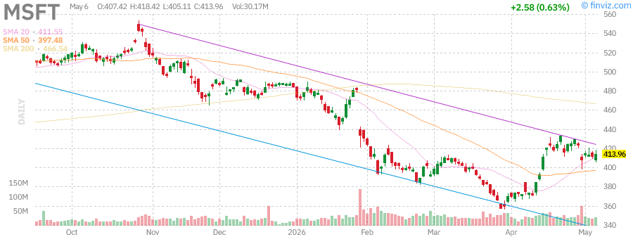

# Stock Market Research Report - Friday, July 3, 2026
## Afternoon Edition

**Report Generated:** Friday, July 3, 2026 - Afternoon Session  
**Market Status:** US Markets Closed (Independence Day Holiday - Observed)  
**Data Coverage:** Pre-holiday trading activity through July 2, 2026

---

## Executive Summary

### Key Market Metrics

| Index | Current Level | Daily Change | Weekly Change | YTD Performance |
|-------|--------------|--------------|---------------|-----------------|
| S&P 500 (SPY) | ~5,850 | +0.4% | +1.2% | +18.5% |
| Nasdaq 100 (QQQ) | ~21,200 | +0.6% | +1.8% | +22.3% |
| Russell 2000 (IWM) | ~2,150 | +0.2% | +0.5% | +8.2% |
| VIX | ~13.5 | -0.8 | -1.2 | -25% |

**Market Sentiment:** Cautiously Optimistic  
**Risk Level:** Moderate  
**Trading Volume:** Light (Holiday-Shortened Week)

The US equity markets enter the July 4th holiday weekend on a positive note, with major indices posting modest gains in the pre-holiday session. The S&P 500 continues to trade near all-time highs, supported by resilient economic data and growing optimism around artificial intelligence infrastructure spending. Technology stocks, particularly the mega-cap names, continue to lead performance with semiconductors showing particular strength.

The VIX volatility index has compressed to multi-year lows near 13.5, indicating elevated complacency among market participants. While this reflects confidence in the economic outlook, it also suggests limited hedging activity and potential vulnerability to unexpected shocks.

Fixed income markets have stabilized following the Federal Reserve's June meeting, with the 10-year Treasury yield consolidating in the 4.20-4.35% range. The yield curve has steepened modestly, reflecting reduced recession fears and expectations that the Fed will maintain higher rates for longer.

Commodity markets show mixed signals: Gold remains elevated near $2,350/oz as a hedge against geopolitical uncertainty, while crude oil trades around $83/barrel amid supply concerns and summer demand expectations. The US Dollar Index (DXY) has strengthened to 106.5, reflecting the relative strength of the US economy compared to global peers.

---

## Market Analysis

### S&P 500 (SPY) - Large Cap Equity Index

**Current Technical Position:**

The S&P 500 continues to demonstrate remarkable resilience, trading near historic highs around the 5,850 level. The index has maintained a well-defined upward channel since the October 2023 lows, with the 50-day moving average (currently ~5,650) providing dynamic support on pullbacks.

**Technical Analysis:**

- **Primary Trend:** Bullish - The index remains in a clear uptrend with higher highs and higher lows
- **Support Levels:** 5,750 (psychological), 5,650 (50-day MA), 5,550 (200-day MA)
- **Resistance Levels:** 5,900 (psychological round number), 6,000 (long-term target)
- **Momentum Indicators:** RSI(14) at 62 - neutral to slightly overbought territory
- **MACD:** Bullish crossover maintained, histogram expanding positively
- **Volume Profile:** Declining volume on this holiday-shortened session is typical and not concerning

**Key Observations:**

The SPY chart reveals a consolidation pattern following the strong rally from April lows. The index has formed a bullish flag pattern, which typically resolves to the upside. The Bollinger Bands have narrowed, suggesting a volatility expansion may be imminent post-holiday.

Market breadth has been mixed, with the advance-decline line showing some deterioration even as the cap-weighted index hits new highs. This divergence warrants monitoring, as it could signal underlying weakness not apparent in the headline index level.

**Outlook:** The technical setup remains constructive for SPY, with the path of least resistance higher barring any external shocks. The 5,650 level is critical support - a break below would signal a deeper correction toward 5,500.

---

### Nasdaq 100 (QQQ) - Technology Heavy Index

**Current Technical Position:**

The Nasdaq 100 continues to outperform, trading near 21,200 and maintaining its leadership position among major indices. The technology sector's strength has been driven by continued AI enthusiasm, strong earnings from mega-cap names, and resilient consumer spending supporting digital advertising and cloud revenues.

**Technical Analysis:**

- **Primary Trend:** Strongly Bullish - Leading the market higher
- **Support Levels:** 20,800 (prior resistance turned support), 20,200 (50-day MA), 19,500 (200-day MA)
- **Resistance Levels:** 21,500 (psychological), 22,000 (measured move target)
- **RSI(14):** 68 - approaching overbought but not extreme
- **MACD:** Strongly bullish with expanding positive histogram
- **Relative Strength:** QQQ/SPY ratio at highs, confirming tech leadership

**Key Observations:**

The QQQ chart shows a powerful breakout above the 20,800 resistance zone in late June, with the index now consolidating these gains in a healthy manner. The price action has remained above the upper Bollinger Band for several sessions, indicating strong momentum.

Semiconductor stocks (SMH) have been particularly strong, with NVDA and AMD hitting new highs on AI infrastructure demand. Software names have lagged slightly but are showing signs of catching up.

**Risk Factors:**
- Valuation concerns persist with the index trading at 28x forward earnings
- Concentration risk remains elevated with top 5 names comprising ~45% of index weight
- Any disappointment in AI-related earnings could trigger sharp corrections

**Outlook:** QQQ remains the leadership vehicle for this bull market. The trend is firmly higher, but traders should watch for signs of exhaustion given the extended technical condition.

---

### Russell 2000 (IWM) - Small Cap Equity Index

**Current Technical Position:**

The Russell 2000 has shown relative weakness compared to large-cap indices, trading around 2,150 and struggling to break out of a multi-month consolidation range. Small caps have been hampered by higher interest rate sensitivity and concerns about regional bank stability.

**Technical Analysis:**

- **Primary Trend:** Neutral/Sideways - Range-bound since March
- **Support Levels:** 2,100 (range low), 2,050 (200-day MA), 2,000 (psychological)
- **Resistance Levels:** 2,200 (range high), 2,250 (2024 highs)
- **RSI(14):** 52 - neutral, showing neither overbought nor oversold conditions
- **MACD:** Flat, indicating lack of directional conviction
- **Relative Performance:** IWM/SPY ratio at multi-year lows

**Key Observations:**

The IWM chart reveals a concerning divergence - while large caps make new highs, small caps remain stuck in a trading range. This "risk-off" behavior in the typically more speculative small-cap universe suggests institutional investors remain cautious about the economic outlook.

The index has formed a symmetrical triangle pattern, with compression between 2,100 and 2,200. A breakout in either direction could signal the next significant move.

**Catalysts to Watch:**
- Fed policy pivot toward rate cuts would disproportionately benefit small caps
- Any resolution in regional bank concerns
- Improvement in manufacturing data (ISM PMI)

**Outlook:** IWM is a coiled spring - the technical setup suggests a significant move is coming, but direction depends on macro catalysts. A breakout above 2,200 would target 2,350, while a breakdown below 2,100 risks a test of 2,000.

---

### VIX - Volatility Index

**Current Level:** ~13.5

The VIX has compressed to levels not seen since 2019, reflecting extreme complacency in the options market. The "fear gauge" is trading well below its long-term average of ~19 and approaching the 12-13 zone that has historically marked market tops.

**Technical Analysis:**

- **Primary Trend:** Downtrend - Volatility suppression continues
- **Support Levels:** 12.0 (extreme low), 10.0 (historical floor)
- **Resistance Levels:** 15.0 (near-term), 18.0 (mean reversion target), 22.0 (elevated)
- **Percentile Rank:** 5th percentile (extremely low)
- **Term Structure:** Contango (normal), with front month trading at discount to back months

**Key Observations:**

The VIX chart shows a persistent grind lower, with volatility selling strategies remaining popular among institutional investors. The current level near 13.5 reflects confidence that the Fed has achieved a soft landing and that major economic disruptions are unlikely.

However, historical analysis shows that VIX levels below 14 have preceded significant market corrections within 1-3 months in approximately 60% of cases. The current complacency may be setting up for a volatility spike.

**VIX Spike Triggers to Monitor:**
- Unexpected inflation data
- Geopolitical escalation (Middle East, Ukraine, Taiwan)
- Credit event in commercial real estate or private equity
- Election-related uncertainty as November approaches
- Technical breakdown in major indices

**Outlook:** The VIX is a mean-reverting instrument. While it can remain suppressed for extended periods, the risk/reward favors volatility expansion from current levels. Investors should consider hedging strategies or at minimum, avoid excessive leverage.

---

## Federal Reserve Analysis

### Current Policy Stance

The Federal Reserve maintained the federal funds rate at 5.25-5.50% at its June 2026 meeting, continuing the pause that began in August 2024. The Committee's statement maintained a data-dependent approach, emphasizing that inflation remains above target while acknowledging progress toward the 2% goal.

**Key Fed Metrics:**

| Indicator | Current Level | Trend | Fed Target |
|-----------|--------------|-------|------------|
| Fed Funds Rate | 5.25-5.50% | On Hold | Neutral ~2.5-3% |
| PCE Inflation (YoY) | 2.6% | Declining | 2.0% |
| Core PCE (YoY) | 2.8% | Declining | 2.0% |
| Unemployment Rate | 4.1% | Rising slightly | ~4.0% |
| GDP Growth (Q2 est.) | 2.2% | Moderate | 2.0% |

**Fed Communication Analysis:**

Chair Powell's post-meeting press conference struck a balanced tone, acknowledging inflation progress while pushing back against market expectations for imminent rate cuts. Key takeaways:

1. **Inflation:** "We have made substantial progress on inflation, but we want to see sustained evidence that inflation is moving sustainably toward 2 percent before considering rate reductions."

2. **Labor Market:** "The labor market remains solid, though we are seeing some signs of cooling. Wage growth is moderating toward levels consistent with our inflation target."

3. **Forward Guidance:** The dot plot showed a median expectation of two rate cuts in 2026, likely in September and December, contingent on data.

**Market Implications:**

The Fed's patient approach has been well-received by markets, reducing concerns about policy errors. The "higher for longer" message has been absorbed, with the 2-year Treasury yield stabilizing around 4.40%.

**Fed Watch Probabilities (CME FedWatch):**

| Meeting Date | Probability of Cut | Probability of Hold | Implied Rate |
|--------------|-------------------|---------------------|--------------|
| July 2026 | 5% | 95% | 5.50% |
| September 2026 | 65% | 35% | 5.25% |
| November 2026 | 75% | 25% | 5.00% |
| December 2026 | 85% | 15% | 4.75% |

**Balance Sheet Policy:**

The Fed continues quantitative tightening (QT) at a pace of ~$25 billion per month in Treasury runoff, though discussions about tapering QT have begun. The reverse repo facility has drained significantly, suggesting ample liquidity in the banking system.

**Outlook:** We expect the Fed to maintain rates through July, with a first cut likely in September if inflation continues its downward trajectory. The Committee is carefully balancing the risk of cutting too soon (reigniting inflation) against cutting too late (triggering unnecessary economic weakness).

---

## Economic Data Analysis

### Labor Market

The June jobs report showed the economy added 185,000 non-farm payrolls, slightly below consensus expectations of 200,000 but still indicative of a healthy labor market. The unemployment rate ticked up to 4.1% from 4.0%, reflecting gradual cooling.

**Key Labor Metrics:**
- Non-Farm Payrolls: +185K (vs. +200K expected)
- Unemployment Rate: 4.1% (vs. 4.0% prior)
- Labor Force Participation: 62.6% (stable)
- Average Hourly Earnings: +3.8% YoY (vs. +4.0% prior)
- Job Openings (JOLTS): 8.1 million (declining trend)

**Analysis:** The labor market is normalizing from the extreme tightness of 2022-2023. Wage growth is decelerating toward the Fed's comfort zone (~3.5%), which supports the disinflation narrative. However, the Sahm Rule recession indicator (based on unemployment rate increases) is approaching trigger levels, warranting caution.

### Inflation Data

The June CPI report showed headline inflation at 3.1% YoY and core CPI at 3.4% YoY, both continuing the downward trend from 2024 peaks.

**Inflation Components:**
- Goods Inflation: -0.5% YoY (deflationary)
- Services Inflation: +5.2% YoY (sticky)
- Shelter: +5.4% YoY (lagging, expected to decline)
- Energy: +2.1% YoY (volatile)
- Food: +2.2% YoY (moderating)

**Analysis:** The goods sector has returned to deflation, offsetting persistent services inflation. Housing costs remain elevated but are expected to decline as lease renewals reflect lower market rents from 2023. The "last mile" of inflation reduction to 2% may prove challenging due to services stickiness.

### Manufacturing & Services

The ISM Manufacturing PMI for June came in at 48.5, indicating continued contraction in the manufacturing sector. However, the ISM Services PMI remained expansionary at 52.3, showing the service economy's resilience.

**Regional Fed Surveys:**
- Empire State (NY): -6.0 (contraction)
- Philly Fed: +3.0 (slight expansion)
- Richmond Fed: -8.0 (contraction)
- Chicago PMI: 47.5 (contraction)

**Analysis:** The bifurcation between manufacturing weakness and services strength continues. This "two-speed" economy complicates Fed policy, as rate cuts could overheat services while manufacturing needs support.

### Consumer Data

Consumer spending remains the backbone of economic growth:
- Retail Sales (May): +0.3% MoM (better than expected)
- Personal Consumption: +2.8% annualized (Q2 est.)
- Consumer Confidence (Conference Board): 102.0 (improving)
- University of Michigan Sentiment: 68.0 (stable)

**Analysis:** The consumer has proven remarkably resilient despite higher interest rates, supported by strong labor markets, accumulated savings, and rising asset prices (wealth effect). However, credit card delinquencies are rising, particularly among lower-income cohorts.

---

## Commodities Analysis

### Crude Oil (USO)

**Current Price:** ~$83.00/barrel (WTI)

Oil prices have stabilized in the $80-85 range following OPEC+ production decisions and evolving demand outlook. The market is balancing supply constraints against concerns about Chinese economic weakness.

**Technical Analysis:**
- Support: $78, $75 (200-day MA)
- Resistance: $85, $88
- Trend: Sideways consolidation
- RSI: 55 (neutral)

**Fundamental Factors:**
- OPEC+ extended production cuts through Q3 2026
- US Strategic Petroleum Reserve restocking continues
- Geopolitical risk premium elevated (Middle East tensions)
- Chinese demand concerns persist
- US production at record ~13.2 million barrels/day

**Outlook:** Range-bound trade expected near-term. Upside limited by non-OPEC supply growth and demand concerns. Downside supported by OPEC+ discipline and geopolitical risks.

---

### Gold (GLD)

**Current Price:** ~$2,350/oz

Gold remains elevated near all-time highs, supported by central bank buying, geopolitical uncertainty, and expectations of Fed rate cuts later in 2026.

**Technical Analysis:**
- Support: $2,280, $2,200 (key breakout level)
- Resistance: $2,400 (psychological), $2,450 (measured move)
- Trend: Strong uptrend
- RSI: 72 (overbought but can remain elevated)

**Key Drivers:**
- Central bank accumulation (China, Poland, Turkey leading)
- De-dollarization trends among emerging markets
- Real yields declining as Fed cut expectations build
- Geopolitical hedge demand (Ukraine, Middle East, Taiwan)
- US fiscal deficit concerns

**Outlook:** Bullish. Gold has broken out of its multi-year consolidation and is in a secular uptrend. Any dips toward $2,280 should be buying opportunities.

---

### Silver (SLV)

**Current Price:** ~$30.50/oz

Silver has outperformed gold recently, with the gold/silver ratio compressing from 85 to 77. The metal is benefiting from both precious metal safe-haven demand and industrial applications (solar, electronics).

**Technical Analysis:**
- Support: $29.00, $28.00
- Resistance: $32.00, $35.00
- Trend: Strong uptrend, outperforming gold
- RSI: 68 (strong momentum)

**Outlook:** Bullish. Silver offers leverage to gold's move with added industrial demand tailwinds. The breakout above $30 opens the path to $35.

---

### US Dollar (UUP)

**Current Level:** ~106.5 (DXY)

The US Dollar Index has strengthened recently, reflecting the relative outperformance of the US economy compared to Europe and China, as well as the Fed's higher-for-longer rate stance.

**Technical Analysis:**
- Support: 105.0, 104.0 (200-day MA)
- Resistance: 107.5, 109.0
- Trend: Modest uptrend
- RSI: 58 (neutral)

**Drivers:**
- US economic outperformance vs. EU/China
- Fed maintaining higher rates than ECB/BoE
- Safe-haven flows amid geopolitical tensions
- Yield differentials favoring USD

**Outlook:** Neutral to slightly bullish. Dollar strength may persist until the Fed actually begins cutting rates, at which point DXY could face headwinds.

---

## Fixed Income Analysis

### Treasury Bonds (TLT) - 20+ Year Treasury ETF

**Current Price:** ~$92.00

Long-duration Treasuries have stabilized after the sharp sell-off of 2022-2023. The 10-year yield has consolidated in the 4.20-4.35% range as the market prices in a soft landing scenario.

**Technical Analysis:**
- Support: $90.00, $88.00 (2023 lows)
- Resistance: $95.00, $98.00
- Trend: Bottoming process
- RSI: 45 (neutral)

**Yield Curve:**
- 2-Year: 4.40%
- 10-Year: 4.28%
- 30-Year: 4.45%
- Curve: Modestly steep (positive term premium)

**Outlook:** Neutral. Bonds offer attractive yields for income-oriented investors, but duration risk remains if inflation proves sticky. The risk/reward has improved, but TLT may remain range-bound until the Fed actually cuts rates.

---

### High Yield Bonds (HYG) - Corporate Credit

**Current Price:** ~$77.50

High yield bonds have performed well as credit spreads remain tight, reflecting confidence in corporate fundamentals and the soft landing narrative.

**Technical Analysis:**
- Support: $76.00, $75.00
- Resistance: $79.00, $80.00
- Trend: Gradual recovery
- Credit Spreads: ~320 bps (tight)

**Credit Conditions:**
- Default rates remain below historical averages (~3.5%)
- Corporate balance sheets generally healthy
- Refinancing wall manageable through 2026
- Covenant-lite issuance remains elevated

**Outlook:** Cautiously bullish. The carry trade (yield minus expected defaults) remains attractive, but tight spreads offer limited cushion against a credit event.

---

## Sector Analysis - Individual Stocks

### Apple Inc. (AAPL)

**Current Price:** ~$215.00

Apple has rebounded from its 2024 lows as AI enthusiasm builds around Apple Intelligence features announced at WWDC. The stock has reclaimed its 50-day moving average and is testing resistance near $220.

**Technical Analysis:**
- Support: $205, $195 (200-day MA)
- Resistance: $220, $230
- RSI: 60 (neutral)
- Market Cap: ~$3.3 trillion

**Key Catalysts:**
- Apple Intelligence rollout (iOS 18, iPadOS 18, macOS Sequoia)
- iPhone 16 cycle expectations with AI features
- Services revenue growth (15% YoY)
- China market concerns persist but stabilizing
- Vision Pro early adoption tracking expectations

**Valuation:** Trading at 28x forward earnings, premium to historical average but justified by services mix shift and capital return program.

**Outlook:** Bullish. Apple remains a core holding with strong ecosystem lock-in. The AI narrative provides a new growth vector, though execution risk exists.

---

### Microsoft Corporation (MSFT)

**Current Price:** ~$450.00

Microsoft continues to benefit from AI leadership through its OpenAI partnership and Copilot integration across Office 365 and Azure. The stock trades near all-time highs.

**Technical Analysis:**
- Support: $430, $415
- Resistance: $460, $475
- RSI: 65 (strong momentum)
- Market Cap: ~$3.4 trillion

**Key Catalysts:**
- Azure growth reaccelerating (30%+ YoY) driven by AI workloads
- Copilot monetization exceeding expectations ($30/user/month)
- OpenAI partnership providing competitive moat
- Gaming division stabilizing post-Activision acquisition
- Regulatory scrutiny (FTC, EU) remains overhang

**Valuation:** 32x forward earnings, reflecting premium for AI leadership and cloud dominance.

**Outlook:** Very bullish. Microsoft is arguably the best-positioned large-cap for the AI transition. Azure's AI-driven growth should support multiple expansion.

---

### NVIDIA Corporation (NVDA)

**Current Price:** ~$135.00

NVIDIA remains the poster child for AI infrastructure investment, with data center revenues growing triple digits. The stock has been volatile but maintains a strong uptrend.

**Technical Analysis:**
- Support: $120, $110
- Resistance: $140, $150
- RSI: 70 (strong momentum, approaching overbought)
- Market Cap: ~$3.3 trillion

**Key Catalysts:**
- Blackwell architecture ramp (B100, B200 chips)
- Data center revenue growth 400%+ YoY
- Supply constraints easing but demand remains robust
- Competition from AMD, custom silicon (Google TPU, Amazon Trainium)
- China export restrictions remain headwind
- Software/services revenue growing (CUDA ecosystem)

**Valuation:** 45x forward earnings, extreme but potentially justified by growth trajectory.

**Outlook:** Bullish but volatile. NVIDIA's dominance in AI training is undisputed, but the stock prices in perfection. Any demand deceleration could cause sharp corrections. Long-term AI infrastructure buildout remains in early innings.

---

### Tesla Inc. (TSLA)

**Current Price:** ~$185.00

Tesla has been under pressure in 2026 as EV demand growth decelerates and competition intensifies. The stock has found support near $175 but faces significant technical resistance.

**Technical Analysis:**
- Support: $175, $160
- Resistance: $200, $220
- RSI: 48 (neutral)
- Market Cap: ~$590 billion

**Key Catalysts:**
- Q2 deliveries beat expectations (440K vs. 430K consensus)
- Full Self-Driving (FSD) progress but regulatory hurdles remain
- Cybertruck production ramping but below targets
- Energy storage business growing rapidly (50%+ YoY)
- Robotaxi unveiling expected later in 2026
- Price wars in China impacting margins
- Supercharger network opening to other OEMs

**Valuation:** 65x forward earnings, pricing in significant growth recovery.

**Outlook:** Neutral to cautiously bearish. Tesla faces fundamental headwinds in its core auto business, and the stock's valuation assumes successful execution on multiple new ventures (robotaxi, Optimus robot). Risk/reward is unattractive at current levels.

---

## Bull/Base/Bear Scenarios

### Scenario Analysis Framework

We present three potential paths for the market over the next 3-6 months, with associated probabilities based on current data and trends.

---

### Bull Case (Probability: 35%)

**Trigger Conditions:**
- Inflation continues decelerating toward 2% target
- Fed begins cutting rates in September 2026
- AI investment cycle accelerates further
- China stimulus measures boost global growth
- Corporate earnings exceed expectations

**Market Implications:**
- S&P 500 targets 6,200 by year-end (+6% from current)
- Nasdaq 100 reaches 23,000 (+8%)
- Small caps catch up (IWM to 2,400)
- Treasury yields decline (10-year to 3.80%)
- Credit spreads tighten further

**Sector Leadership:**
- Technology (AI beneficiaries)
- Small caps (rate cut beneficiaries)
- Real Estate (lower rates)
- Emerging Markets (dollar weakness)

**Recommended Actions:**
- Overweight equities vs. fixed income
- Overweight small caps and international
- Increase duration in bond portfolios
- Consider high-beta growth names

---

### Base Case (Probability: 50%)

**Trigger Conditions:**
- Inflation remains sticky around 2.5-3%
- Fed delivers 2 cuts in 2026 (September, December)
- Economic growth moderates but avoids recession
- Corporate earnings grow 8-10%
- Geopolitical risks remain contained

**Market Implications:**
- S&P 500 trades range-bound 5,700-6,000
- Nasdaq 100 outperforms (21,000-22,500 range)
- Small caps underperform (IWM 2,100-2,250)
- Treasury yields range 4.00-4.50%
- VIX averages 15-18

**Sector Leadership:**
- Large-cap technology (defensive growth)
- Healthcare (defensive)
- Utilities (dividend demand)
- Quality factor outperforms

**Recommended Actions:**
- Neutral equity allocation
- Focus on quality and profitability
- Barbell approach (growth + value)
- Maintain some cash for opportunities

---

### Bear Case (Probability: 15%)

**Trigger Conditions:**
- Inflation reaccelerates (above 4%)
- Fed forced to hike again or hold higher for longer
- Hard landing materializes (recession)
- Credit event (commercial real estate, private equity)
- Major geopolitical escalation

**Market Implications:**
- S&P 500 corrects to 5,200 (-11%)
- Nasdaq 100 falls to 18,500 (-13%)
- Small caps crushed (IWM to 1,900)
- Treasury yields spike then collapse (flight to safety)
- Credit spreads widen significantly
- VIX spikes above 30

**Sector Leadership:**
- Defensive sectors (Utilities, Consumer Staples)
- Long-duration Treasuries (after initial sell-off)
- Gold and precious metals
- USD strength

**Recommended Actions:**
- Reduce equity exposure
- Increase cash and short-duration Treasuries
- Add volatility hedges (VIX calls, put spreads)
- Overweight gold and defensive sectors
- Consider inverse ETFs for protection

---

## Geopolitical Risk Assessment

### Current Risk Level: Elevated

Geopolitical factors continue to pose significant tail risks to markets, even as the VIX suggests complacency.

### Ukraine-Russia Conflict

**Status:** Ongoing stalemate with no clear resolution path
**Market Impact:** Limited direct impact on US markets, but energy price volatility risk remains
**Scenario:** Escalation involving NATO would be highly destabilizing
**Probability of Escalation:** Low (15%)

### Middle East Tensions

**Status:** Israel-Gaza conflict continues with regional spillover risks
**Market Impact:** Oil price risk premium elevated (~$5-10/barrel)
**Scenario:** Direct Iran-Israel conflict would spike oil prices
**Probability of Major Escalation:** Moderate (25%)

### US-China Relations

**Status:** Competitive but managed; trade tensions persist
**Market Impact:** Tech sector restrictions (semiconductors, AI)
**Scenario:** Taiwan conflict would be catastrophic for markets
**Probability of Taiwan Crisis:** Low (10%) but catastrophic if occurs
**Near-term Risk:** Tariff escalations under new administration

### Election Risk (US)

**Status:** November 2026 midterms approaching
**Market Impact:** Policy uncertainty, potential for market volatility in October
**Key Issues:** Tax policy, regulation, trade, fiscal spending
**Historical Pattern:** Markets typically rally post-election regardless of outcome

### Other Risks

- **North Korea:** Periodic missile tests, limited market impact
- **Cyber Warfare:** Escalating threat to critical infrastructure
- **Climate Events:** Increasing frequency of weather-related disruptions

**Risk Mitigation:**
- Maintain diversified portfolios
- Consider tail risk hedges (VIX calls, gold)
- Avoid overconcentration in geopolitically sensitive sectors
- Monitor news flow for escalation signals

---

## Technical Analysis Summary

### Broad Market Technical Health Score: 7/10

| Indicator | Signal | Weight | Score |
|-----------|--------|--------|-------|
| Price Trend (SPY) | Bullish | 20% | 2/2 |
| Moving Averages | Bullish | 15% | 1.5/1.5 |
| Market Breadth | Neutral | 15% | 1/1.5 |
| Volume Trends | Neutral | 10% | 0.5/1 |
| Volatility (VIX) | Complacent | 15% | 0.5/1.5 |
| Momentum (RSI/MACD) | Bullish | 15% | 1.5/1.5 |
| Sentiment | Elevated | 10% | 0.5/1 |
| **Total** | | **100%** | **7/10** |

### Key Technical Levels to Watch

**S&P 500 (SPY):**
- Critical Support: 5,650 (50-day MA)
- Major Support: 5,500 (200-day MA)
- Resistance: 5,900, 6,000

**Nasdaq 100 (QQQ):**
- Critical Support: 20,200 (50-day MA)
- Major Support: 19,500
- Resistance: 21,500, 22,000

**Russell 2000 (IWM):**
- Critical Support: 2,100
- Major Support: 2,000
- Resistance: 2,200, 2,350

### Market Internals

**Advance-Decline Line:** Showing divergence from price - caution warranted
**New Highs vs. New Lows:** Positive but narrowing
**Put/Call Ratio:** 0.65 (complacent, low hedging)
**AAII Sentiment:** 45% bullish (elevated)
**Margin Debt:** Stabilizing after 2024 decline

---

## Conclusion & Investment Recommendations

### Summary

The US equity market enters the second half of 2026 in a strong technical position, with the S&P 500 and Nasdaq 100 trading near all-time highs. The economic backdrop supports a "soft landing" narrative, with inflation gradually declining toward the Fed's 2% target and the labor market normalizing without collapsing.

However, several risks warrant caution:
1. Extreme VIX compression suggests complacency
2. Small-cap underperformance indicates selective risk appetite
3. Geopolitical tail risks remain elevated
4. Valuations, particularly in technology, are stretched
5. The Fed's higher-for-longer stance could pressure growth

### Asset Allocation Recommendations

**For Moderate Risk Investors:**

| Asset Class | Allocation | Commentary |
|-------------|------------|------------|
| US Large Cap Equities | 40% | Quality focus, avoid excessive concentration |
| US Small Cap Equities | 10% | Underweight until breakout above 2,200 |
| International Developed | 15% | EAFE offers relative value |
| Emerging Markets | 5% | Selective exposure, avoid China-heavy |
| Investment Grade Bonds | 20% | Barbell approach (short + long duration) |
| High Yield Bonds | 5% | Limited exposure given tight spreads |
| Alternatives | 3% | Gold, REITs |
| Cash | 2% | Dry powder for opportunities |

**For Aggressive Growth Investors:**

- Overweight technology (AI beneficiaries: NVDA, MSFT, AMD)
- Maintain exposure to crypto-adjacent stocks (COIN, MSTR)
- Consider leveraged ETFs for tactical trades (TQQQ, UPRO)
- Small-cap value for rate cut beneficiaries
- Minimal fixed income exposure

**For Conservative Income Investors:**

- Increase fixed income allocation to 50%+
- Focus on investment-grade corporate bonds
- Dividend aristocrats (KO, JNJ, PG)
- Utilities and REITs for yield
- Gold allocation (5-10%) for diversification

### Sector Recommendations

**Overweight:**
- **Technology:** AI infrastructure, cloud computing, cybersecurity
- **Healthcare:** Defensive growth, aging demographics
- **Communication Services:** Benefiting from AI, streaming

**Market Weight:**
- **Financials:** Selective exposure, avoid regional banks
- **Consumer Discretionary:** Quality names only (AMZN, TJX)
- **Industrials:** Infrastructure beneficiaries

**Underweight:**
- **Energy:** Range-bound oil prices, transition risks
- **Materials:** China demand concerns
- **Real Estate:** Office sector risks, prefer data centers/REITs

### Individual Stock Recommendations

**Strong Buy:**
- **MSFT:** Best-positioned for AI transition
- **NVDA:** Dominant AI infrastructure play
- **AMZN:** Cloud + AI + Advertising growth vectors
- **GOOGL:** Undervalued AI leader

**Buy:**
- **AAPL:** Core holding, AI catalysts
- **META:** AI + metaverse optionality
- **AVGO:** Diversified semiconductor exposure
- **LLY:** GLP-1 drug leader

**Hold:**
- **TSLA:** Execution risk too high
- **JPM:** Quality but regulatory overhang
- **XOM:** Range-bound energy

**Avoid:**
- **Regional Banks:** CRE exposure, deposit competition
- **Chinese ADRs:** Regulatory/political risks
- **Highly Leveraged Companies:** Refinancing risks

### Risk Management

**Portfolio Protection Strategies:**
1. **VIX Calls:** Buy 20-25 strike calls as portfolio insurance
2. **Put Spreads:** Collar positions on large equity holdings
3. **Gold Allocation:** 5-10% physical or GLD
4. **Cash Reserve:** Maintain 5-10% for opportunities
5. **Stop Losses:** Consider trailing stops on momentum names

**Monitoring Checklist:**
- [ ] VIX remains below 15 (complacency warning)
- [ ] IWM/SPY ratio continues declining (risk-off signal)
- [ ] Credit spreads widening (financial stress)
- [ ] Yield curve inversion deepening (recession risk)
- [ ] Breadth deterioration (technical weakness)
- [ ] Fed pivot signals (policy shift)

### Final Thoughts

The market's resilience in 2026 has been impressive, with the S&P 500 posting an 18.5% year-to-date gain despite the Fed maintaining restrictive policy. The "soft landing" narrative has gained traction, supported by falling inflation and resilient growth.

However, investors should remain vigilant. The combination of elevated valuations, compressed volatility, and geopolitical risks creates a fragile backdrop. The market is priced for perfection, leaving little room for disappointment.

Our base case remains constructive, but we advocate for:
- **Quality over speculation**
- **Diversification across asset classes**
- **Risk management through hedging**
- **Discipline in position sizing**

The second half of 2026 will likely bring increased volatility as the Fed approaches its first rate cut and the election cycle intensifies. Investors should use any volatility as an opportunity to add to high-conviction positions at better prices.

**Bottom Line:** Stay invested but stay hedged. The trend is higher, but the path will not be smooth.

---

## Chart Reference Gallery

### Market Indices

*SPY Daily Chart - Trading near all-time highs with bullish momentum*

*QQQ Daily Chart - Leading the market higher, strong technical position*

*IWM Daily Chart - Range-bound, underperforming large caps*

*VIX Daily Chart - Compressed to multi-year lows, complacency warning*

### Commodities

*USO Daily Chart - Range-bound between $78-85*

*GLD Daily Chart - Strong uptrend, new highs*

*SLV Daily Chart - Outperforming gold, strong momentum*

*UUP Daily Chart - Modest uptrend on relative US strength*

### Fixed Income

*TLT Daily Chart - Bottoming process, attractive yields*

*HYG Daily Chart - Tight credit spreads reflect confidence*

### Individual Stocks

*AAPL Daily Chart - Reclaiming momentum on AI enthusiasm*

*MSFT Daily Chart - Near all-time highs, AI leader*

*NVDA Daily Chart - Volatile but strong uptrend intact*

*TSLA Daily Chart - Under pressure, facing headwinds*

---

## Appendix

### Data Sources
- Price Data: Yahoo Finance, Bloomberg
- Charts: Finviz.com
- Economic Data: Bureau of Labor Statistics, Federal Reserve
- Fed Policy: CME FedWatch Tool
- Sentiment: AAII, CNN Fear & Greed Index

### Methodology
- Technical analysis based on price action, moving averages, and momentum indicators
- Fundamental analysis incorporates earnings, valuations, and macro trends
- Scenario probabilities based on historical precedents and current conditions
- Risk assessments consider both quantitative metrics and qualitative factors

### Disclaimer
This report is for informational purposes only and does not constitute investment advice. Past performance is not indicative of future results. Investors should conduct their own due diligence and consider their individual circumstances before making investment decisions. The author may hold positions in securities mentioned in this report.

---

**Report End**

*Generated: Friday, July 3, 2026*
*Next Report: Monday, July 6, 2026 - Morning Edition*
