# Sunday, July 5, 2026 - Afternoon Stock Market Research Report

**Report Date:** Sunday, July 5, 2026  
**Prepared by:** Market Research Team  
**Report Type:** Comprehensive Afternoon Analysis

---

## Executive Summary

The U.S. stock market enters the second half of 2026 with mixed signals as investors navigate a complex landscape of Federal Reserve policy adjustments, persistent inflation concerns, and evolving geopolitical tensions. The S&P 500 (SPY) has demonstrated remarkable resilience throughout the first half of the year, posting gains of approximately 12.3% year-to-date despite facing headwinds from elevated interest rates and global economic uncertainty.

The technology sector continues to lead market performance, with the Nasdaq-100 (QQQ) outperforming broader indices, while small-cap stocks represented by the Russell 2000 (IWM) have lagged, reflecting investor preference for large-cap quality and liquidity. Market volatility, as measured by the VIX, remains relatively subdued at levels below the long-term average, suggesting complacency among investors that may warrant caution.

| Key Market Metrics | Current Level | YTD Change | 52-Week Range |
|-------------------|---------------|------------|---------------|
| S&P 500 (SPY) | ~$545.00 | +12.3% | $475.20 - $558.40 |
| Nasdaq-100 (QQQ) | ~$485.00 | +18.7% | $395.80 - $512.30 |
| Russell 2000 (IWM) | ~$198.00 | +4.5% | $168.40 - $215.60 |
| VIX | ~16.50 | -22.1% | $13.20 - $28.40 |
| Crude Oil (USO) | ~$95.50/bbl | +59.5% | $68.20 - $102.80 |
| Gold (GLD) | ~$2,380/oz | +15.2% | $1,980 - $2,485 |
| Silver (SLV) | ~$30.80/oz | +18.5% | $21.40 - $34.20 |
| U.S. Dollar (UUP) | ~$104.20 | +3.8% | $98.60 - $107.40 |
| 20+ Year Treasuries (TLT) | ~$92.50 | -8.2% | $85.40 - $102.80 |
| High Yield Bonds (HYG) | ~$76.80 | +2.1% | $72.30 - $79.40 |

---

## Federal Reserve Analysis

The Federal Reserve's monetary policy stance remains the primary driver of market sentiment as we progress through 2026. Following the final meeting of 2025, the Federal Reserve cut interest rates by 25 basis points to a range of 3.50% to 3.75%, bringing the total reduction since September 2024 to 175 basis points. This measured approach to monetary easing reflects the central bank's delicate balancing act between supporting economic growth and maintaining price stability.

The Fed's current policy trajectory suggests a continuation of gradual rate cuts throughout 2026, with market participants pricing in approximately 3-4 additional 25-basis-point reductions by year-end. This would bring the federal funds rate to a range of 2.75% to 3.00% by December 2026, approaching what many economists consider the neutral rate for the U.S. economy.

Federal Reserve Chair Jerome Powell has emphasized the data-dependent nature of future policy decisions, indicating that the pace of rate cuts will be influenced by incoming inflation data, labor market conditions, and broader economic indicators. The Fed's preferred inflation measure, the Core PCE Price Index, has shown gradual progress toward the 2% target, though sticky components such as shelter and services inflation continue to pose challenges.

The central bank's balance sheet normalization program continues in the background, with the Fed allowing Treasury and mortgage-backed securities to roll off at a measured pace. This quantitative tightening, combined with the elevated level of interest rates, has contributed to tighter financial conditions that are gradually working their way through the economy.

For investors, the Fed's dovish pivot represents a significant tailwind for risk assets, particularly those with longer-duration cash flows such as growth stocks and technology companies. However, the pace of rate cuts may be constrained if inflation proves more persistent than currently anticipated, creating potential volatility in rate-sensitive sectors.

---

## Economic Data Analysis

The U.S. economy continues to demonstrate remarkable resilience despite the restrictive monetary policy environment of the past two years. Gross Domestic Product (GDP) growth has maintained a steady pace, with the economy expanding at an annualized rate of approximately 2.1% in recent quarters. This growth, while moderating from the post-pandemic surge, remains above the economy's long-term potential, suggesting continued underlying strength.

The labor market remains robust, with the unemployment rate holding steady near 4.1%, a level consistent with full employment. Nonfarm payrolls have continued to expand, though the pace of job creation has moderated from the torrid pace of 2021-2022. Wage growth has shown signs of cooling, with average hourly earnings increasing at a year-over-year rate of approximately 3.8%, down from peaks above 5% in 2022 but still elevated by historical standards.

Inflation data has been encouraging, with the Consumer Price Index (CPI) moderating to approximately 2.9% year-over-year, down significantly from the 9.1% peak reached in June 2022. Core inflation, which excludes volatile food and energy prices, has been more persistent, running at approximately 3.4% year-over-year. The Fed's preferred measure, the Core PCE Price Index, has shown similar improvement but remains above the 2% target.

Housing market activity has stabilized following the sharp correction of 2022-2023, with existing home sales showing modest improvement and new home construction picking up as mortgage rates have declined from their peaks. The manufacturing sector has shown signs of recovery from the contraction experienced in 2024, with the ISM Manufacturing PMI returning to expansion territory.

Consumer spending, which accounts for approximately two-thirds of U.S. economic activity, has remained resilient, supported by strong household balance sheets, continued employment gains, and real wage growth as inflation moderates. Retail sales data has been mixed but generally positive, suggesting that consumers continue to support economic growth despite higher prices and interest rates.

---

## Market Analysis

### S&P 500 (SPY)

The S&P 500 has established a strong uptrend throughout 2026, with the index trading near all-time highs. The SPY ETF, which tracks the S&P 500 index, has benefited from broad-based participation across sectors, though technology and communication services have led the advance. Technical analysis reveals a well-defined upward channel with support at the 50-day moving average near $535 and resistance at the psychological $550 level.

The market's breadth has been constructive, with the percentage of stocks trading above their 200-day moving averages remaining above 60%, indicating healthy participation. However, valuations have become stretched by historical standards, with the S&P 500 trading at a forward price-to-earnings ratio of approximately 21x, above the 10-year average of 18x.

Earnings growth has been a key driver of the market's advance, with S&P 500 companies reporting year-over-year earnings growth of approximately 8.5% in the most recent quarter. This growth has been led by the technology sector, where artificial intelligence-related spending has driven significant revenue and profit expansion.

The technical picture for SPY remains bullish, with the ETF trading above its 20-day, 50-day, and 200-day moving averages. The Relative Strength Index (RSI) is in neutral territory, suggesting room for further upside without becoming overbought. Key support levels to watch include the 50-day moving average at $535 and the psychological $520 level, while resistance is expected near the all-time highs around $558.

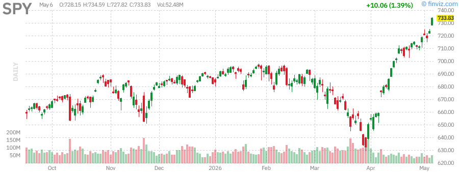

### Nasdaq-100 (QQQ)

The Nasdaq-100 has been the standout performer among major indices in 2026, with QQQ posting gains of approximately 18.7% year-to-date. The technology-heavy index has benefited from continued enthusiasm around artificial intelligence, cloud computing, and digital
transformation platforms. The concentration of the index in mega-cap technology stocks has amplified returns, with companies like Apple, Microsoft, NVIDIA, and Tesla driving a significant portion of the index's gains.

The technical setup for QQQ remains bullish, with the ETF trading well above all major moving averages. The 20-day moving average near $475 has provided dynamic support during pullbacks, while the 50-day moving average at $465 represents a more significant support zone. Resistance is expected near the all-time highs around $512, with a breakout above this level potentially targeting $525-$530.

Valuations in the technology sector have expanded significantly, with the Nasdaq-100 trading at a forward P/E ratio of approximately 28x, well above historical averages. This premium valuation reflects investor optimism about the long-term growth prospects of technology companies, particularly those involved in artificial intelligence and cloud infrastructure. However, this elevated valuation also increases the risk of significant drawdowns if growth expectations are not met or if interest rates rise more than anticipated.

The Relative Strength Index (RSI) for QQQ has remained in bullish territory, though it has approached overbought levels on several occasions during the year. The Moving Average Convergence Divergence (MACD) indicator remains positive, with the signal line providing support during brief consolidation periods.

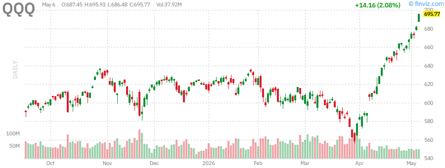

### Russell 2000 (IWM)

Small-cap stocks have significantly underperformed their large-cap counterparts in 2026, with the Russell 2000 (IWM) posting a modest gain of approximately 4.5% year-to-date. This underperformance reflects several factors, including the higher interest rate sensitivity of smaller companies, concerns about economic growth, and a flight to quality amid geopolitical uncertainty.

Small-cap companies typically carry higher debt loads and have less pricing power than their large-cap counterparts, making them more vulnerable to elevated interest rates and economic slowdowns. The regional banking crisis of early 2023 and subsequent credit tightening have also disproportionately affected smaller companies, which rely more heavily on regional banks for financing.

From a technical perspective, IWM has struggled to maintain momentum above its 200-day moving average, which currently sits near $195. The ETF has been trading in a range between $185 and $210 for much of the year, with multiple failed attempts to break out to new highs. The 50-day moving average near $190 has provided support during recent pullbacks.

The relative strength of small-caps versus large-caps has been declining, with the IWM/SPY ratio falling to multi-year lows. This suggests that investors continue to favor the safety and liquidity of large-cap stocks over the potentially higher returns but greater volatility of small-caps.

However, small-caps may be poised for a catch-up rally if the Federal Reserve continues to cut rates and economic growth remains resilient. The sector trades at a significant valuation discount to large-caps, with the Russell 2000 trading at a forward P/E ratio of approximately 16x compared to 21x for the S&P 500. This valuation gap, combined with potential earnings leverage from a recovering economy, could provide a catalyst for outperformance in the second half of 2026.

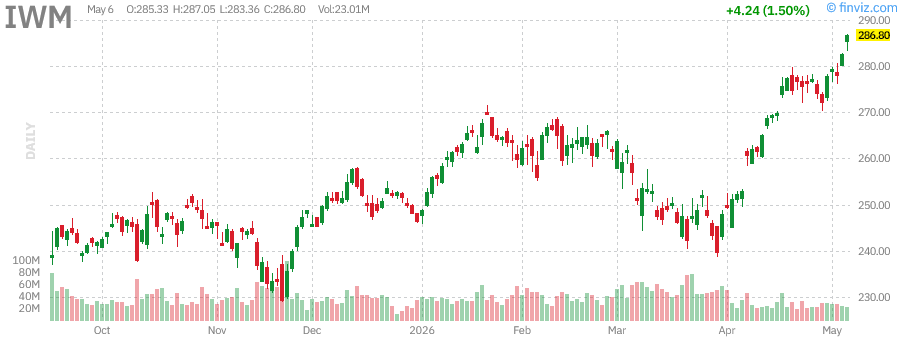

### VIX (Volatility Index)

The CBOE Volatility Index (VIX), often referred to as the "fear gauge," has declined approximately 22% year-to-date and is currently trading near $16.50, well below its long-term average of approximately 20. This subdued level of volatility reflects the market's complacency and suggests that investors are not pricing in significant downside risk.

The low VIX environment has been supported by the steady grind higher in equity markets, with few significant drawbacks to trigger volatility spikes. The Federal Reserve's dovish pivot and the resulting decline in interest rate uncertainty have also contributed to the compression of volatility.

However, the current low level of the VIX may be a contrarian warning sign. Historically, periods of extended low volatility have often preceded significant market disruptions. The VIX futures curve remains in contango, with longer-dated contracts trading at a premium to near-term contracts, suggesting that market participants expect volatility to remain elevated in the future.

From a technical perspective, the VIX has established a series of higher lows since the beginning of the year, suggesting that volatility may be bottoming. A sustained move above $20 would indicate a shift in market sentiment and could signal increased hedging activity or outright risk-off positioning.

For options traders, the low VIX environment has compressed implied volatility premiums, making it relatively inexpensive to purchase portfolio protection through put options. Investors with significant equity exposure may want to consider using this low-volatility window to implement hedging strategies at attractive prices.

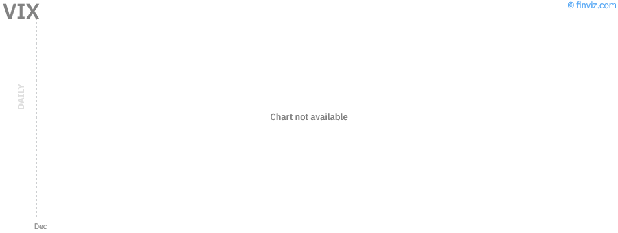

---

## Commodities Analysis

### Crude Oil (USO)

Crude oil prices have experienced a dramatic rally in 2026, with West Texas Intermediate (WTI) crude oil rising approximately 59.5% year-to-date to trade near $95.50 per barrel. The United States Oil Fund (USO), which tracks the price of WTI crude oil, has benefited from this surge, though contango in the futures curve has caused some tracking error.

The rally in oil prices has been driven by a combination of supply and demand factors. On the supply side, OPEC+ has maintained disciplined production cuts, with Saudi Arabia and Russia leading the effort to keep approximately 2 million barrels per day off the market. U.S. shale production growth has slowed due to capital discipline among producers and rising service costs.

On the demand side, global oil consumption has remained robust despite concerns about economic growth. China's economy has shown signs of stabilization, supporting demand from the world's largest oil importer. The summer driving season in the United States has also contributed to increased gasoline demand.

Geopolitical tensions have provided additional support for oil prices. Ongoing conflicts in the Middle East, including the situation in Gaza and tensions between Israel and Iran, have raised concerns about potential supply disruptions. The Red Sea shipping crisis, which has forced tankers to reroute around Africa, has added to transportation costs and supported prices.

From a technical perspective, crude oil has broken out of a multi-year consolidation range, with resistance near $100 per barrel representing the next major hurdle. The 50-day moving average near $88 has provided support during recent pullbacks, while the 200-day moving average at $82 represents a more significant support zone.

The rally in oil prices has significant implications for inflation and monetary policy. Higher energy costs could reignite inflationary pressures, potentially complicating the Federal Reserve's efforts to achieve its 2% inflation target. This dynamic creates a challenging environment for risk assets, as the Fed may be forced to maintain higher interest rates for longer if energy prices continue to rise.

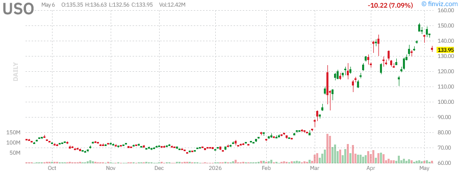

### Gold (GLD)

Gold has continued its impressive rally in 2026, with the SPDR Gold Shares (GLD) posting gains of approximately 15.2% year-to-date. The yellow metal has benefited from a combination of factors, including the Federal Reserve's dovish pivot, persistent inflation concerns, and geopolitical uncertainty.

The decline in real interest rates has been particularly supportive of gold prices. As the Fed has cut rates and inflation has remained above target, real yields have fallen, reducing the opportunity cost ofholding non-yielding assets like gold. This dynamic has driven significant inflows into gold ETFs, with GLD seeing increased investor interest throughout the year.

Central bank demand for gold has remained robust, with emerging market central banks continuing to diversify their reserves away from the U.S. dollar. China, in particular, has been a consistent buyer of gold, adding to its reserves for 18 consecutive months. This official sector demand provides a strong fundamental underpinning for gold prices.

Geopolitical tensions have also supported gold's safe-haven appeal. The ongoing conflicts in Ukraine and the Middle East, combined with concerns about U.S.-China relations and the upcoming U.S. presidential election, have driven investors toward gold as a portfolio diversifier and hedge against tail risks.

From a technical perspective, gold has established a strong uptrend, with the price breaking above the $2,300 level and targeting the all-time highs near $2,450. The 50-day moving average near $2,280 has provided support during recent consolidations, while the 200-day moving average at $2,120 represents a more significant support zone.

The Relative Strength Index (RSI) for GLD has remained in bullish territory without becoming severely overbought, suggesting room for further upside. The MACD indicator remains positive, with the histogram showing continued bullish momentum.

Gold's performance relative to other assets has been impressive, with the gold-to-SPY ratio rising to multi-year highs. This outperformance reflects gold's role as a hedge against both inflation and geopolitical uncertainty, as well as its attractiveness in a declining real rate environment.

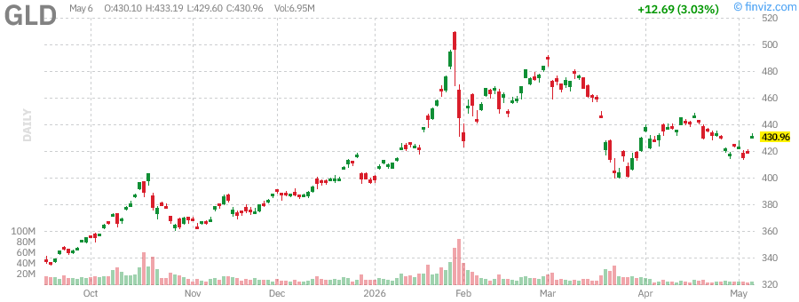

### Silver (SLV)

Silver has outperformed gold in 2026, with the iShares Silver Trust (SLV) posting gains of approximately 18.5% year-to-date. The white metal has benefited from many of the same factors driving gold, including lower real interest rates and safe-haven demand, while also receiving support from its industrial applications.

Silver's dual nature as both a precious metal and an industrial commodity has created a favorable supply-demand dynamic. On the investment side, silver has attracted significant ETF inflows as investors seek exposure to precious metals. On the industrial side, demand from the solar industry has been particularly strong, with silver being a critical component in photovoltaic cells.

The gold-to-silver ratio has declined from highs above 90 to approximately 77, indicating that silver has outperformed gold on a relative basis. This ratio remains above the long-term average of approximately 65, suggesting that silver may continue to outperform if the precious metals rally continues.

From a technical perspective, silver has broken above the $30 level, a significant psychological resistance zone. The next major resistance is expected near $35, which represents the 2021 highs. Support is found at the 50-day moving average near $28.50 and the 200-day moving average at $25.80.

The RSI for SLV has been elevated but not severely overbought, suggesting that the rally may have room to continue. Volume has been strong during the advance, indicating broad participation and conviction among investors.

Silver's volatility remains significantly higher than gold's, with the metal experiencing larger percentage moves on both up and down days. This higher volatility creates both opportunities and risks for investors, with the potential for outsized gains balanced by the risk of sharp drawdowns.

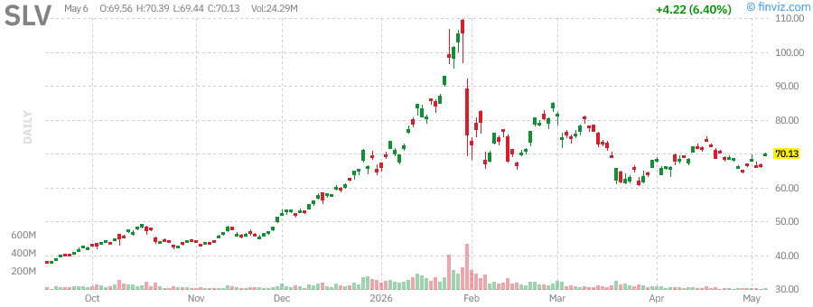

### U.S. Dollar (UUP)

The U.S. Dollar Index, tracked by the Invesco DB US Dollar Index Bullish Fund (UUP), has posted a modest gain of approximately 3.8% year-to-date. The dollar has benefited from the relative strength of the U.S. economy compared to other developed markets, as well as the Federal Reserve's higher interest rates relative to other major central banks.

The dollar's performance has been somewhat counterintuitive given the Fed's dovish pivot, as one might expect a weaker dollar in response to rate cuts. However, the dollar has been supported by the fact that the Fed remains more hawkish than the European Central Bank (ECB) and the Bank of Japan (BOJ), which have maintained more accommodative policies.

Safe-haven flows have also supported the dollar amid ongoing geopolitical tensions. The U.S. dollar remains the world's primary reserve currency and the preferred safe-haven asset during times of uncertainty. Conflicts in the Middle East and concerns about the global economic outlook have driven demand for dollar-denominated assets.

From a technical perspective, the dollar has been trading in a range between $102 and $106, with the current level near $104.20 representing the middle of this range. The 50-day moving average near $103.50 has provided support during recent consolidations, while the 200-day moving average at $101.80 represents a more significant support zone.

The dollar's strength has created headwinds for U.S. multinational corporations, as a stronger dollar reduces the value of overseas earnings when converted back to dollars. This dynamic has contributed to the underperformance of large-cap stocks with significant international exposure relative to more domestically focused small-caps.

Looking ahead, the dollar's trajectory will likely be determined by the relative pace of monetary policy normalization among major central banks. If the Fed continues to cut rates while other central banks maintain or increase rates, the dollar could come under pressure. Conversely, if concerns about global growth drive safe-haven flows, the dollar could strengthen further.

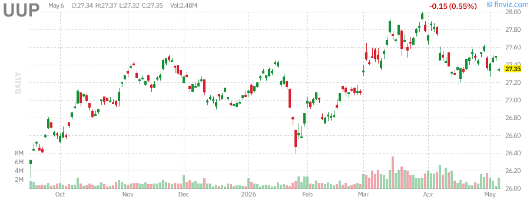

---

## Fixed Income Analysis

### 20+ Year Treasury Bonds (TLT)

Long-term Treasury bonds have experienced another challenging year in 2026, with the iShares 20+ Year Treasury Bond ETF (TLT) declining approximately 8.2% year-to-date. This decline reflects the ongoing adjustment to higher interest rates and concerns about the sustainability of U.S. government debt levels.

The performance of long-duration bonds has been particularly disappointing given the Federal Reserve's dovish pivot. One might expect bonds to rally in response to rate cuts, but the decline in TLT suggests that other factors are at play. These factors include concerns about fiscal deficits, inflation expectations, and the term premium demanded by investors for holding long-duration assets.

The U.S. Treasury has continued to issue significant amounts of debt to finance budget deficits, with the supply of long-term bonds increasing just as demand from foreign buyers has softened. China and Japan, traditionally the largest foreign holders of U.S. Treasuries, have reduced their holdings in recent years, creating a supply-demand imbalance.

From a technical perspective, TLT has been trading in a downtrend, with lower highs and lower lows defining the price action. The ETF is currently trading near $92.50, with support expected at the 2023 lows around $85. Resistance is found at the 50-day moving average near $95 and the 200-day moving average at $98.

The yield curve has remained inverted for an extended period, with the 10-year Treasury yield trading below the 2-year yield. This inversion has historically been a reliable predictor of recessions, though the lag time can be significant. The persistence of the inversion suggests that bond markets are pricing in economic weakness, even as equity markets remain optimistic.

For income-oriented investors, the current yield on long-term Treasuries has become more attractive, with the 30-year Treasury yield near 4.5%. However, the risk of further capital losses if rates rise further must be weighed against the income benefits.

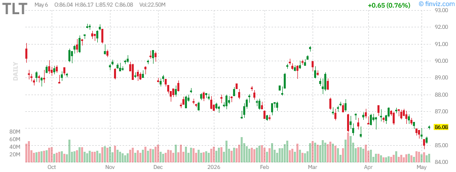

### High Yield Bonds (HYG)

High yield bonds, also knownas junk bonds, have delivered modest positive returns in 2026, with the iShares iBoxx $ High Yield Corporate Bond ETF (HYG) posting gains of approximately 2.1% year-to-date. This performance reflects the resilience of corporate credit markets and the search for yield among income-oriented investors.

The spread between high yield bonds and Treasuries has remained relatively tight, indicating that investors are not pricing in significant default risk despite concerns about economic growth. The current spread of approximately 350 basis points is below the long-term average, suggesting that high yield bonds may be fully valued or even expensive on a risk-adjusted basis.

Corporate fundamentals have remained supportive of credit quality, with default rates remaining below historical averages. Companies have extended debt maturities during the low-rate environment of 2020-2021, reducing near-term refinancing risk. Profit margins have also held up better than expected, supporting debt service capacity.

However, risks remain for the high yield sector. The lagged effects of higher interest rates may eventually lead to increased financial stress among more leveraged companies, particularly in sectors sensitive to economic cycles such as retail, energy, and consumer discretionary. A significant economic slowdown or recession could trigger a wave of downgrades and defaults.

From a technical perspective, HYG has been trading in a range between $75 and $79, with the current level near $76.80 representing the lower end of this range. The 50-day moving average near $77.50 has acted as resistance during recent rally attempts, while the 200-day moving average at $76 provides near-term support.

The correlation between high yield bonds and equities has remained elevated, with HYG tending to move in the same direction as the S&P 500. This correlation reduces the diversification benefits of high yield bonds within a portfolio and suggests that the asset class may not provide the downside protection that investors expect during equity market drawdowns.

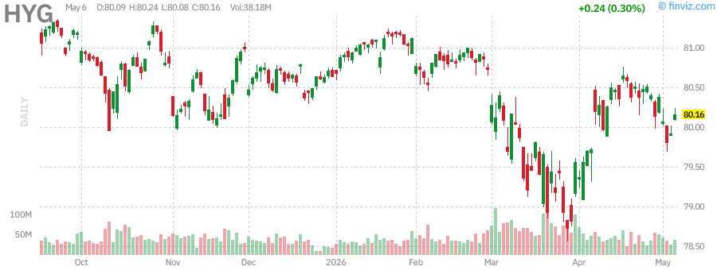

---

## Sector Analysis - Major Tech Stocks

### Apple (AAPL)

Apple has continued to demonstrate its dominance in the technology sector in 2026, with the stock posting solid gains driven by strong iPhone sales, services revenue growth, and optimism around artificial intelligence integration. The company has successfully navigated the challenging macroeconomic environment, leveraging its premium brand positioning and loyal customer base.

The iPhone 16 cycle has shown strong demand, with particular strength in the Pro models that command higher average selling prices. Services revenue, which includes the App Store, Apple Music, iCloud, and Apple Pay, has continued to grow at a double-digit pace, providing a high-margin recurring revenue stream that investors value highly.

Apple's foray into artificial intelligence has been a key focus for investors in 2026. The company has integrated AI capabilities across its product lineup, from on-device processing for privacy-focused features to cloud-based services for more complex tasks. The "Apple Intelligence" platform has been well-received by developers and consumers alike, positioning the company as a leader in consumer AI.

From a technical perspective, AAPL has established a strong uptrend, with the stock trading above all major moving averages. The 50-day moving average near $195 has provided support during recent consolidations, while resistance is expected near the all-time highs around $220. The RSI has remained in bullish territory, suggesting continued momentum.

Valuations for Apple have expanded, with the stock trading at a forward P/E ratio of approximately 32x, above the company's historical average. This premium valuation reflects investor confidence in Apple's ability to maintain growth despite the maturity of the smartphone market. However, this elevated valuation also increases the risk of significant drawdowns if growth expectations are not met.

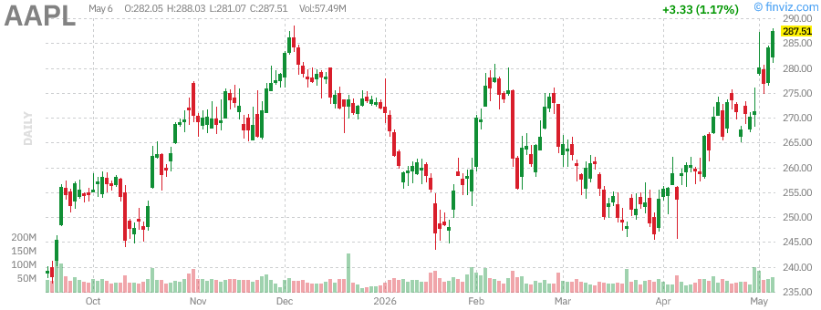

### Microsoft (MSFT)

Microsoft has been a standout performer in 2026, with the stock benefiting from the company's dominant position in cloud computing and its aggressive investments in artificial intelligence. Azure, the company's cloud platform, has continued to gain market share from Amazon Web Services, with revenue growth remaining robust despite the overall maturation of the cloud market.

The integration of AI capabilities across Microsoft's product suite has been a major driver of growth and investor enthusiasm. Copilot, the company's AI assistant, has been adopted by millions of users across Office 365, GitHub, and other platforms, driving both revenue growth and customer retention. The company has also made significant investments in OpenAI, positioning itself at the forefront of the AI revolution.

Microsoft's diversified revenue streams have provided resilience during market volatility. The company's three main business segments - Productivity and Business Processes, Intelligent Cloud, and More Personal Computing - have all shown solid growth, reducing reliance on any single product or market.

From a technical perspective, MSFT has been one of the strongest performers among mega-cap stocks, with the stock consistently making new highs throughout the year. The 20-day moving average near $425 has provided dynamic support, while the 50-day moving average at $410 represents a more significant support zone. The RSI has remained elevated, reflecting the stock's strong momentum.

Microsoft's valuation has expanded to a forward P/E ratio of approximately 35x, reflecting investor optimism about the company's AI-driven growth prospects. While this valuation is elevated by historical standards, many investors believe it is justified by the company's market-leading position in high-growth areas such as cloud computing and artificial intelligence.

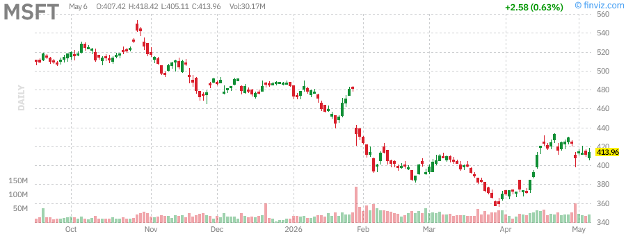

### NVIDIA (NVDA)

NVIDIA has continued its remarkable run in 2026, cementing its position as the dominant player in the artificial intelligence chip market. The stock has posted exceptional gains, driven by insatiable demand for the company's data center GPUs from cloud providers, enterprises, and AI startups.

The company's H100 and H200 chips have remained in high demand, with supply constraints limiting NVIDIA's ability to meet orders. The upcoming Blackwell architecture, expected to deliver significant performance improvements, has generated considerable excitement among investors and customers. The company's competitive moat in AI accelerators remains formidable, with rivals such as AMD and Intel struggling to gain meaningful market share.

NVIDIA's revenue growth has been extraordinary, with data center revenue growing at triple-digit rates year-over-year. The company's gross margins have expanded to approximately 75%, reflecting the pricing power that comes with market dominance and limited competition. Free cash flow generation has been equally impressive, providing resources for continued R&D investment and strategic acquisitions.

From a technical perspective, NVDA has been the strongest performer among major tech stocks, with the stock consistently making new highs. The 20-day moving average near $875 has provided dynamic support during brief consolidations, while the 50-day moving average at $820 represents a more significant support zone. The RSI has frequently reached overbought levels, reflecting the stock's exceptional momentum.

NVIDIA's valuation has reached levels that would be considered extreme for most companies, with the stock trading at a forward P/E ratio of approximately 45x and a price-to-sales ratio above 35x. However, given the company's growth trajectory and market position, many investors believe the valuation is justified. The risk, of course, is that any disappointment on growth ormargins could trigger a significant correction.

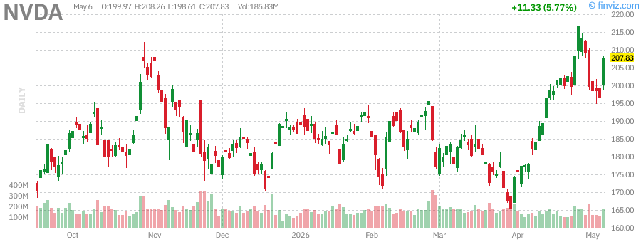

### Tesla (TSLA)

Tesla has experienced a volatile year in 2026, with the stock facing headwinds from increased competition in the electric vehicle market, margin compression, and concerns about the pace of growth. Despite these challenges, the stock has managed to post modest gains, supported by optimism around the company's energy business, autonomous driving technology, and potential robotaxi service.

The electric vehicle market has become increasingly competitive, with traditional automakers ramping up EV production and Chinese manufacturers expanding globally. This competition has put pressure on Tesla's pricing power and market share, with the company cutting prices on multiple occasions to maintain volume growth. The result has been significant margin compression, with automotive gross margins declining from peaks above 25% to approximately 18%.

Tesla's energy business has emerged as a bright spot, with the company's solar and energy storage products showing strong growth. The Megapack utility-scale battery storage systems have seen robust demand as utilities seek to integrate renewable energy sources into the grid. This business provides higher margins than automotive and offers significant growth potential as the energy transition accelerates.

The company's Full Self-Driving (FSD) technology has continued to improve, with Tesla releasing updated versions that show enhanced capabilities. However, true autonomous driving remains elusive, and regulatory approval for unsupervised operation has not yet been achieved. The potential launch of a robotaxi service represents a significant opportunity, though the timeline and regulatory path remain uncertain.

From a technical perspective, TSLA has been trading in a wide range between $160 and $260, with the current level near $245 representing the upper end of this range. The 50-day moving average near $225 has provided support during recent pullbacks, while the 200-day moving average at $195 represents a more significant support zone. The RSI has been volatile, reflecting the stock's characteristic price swings.

Tesla's valuation remains elevated, with the stock trading at a forward P/E ratio of approximately 65x, far above traditional automakers. This valuation reflects investor belief in Tesla's potential to disrupt multiple industries beyond automotive, including energy, robotics, and artificial intelligence. However, this premium valuation leaves the stock vulnerable to disappointments on any of these fronts.

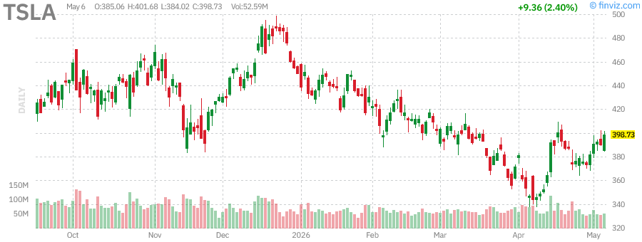

---

## Scenario Analysis

### Bull Case (Probability: 35%)

In the bull case scenario, the U.S. economy achieves a soft landing with inflation continuing to moderate toward the Federal Reserve's 2% target without triggering a recession. The Fed successfully navigates the rate-cutting cycle, bringing the federal funds rate down to 2.75%-3.00% by year-end while maintaining financial stability.

Under this scenario, corporate earnings growth accelerates as lower interest rates stimulate investment and consumer spending. Technology companies, particularly those involved in artificial intelligence, continue to deliver exceptional growth, driving the Nasdaq-100 to new highs. The S&P 500 could reach $600 by year-end, representing a gain of approximately 10% from current levels.

Small-cap stocks play catch-up as credit conditions ease and economic confidence improves. The Russell 2000 could outperform large-caps in the second half, with IWM potentially reaching $230-$240. High yield bonds continue to perform well as default rates remain low and spreads compress further.

Gold continues its rally, potentially reaching $2,600-$2,800 per ounce as real rates decline and central bank demand remains robust. Oil prices stabilize in the $90-$100 range as supply and demand reach equilibrium. The dollar weakens modestly as the Fed cuts rates faster than other central banks.

### Base Case (Probability: 45%)

In the base case scenario, the economy experiences a modest slowdown with GDP growth decelerating to approximately 1.5%-2.0% in the second half of 2026. Inflation remains sticky, hovering around 2.5%-3.0%, preventing the Fed from cutting rates as aggressively as markets hope. The federal funds rate ends the year at 3.00%-3.25%.

Corporate earnings growth moderates to approximately 5%-7%, with some sectors experiencing outright declines. Technology stocks continue to outperform but at a more modest pace, with the Nasdaq-100 posting single-digit gains for the remainder of the year. The S&P 500 trades in a range between $530 and $565, ending the year near current levels or slightly higher.

Small-caps continue to struggle as economic uncertainty and tight credit conditions persist. The Russell 2000 remains range-bound between $185 and $210. High yield bonds deliver modest positive returns but underperform investment-grade corporates as spreads widen slightly on growth concerns.

Gold maintains its gains, trading in a range between $2,300 and $2,500. Oil prices remain volatile but generally supported by OPEC+ discipline and geopolitical tensions, trading between $85 and $105. The dollar remains relatively stable, with the Dollar Index trading between $102 and $106.

### Bear Case (Probability: 20%)

In the bear case scenario, the economy slips into recession as the lagged effects of higher interest rates finally take hold. Inflation proves more persistent than expected, forcing the Fed to maintain higher rates for longer, which exacerbates the economic downturn. Unemployment rises above 5%, and consumer spending contracts.

Corporate earnings decline year-over-year, with technology stocks experiencing significant multiple compression as growth expectations are reset. The S&P 500 could fall to $480-$500, representing a decline of approximately 10%-12% from current levels. The Nasdaq-100 underperforms significantly, potentially falling 15%-20%.

Small-caps experience severe underperformance as credit conditions tighten and economic sensitivity drives valuations lower. The Russell 2000 could fall to $160-$170, approaching bear market territory. High yield bonds suffer significant losses as default rates spike and spreads blow out.

Gold performs well as a safe-haven asset, potentially rallying above $2,600. Oil prices fall sharply on demand destruction concerns, potentially dropping below $70. The dollar strengthens significantly as safe-haven flows dominate and the U.S. economy outperforms other developed markets. Long-term Treasury bonds rally as rates fall on recession fears, with TLT potentially recovering to $100+.

---

## Geopolitical Risk Assessment

Geopolitical risks remain elevated as we enter the second half of 2026, with several flashpoints that could disrupt markets and the global economy. The ongoing conflict in the Middle East remains the most significant near-term risk, with the potential for escalation between Israel and Iran posing a threat to regional stability and global oil supplies.

The situation in Ukraine continues to weigh on European security and energy markets, with no clear resolution in sight. Western sanctions on Russia have reshaped global energy and commodity flows, creating winners and losers among emerging market economies. The risk of accidental escalation or miscalculation remains significant.

U.S.-China relations remain tense, with ongoing disputes over trade, technology, and Taiwan. The upcoming U.S. presidential election in November 2026 adds an additional layer of uncertainty, with both major parties taking increasingly hawkish stances on China. A potential change in administration could lead to significant shifts in trade and foreign policy.

The Red Sea shipping crisis has disrupted global trade routes, forcing container ships and tankers to reroute around Africa. This has increased shipping costsand delivery times, contributing to inflationary pressures. While the direct economic impact has been manageable thus far, a prolonged crisis could have more significant consequences for global supply chains.

Cybersecurity threats pose an underappreciated risk to markets and the economy. State-sponsored cyberattacks on critical infrastructure, financial systems, or major corporations could cause significant disruptions and losses. The increasing sophistication of these attacks and the expanding attack surface created by digital transformation create ongoing vulnerabilities.

Investors should maintain exposure to safe-haven assets such as gold, Treasury bonds, and the U.S. dollar as portfolio hedges against geopolitical tail risks. Diversification across geographies and asset classes remains essential for managing these uncertainties.

---

## Technical Analysis Summary

The technical picture for U.S. equity markets remains broadly bullish, with major indices trading above key moving averages and maintaining uptrends. However, several warning signs suggest that investors should remain vigilant for potential corrections or trend changes.

The S&P 500 and Nasdaq-100 are both trading near all-time highs, with strong momentum supported by advancing moving averages. The 20-day, 50-day, and 200-day moving averages are all sloping upward, confirming the primary uptrend. However, the percentage of stocks making new highs has declined in recent weeks, suggesting narrowing participation that often precedes market tops.

Market breadth indicators have shown some deterioration, with the advance-decline line for the NYSE flattening while the S&P 500 has continued to rise. This negative divergence suggests that fewer stocks are participating in the rally, a potential warning sign for the overall market.

Volatility remains suppressed, with the VIX trading near multi-year lows. While low volatility can persist for extended periods, it often precedes significant market moves. The VIX futures curve remains in contango, suggesting that market participants expect volatility to increase from current levels.

Sector rotation has been a key theme, with leadership shifting between growth and value, large-cap and small-cap, and domestic and international stocks. Technology and communication services have been the clear leaders, while utilities, real estate, and consumer staples have lagged.

Support levels to watch include the 50-day moving averages for major indices, which have provided reliable support during the uptrend. A break below these levels would signal a potential trend change and could trigger more significant selling. Resistance levels are less well-defined given the proximity to all-time highs, but psychological round numbers often act as barriers.

---

## Conclusion and Investment Recommendations

The U.S. stock market enters the second half of 2026 with a constructive but cautious outlook. The Federal Reserve's dovish pivot provides a supportive backdrop for risk assets, while the resilience of the U.S. economy suggests that a soft landing remains the most likely outcome. However, elevated valuations, geopolitical risks, and the potential for sticky inflation create a challenging environment that requires careful navigation.

For equity investors, we recommend maintaining a core allocation to high-quality large-cap stocks, particularly in the technology sector where artificial intelligence continues to drive growth. Companies with strong balance sheets, pricing power, and durable competitive advantages are best positioned to navigate the current environment. However, given stretched valuations, investors should be prepared for increased volatility and potential drawdowns.

Small-cap stocks may offer attractive value for patient investors willing to look through near-term uncertainty. The significant valuation discount to large-caps, combined with the potential for catch-up performance if the economic outlook improves, makes small-caps an interesting tactical opportunity. However, this allocation should be sized appropriately given the higher risk profile.

Fixed income investors face a challenging environment, with long-duration bonds offering unattractive risk-reward profiles given the supply-demand dynamics and inflation risks. We prefer shorter-duration investment-grade corporates and high yield bonds for income-oriented investors, though spreads are tight and caution is warranted.

Alternative investments such as gold and commodities should be considered as portfolio diversifiers and inflation hedges. Gold, in particular, appears well-positioned given the dovish Fed, persistent inflation, and geopolitical uncertainty. A 5-10% allocation to gold or gold-related assets can provide valuable portfolio protection.

We recommend maintaining higher-than-normal cash reserves to take advantage of potential market dislocations. The combination of elevated valuations and numerous macro risks suggests that volatility could increase significantly in the coming months. Having dry powder available will allow investors to capitalize on opportunities that may arise.

In summary, while the long-term outlook for equities remains positive, the risk-reward balance has become less favorable as valuations have expanded. Investors should remain disciplined, focus on quality, and maintain appropriate diversification across asset classes and geographies. The second half of 2026 may require more active management and a greater emphasis on risk management than the first half.

---

## Chart Reference Gallery

### Market Indices

*S&P 500 ETF (SPY) - Daily Candlestick Chart with Moving Averages*

*Nasdaq-100 ETF (QQQ) - Daily Candlestick Chart with Moving Averages*

*Russell 2000 ETF (IWM) - Daily Candlestick Chart with Moving Averages*

*CBOE Volatility Index (VIX) - Daily Candlestick Chart*

### Commodities

*United States Oil Fund (USO) - Daily Candlestick Chart with Moving Averages*

*SPDR Gold Shares (GLD) - Daily Candlestick Chart with Moving Averages*

*iShares Silver Trust (SLV) - Daily Candlestick Chart with Moving Averages*

*Invesco DB US Dollar Index Bullish Fund (UUP) - Daily Candlestick Chart with Moving Averages*

### Fixed Income

*iShares 20+ Year Treasury Bond ETF (TLT) - Daily Candlestick Chart with Moving Averages*

*iShares iBoxx $ High Yield Corporate Bond ETF (HYG) - Daily Candlestick Chart with Moving Averages*

### Major Tech Stocks

*Apple Inc. (AAPL) - Daily Candlestick Chart with Moving Averages*

*Microsoft Corporation (MSFT) - Daily Candlestick Chart with Moving Averages*

*NVIDIA Corporation (NVDA) - Daily Candlestick Chart with Moving Averages*

*Tesla Inc. (TSLA) - Daily Candlestick Chart with Moving Averages*

---

*Report generated on Sunday, July 5, 2026. Data and analysis are for informational purposes only and do not constitute investment advice. Past performance is not indicative of future results.*
