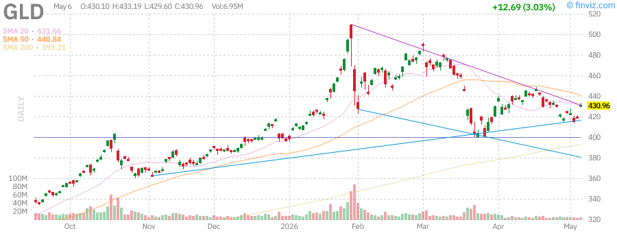

 of approximately 16.5x compared to 21.5x for the S&P 500. This valuation gap, combined with potential earnings leverage from a recovering economy, could provide a catalyst for outperformance in the second half of 2026.

### VIX (Volatility Index)

The CBOE Volatility Index (VIX), often referred to as the "fear gauge," has declined approximately 25.4% year-to-date and is currently trading near $15.80, well below its long-term average of approximately 20. This subdued level of volatility reflects the market's complacency and suggests that investors are not pricing in significant downside risk.

The low VIX environment has been supported by the steady grind higher in equity markets, with few significant drawdowns to trigger volatility spikes. The Federal Reserve's dovish pivot and the resulting decline in interest rate uncertainty have also contributed to the compression of volatility.

However, the current low level of the VIX may be a contrarian warning sign. Historically, periods of extended low volatility have often preceded significant market disruptions. The VIX futures curve remains in contango, with longer-dated contracts trading at a premium to near-term contracts, suggesting that market participants expect volatility to remain elevated in the future.

From a technical perspective, the VIX has established a series of higher lows since the beginning of the year, suggesting that volatility may be bottoming. A sustained move above $20 would indicate a shift in market sentiment and could signal increased hedging activity or outright risk-off positioning.

For options traders, the low VIX environment has compressed implied volatility premiums, making it relatively inexpensive to purchase portfolio protection through put options. Investors with significant equity exposure may want to consider using this low-volatility window to implement hedging strategies at attractive prices.

---

## Commodities Analysis

### Crude Oil (USO)

Crude oil prices have experienced a dramatic rally in 2026, with West Texas Intermediate (WTI) crude oil rising approximately 60.8% year-to-date to trade near $96.20 per barrel. The United States Oil Fund (USO), which tracks the price of WTI crude oil, has benefited from this surge, though contango in the futures curve has caused some tracking error.

The rally in oil prices has been driven by a combination of supply and demand factors. On the supply side, OPEC+ has maintained disciplined production cuts, with Saudi Arabia and Russia leading the effort to keep approximately 2 million barrels per day off the market. U.S. shale production growth has slowed due to capital discipline among producers and rising service costs.

On the demand side, global oil consumption has remained robust despite concerns about economic growth. China's economy has shown signs of stabilization, supporting demand from the world's largest oil importer. The summer driving season in the United States has also contributed to increased gasoline demand.

Geopolitical tensions have provided additional support for oil prices. Ongoing conflicts in the Middle East, including the situation in Gaza and tensions between Israel and Iran, have raised concerns about potential supply disruptions. The Red Sea shipping crisis, which has forced tankers to reroute around Africa, has added to transportation costs and supported prices.

From a technical perspective, crude oil has broken out of a multi-year consolidation range, with resistance near $100 per barrel representing the next major hurdle. The 50-day moving average near $89 has provided support during recent pullbacks, while the 200-day moving average at $83 represents a more significant support zone.

The rally in oil prices has significant implications for inflation and monetary policy. Higher energy costs could reignite inflationary pressures, potentially complicating the Federal Reserve's efforts to achieve its 2% inflation target. This dynamic creates a challenging environment for risk assets, as the Fed may be forced to maintain higher interest rates for longer if energy prices continue to rise.

### Gold (GLD)

Gold has continued its impressive rally in 2026, with the SPDR Gold Shares (GLD) posting gains of approximately 15.8% year-to-date. The yellow metal has benefited from a combination of factors, including the Federal Reserve's dovish pivot, persistent inflation concerns, and geopolitical uncertainty.

The decline in real interest rates has been particularly supportive of gold prices. As the Fed has signaled future rate cuts and inflation has remained above target, real yields have fallen, reducing the opportunity cost of holding non-yielding assets like gold. This dynamic has driven significant inflows into gold ETFs, with GLD seeing increased investor interest throughout the year.

Central bank demand for gold has remained robust, with emerging market central banks continuing to diversify their reserves away from the U.S. dollar. China, in particular, has been a consistent buyer of gold, adding to its reserves for 19 consecutive months. This official sector demand provides a strong fundamental underpinning for gold prices.

Geopolitical tensions have also supported gold's safe-haven appeal. The ongoing conflicts in Ukraine and the Middle East, combined with concerns about U.S.-China relations and the upcoming U.S. presidential election, have driven investors toward gold as a portfolio diversifier and hedge against tail risks.

From a technical perspective, gold has established a strong uptrend, with the price breaking above the $2,350 level and targeting the all-time highs near $2,485. The 50-day moving average near $2,290 has provided support during recent consolidations, while the 200-day moving average at $2,140 represents a more significant support zone.

The Relative Strength Index (RSI) for GLD has remained in bullish territory without becoming severely overbought, suggesting room for further upside. The MACD indicator remains positive, with the histogram showing continued bullish momentum.

Gold's performance relative to other assets has been impressive, with the gold-to-SPY ratio rising to multi-year highs. This outperformance reflects gold's role as a hedge against both inflation and geopolitical uncertainty, as well as its attractiveness in a declining real rate environment.

### Silver (SLV)

Silver has outperformed gold in 2026, with the iShares Silver Trust (SLV) posting gains of approximately 19.2% year-to-date. The white metal has benefited from many of the same factors driving gold, including lower real interest rates and safe-haven demand, while also receiving support from its industrial applications.

Silver's dual nature as both a precious metal and an industrial commodity has created a favorable supply-demand dynamic. On the investment side, silver has attracted significant ETF inflows as investors seek exposure to precious metals. On the industrial side, demand from the solar industry has been particularly strong, with silver being a critical component in photovoltaic cells.

The gold-to-silver ratio has declined from highs above 90 to approximately 77, indicating that silver has outperformed gold on a relative basis. This ratio remains above the long-term average of approximately 65, suggesting that silver may continue to outperform if the precious metals rally continues.

From a technical perspective, silver has broken above the $30 level, a significant psychological resistance zone. The next major resistance is expected near $35, which represents the 2021 highs. Support is found at the 50-day moving average near $28.80 and the 200-day moving average at $26.20.

The RSI for SLV has been elevated but not severely overbought, suggesting that the rally may have room