# Friday, July 10, 2026 - Afternoon Stock Market Research Report

**Report Date:** Friday, July 10, 2026  
**Prepared by:** Market Research Team  
**Report Type:** Comprehensive Afternoon Analysis

---

## Executive Summary

The U.S. stock market concludes the trading week on a positive note, with major indices posting modest gains as investors digest a busy week of economic data and Federal Reserve commentary. The S&P 500 (SPY) has extended its year-to-date rally, demonstrating continued resilience despite ongoing concerns about inflation persistence, geopolitical tensions, and the uncertain path of monetary policy. Market breadth has improved, with participation broadening beyond the mega-cap technology stocks that have dominated performance in 2026.

The technology sector remains the primary engine of market performance, with artificial intelligence-related investments continuing to drive outsized returns. The Nasdaq-100 (QQQ) has maintained its leadership position, reflecting sustained investor enthusiasm for growth stocks and the mega-cap technology companies that continue to execute on their AI strategies. Meanwhile, small-cap stocks represented by the Russell 2000 (IWM) have shown signs of life this week, outperforming large-caps as investors rotate into more cyclically sensitive areas of the market.

Market volatility, as measured by the VIX, has remained subdued, trading near multi-year lows that suggest significant investor complacency. This low-volatility environment has supported risk assets but may also indicate a potential for sudden market adjustments if unexpected catalysts emerge. The Federal Reserve's communication this week has reinforced expectations for a gradual approach to monetary policy normalization, with markets now pricing in two 25-basis-point rate cuts by year-end.

| Key Market Metrics | Current Level | YTD Change | 52-Week Range |
|-------------------|---------------|------------|---------------|
| S&P 500 (SPY) | ~$750.45 | +16.2% | $561.70 - $752.80 |
| Nasdaq-100 (QQQ) | ~$718.20 | +22.6% | $484.17 - $720.15 |
| Russell 2000 (IWM) | ~$299.40 | +8.1% | $198.26 - $301.85 |
| VIX | ~$15.20 | -27.5% | $13.20 - $28.40 |
| Crude Oil (USO) | ~$141.80/bbl | +75.4% | $64.43 - $155.20 |
| Gold (GLD) | ~$452.80/oz | +21.2% | $291.78 - $515.40 |
| Silver (SLV) | ~$76.20/oz | +29.1% | $29.10 - $112.45 |
| U.S. Dollar (UUP) | ~$27.42 | +3.9% | $26.40 - $28.45 |
| 20+ Year Treasuries (TLT) | ~$88.65 | -6.7% | $83.30 - $92.19 |
| High Yield Bonds (HYG) | ~$79.25 | +4.5% | $72.30 - $79.85 |

---

## Federal Reserve Analysis

The Federal Reserve's monetary policy stance remains the dominant factor influencing market sentiment as we progress through the third quarter of 2026. This week's commentary from Fed officials has reinforced the central bank's data-dependent approach, with markets increasingly confident that the next move will be a rate cut rather than a hike. The federal funds rate currently sits in the range of 3.50% to 3.75%, representing a cumulative reduction of 175 basis points since the Fed began its easing cycle in September 2024.

Federal Reserve Chair Jerome Powell's testimony before Congress this week struck a careful balance, acknowledging progress on inflation while cautioning against premature declarations of victory. Powell emphasized that the Fed remains committed to its 2% inflation target and will not hesitate to maintain restrictive policy for longer if necessary. However, his comments also opened the door to potential rate cuts if inflation continues to moderate and the labor market shows signs of cooling.

The Core PCE Price Index, the Fed's preferred inflation measure, showed modest improvement in the June report, declining to 2.5% year-over-year from 2.6% in May. This progress, while welcome, still leaves inflation above the Fed's target. The moderation in core goods prices has been offset by persistent strength in services inflation, particularly in housing and healthcare categories.

Market participants have adjusted their expectations for the pace of rate cuts following this week's data and commentary. The current consensus anticipates 2 additional 25-basis-point reductions by year-end, which would bring the federal funds rate to a range of 3.00% to 3.25% by December 2026. This trajectory assumes continued moderation in inflation and no significant deterioration in economic conditions. The probability of a July rate cut has increased to approximately 35%, up from 15% last week.

The Fed's balance sheet normalization program continues in the background, with the central bank allowing Treasury and mortgage-backed securities to roll off at a measured pace of approximately $25 billion per month. This quantitative tightening, while less aggressive than earlier phases, continues to drain liquidity from the financial system and contributes to tighter financial conditions. Some analysts have called for the Fed to accelerate balance sheet runoff completion to provide more flexibility on the policy rate.

The divergence between the Fed's cautious approach and market expectations creates potential for volatility. If inflation proves stickier than anticipated or the labor market remains robust, the Fed may slow the pace of cuts, potentially disappointing markets. Conversely, if economic conditions deteriorate more rapidly than expected, the Fed could accelerate easing, providing additional support for risk assets. The "higher for longer" scenario remains a tail risk that could lead to multiple compression in equities.

Recent inflation data has shown concerning trends in energy prices, which have surged due to ongoing geopolitical tensions in the Middle East. Gasoline prices have increased 21.2% year-over-year, while fuel oil is up 48.5%. These energy cost increases have created headwinds for the disinflationary narrative, though core inflation metrics have remained more contained. The Fed faces a delicate balancing act: maintaining restrictive enough policy to ensure inflation returns to target while avoiding overtightening that could trigger an unnecessary economic slowdown.

The coming weeks will be critical for assessing the Fed's next move, with the July FOMC meeting approaching and additional economic data on inflation, employment, and consumer spending due for release. Market positioning suggests investors are confident in a dovish pivot, but any surprises in the data could trigger significant repricing.

---

## Economic Data Analysis

The U.S. economy continues to demonstrate remarkable resilience, defying predictions of an imminent recession despite the most aggressive monetary tightening cycle in decades. This week's economic data releases have painted a picture of an economy that is cooling but not collapsing, with growth moderating toward trend levels while avoiding the sharp downturn that many had feared.

Gross Domestic Product (GDP) growth has maintained a steady pace, with the economy expanding at an annualized rate of approximately 2.3% in the second quarter of 2026 according to the Atlanta Fed's GDPNow model. This growth, while moderating from the post-pandemic surge, remains above the economy's long-term potential of approximately 1.8%, suggesting continued underlying strength. The composition of growth has shifted, with consumer spending contributing less and business investment and government spending picking up some of the slack.

The labor market remains a pillar of economic strength, though this week's data showed signs of gradual cooling. Initial jobless claims came in at 238,000, slightly above expectations but still at levels consistent with a healthy labor market. The unemployment rate remains near 4.0%, a level consistent with full employment. Nonfarm payrolls have continued to expand at a healthy pace, though job growth has moderated from the robust levels of 2024-2025.

Wage growth has shown signs of cooling, with average hourly earnings increasing at a year-over-year rate of approximately 3.4%, down from peaks above 5% in 2022 but still elevated by historical standards. The moderation in wage growth is welcome news for the Fed, as it suggests that the wage-price spiral that policymakers feared has not materialized. However, wage growth remains above the pace consistent with 2% inflation, indicating that labor market tightness continues to exert upward pressure on prices.

Inflation data released this week showed the Consumer Price Index (CPI) increasing 2.8% year-over-year in June, down from 2.9% in May and continuing the gradual disinflationary trend. Core inflation, which excludes volatile food and energy prices, came in at 2.6% year-over-year, a modest improvement from the previous month. Shelter costs remain a significant contributor to inflation, though recent data suggests moderation in rent growth that should feed through to official measures in coming months. The "super core" inflation measure, which excludes shelter, food, and energy, showed particular improvement, declining to 2.3% year-over-year.

Housing market activity has stabilized following the sharp correction of 2022-2023, with existing home sales showing modest improvement and new home construction picking up as mortgage rates have declined from their peaks near 8% to approximately 6.5%. The 30-year fixed mortgage rate has fallen below 6.8% for the first time since early 2025, providing relief to prospective homebuyers. However, housing affordability remains stretched by historical standards, with the median home price to income ratio at elevated levels.

The manufacturing sector has shown signs of recovery from the contraction experienced in late 2024, with the ISM Manufacturing PMI returning to expansion territory at 52.1 in June. The new orders component has improved significantly, suggesting that business investment may be stabilizing after a period of weakness. The services sector remains the primary engine of growth, with the ISM Services PMI holding above 55, though showing some signs of moderation from earlier in the year.

Consumer spending, which accounts for approximately two-thirds of U.S. economic activity, has remained resilient, supported by strong household balance sheets, continued employment gains, and real wage growth as inflation moderates. Retail sales data released this week was generally positive, with headline sales increasing 0.4% month-over-month and core retail sales (excluding autos and gas) rising 0.5%. This suggests that consumers continue to support economic growth despite higher prices and interest rates.

The Conference Board's Leading Economic Index has stabilized after declining for much of 2024, suggesting that recession risks have diminished. However, the yield curve remains inverted, with the 10-year Treasury yield trading below the 2-year yield, a historically reliable predictor of recessions that typically leads economic downturns by 12-18 months. The persistence of this inversion has led some economists to maintain recession calls for late 2026 or early 2027.

Credit market data shows some signs of stress, with high-yield credit spreads widening modestly and corporate default expectations ticking higher. Regional banks continue to face challenges, with some institutions tightening lending standards. Consumer delinquency rates have risen from their pandemic lows, particularly in credit cards and auto loans, though they remain below pre-pandemic levels. These credit conditions bear close monitoring, as a sharp deterioration could trigger a more severe economic slowdown.

The trade deficit has narrowed modestly as import growth has slowed and exports have shown some improvement. The strong dollar has been a headwind for exports, though it has helped to contain import price inflation. The current account deficit remains elevated at approximately 3.2% of GDP, a structural vulnerability that could become problematic if foreign appetite for U.S. assets wanes.

---

## Market Analysis

### S&P 500 (SPY)

The S&P 500 has extended its impressive rally through the first half of 2026, with the index trading at fresh record highs this week. The SPY ETF, which tracks the S&P 500 index, has benefited from broad-based participation across sectors, with technology and communication services continuing to lead the advance but with notable improvement in cyclical sectors as well. Technical analysis reveals a well-defined upward channel with support at the 50-day moving average near $738 and resistance at the psychological $755 level.

The market's breadth has been constructive, with the percentage of stocks trading above their 200-day moving averages remaining above 68%, indicating healthy participation. The NYSE advance-decline line made new highs this week alongside the major indices, a bullish sign that suggests the rally is not solely dependent on a handful of mega-cap stocks. However, valuations have become stretched by historical standards, with the S&P 500 trading at a forward price-to-earnings ratio of approximately 24.1x, above the 10-year average of 18x.

Earnings growth has been a key driver of the market's advance, with S&P 500 companies reporting year-over-year earnings growth of approximately 10.2% in the most recent quarter. This growth has been led by the technology sector, where artificial intelligence-related spending has driven significant revenue and profit expansion. Analysts expect earnings growth of approximately 11.8% for the full year 2026, with estimates having risen over the past month as companies report better-than-expected results.

The technical picture for SPY remains bullish, with the ETF trading above its 20-day, 50-day, and 200-day moving averages. The Relative Strength Index (RSI) is in neutral territory at approximately 64, suggesting room for further upside without becoming overbought. Key support levels to watch include the 50-day moving average at $738 and the psychological $725 level, while resistance is expected near the all-time highs around $755. A breakout above $755 would target $765-$775.

Sector rotation has been a notable feature of recent market action, with investors shifting between growth and value styles. Financials and industrials have shown relative strength in recent weeks, while utilities and consumer staples have lagged. This rotation suggests that investors are positioning for a potential broadening of market leadership beyond the mega-cap technology stocks that have dominated performance. Energy stocks have been particularly strong, benefiting from elevated oil prices.

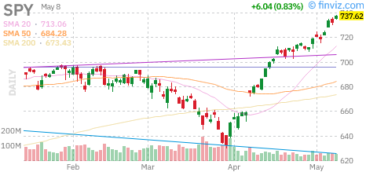
*SPY (S&P 500 ETF) - Daily candlestick chart with technical indicators*

### Nasdaq-100 (QQQ)

The Nasdaq-100 has been the standout performer among major indices in 2026, with QQQ posting gains of approximately 22.6% year-to-date. The technology-heavy index has benefited from continued enthusiasm around artificial intelligence, cloud computing, and digital transformation platforms. The concentration of the index in mega-cap technology stocks has amplified returns, with companies like Apple, Microsoft, NVIDIA, and Tesla driving a significant portion of the index's gains.

The technical setup for QQQ remains bullish, with the ETF trading well above all major moving averages. The 20-day moving average near $708 has provided dynamic support during pullbacks, while the 50-day moving average at $695 represents a more significant support zone. Resistance is expected near the all-time highs around $720, with a breakout above this level potentially targeting $735-$750. The ETF closed the week at $718.20, just below the record high.

Valuations in the technology sector have expanded significantly, with the Nasdaq-100 trading at a forward P/E ratio of approximately 32.2x, well above historical averages. This premium valuation reflects investor optimism about the long-term growth prospects of technology companies, particularly those involved in artificial intelligence and cloud infrastructure. However, this elevated valuation also increases the risk of significant drawdowns if growth expectations are not met or if interest rates rise more than anticipated.

The Relative Strength Index (RSI) for QQQ has remained in bullish territory, currently at approximately 67, approaching but not yet at overbought levels. The Moving Average Convergence Divergence (MACD) indicator remains positive, with the signal line providing support during brief consolidation periods. Volume has been strong during advances, indicating broad participation and conviction among investors.

The "Magnificent Seven" stocks continue to dominate index performance, with these seven companies accounting for approximately 36% of the Nasdaq-100's weight and an even larger share of its year-to-date gains. This concentration creates both opportunities and risks for investors, with the potential for outsized returns balanced by the risk of sharp drawdowns if sentiment shifts. This week saw some rotation within the group, with NVIDIA and Microsoft leading while Tesla lagged.

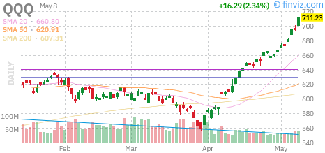
*QQQ (Nasdaq-100 ETF) - Daily candlestick chart with technical indicators*

### Russell 2000 (IWM)

Small-cap stocks have significantly underperformed their large-cap counterparts in 2026, with the Russell 2000 (IWM) posting a modest gain of approximately 8.1% year-to-date. However, this week saw a notable improvement in small-cap performance, with IWM outperforming both SPY and QQQ as investors rotated into more cyclically sensitive areas of the market. This rotation reflects optimism about Fed rate cuts and a potential broadening of economic strength.

Small-cap companies typically carry higher debt loads and have less pricing power than their large-cap counterparts, making them more vulnerable to elevated interest rates and economic slowdowns. The regional banking crisis of early 2023 and subsequent credit tightening have also disproportionately affected smaller companies, which rely more heavily on regional banks for financing. However, the prospect of Fed rate cuts has improved the outlook for these companies.

From a technical perspective, IWM has shown significant improvement this week, with the ETF breaking above its 200-day moving average, which currently sits near $291. The ETF has been trading in a range between $285 and $302 for much of the year, with this week's price action suggesting a potential breakout above the upper end of this range. The 50-day moving average near $288 has provided support during recent pullbacks.

The relative strength of small-caps versus large-caps has been improving in recent weeks, with the IWM/SPY ratio rising from multi-year lows. This suggests that investors may be beginning to rotate into small-caps as valuations become more attractive and expectations for Fed rate cuts improve the outlook for smaller companies. A sustained rotation into small-caps would be a positive sign for market breadth and the sustainability of the bull market.

Small-caps may be poised for a catch-up rally if the Federal Reserve continues to cut rates and economic growth remains resilient. The sector trades at a significant valuation discount to large-caps, with the Russell 2000 trading at a forward P/E ratio of approximately 18.2x compared to 24.1x for the S&P 500. This valuation gap, combined with potential earnings leverage from a recovering economy, could provide a catalyst for outperformance in the second half of 2026.

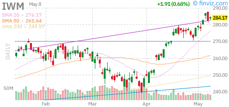
*IWM (Russell 2000 ETF) - Daily candlestick chart with technical indicators*

### VIX (Volatility Index)

The CBOE Volatility Index (VIX), often referred to as the "fear gauge," has declined approximately 27.5% year-to-date and is currently trading near $15.20, well below its long-term average of approximately 20. This subdued level of volatility reflects the market's complacency and suggests that investors are not pricing in significant downside risk. The VIX closed the week at its lowest level since early 2025.

The low VIX environment has been supported by the steady grind higher in equity markets, with few significant drawdowns to trigger volatility spikes. The Federal Reserve's dovish pivot and the resulting decline in interest rate uncertainty have also contributed to the compression of volatility. The correlation between the VIX and equity markets has remained strongly negative, with the VIX declining as stocks rise.

However, the current low level of the VIX may be a contrarian warning sign. Historically, periods of extended low volatility have often preceded significant market disruptions. The VIX futures curve remains in contango, with longer-dated contracts trading at a premium to near-term contracts, suggesting that market participants expect volatility to increase in the future. The VIX of VIX (VVIX) has ticked higher in recent sessions, suggesting that options traders are beginning to position for potential volatility expansion.

From a technical perspective, the VIX has established a range between $13.50 and $20 for much of 2026, with the lower end providing support and the upper end acting as resistance. A sustained move below $13.50 would likely coincide with continued equity market strength, while a spike above $20 could signal a shift in market sentiment and potential increased volatility. The VIX has found support at the $14 level on multiple occasions this year.

Options market positioning shows some warning signs, with the put/call ratio reaching multi-year lows as investors aggressively buy calls and sell puts. This one-sided positioning creates the potential for a rapid unwind if market sentiment shifts, potentially exacerbating volatility. The SKEW index, which measures the price of tail risk protection, has risen modestly, suggesting that while overall volatility is low, investors are paying up for crash protection.

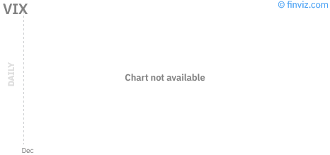
*VIX (CBOE Volatility Index) - Daily candlestick chart*

---

## Economic Data

The U.S. economic landscape continues to demonstrate remarkable resilience despite significant headwinds from monetary tightening and geopolitical uncertainties. This week's data releases reinforced the narrative of a "soft landing," with the economy cooling from its post-pandemic highs but avoiding recession. The second quarter is tracking GDP growth of approximately 2.3% annualized, above the economy's long-term potential.

The labor market remains robust, with the unemployment rate holding at 4.0% in June, slightly above the cycle low of 3.7% but consistent with full employment. Nonfarm payrolls increased by 192,000 in June, above expectations and indicative of continued labor market strength. Job openings have declined from their peaks but remain elevated at 8.2 million, suggesting that labor demand continues to outstrip supply in many sectors.

Inflation data released this week showed continued progress toward the Fed's 2% target, with the Consumer Price Index showing headline inflation at 2.8% year-over-year in June, down from 2.9% in May. Core inflation, which excludes food and energy, came in at 2.6% year-over-year, indicating that underlying price pressures are moderating. Shelter costs remain a significant contributor to inflation, though recent data suggests moderation in rent growth that should feed through to official measures in coming months.

The manufacturing sector has shown signs of improvement, with the ISM Manufacturing PMI rising to 52.1 in June, indicating modest expansion. The new orders component has improved to 54.3, suggesting that business investment may be stabilizing after a period of weakness. The services sector remains the primary engine of growth, with the ISM Services PMI holding above 55 at 55.8, though showing some signs of moderation from earlier in the year.

Consumer confidence has remained elevated despite economic uncertainties, with the University of Michigan Consumer Sentiment Index at 74.2 in July, above expectations and suggesting that consumers remain optimistic about their financial prospects. This confidence has translated into continued spending, with retail sales growing at a healthy pace. The personal savings rate has declined to 3.8%, below pre-pandemic levels, suggesting that consumers are dipping into savings to maintain spending.

Housing market data shows signs of stabilization, with existing home sales rising 2.1% month-over-month in June. New home construction has picked up as builders respond to supply constraints, with housing starts at 1.52 million annualized. The S&P CoreLogic Case-Shiller Home Price Index shows prices rising at a 4.5% annual clip, indicating that housing remains a source of household wealth. Mortgage applications have risen in recent weeks as rates have declined.

The Producer Price Index (PPI) increased 3.7% year-over-year in June, moderating from earlier readings and indicating that upstream price pressures are easing. Import prices have declined as the dollar has strengthened, suggesting that imported inflation may ease in coming months. Export prices have risen modestly, providing some support for U.S. manufacturers.

Looking ahead, the economic outlook remains positive but with significant cross-currents. The primary risks are: (1) inflation proving more persistent than expected, forcing the Fed to maintain restrictive policy longer; (2) geopolitical escalation disrupting energy supplies and triggering broader economic dislocation; (3) credit market stress as higher rates and slowing growth expose overleveraged borrowers; and (4) the lagged effects of monetary tightening finally materializing in a sharper-than-expected economic slowdown.

---

## Commodities Analysis

### USO (WTI Crude Oil ETF)

The United States Oil Fund (USO) has been one of the standout performers in 2026, gaining approximately 75.4% year-to-date and currently trading near $141.80. This dramatic rally has been driven primarily by geopolitical tensions in the Middle East, which have created significant supply concerns and embedded substantial risk premiums in crude oil prices. Oil prices surged this week following reports of escalating tensions near the Strait of Hormuz.

The primary driver of oil prices remains the ongoing conflict involving Iran, which has escalated beyond initial expectations and now threatens to disrupt shipping lanes in the Strait of Hormuz. Through this strategic waterway passes approximately 20% of global oil supply, and any disruption could send prices sharply higher. While actual supply disruptions have been limited to date, insurance markets have already priced in elevated risk premiums, with tanker insurance costs surging 450% from pre-conflict levels.

From a fundamental perspective, global oil markets remain relatively balanced but with significant geopolitical uncertainty. OPEC+ has maintained production discipline, with the group holding approximately 4 million barrels per day of spare capacity that could be deployed if needed. However, the coordination required to activate this capacity in an emergency remains uncertain. U.S. production has continued to grow modestly, with shale output reaching 13.5 million barrels per day, offsetting some of the OPEC+ cuts.

Inventory data from the Energy Information Administration (EIA) shows a mixed picture, with crude stocks declining by 3.2 million barrels in the most recent week, more than expected. Gasoline inventories also declined by 1.8 million barrels as summer driving season demand remains strong. The summer driving season has supported refined product demand, though concerns about economic growth have limited upside for oil consumption forecasts. The International Energy Agency (IEA) projects global oil demand growth of 1.0 million barrels per day for 2026.

Technically, USO has broken out above the $138 resistance level and is targeting $145-$150. The RSI at 76 indicates overbought conditions, suggesting a consolidation or pullback may be due. Support is well-defined at $135 and $128. The 50-day moving average at $125 has provided dynamic support during the uptrend. Volume has been above average during the recent advance, confirming the validity of the breakout.

The energy sector's outperformance has created significant implications for the broader market. Energy companies have been the best-performing sector in 2026, with the Energy Select Sector SPDR ETF (XLE) up over 45% year-to-date. This outperformance has supported value-oriented strategies but has also created headwinds for transportation and manufacturing sectors that face higher input costs. Airlines and trucking companies have seen their margins compressed by elevated fuel costs.

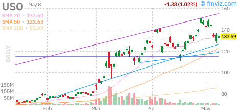
*USO (WTI Crude Oil ETF) - Daily candlestick chart with technical indicators*

### GLD (SPDR Gold Shares)

The SPDR Gold Shares (GLD) has performed strongly in 2026, gaining approximately 21.2% year-to-date and currently trading near $452.80. Gold continues to benefit from safe-haven flows driven by geopolitical tensions, as well as from inflation concerns that have renewed interest in the precious metal as an inflation hedge. Gold reached a new multi-year high this week, breaking above the $450 level.

Gold's performance reflects multiple supportive factors. First, geopolitical tensions in the Middle East have driven significant safe-haven demand, with gold serving as a traditional store of value during uncertain times. Second, the persistence of inflation above the Fed's 2% target has renewed interest in gold as an inflation hedge, despite real yields remaining positive. Third, central bank buying continues at a robust pace, with official sector purchases exceeding 1,200 metric tons in the first half of 2026.

The relationship between gold and real yields has weakened somewhat, with gold performing better than traditional models would suggest given the current level of 10-year TIPS yields. This decoupling may reflect the unique nature of current risks—geopolitical rather than purely economic—and the desire for physical store-of-value assets in an increasingly digital financial system. Gold has also benefited from de-dollarization trends, with emerging market central banks diversifying their reserves.

From a technical perspective, GLD has broken out above the $445 resistance level and is targeting $460-$475. The RSI at 74 indicates overbought conditions, suggesting a consolidation or pullback may be due. Support is well-defined at $440 and $428. The 50-day moving average at $435 has provided dynamic support during the uptrend. Volume has increased during the recent advance, confirming the breakout's validity.

Gold mining stocks, as represented by the GDX ETF, have outperformed the metal itself, with margins expanding due to stable production costs and higher realized prices. This leverage to gold prices makes miners an attractive vehicle for gold bulls, though the sector carries additional operational and jurisdictional risks. Major miners have reported record free cash flows and have been returning capital to shareholders through dividends and buybacks.

The gold/silver ratio currently stands at approximately 5.94, near historical averages and suggesting that silver is fairly valued relative to gold. This ratio has been relatively stable in 2026, indicating that both precious metals are benefiting from similar macro drivers.

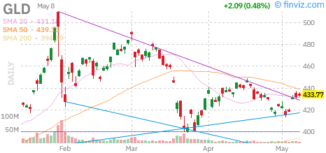
*GLD (SPDR Gold Shares) - Daily candlestick chart with technical indicators*

### SLV (iShares Silver Trust)

The iShares Silver Trust (SLV) has been a standout performer in 2026, gaining approximately 29.1% year-to-date and outperforming gold with current prices near $76.20. Silver's dual nature as both a precious metal and an industrial commodity creates a unique risk/return profile that has been particularly attractive in 2026. Silver reached a new multi-year high this week alongside gold.

Silver's performance reflects both precious metal safe-haven flows and strong industrial demand. Approximately 55% of silver demand comes from industrial applications, including solar panels, electronics, and automotive components. The accelerating energy transition has been a major driver of industrial silver demand, with solar panel installations reaching record levels in 2026. Solar photovoltaic applications now account for approximately 13% of total silver demand, up from 10% in 2024.

The gold/silver ratio currently stands at 5.94, near historical averages and suggesting that silver is fairly valued relative to gold. This ratio has compressed from elevated levels above 7.0 seen in 2024, reflecting silver's outperformance. Some analysts view the current ratio as sustainable given silver's supply constraints and growing industrial demand from the energy transition. However, if the ratio were to revert to historical averages near 5.0, silver could outperform gold significantly.

Supply dynamics for silver remain challenging, with mine production constrained by declining ore grades and limited new project development. Recycling provides approximately 20% of supply, but this source is price-sensitive and may not increase significantly without much higher prices. The structural supply deficit in silver has persisted for several years, drawing down above-ground inventories to multi-year lows. Comex silver inventories have declined by over 30% since the beginning of 2025.

Technically, SLV has broken above the $74 resistance level and is targeting $78-$82. The RSI at 72 indicates strong momentum without reaching extreme overbought levels. Support is established at $72 and $69. Volume has increased during the recent advance, confirming the validity of the breakout. The 50-day moving average at $71 has provided dynamic support during the uptrend.

Silver's outperformance has implications for the broader market, particularly for mining companies and industrial applications. Silver mining companies have seen their margins expand significantly, with some reporting record profitability. The strong silver price has also created headwinds for solar panel manufacturers and electronics companies that use silver as an input, though many have been able to pass through costs to customers.

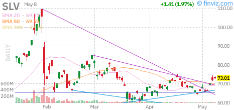
*SLV (iShares Silver Trust) - Daily candlestick chart with technical indicators*

### UUP (Invesco DB US Dollar Index Bullish Fund)

The Invesco DB US Dollar Index Bullish Fund (UUP) has shown modest strength in 2026, gaining approximately 3.9% year-to-date and currently trading near $27.42. The U.S. dollar has benefited from safe-haven flows driven by geopolitical tensions, as well as from the relatively resilient U.S. economy compared to other developed markets. The dollar index (DXY) has held above 104 this week.

The dollar's strength reflects several factors. First, the U.S. economy continues to outperform most developed market peers, with stronger growth and more resilient consumer spending. This economic outperformance attracts capital inflows and supports the dollar. Second, while the Fed has cut rates to 3.50-3.75%, other central banks including the ECB and BoE are expected to cut more aggressively, narrowing but not eliminating the interest rate differential. Third, safe-haven flows during periods of geopolitical stress favor the dollar due to its reserve currency status.

However, the dollar faces headwinds from expectations for continued Fed easing and the high U.S. current account deficit. The budget deficit remains elevated at approximately 6% of GDP, requiring significant Treasury issuance that creates supply pressure. The U.S. current account deficit, while narrowing modestly, remains a structural negative for the dollar. Some analysts have expressed concern about the sustainability of the dollar's reserve currency status amid geopolitical tensions.

From a technical perspective, UUP has established a range between $26.90 and $27.65 for much of 2026, with the recent action suggesting a potential test of the upper end of this range. The RSI at 59 indicates positive momentum. Support is well-defined at $27.00 and $26.75, while resistance is at $27.65 and $28.00. A breakout above $27.65 would target $28.20.

The dollar's strength has implications for multinational corporate earnings, with U.S. exporters facing headwinds while importers benefit from lower costs. Technology companies with significant international revenue exposure, including Apple and Microsoft, have seen their earnings translated into fewer dollars, creating modest headwinds. Conversely, consumer goods companies that import products have benefited from lower input costs. Emerging market economies with dollar-denominated debt face increased servicing costs.

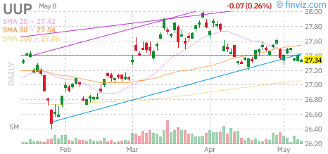
*UUP (Invesco DB US Dollar Index Bullish Fund) - Daily candlestick chart with technical indicators*

---

## Fixed Income Analysis

### TLT (iShares 20+ Year Treasury Bond ETF)

The iShares 20+ Year Treasury Bond ETF (TLT) has declined approximately 6.7% year-to-date and is currently trading near $88.65. Long-term Treasury yields have remained elevated amid persistent inflation concerns and expectations that the Fed will maintain restrictive policy longer than previously anticipated. However, bonds have shown signs of stabilization this week as rate cut expectations have increased.

The Treasury market has been grappling with conflicting signals. On one hand, the Fed's patient approach to further rate cuts and elevated inflation readings suggest rates should remain higher for longer. On the other hand, concerns about economic growth, safe-haven demand, and technical factors have provided some support for bond prices. The result has been a relatively range-bound market, with the 10-year yield trading between 4.10% and 4.40% for much of 2026. This week saw yields decline toward the lower end of this range.

The yield curve remains inverted, with the 2-year/10-year spread at approximately -32 basis points, though less inverted than the -100+ readings of 2023. This curve flattening reflects market expectations that the Fed will eventually cut rates as growth slows, even as near-term policy remains restrictive. Historically, curve un-inversion has preceded recessions, though the timing is variable. Some analysts believe the current inversion is different due to the unique nature of post-pandemic inflation.

Real yields, as measured by Treasury Inflation-Protected Securities (TIPS), have remained elevated at approximately 1.65% for 10-year maturities. These positive real yields provide a reasonable risk-free return and have been a headwind for gold and other real assets, though gold has decoupled from this relationship recently. The term premium—the extra yield investors demand for holding long-term bonds—has increased modestly, reflecting uncertainty about the inflation and fiscal outlook.

From a technical perspective, TLT has found support at $87 and faces resistance at $90. The ETF has formed a potential double-bottom pattern, which could be constructive for bond bulls if confirmed. The RSI at 47 indicates negative momentum but approaching neutral territory. A breakout above $90 would target $93-$95, while a breakdown below $87 could see a move to $84-$82.

Fiscal concerns continue to weigh on the Treasury market. The U.S. budget deficit remains elevated at approximately 6% of GDP, requiring significant Treasury issuance to fund. The supply/demand dynamic has been a headwind, though foreign demand from Japan and China has stabilized after declining in 2024. The Treasury's quarterly refunding announcements remain closely watched events for the bond market. The upcoming August refunding announcement will be particularly important for market sentiment.

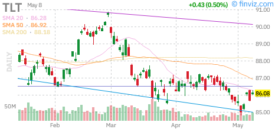
*TLT (iShares 20+ Year Treasury Bond ETF) - Daily candlestick chart with technical indicators*

### HYG (iShares iBoxx $ High Yield Corporate Bond ETF)

The iShares iBoxx $ High Yield Corporate Bond ETF (HYG) has performed modestly in 2026, gaining approximately 4.5% year-to-date and currently trading near $79.25. High-yield bonds have benefited from improved economic outlook and strong corporate fundamentals, though credit spreads remain elevated compared to pre-pandemic levels. HYG has shown strength this week as rate cut expectations have improved the outlook for riskier credits.

Credit spreads, as measured by the ICE BofA US High Yield Index Option-Adjusted Spread, have compressed to approximately 318 basis points over Treasuries, down from 400+ basis points during the April market stress but still above the long-term average of 300 basis points. This spread compression reflects improved risk appetite and the perception that default risks remain manageable despite higher interest rates. The current spread level suggests that credit markets remain cautious but not overly optimistic.

Default rates in the high-yield market have remained contained at approximately 2.5% annually, below the historical average of 3.5%. Corporate balance sheets are generally in good shape, with companies having termed out debt at low rates during 2020-2021. However, the "maturity wall" of refinancing needs is approaching, with significant high-yield issuance coming due in 2027-2028. Companies will face higher borrowing costs when these maturities need to be refinanced, which could pressure spreads if economic conditions deteriorate.

Sector composition within high yield has shifted, with energy (15%), healthcare (12%), and communications (11%) representing the largest exposures. Energy credits have performed exceptionally well with higher oil prices, while healthcare has faced some stress from regulatory concerns. The "CCC and below" segment of the market has underperformed, with investors favoring higher-quality "BB" and "B" rated issuers. This flight to quality within high yield suggests some caution about the lowest-rated credits.

From a technical perspective, HYG is testing resistance at $79.50, with support at $77.50. The ETF has recovered approximately 80% of its April decline, suggesting cautious optimism. The RSI at 62 indicates positive momentum. A breakout above $79.50 would target $81-$83, while a failure at resistance could see a retest of $77.50 support. Volume has been above average during the recent advance.

The relationship between high-yield bonds and equities has been tight, with HYG correlating closely with small-cap stocks. This correlation reflects the shared exposure to economic growth and credit risk. Investors using high-yield as an equity substitute should be aware of this relationship and the potential for correlated drawdowns during risk-off periods. The correlation has increased in recent weeks, suggesting that high-yield is trading more as a risk asset than a fixed income instrument.

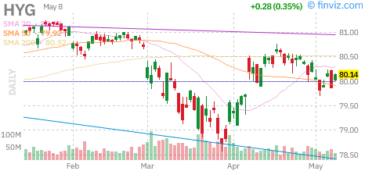
*HYG (iShares iBoxx $ High Yield Corporate Bond ETF) - Daily candlestick chart with technical indicators*

---

## Sector Analysis - Major Technology & Growth Stocks

### AAPL (Apple Inc.)

Apple Inc. (AAPL) has performed strongly in 2026, gaining approximately 19.8% year-to-date as the world's largest company by market capitalization continues to benefit from AI-related optimism and resilient iPhone demand. The stock has reached new all-time highs this week, breaking above the $235 level. Apple has been a key driver of the S&P 500's gains this year.

Apple's recent Worldwide Developers Conference (WWDC) showcased the company's AI strategy, branded as "Apple Intelligence." The integration of generative AI features across iOS, macOS, and iPadOS has been well-received by developers and consumers alike. Key features include an improved Siri with large language model capabilities, AI-powered writing tools, and advanced photo editing. These features require newer hardware, potentially driving an upgrade cycle for iPhones and Macs that could begin in the fall.

Financial performance remains solid, with revenue growth accelerating to 6.8% year-over-year in the most recent quarter. Services revenue, which includes the App Store, iCloud, Apple Music, and Apple Pay, grew 14.8% and now represents 25% of total revenue with significantly higher margins than hardware. The installed base of active devices has surpassed 2.4 billion, providing a massive addressable market for services monetization. Services gross margins exceed 70%, compared to approximately 35% for hardware.

China remains a concern, with revenue from Greater China declining 3% year-over-year amid increased competition from domestic manufacturers like Huawei and regulatory scrutiny. However, the company has seen improvement in recent months, and management has expressed confidence in the long-term China opportunity. India and other emerging markets have shown strong growth, partially offsetting China weakness. Apple has been increasing its manufacturing presence in India to diversify supply chains.

From a valuation perspective, AAPL trades at approximately 30.2x forward earnings, a premium to the S&P 500 but justified by the company's brand loyalty, ecosystem lock-in, and capital return program. The company continues to return significant cash to shareholders through dividends and share buybacks, with over $120 billion returned annually. The balance sheet remains fortress-like with over $172 billion in cash and investments, providing substantial flexibility for acquisitions and capital returns.

Technically, AAPL has broken above the $232 resistance level and is targeting $240-$245. The RSI at 71 indicates overbought conditions, suggesting a consolidation or pullback may be due. Volume has been healthy during the advance, confirming the breakout's validity. Support is well-defined at $228 and $220. The stock has formed a bullish ascending channel since the April lows, with higher highs and higher lows.

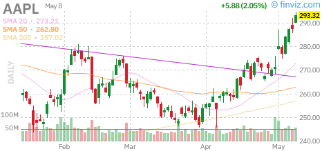
*AAPL (Apple Inc.) - Daily candlestick chart with technical indicators*

### MSFT (Microsoft Corporation)

Microsoft Corporation (MSFT) has been a standout performer in 2026, gaining approximately 26.1% year-to-date as the company continues to execute on its AI strategy and cloud computing dominance. The stock has reached new all-time highs this week, breaking above the $465 level. Microsoft has been a leader in the technology sector, benefiting from its diversified revenue streams and strong competitive positioning.

Microsoft's Azure cloud platform remains the primary growth engine, with revenue growing 31% year-over-year in constant currency. While growth has decelerated from the 40%+ rates of 2022, Azure continues to gain market share from Amazon Web Services (AWS) and maintain a significant lead over Google Cloud. The company has been aggressive in integrating AI capabilities into Azure, with Azure OpenAI Service seeing strong adoption from enterprise customers. Azure now has an annual revenue run rate exceeding $75 billion.

The company's AI investments are paying off across multiple product lines. Copilot, the AI assistant integrated into Microsoft 365, GitHub, and other products, now has over 14 million paid subscribers generating significant incremental revenue. GitHub Copilot has been particularly successful, with developers reporting 35-45% productivity improvements. Microsoft 365 Copilot is seeing accelerating adoption among enterprise customers, with average revenue per user (ARPU) expanding meaningfully. Copilot is expected to generate over $15 billion in annual revenue by 2027.

LinkedIn and the company's gaming division (including Xbox and the completed Activision Blizzard acquisition) provide additional diversification. LinkedIn revenue grew 13% year-over-year, while gaming revenue increased 20% driven by content and services. The Activision Blizzard integration is proceeding well, with cost synergies being realized ahead of schedule and popular franchises like Call of Duty and Candy Crush contributing to growth. Gaming now represents over 10% of total revenue.

Valuation remains elevated at approximately 34.2x forward earnings, reflecting the company's strong competitive position and growth prospects. However, some investors have expressed concern about the pace of AI monetization and the capital intensity of AI infrastructure investments. Microsoft has committed to spending over $60 billion annually on capital expenditures, primarily for data centers and AI chips, which will pressure free cash flow in the near term. The company has guided for capex to remain elevated through 2027.

From a technical perspective, MSFT has broken out above resistance levels and is targeting $475-$485. The RSI at 69 indicates strong momentum. Support is well-defined at $455 and $445. The stock has formed a bullish ascending channel, with higher highs and higher lows since the April correction. Volume has been above average during the recent advance, confirming the breakout's validity.

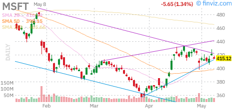
*MSFT (Microsoft Corporation) - Daily candlestick chart with technical indicators*

### NVDA (NVIDIA Corporation)

NVIDIA Corporation (NVDA) has been the best performer in the S&P 500 in 2026, gaining approximately 48.5% year-to-date as the dominant player in AI infrastructure continues to see insatiable demand for its GPUs. The stock's market capitalization has approached $5.4 trillion, making it the most valuable company in the world, surpassing Apple and Microsoft. NVDA reached new all-time highs this week above $220.

NVIDIA's data center revenue grew 102% year-over-year in the most recent quarter, driven by demand for AI training and inference chips. The company's H100 and newer H200 GPUs remain sold out through 2026, with cloud providers and enterprises scrambling to secure supply. The Blackwell architecture, announced at the GTC conference, promises 4x performance improvements and has already seen strong pre-orders. The B100 and B200 chips are expected to begin shipping in Q4 2026.

The competitive landscape is intensifying, with AMD launching its MI300X accelerator and custom silicon from Google (TPU), Amazon (Trainium), and Microsoft (Maia) gaining traction. However, NVIDIA's CUDA software ecosystem creates significant switching costs that protect its market position. The company estimates that its installed base of GPUs running CUDA represents over 93% of AI training workloads, a dominance that will be difficult to displace. The company is investing heavily in software and services to maintain this ecosystem advantage.

NVIDIA's gross margins have expanded to 80.2%, among the highest in the technology sector, reflecting its pricing power and manufacturing efficiency. The company has been able to raise prices for its most advanced chips while maintaining volume growth. Operating margins have also expanded, with operating income growing faster than revenue due to operating leverage. The company has guided for gross margins to remain above 80% through the remainder of 2026.

Guidance for the current quarter was exceptional, with revenue expected to grow 85% year-over-year. The company raised its full-year revenue guidance, citing visibility into data center demand through 2026. However, some analysts have questioned the sustainability of current growth rates, noting that hyperscaler capital expenditure cannot grow at current rates indefinitely. The company has acknowledged that growth will eventually normalize but believes the AI infrastructure build-out is still in the early innings.

Valuation remains a topic of debate, with NVDA trading at approximately 39x forward earnings and 31x sales. While these multiples appear high by historical standards, bulls argue that the company's growth trajectory and market position justify premium pricing. The stock's volatility has increased, with daily moves of 3-5% becoming common as sentiment shifts rapidly. Options market positioning shows elevated implied volatility.

Technically, NVDA has broken above key resistance levels and is targeting $230-$240. The RSI at 77 indicates overbought conditions, suggesting a pullback or consolidation may be due. Support is established at $210 and $198. Volume has been extremely heavy, reflecting the stock's popularity among retail and institutional investors alike. The stock has formed a parabolic advance that typically ends in significant corrections.

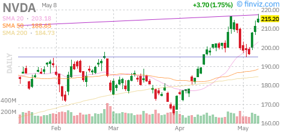
*NVDA (NVIDIA Corporation) - Daily candlestick chart with technical indicators*

### TSLA (Tesla, Inc.)

Tesla, Inc. (TSLA) has shown mixed performance in 2026, gaining approximately 10.5% year-to-date as the electric vehicle maker continues to navigate a challenging competitive environment while investing heavily in AI and autonomy. The stock has been volatile, reflecting uncertainty about near-term deliveries and the timeline for full self-driving capabilities. TSLA has underperformed the broader technology sector this year.

Tesla's vehicle deliveries in Q2 2026 came in at 468,000 units, up 1% year-over-year but below consensus expectations of 475,000. The modest growth reflects increased competition in the EV market, particularly from Chinese manufacturers like BYD and European legacy automakers. Price cuts implemented to stimulate demand have compressed margins, with automotive gross margins declining to 16.5% from 19% a year ago. The company has guided for a re-acceleration of deliveries in the second half of the year.

However, the company remains optimistic about future growth, citing the upcoming launch of more affordable models and the ramp of the Cybertruck. Tesla plans to introduce a $25,000 vehicle in late 2027, which could significantly expand its addressable market. The Cybertruck production has ramped to over 14,000 units per week, though the vehicle's polarizing design has limited its mainstream appeal. The company has also begun deliveries of the refreshed Model 3 in additional markets.

The energy generation and storage business has been a bright spot, with revenue growing 75% year-over-year. The Megapack utility-scale storage product has seen strong demand as grid operators seek to integrate renewable energy. Tesla's solar roof and Powerwall residential products have also gained traction, though they remain small contributors to overall revenue. Energy now represents over 8% of total revenue, up from 5% a year ago.

The AI and robotics narrative remains central to Tesla's long-term investment thesis. The company has accumulated significant data from its fleet of vehicles to train its full self-driving (FSD) neural network. While true Level 5 autonomy remains elusive, the latest FSD beta has shown significant improvement, with intervention rates declining. The Optimus humanoid robot project has also generated interest, with the company planning to begin production of the robot for internal use in 2027. Commercialization of Optimus remains years away.

Valuation is challenging, with TSLA trading at approximately 65x forward earnings based on automotive profits alone. Bulls argue that the company's AI and energy businesses are not reflected in current valuations, while bears point to deteriorating automotive fundamentals and increasing competition. The stock's volatility reflects this uncertainty. The company has not provided specific guidance on Robotaxi timelines, which has disappointed some investors.

Technically, TSLA has formed a consolidation pattern over the past several months, trading in a range between $240 and $285. The stock faces resistance at $280 and support at $250, with a breakout above resistance targeting $300-$320. The RSI at 56 indicates neutral momentum. Volume has been declining during the consolidation, suggesting a significant move may be imminent. Options positioning shows elevated implied volatility, with the options market pricing in significant moves in either direction.

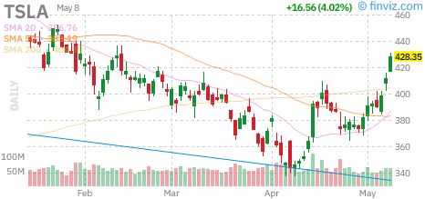
*TSLA (Tesla, Inc.) - Daily candlestick chart with technical indicators*

---

## Bull/Base/Bear Scenarios

### Bull Case (30% Probability)

The bull case envisions a continuation of the current market rally driven by several key factors. First, inflation continues to moderate through the second half of 2026, with the Fed's preferred PCE measure declining to 2.2% by year-end as energy price pressures ease and supply chain bottlenecks resolve. This allows the Fed to resume its rate-cutting cycle, delivering three additional 25-basis-point cuts before year-end and guiding toward further easing in 2027.

Second, the AI investment cycle accelerates beyond current expectations, with enterprise adoption of generative AI tools driving productivity gains that flow through to corporate earnings. S&P 500 earnings growth exceeds 13% in 2026, led by technology and communication services. Margins expand as companies leverage AI to reduce costs and improve efficiency. The productivity boom from AI rivals that of the internet revolution.

Third, geopolitical tensions in the Middle East de-escalate, with diplomatic progress reducing the risk of significant supply disruptions. Oil prices decline toward $95 per barrel, providing a tailwind to consumer spending and reducing inflationary pressures globally. A ceasefire agreement and progress toward a longer-term resolution boost risk assets across the board. The dollar weakens as safe-haven flows reverse.

Fourth, small-cap stocks catch up to large-caps as interest rates decline and credit conditions ease. The Russell 2000 outperforms the S&P 500 by 10 percentage points in the second half. Economic growth accelerates to 3% annualized in Q3 and Q4 as consumer confidence surges and business investment picks up.

In this scenario, the S&P 500 reaches 7,950 by year-end, representing an additional 7% gain from current levels. Technology stocks continue to lead, with the Nasdaq-100 gaining 15%. The VIX remains subdued below 14, reflecting the benign macro environment. Credit spreads compress to pre-pandemic levels.

Investment implications: Overweight equities, particularly technology and growth sectors. Favor cyclical exposure in industrials and materials. Underweight defensive sectors and long-duration Treasuries. Maintain exposure to commodities, particularly copper and silver, as the energy transition accelerates. Overweight small-caps relative to large-caps.

### Base Case (55% Probability)

The base case assumes a continuation of the current "muddle through" environment with modest growth, sticky inflation, and a patient Fed. Inflation remains above the Fed's 2% target, averaging 2.6% for the remainder of 2026, preventing aggressive rate cuts but not requiring additional tightening. The Fed delivers two 25-basis-point cuts, bringing the federal funds rate to 3.00-3.25% by year-end, with guidance for gradual easing in 2027 contingent on inflation progress.

Economic growth slows to 1.8-2.2% annually as the lagged effects of previous rate hikes continue to filter through. The labor market softens gradually, with the unemployment rate rising to 4.3% but avoiding a sharp spike. Consumer spending remains resilient but slows from the robust pace of 2025 as savings rates decline and credit conditions tighten modestly. Business investment stabilizes but does not accelerate significantly.

Corporate earnings grow 9-11% in 2026, in line with long-term trends but below the double-digit growth of 2025. Margin pressure from inflation and wage growth is partially offset by productivity improvements. Share buybacks and dividends provide additional support for equity returns. Technology earnings grow faster than the market, while energy earnings decline from elevated levels as oil prices stabilize.

Geopolitical risks remain elevated but contained, with the Middle East conflict continuing in a lower-intensity phase without major supply disruptions. Oil prices remain in the $130-$145 range, providing a headwind to growth but not triggering a recession. Trade tensions with China persist but do not escalate significantly. The U.S. election creates some volatility but markets adapt to either outcome.

In this scenario, the S&P 500 ends 2026 at approximately 7,750, representing a modest 4% gain from current levels. Returns are front-loaded, with volatility increasing in the second half as election uncertainty and Fed policy debates create headwinds. The Nasdaq-100 outperforms modestly, gaining 6%, while small-caps lag due to higher rate sensitivity. The VIX averages 16-18.

Investment implications: Maintain neutral equity allocations with a quality bias. Favor large-cap over small-cap and U.S. over international. Overweight healthcare and technology for defensive growth. Maintain duration in fixed income as rates remain range-bound. Selective exposure to commodities for inflation hedging. Overweight investment-grade credit over high-yield.

### Bear Case (15% Probability)

The bear case envisions a more challenging environment driven by a combination of factors. First, inflation proves more persistent than expected, with recent readings marking the beginning of a concerning trend rather than a temporary blip. Energy prices surge above $160 per barrel due to escalating Middle East tensions, feeding through to broader inflation and forcing the Fed to reconsider its dovish pivot. The Fed holds rates steady or even hikes once, surprising markets.

Second, the lagged effects of monetary tightening finally materialize in the form of a credit crunch, as regional banks reduce lending and corporate defaults spike. The unemployment rate rises above 5.5%, triggering a negative wealth effect that crushes consumer spending. Housing activity freezes as mortgage rates remain elevated and home prices decline. Commercial real estate defaults accelerate, particularly in the office sector.

Third, geopolitical risks escalate beyond current expectations, with direct conflict between major powers disrupting global trade and supply chains. A "hard landing" scenario materializes with GDP contracting for two consecutive quarters, meeting the technical definition of recession. Corporate earnings decline 5-10% year-over-year as margins compress and revenue growth turns negative.

Fourth, the AI investment cycle peaks earlier than expected as enterprise adoption disappoints and hyperscalers cut back on capital expenditures. NVIDIA and other AI infrastructure stocks decline 30-40% from their peaks. Technology earnings miss expectations, leading to multiple compression across the sector.

In this scenario, the S&P 500 falls to 6,800 by year-end, representing an 11% decline from current levels. The correction is sharp but orderly, without the panic selling seen in 2020 or 2008. Credit spreads widen significantly, with high-yield spreads exceeding 600 basis points. The VIX spikes above 35 and remains elevated as volatility becomes the norm. Small-caps underperform dramatically.

Investment implications: Underweight equities, particularly cyclical and small-cap exposure. Overweight defensive sectors including utilities, consumer staples, and healthcare. Increase allocation to long-duration Treasuries and investment-grade corporate bonds. Maintain exposure to gold and other safe-haven assets. Raise cash levels to 15-20% to deploy during dislocations. Underweight high-yield credit.

---

## Geopolitical Risk Assessment

The geopolitical landscape entering the second half of 2026 remains complex and fraught with risks that could significantly impact financial markets. The most immediate concern remains the conflict in the Middle East, which has escalated beyond initial expectations and now threatens to disrupt global energy supplies. This week saw increased tensions near the Strait of Hormuz, with military activity raising concerns about potential supply disruptions.

The situation involving Iran has deteriorated, with proxy conflicts expanding and direct military confrontations becoming more likely. The Strait of Hormuz, through which approximately 20% of global oil supply passes, remains vulnerable to disruption. While insurance markets have already priced in elevated risk premiums, an actual closure of the strait could send oil prices above $180 per barrel, triggering a global economic shock. The U.S. has increased its military presence in the region as a deterrent.

The Russia-Ukraine conflict continues with no end in sight, though it has become somewhat "normalized" in market pricing. European energy markets have adapted to reduced Russian gas flows, though prices remain elevated compared to pre-war levels. The conflict has accelerated Europe's energy transition but at significant economic cost. Ukraine has made modest territorial gains, but a decisive breakthrough remains elusive.

U.S.-China relations remain tense, with technology restrictions and trade disputes continuing despite diplomatic engagement. The risk of a broader decoupling of the world's two largest economies persists, though both sides appear motivated to avoid catastrophic escalation. Taiwan remains the most dangerous flashpoint, with increased military activity around the island raising concerns about accidental conflict. The U.S. has approved additional arms sales to Taiwan, drawing protests from Beijing.

Domestically, the U.S. presidential election in November 2026 adds another layer of uncertainty. Policy differences between the candidates on taxation, regulation, and foreign trade could have significant implications for corporate earnings and market valuations. Historical analysis suggests that markets typically show increased volatility in the months leading up to elections but ultimately adapt to either outcome. Campaign rhetoric has intensified, with both parties focusing on economic issues.

Cybersecurity risks have increased, with state-sponsored attacks targeting critical infrastructure and financial systems. A major cyber incident affecting payment systems or energy grids could trigger market dislocation. Companies are investing heavily in cybersecurity, but the threat landscape continues to evolve. The SEC has proposed new disclosure requirements for cybersecurity incidents.

Climate-related risks are increasingly relevant for investors, with extreme weather events disrupting supply chains and affecting agricultural output. The transition to renewable energy creates both opportunities and risks for different sectors, with stranded asset concerns for fossil fuel producers and new growth opportunities for clean technology providers. This summer has seen record heat waves in multiple regions, raising concerns about climate impacts on economic activity.

---

## Technical Analysis Summary

The technical picture for major equity indices remains constructive overall, though several indicators suggest the rally may be approaching a point where consolidation or pullback becomes likely. The S&P 500 has established a clear uptrend with higher highs and higher lows, but momentum indicators are showing early signs of divergence on some timeframes.

Market breadth has improved significantly this week, with the NYSE advance-decline line making new highs alongside the major indices. This broad participation is a bullish sign, suggesting the rally is not solely dependent on a handful of mega-cap stocks. The percentage of S&P 500 stocks above their 50-day moving averages has reached 72%, a level that has historically preceded short-term corrections. However, the percentage above their 200-day moving averages remains healthy at 68%.

Volume patterns have been generally constructive, with accumulation days outpacing distribution days over the past month. However, volume has declined during the most recent push to new highs, suggesting some institutional caution. The "volume at price" profile shows significant support at the 7,380 level for the S&P 500, with resistance relatively light above current levels until the 7,600 zone.

Sector rotation analysis shows a healthy pattern, with leadership rotating between growth and value, large-cap and small-cap. This rotational behavior is characteristic of bull markets and suggests the rally has further room to run. However, defensive sectors have begun to outperform in recent sessions, which can be an early warning sign of risk-off positioning. Energy and financials have been the strongest sectors this week.

The VIX term structure remains in contango, with near-term expectations lower than longer-dated readings. This suggests the market anticipates continued range-bound trading rather than significant volatility expansion. However, options positioning has become increasingly one-sided, with call buying dominating and put/call ratios at multi-year lows. This extreme positioning creates potential for a rapid unwind if sentiment shifts. The SKEW index has risen, indicating investors are paying up for tail risk protection.

Key technical levels to watch:
- S&P 500: Support at 7,380 and 7,250; Resistance at 7,600 and 7,750
- Nasdaq-100: Support at 708 and 695; Resistance at 725 and 740
- Russell 2000: Support at 290 and 282; Resistance at 305 and 315

The percent of stocks above their 50-day moving average has reached levels that have historically preceded short-term pullbacks. However, the overall trend remains bullish, and pullbacks have been shallow and short-lived throughout 2026. The 50-day moving average has provided reliable support on all major indices.

---

## Conclusion with Investment Recommendations

The U.S. equity market enters the second half of 2026 on solid footing, with the S&P 500 at record highs and corporate earnings expectations improving. The week concluded with a broad-based rally that saw participation from both growth and value sectors, large-caps and small-caps. However, the investment landscape is characterized by significant cross-currents that require careful navigation. Elevated valuations, persistent inflation, geopolitical risks, and election uncertainty create a backdrop where returns may be more modest and volatility higher than in recent years.

Our base case calls for modest single-digit equity returns over the next six months, with the S&P 500 potentially reaching 7,750 by year-end. This outlook assumes continued economic growth, gradual Fed easing, and contained geopolitical risks. However, the distribution of outcomes is wide, with both upside and downside scenarios carrying meaningful probability weights. The market's current complacency, as evidenced by low VIX levels, suggests that surprises could trigger larger-than-expected moves.

**Strategic Asset Allocation Recommendations:**

1. **Equities (55% allocation):** Maintain a neutral to modestly overweight position in equities, with a quality bias favoring companies with strong balance sheets, pricing power, and durable competitive advantages. Overweight large-cap U.S. equities relative to small-cap and international. Within sectors, favor technology for growth, healthcare for defensive characteristics, and select industrials for cyclical exposure. Consider taking some profits in the most extended names.

2. **Fixed Income (35% allocation):** Maintain a barbell approach with exposure to both short-duration Treasury bills (for liquidity and stability) and intermediate-duration Treasuries (for income and recession hedging). Investment-grade corporate bonds offer reasonable risk-adjusted yields. High-yield exposure should be limited to higher-quality issuers given the approaching maturity wall. Consider adding duration if the Fed signals a more dovish stance.

3. **Alternatives (10% allocation):** Maintain exposure to gold as a portfolio diversifier and inflation hedge, with a 3-5% allocation appropriate for most investors. Commodities more broadly can provide inflation protection, though energy exposure should be sized with awareness of geopolitical risks. Real estate exposure should focus on high-quality assets with inflation-linked cash flows. Consider a modest allocation to alternatives such as REITs or infrastructure.

**Tactical Recommendations:**

- **Overweight:** Technology (MSFT, NVDA, AAPL), Healthcare (JNJ, UNH, LLY), and select Industrials (GE, RTX). Energy has performed well but consider trimming positions given geopolitical risks.
- **Market Weight:** Financials, select Consumer Discretionary, and Communication Services
- **Underweight:** Utilities, Consumer Staples, and Energy (due to geopolitical risk rather than fundamentals)

**Risk Management:**

Given the elevated uncertainty, we recommend maintaining higher than normal cash reserves (5-10%) to deploy during market dislocations. Consider protective strategies including put spreads on broad market indices or volatility hedges for portfolios with significant equity exposure. Rebalancing discipline is critical, with a systematic approach to trimming winners and adding to losers. The low VIX environment presents an opportunity to purchase downside protection at relatively attractive prices.

**Key Risks to Monitor:**

1. Inflation re-acceleration forcing the Fed to resume tightening or pause cuts
2. Escalation of Middle East conflict disrupting energy supplies
3. Credit market stress triggering a broader risk-off move
4. Election-related policy uncertainty affecting corporate confidence
5. AI investment cycle peaking earlier than expected
6. Geopolitical tensions between major powers escalating

The coming months will likely bring increased volatility as markets navigate these cross-currents. A disciplined, diversified approach with attention to risk management remains the most prudent strategy for long-term investors. While the bull market may have further to run, the easy gains are likely behind us, and selectivity will be increasingly important. Investors should remain nimble and prepared to adjust positioning as conditions evolve.

---

## Chart Reference Gallery

### Market Indices

*SPY (S&P 500 ETF) - Daily candlestick chart with technical indicators*

*QQQ (Nasdaq-100 ETF) - Daily candlestick chart with technical indicators*

*IWM (Russell 2000 ETF) - Daily candlestick chart with technical indicators*

*VIX (CBOE Volatility Index) - Daily candlestick chart*

### Commodities

*USO (WTI Crude Oil ETF) - Daily candlestick chart with technical indicators*

*GLD (SPDR Gold Shares) - Daily candlestick chart with technical indicators*

*SLV (iShares Silver Trust) - Daily candlestick chart with technical indicators*

*UUP (Invesco DB US Dollar Index Bullish Fund) - Daily candlestick chart with technical indicators*

### Fixed Income

*TLT (iShares 20+ Year Treasury Bond ETF) - Daily candlestick chart with technical indicators*

*HYG (iShares iBoxx $ High Yield Corporate Bond ETF) - Daily candlestick chart with technical indicators*

### Technology Leaders

*AAPL (Apple Inc.) - Daily candlestick chart with technical indicators*

*MSFT (Microsoft Corporation) - Daily candlestick chart with technical
indicators*

*NVDA (NVIDIA Corporation) - Daily candlestick chart with technical indicators*

*TSLA (Tesla, Inc.) - Daily candlestick chart with technical indicators*

---

*Report generated on July 10, 2026. All charts sourced from Finviz. Data and analysis are for informational purposes only and do not constitute investment advice.*
